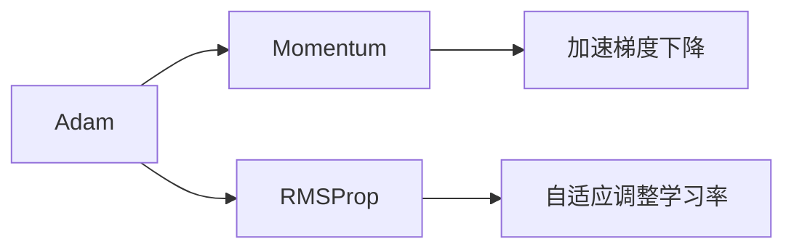

## 1.背景介绍

在深度学习领域，优化算法的选择和应用对模型的训练效果至关重要。优化算法的主要任务是通过调整模型的参数，使得模型在训练集上的损失函数值尽可能小。其中，Adam算法作为一种自适应学习率的优化算法，因其优秀的性能和稳定的表现，被广泛应用在各种深度学习模型的训练中。

## 2.核心概念与联系

Adam算法是一种结合了Momentum优化和RMSProp优化的自适应学习率优化算法。Momentum优化可以看作是一种物理上的动量概念，可以加速梯度下降在相关方向上的收敛，抑制震荡。而RMSProp优化则是一种自适应调整学习率的方法，可以改变每个参数的更新速度。



## 3.核心算法原理具体操作步骤

Adam算法的核心思想是计算梯度的一阶矩估计和二阶矩估计，并对其进行偏差修正。具体操作步骤如下：

- 初始化参数值，设置一阶矩和二阶矩的初始值为0
- 计算梯度的一阶矩和二阶矩
- 对一阶矩和二阶矩进行偏差修正
- 更新参数

## 4.数学模型和公式详细讲解举例说明

Adam算法的数学模型可以用以下公式表示：

$$
m_t = \beta_1 m_{t-1} + (1 - \beta_1) g_t
$$

$$
v_t = \beta_2 v_{t-1} + (1 - \beta_2) g_t^2
$$

$$
\hat{m_t} = \frac{m_t}{1 - \beta_1^t}
$$

$$
\hat{v_t} = \frac{v_t}{1 - \beta_2^t}
$$

$$
\theta_{t+1} = \theta_t - \alpha \frac{\hat{m_t}}{\sqrt{\hat{v_t}} + \epsilon}
$$

其中，$m_t$和$v_t$分别为梯度的一阶矩估计和二阶矩估计；$\hat{m_t}$和$\hat{v_t}$为偏差修正后的一阶矩和二阶矩；$\theta_{t+1}$为更新后的参数值。

## 5.项目实践：代码实例和详细解释说明

下面我们以Python为例，展示如何在神经网络模型中应用Adam优化算法。

```python
import torch
import torch.nn as nn

# 定义模型
model = nn.Sequential(
    nn.Linear(64, 32),
    nn.ReLU(),
    nn.Linear(32, 10),
)

# 定义损失函数
loss_fn = nn.CrossEntropyLoss()

# 定义优化器
optimizer = torch.optim.Adam(model.parameters(), lr=0.001)

# 训练模型
for epoch in range(100):
    for x, y in dataloader:
        y_pred = model(x)
        loss = loss_fn(y_pred, y)
        optimizer.zero_grad()
        loss.backward()
        optimizer.step()
```

## 6.实际应用场景

Adam优化算法在许多深度学习应用中都有出色的表现，包括但不限于：图像识别、自然语言处理、语音识别、推荐系统等。

## 7.工具和资源推荐

- [PyTorch](https://pytorch.org/)：一个开源的深度学习框架，提供了丰富的模型和优化算法，包括Adam。
- [TensorFlow](https://www.tensorflow.org/)：一个开源的深度学习框架，提供了丰富的模型和优化算法，包括Adam。

## 8.总结：未来发展趋势与挑战

Adam优化算法作为一种高效的优化方法，已经在深度学习领域得到了广泛的应用。然而，如何进一步提升其性能，如何在特定的应用场景中进行优化，都是未来需要探索和研究的方向。

## 9.附录：常见问题与解答

Q: Adam优化算法有什么优点？
A: Adam优化算法结合了Momentum和RMSProp的优点，既能加速梯度下降，又能自适应调整学习率，使得参数更新更加稳定。

Q: Adam优化算法适用于所有深度学习模型吗？
A: 在大多数情况下，Adam优化算法都能取得不错的效果。但是，针对不同的模型和任务，可能需要调整其参数（如学习率、一阶矩估计和二阶矩估计的衰减率）以达到最优效果。

作者：禅与计算机程序设计艺术 / Zen and the Art of Computer Programming