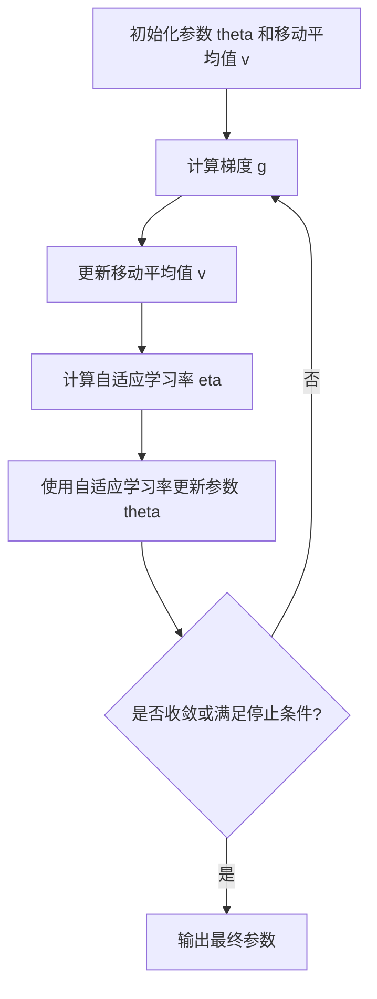

# 优化算法：RMSProp 原理与代码实例讲解

## 1. 背景介绍

在机器学习和深度学习领域中,优化算法扮演着至关重要的角色。它们用于调整模型参数,以最小化损失函数并提高模型性能。随着深度神经网络变得越来越复杂,传统的优化算法如随机梯度下降(SGD)往往会遇到一些挑战,例如收敛速度慢、陷入鞍点等问题。为了解决这些挑战,研究人员提出了一系列自适应优化算法,其中RMSProp就是一种广为人知的自适应学习率优化算法。

RMSProp是Geoff Hinton在他的课程中提出的一种无矩估计自适应学习率算法,旨在加速收敛并改善优化过程。它基于自适应学习率的思想,通过动态调整每个参数的学习率来加速收敛。与经典的动量优化算法相比,RMSProp不仅考虑了梯度的方向,还考虑了梯度的幅值,从而更好地处理了梯度消失和梯度爆炸问题。

## 2. 核心概念与联系

### 2.1 自适应学习率

传统的SGD算法使用固定的全局学习率,这意味着所有参数在每次迭代中使用相同的学习率进行更新。然而,这种方法存在一些缺陷,例如:

- 对于不同的参数,固定的学习率可能不是最佳选择。一些参数可能需要较大的学习率以加快收敛,而另一些参数可能需要较小的学习率以避免振荡。
- 在优化过程的不同阶段,固定的学习率可能不再合适。在开始时,较大的学习率有助于快速收敛,但在接近最优解时,较小的学习率可以提高收敛的稳定性。

自适应学习率算法旨在解决这些问题,通过为每个参数动态调整学习率来加速收敛并提高稳定性。

### 2.2 RMSProp算法

RMSProp是一种自适应学习率算法,它通过计算梯度的指数加权移动平均值来动态调整每个参数的学习率。具体来说,RMSProp维护一个移动平均值变量,用于跟踪每个参数的梯度平方的指数加权移动平均值。然后,它使用该移动平均值来缩放每个参数的梯度,从而调整其学习率。

RMSProp的核心思想是:对于具有较大梯度的参数,降低其学习率以避免振荡;对于具有较小梯度的参数,增加其学习率以加快收敛。这种自适应机制有助于加速收敛并提高优化过程的稳定性。

## 3. 核心算法原理具体操作步骤

RMSProp算法的具体操作步骤如下:

1. 初始化参数向量 $\theta$ 和移动平均值向量 $v$,通常将 $v$ 初始化为0向量。

2. 在每次迭代中,计算当前参数 $\theta$ 的梯度 $g$。

3. 更新移动平均值向量 $v$,其中 $\beta$ 是一个衰减率(通常设置为0.9):

$$v = \beta v + (1 - \beta)g^2$$

4. 计算每个参数的自适应学习率:

$$\eta = \frac{\eta_0}{\sqrt{v + \epsilon}}$$

其中 $\eta_0$ 是初始学习率, $\epsilon$ 是一个小常数(如 $10^{-8}$),用于避免分母为0。

5. 使用自适应学习率更新参数:

$$\theta = \theta - \eta \odot g$$

其中 $\odot$ 表示元素wise乘法。

6. 重复步骤2-5,直到达到收敛或满足其他停止条件。

RMSProp算法的流程图如下所示:



需要注意的是,RMSProp算法存在一个问题,即在初始阶段,由于移动平均值 $v$ 较小,会导致自适应学习率 $\eta$ 过大,从而引起不稳定性。为了解决这个问题,一种常见的做法是在初始化时将 $v$ 设置为一个较大的值(如1),以避免过大的自适应学习率。

## 4. 数学模型和公式详细讲解举例说明

在上一节中,我们介绍了RMSProp算法的核心操作步骤。现在,让我们更深入地探讨其中涉及的数学模型和公式。

### 4.1 移动平均值

RMSProp算法的关键是维护一个移动平均值向量 $v$,用于跟踪每个参数的梯度平方的指数加权移动平均值。具体来说,在第 $t$ 次迭代中,移动平均值 $v_t$ 的更新公式为:

$$v_t = \beta v_{t-1} + (1 - \beta)g_t^2$$

其中:

- $\beta$ 是一个衰减率,通常设置为0.9。它控制了新梯度平方值对移动平均值的影响程度。较大的 $\beta$ 意味着移动平均值更加平滑,对新梯度平方值的响应较慢。
- $g_t$ 是当前迭代中计算得到的梯度向量。
- $g_t^2$ 表示对梯度向量进行元素wise平方操作。

通过这种指数加权移动平均值的方式,RMSProp算法可以有效地捕捉每个参数的梯度幅值的变化趋势,从而动态调整其学习率。

让我们通过一个简单的例子来说明移动平均值的计算过程。假设我们有一个参数 $\theta$,其梯度序列为 $[1, 2, 3, 4, 5]$,并且 $\beta = 0.9$。初始时,我们将移动平均值 $v_0$ 设置为1。那么,移动平均值的计算过程如下:

$$\begin{align*}
v_0 &= 1 \\
v_1 &= 0.9 \times 1 + 0.1 \times 1^2 = 1.1 \\
v_2 &= 0.9 \times 1.1 + 0.1 \times 2^2 = 1.49 \\
v_3 &= 0.9 \times 1.49 + 0.1 \times 3^2 = 2.41 \\
v_4 &= 0.9 \times 2.41 + 0.1 \times 4^2 = 4.09 \\
v_5 &= 0.9 \times 4.09 + 0.1 \times 5^2 = 6.81
\end{align*}$$

从这个例子中,我们可以看到移动平均值 $v_t$ 随着时间的推移而逐渐增大,反映了梯度幅值的变化趋势。

### 4.2 自适应学习率

在获得移动平均值 $v_t$ 后,RMSProp算法使用它来计算每个参数的自适应学习率 $\eta_t$:

$$\eta_t = \frac{\eta_0}{\sqrt{v_t + \epsilon}}$$

其中:

- $\eta_0$ 是初始学习率,通常设置为一个较小的值,如0.001。
- $\epsilon$ 是一个小常数(如 $10^{-8}$),用于避免分母为0的情况。

自适应学习率 $\eta_t$ 的计算方式体现了RMSProp算法的核心思想:对于具有较大梯度的参数(即 $v_t$ 较大),降低其学习率以避免振荡;对于具有较小梯度的参数(即 $v_t$ 较小),增加其学习率以加快收敛。

让我们继续上面的例子,假设初始学习率 $\eta_0 = 0.01$,计算每个时刻的自适应学习率:

$$\begin{align*}
\eta_1 &= \frac{0.01}{\sqrt{1.1 + 10^{-8}}} \approx 0.0092 \\
\eta_2 &= \frac{0.01}{\sqrt{1.49 + 10^{-8}}} \approx 0.0078 \\
\eta_3 &= \frac{0.01}{\sqrt{2.41 + 10^{-8}}} \approx 0.0061 \\
\eta_4 &= \frac{0.01}{\sqrt{4.09 + 10^{-8}}} \approx 0.0048 \\
\eta_5 &= \frac{0.01}{\sqrt{6.81 + 10^{-8}}} \approx 0.0038
\end{align*}$$

我们可以观察到,随着移动平均值 $v_t$ 的增大,自适应学习率 $\eta_t$ 逐渐降低,这反映了RMSProp算法对具有较大梯度的参数降低学习率的策略。

### 4.3 参数更新

在计算出自适应学习率 $\eta_t$ 后,RMSProp算法使用它来更新参数 $\theta_t$:

$$\theta_t = \theta_{t-1} - \eta_t \odot g_t$$

其中 $\odot$ 表示元素wise乘法。这种更新方式确保了每个参数都使用了其对应的自适应学习率进行更新,从而实现了动态调整学习率的目标。

继续上面的例子,假设初始参数 $\theta_0 = 1$,梯度序列为 $[1, 2, 3, 4, 5]$,那么参数的更新过程如下:

$$\begin{align*}
\theta_1 &= 1 - 0.0092 \times 1 = 0.9908 \\
\theta_2 &= 0.9908 - 0.0078 \times 2 = 0.9752 \\
\theta_3 &= 0.9752 - 0.0061 \times 3 = 0.9568 \\
\theta_4 &= 0.9568 - 0.0048 \times 4 = 0.9376 \\
\theta_5 &= 0.9376 - 0.0038 \times 5 = 0.9186
\end{align*}$$

通过这个例子,我们可以看到参数 $\theta_t$ 在每次迭代中都使用了对应的自适应学习率进行更新,体现了RMSProp算法的自适应性。

## 5. 项目实践:代码实例和详细解释说明

为了更好地理解RMSProp算法,让我们通过一个实际的代码示例来演示它的实现和使用。在这个示例中,我们将使用PyTorch框架,并在MNIST手写数字识别任务上训练一个简单的神经网络模型。

### 5.1 导入所需库

```python
import torch
import torch.nn as nn
import torch.optim as optim
from torchvision import datasets, transforms
```

### 5.2 定义神经网络模型

```python
class Net(nn.Module):
    def __init__(self):
        super(Net, self).__init__()
        self.fc1 = nn.Linear(28 * 28, 512)
        self.fc2 = nn.Linear(512, 256)
        self.fc3 = nn.Linear(256, 10)

    def forward(self, x):
        x = x.view(-1, 28 * 28)
        x = torch.relu(self.fc1(x))
        x = torch.relu(self.fc2(x))
        x = self.fc3(x)
        return x
```

这是一个简单的全连接神经网络,包含两个隐藏层,输入为28x28的图像像素,输出为10个类别(0-9)的概率分布。

### 5.3 加载数据集

```python
train_loader = torch.utils.data.DataLoader(
    datasets.MNIST('../data', train=True, download=True,
                   transform=transforms.Compose([
                       transforms.ToTensor(),
                       transforms.Normalize((0.1307,), (0.3081,))
                   ])),
    batch_size=64, shuffle=True)

test_loader = torch.utils.data.DataLoader(
    datasets.MNIST('../data', train=False, transform=transforms.Compose([
                       transforms.ToTensor(),
                       transforms.Normalize((0.1307,), (0.3081,))
                   ])),
    batch_size=1000, shuffle=True)
```

这段代码加载了MNIST数据集,并对数据进行了标准化处理。

### 5.4 定义损失函数和优化器

```python
model = Net()
criterion = nn.CrossEntropyLoss()
optimizer = optim.RMSprop(model.parameters(), lr=0.01)