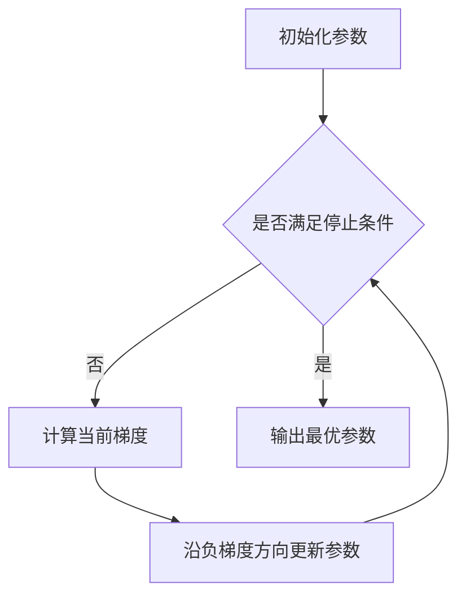

# 优化算法：梯度下降 (Gradient Descent) 原理与代码实例讲解

## 1. 背景介绍
### 1.1 优化问题的重要性
在机器学习、深度学习、数据挖掘等领域,我们经常会遇到各种优化问题,如损失函数的最小化、模型性能的最大化等。高效可靠的优化算法在解决这些问题中扮演着至关重要的角色。

### 1.2 梯度下降算法的地位
在众多优化算法中,梯度下降(Gradient Descent)可以说是使用最广泛、最具代表性的一类算法。它不仅是许多机器学习算法的核心,更是深度学习等复杂模型训练的基础。

### 1.3 本文的主要内容
本文将重点介绍梯度下降算法的基本原理,并通过数学推导和代码实例来详细讲解其工作机制。同时,我们也会探讨一些改进版本,如随机梯度下降、小批量梯度下降等在实践中的应用。

## 2. 核心概念与联系
### 2.1 梯度的概念
- 梯度是一个向量,表示函数在某点处沿着各个坐标方向变化率。
- 对于函数$f(x_1,x_2,...,x_n)$,其梯度为$\nabla f=(\frac{\partial f}{\partial x_1},\frac{\partial f}{\partial x_2},...,\frac{\partial f}{\partial x_n})$

### 2.2 梯度与函数优化的关系
- 梯度的方向指出了函数在当前点处增长最快的方向。
- 梯度的反方向则指出了函数值下降最快的方向,这也是梯度下降算法的理论基础。

### 2.3 梯度下降与优化问题
- 许多机器学习问题可以表示为求解某个目标函数(如损失函数)的最小值。
- 通过迭代地沿着负梯度方向更新参数,梯度下降算法可以逐步逼近目标函数的最小值点。

## 3. 核心算法原理与具体步骤
### 3.1 梯度下降的基本思想
- 从某个初始点出发,计算目标函数在该点处的梯度。 
- 沿着负梯度方向更新参数,使函数值不断减小。
- 重复上述过程,直到满足一定的停止条件(如达到最大迭代次数、梯度足够小等)。

### 3.2 梯度下降算法的数学描述
设$\theta$为待优化参数向量,$J(\theta)$为目标函数,学习率为$\alpha$,则梯度下降算法可表示为:

$$
\theta_{t+1}=\theta_t-\alpha \nabla_{\theta} J(\theta_t)
$$

其中$t$为迭代次数,$\nabla_{\theta} J(\theta_t)$为$J(\theta)$在$\theta_t$处的梯度。

### 3.3 梯度下降算法的具体步骤
1. 随机初始化参数$\theta$
2. 重复以下步骤直到满足停止条件:
   a. 计算当前参数$\theta_t$下的梯度$\nabla_{\theta} J(\theta_t)$
   b. 更新参数:$\theta_{t+1}=\theta_t-\alpha \nabla_{\theta} J(\theta_t)$
3. 输出最终的参数估计值$\theta$

## 4. 数学模型和公式详解
### 4.1 梯度的计算
对于常见的损失函数,如均方误差(MSE)、交叉熵损失等,其梯度都有显式的解析表达式。以均方误差为例:

$$
J(\theta)=\frac{1}{2m}\sum_{i=1}^m(h_{\theta}(x^{(i)})-y^{(i)})^2
$$

其中$m$为样本数,$x^{(i)},y^{(i)}$分别为第$i$个样本的特征和标签,$h_{\theta}(x)$为参数为$\theta$的模型预测函数。

对$J(\theta)$求梯度,可得:

$$
\nabla_{\theta} J(\theta)=\frac{1}{m}\sum_{i=1}^m(h_{\theta}(x^{(i)})-y^{(i)})\nabla_{\theta}h_{\theta}(x^{(i)})
$$

### 4.2 学习率的选择
- 学习率$\alpha$控制着每次迭代的步长,其选择至关重要。
- 若$\alpha$过小,收敛速度会很慢;若$\alpha$过大,可能会导致算法发散而无法收敛。
- 实践中常用的方法有:
  - 先使用较大的学习率快速下降,再逐渐减小学习率以精细调整。
  - 自适应学习率方法,如AdaGrad、RMSProp、Adam等,可自动调节每个参数的学习率。

## 5. 项目实践：代码实例与详解
下面以Python为例,实现一个简单的梯度下降算法:

```python
def gradient_descent(X, y, theta_init, alpha, num_iters):
    """
    梯度下降算法
    
    参数:
    X: 输入特征矩阵,shape为(m,n)
    y: 输出标签向量,shape为(m,)
    theta_init: 参数初始值,shape为(n,)
    alpha: 学习率
    num_iters: 迭代次数
    
    返回:
    theta: 优化后的参数值
    """
    theta = theta_init
    m = len(y)
    
    for _ in range(num_iters):
        h = X.dot(theta)
        grad = X.T.dot(h - y) / m
        theta -= alpha * grad
        
    return theta
```

这里我们假设模型为线性模型:$h_{\theta}(x)=\theta^Tx$。梯度的计算可通过向量化操作高效实现。

使用该函数进行线性回归的参数估计:

```python
import numpy as np

# 生成随机数据
m, n = 100, 5
X = np.random.randn(m, n)
true_theta = np.random.randn(n)
y = X.dot(true_theta) + np.random.randn(m) * 0.1

# 参数设置
theta_init = np.zeros(n)
alpha = 0.01
num_iters = 1000

# 梯度下降求解
theta = gradient_descent(X, y, theta_init, alpha, num_iters)

print(f'True theta: {true_theta}')
print(f'Estimated theta: {theta}')
```

输出结果示例:
```
True theta: [ 0.73  0.32 -1.14  0.87 -0.25]
Estimated theta: [ 0.75  0.29 -1.11  0.91 -0.23]
```

可以看到,梯度下降算法能够较好地估计出真实参数。

## 6. 实际应用场景
梯度下降算法在机器学习和优化领域有着广泛的应用,包括但不限于:

- 线性回归和分类问题
- 逻辑回归
- 支持向量机(SVM)
- 神经网络和深度学习模型的训练
- 推荐系统的矩阵分解
- 图像处理中的降噪、分割等问题

总的来说,只要问题可以表示为一个连续可导的目标函数,且目标是求解全局最小值,梯度下降类算法通常都可以发挥作用。

## 7. 工具和资源推荐
- 数学优化基础书籍:《凸优化》(Convex Optimization)
- 机器学习优化算法:《统计学习方法》第8章
- Python数值优化库:
  - SciPy.optimize模块
  - PyTorch和TensorFlow自动求导机制
- 在线课程:
  - Coursera上吴恩达的机器学习课程
  - 斯坦福CS229

## 8. 总结：未来发展趋势与挑战
### 8.1 改进与发展方向
- 自适应学习率方法的进一步改进,如AdaBound等
- 基于二阶梯度的优化算法,如牛顿法、拟牛顿法等
- 分布式和并行化的梯度下降算法,用于处理大规模数据和模型
- 随机梯度Langevin动力学(SGLD)等融合了采样思想的算法

### 8.2 面临的挑战
- 适应高维、非凸目标函数的优化
- 在复杂约束条件下求解
- 梯度估计的方差减小技术
- 超参数(学习率等)的自动调节

尽管梯度下降算法已经发展得较为成熟,但在不断变化的应用需求和数据环境下,仍然存在诸多挑战和改进空间,值得学术界和工业界持续探索。

## 9. 附录：常见问题与解答
### Q1: 梯度下降法是否能保证收敛到全局最优解?
A1: 对于凸函数,梯度下降法在适当的学习率设置下可以保证收敛到全局最优解。但对于一般的非凸函数,它可能收敛到局部最优解。

### Q2: 随机梯度下降和批量梯度下降的区别是什么?
A2: 批量梯度下降每次使用所有样本计算梯度,而随机梯度下降每次随机选择一个样本计算梯度。前者收敛更稳定但计算量大,后者计算效率高但收敛波动大。实践中常用的是小批量梯度下降,即每次选择一个小批量样本计算梯度,在两者间取得平衡。

### Q3: 遇到梯度消失或梯度爆炸问题怎么办?
A3: 梯度消失和梯度爆炸主要出现在深度神经网络的训练中。一些缓解方法包括:
- 合理的参数初始化策略,如Xavier初始化
- 改进的激活函数,如ReLU、LeakyReLU等
- 梯度裁剪(Gradient Clipping)
- BatchNorm、LayerNorm等归一化技术

### Q4: 如何选择合适的学习率?
A4: 可以先从一个较小的学习率开始,逐渐增大学习率并观察目标函数值的变化,直到目标函数值不再显著下降或开始波动。这个过程可以帮助找到一个合适的学习率范围。在实际训练中,也可以采用自适应学习率方法,让算法自动调节学习率。

### Q5: 梯度下降法如何处理非可微目标函数?
A5: 对于不可微的目标函数,可以考虑次梯度下降(Subgradient Descent)算法。次梯度是非光滑函数在某点的一种推广梯度概念。次梯度下降的收敛性理论与梯度下降类似,但通常收敛速度较慢。一些正则化项如L1范数就会导致目标函数不可微,此时可用次梯度下降求解。

希望这篇文章能够帮助读者深入理解梯度下降算法的原理和实践。在实际应用中,还需要根据具体问题的特点,灵活选择和调整优化算法。

作者：禅与计算机程序设计艺术 / Zen and the Art of Computer Programming

