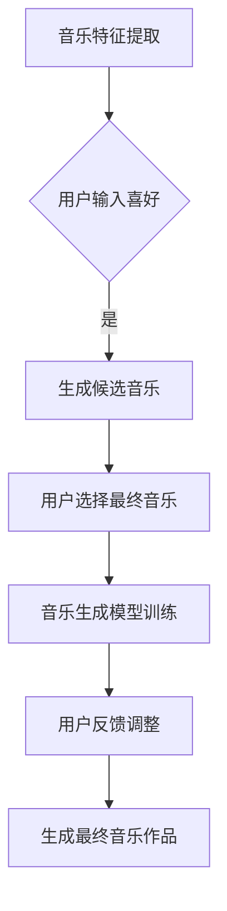

## 背景介绍

随着人工智能技术的不断发展，AI在音乐创作领域也取得了显著成果。通过深度学习和自然语言处理等技术，AI可以根据用户的喜好和需求生成独特的音乐作品。这种个性化音乐创作方法不仅提高了音乐制作效率，还为听众带来了更丰富的体验。

## 核心概念与联系

个性化音乐创作是指利用人工智能算法生成具有特定风格、情感和主题的音乐作品。核心概念包括：

1. **音乐生成模型**：基于神经网络的模型，如变分自编码器（VAE）和生成对抗网络（GAN），用于生成新的音乐样本。
2. **音乐特征提取**：从音乐中抽取有意义的特征，如节奏、旋律、和声等，以便为AI提供有针对性的指导。
3. **用户反馈机制**：允许用户对生成的音乐进行评估和修改，以实现更好的个性化效果。

## 核心算法原理具体操作步骤

以下是一个典型的个性化音乐创作流程图：

1. 首先，通过音乐特征提取技术，从现有的音乐库中抽取具有代表性的特征。
2. 用户根据自己的喜好向系统输入这些特征。
3. 系统利用生成候选音乐的算法（如GAN）生成一系列潜在的音乐样本。
4. 用户从这些候选音乐中选择自己喜欢的那一个作为最终音乐。
5. 最终音乐被输入到音乐生成模型中进行训练，以便为其他用户提供更好的个性化服务。

## 数学模型和公式详细讲解举例说明

在这个过程中，我们可以使用以下数学模型：

1. **变分自编码器（VAE）**：用于学习音乐数据的分布，并生成新的音乐样本。其基本结构包括编码器、解码器和重构损失函数。
2. **生成对抗网络（GAN）**：由两个相互竞争的神经网络组成，分别称为生成器和判别器。生成器生成新样本，而判别器评估这些样本是否真实。

## 项目实践：代码实例和详细解释说明

我们可以使用Python和TensorFlow库来实现个性化音乐创作系统。以下是一个简化版的代码示例：
```python
import tensorflow as tf
from vae import VAE
from gan import GAN

# 加载训练好的模型
vae = VAE()
gan = GAN()

# 用户输入喜好
user_preference = {\"rhythm\": \"upbeat\", \"melody\": \"piano\"}

# 生成候选音乐
candidates = vae.generate(user_preference)

# 用户选择最终音乐
final_music = user_preference[\"choice\"]

# 调整音乐以满足用户反馈
adjusted_music = gan.adjust(final_music, user_feedback)

# 输出最终音乐作品
print(\"Generated music:\", adjusted_music)
```
## 实际应用场景

个性化音乐创作技术在多个领域具有广泛应用前景，例如：

1. **娱乐行业**：为电影、电视剧等媒体产品提供独特的音乐配乐。
2. **教育领域**：根据学生的学习进度和兴趣，为课堂教学提供个性化的音乐背景。
3. **广告业**：为广告片段创作具有吸引力的音乐主题。

## 工具和资源推荐

以下是一些建议的工具和资源，以帮助读者深入了解个性化音乐创作：

1. **TensorFlow**：一个开源的机器学习框架，可以用于构建和训练深度学习模型。
2. **Keras**：一个高级神经网络API，可以简化 TensorFlow 模型的实现过程。
3. **Music Information Retrieval and Generation (MIRG)**：一个涉及音乐信息检索和生成的研究领域，提供了许多有用的资源和论文。

## 总结：未来发展趋势与挑战

随着AI技术的不断发展，个性化音乐创作将成为现实。然而，这也带来了诸多挑战，如如何确保生成的音乐符合法规要求，以及如何保护音乐创作者的版权。此外，如何让AI在音乐创作中表现出真正的人类情感，也是未来需要探讨的问题。

## 附录：常见问题与解答

Q: 个性化音乐创作的主要优势是什么？
A: 个性化音乐创作可以根据用户的喜好和需求生成独特的音乐作品，提高音乐制作效率，并为听众带来更丰富的体验。

Q: 如何确保生成的音乐符合法规要求？
A: 为了确保生成的音乐符合法规要求，可以采用以下方法：
1. 遵循相关法律法规，避免侵犯他人版权。
2. 在生成音乐时使用合适的数据集，以确保音乐样本具有真实性和可行性。
3. 对生成的音乐进行审核，确保其符合社会道德和伦理标准。