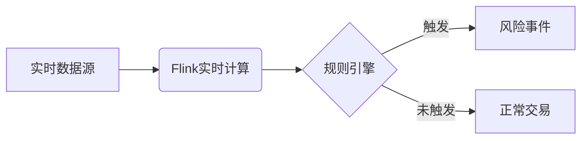

# 使用ApplicationMaster快速搭建实时风控平台

## 1. 背景介绍
### 1.1 实时风控平台的重要性
在当今快速发展的互联网金融时代,实时风控平台已成为金融机构不可或缺的重要组成部分。随着金融欺诈、信用风险等问题日益严重,传统的事后风控模式已经无法满足业务需求。实时风控平台可以在交易发生的瞬间对风险进行识别和控制,大大降低了金融机构的损失,提高了风控效率。

### 1.2 搭建实时风控平台面临的挑战
然而,搭建一个高效、稳定、易扩展的实时风控平台并非易事。它需要处理海量的交易数据,并在毫秒级响应。同时,风控规则也在不断变化,平台需要能够灵活配置和快速上线新规则。此外,还需要有完善的监控和报警机制,确保风控策略执行正确。

### 1.3 ApplicationMaster 简介
ApplicationMaster 是一个基于 Spark 和 Flink 的实时大数据处理平台,它提供了一套完整的开发、部署、监控、运维工具,帮助企业快速构建实时应用。ApplicationMaster 不仅支持常见的 ETL、统计分析等批处理场景,还支持实时流处理,非常适合用于搭建实时风控平台。

## 2. 核心概念与联系
### 2.1 实时计算
实时计算是指连续不断地处理实时到达的数据,并在尽可能短的时间内返回处理结果。它强调的是数据的时效性,要求尽快产生结果。实时风控正是实时计算的一个典型应用场景。

### 2.2 Flink
Flink 是目前最主流的分布式实时计算引擎之一,它被设计用于在无界和有界数据流上进行有状态的计算。Flink 以其高吞吐、低延迟、高性能著称,非常适合实时风控场景。

### 2.3 规则引擎
规则引擎是一种嵌入在应用程序中的组件,它可以将业务决策逻辑从应用程序代码中分离出来,使得业务规则可以被声明、加载、执行。在实时风控场景下,风控规则可以用规则引擎来实现,以方便灵活的配置和修改。

### 2.4 实时风控中的核心概念联系
下图展示了实时风控平台中几个核心概念之间的关系:



实时数据源不断产生交易数据,这些数据被 Flink 实时摄入和计算,然后交给规则引擎进行风控判断,最终输出风险事件或者正常交易。

## 3. 核心算法原理具体操作步骤
### 3.1 实时数据摄入
第一步是将交易数据实时摄入到 Flink 系统中。常见的数据源有 Kafka、Pulsar 等消息队列。在 ApplicationMaster 中,可以使用内置的 Source Connector 来实现,例如:

```java
// 创建数据源
DataStream<String> stream = env.addSource(
    new FlinkKafkaConsumer<>("topic", new SimpleStringSchema(), properties));
```

### 3.2 数据预处理
摄入的数据通常是原始的 JSON 或者 CSV 格式,需要进行解析、转换、清洗等预处理操作,转换成便于计算的对象。例如:

```java
// 解析 JSON
DataStream<Transaction> transactions = stream.map(new JsonMapper());

// 过滤掉 null 值
transactions = transactions.filter(x -> x != null);
```

### 3.3 特征工程
风控模型通常需要各种特征作为输入,因此需要在数据流中进行特征提取、转换等操作。例如,提取交易的 IP 地址,然后查询 IP 库获取 IP 属性:

```java
// 提取 IP 地址
DataStream<String> ipAddresses = transactions.map(x -> x.ipAddress);

// 异步查询 IP 属性
DataStream<IpAttributes> ipAttributes = AsyncDataStream.unorderedWait(
    ipAddresses,
    new IpAttributesAsyncFunction(),
    1000, TimeUnit.MILLISECONDS,
    100);

// 合并 IP 属性
transactions = transactions.join(ipAttributes)
    .where(x -> x.ipAddress)
    .equalTo(x -> x.ipAddress)
    .window(TumblingEventTimeWindows.of(Time.seconds(5)))
    .apply(new JoinFunction());
```

### 3.4 规则匹配
当所有特征都准备好后,就可以将其输入到规则引擎中进行规则匹配。ApplicationMaster 内置了一个高性能规则引擎,可以直接使用:

```java
// 创建规则执行器
RuleEngine ruleEngine = new RuleEngine();
ruleEngine.registerRule(new FrequentTransactionRule());

// 执行规则
transactions.flatMap(new RichFlatMapFunction<Transaction, Alert>() {
    @Override
    public void flatMap(Transaction transaction, Collector<Alert> out) throws Exception {
        List<Alert> alerts = ruleEngine.execute(transaction);
        for (Alert alert : alerts) {
            out.collect(alert);
        }
    }
});
```

### 3.5 输出结果
规则匹配的结果可以输出到下游系统,例如数据库、消息队列、文件系统等,以便进一步处理和分析。例如:

```java
// 输出到 Kafka
alerts.addSink(new FlinkKafkaProducer<>("topic", new AlertSchema(), properties));
```

## 4. 数学模型和公式详细讲解举例说明
在实时风控中,常常需要用到一些数学模型和算法,例如异常检测、聚类、分类等。下面以异常检测中的 3-Sigma 原则为例进行说明。

3-Sigma 原则是指,如果一个事件发生的概率小于 0.3%,那么它就是一个异常事件。这个原则基于正态分布的 3-Sigma 区间。在正态分布中,数据分布在平均值 $\mu$ 附近,标准差为 $\sigma$,那么:

- $\mu \pm 1\sigma$ 覆盖了 68.27% 的数据
- $\mu \pm 2\sigma$ 覆盖了 95.45% 的数据 
- $\mu \pm 3\sigma$ 覆盖了 99.73% 的数据

超出 $\mu \pm 3\sigma$ 的数据被认为是异常的。

在实时风控场景中,我们可以用移动平均和标准差来在线计算 3-Sigma 区间。假设有一个交易金额数据流 $x_1, x_2, ..., x_n$,那么第 $i$ 个数据的移动平均 $m_i$ 和标准差 $s_i$ 为:

$$
\begin{aligned}
m_i &= \frac{x_i + x_{i-1} + ... + x_{i-w+1}}{w} \\
s_i &= \sqrt{\frac{(x_i - m_i)^2 + (x_{i-1} - m_{i-1})^2 + ... + (x_{i-w+1} - m_{i-w+1})^2}{w}}
\end{aligned}
$$

其中 $w$ 为移动窗口大小。

如果新来一个交易金额 $x_{n+1}$,判断其是否异常就是看其是否落在 $[m_n - 3s_n, m_n + 3s_n]$ 区间内。这个过程可以用 Flink 的状态和窗口机制来实现:

```java
// 定义状态
private transient ValueState<Tuple2<Double, Double>> state;

@Override
public void flatMap(Double value, Collector<Alert> out) throws Exception {
    // 获取状态
    Tuple2<Double, Double> ms = state.value();
    double m = ms.f0;
    double s = ms.f1;
    
    // 更新平均值和标准差
    m = (m * (w - 1) + value) / w;
    double t = (value - m) * (value - m);
    s = Math.sqrt((s * s * (w - 1) + t) / w);
    
    // 判断是否异常
    if (value < m - 3 * s || value > m + 3 * s) {
        out.collect(new Alert(...));
    }
    
    // 更新状态
    state.update(Tuple2.of(m, s));
}
```

这里用一个 `ValueState` 来存储移动平均值和标准差,每来一个新的交易金额就更新一次,并判断其是否异常。

## 5. 项目实践：代码实例和详细解释说明
下面是一个使用 ApplicationMaster 搭建实时风控平台的完整代码示例:

```java
// 创建执行环境
StreamExecutionEnvironment env = StreamExecutionEnvironment.getExecutionEnvironment();

// 创建数据源
DataStream<String> stream = env.addSource(
    new FlinkKafkaConsumer<>("transactions", new SimpleStringSchema(), properties));

// 解析 JSON
DataStream<Transaction> transactions = stream.map(new JsonMapper());

// 过滤掉 null 值
transactions = transactions.filter(x -> x != null);

// 提取 IP 地址
DataStream<String> ipAddresses = transactions.map(x -> x.ipAddress);

// 异步查询 IP 属性
DataStream<IpAttributes> ipAttributes = AsyncDataStream.unorderedWait(
    ipAddresses,
    new IpAttributesAsyncFunction(),
    1000, TimeUnit.MILLISECONDS,
    100);

// 合并 IP 属性
transactions = transactions.join(ipAttributes)
    .where(x -> x.ipAddress)
    .equalTo(x -> x.ipAddress)
    .window(TumblingEventTimeWindows.of(Time.seconds(5)))
    .apply(new JoinFunction());

// 创建规则执行器
RuleEngine ruleEngine = new RuleEngine();
ruleEngine.registerRule(new FrequentTransactionRule());

// 执行规则
DataStream<Alert> alerts = transactions.flatMap(new RichFlatMapFunction<Transaction, Alert>() {
    @Override
    public void flatMap(Transaction transaction, Collector<Alert> out) throws Exception {
        List<Alert> alerts = ruleEngine.execute(transaction);
        for (Alert alert : alerts) {
            out.collect(alert);
        }
    }
});

// 输出到 Kafka
alerts.addSink(new FlinkKafkaProducer<>("alerts", new AlertSchema(), properties));

// 执行
env.execute("Real-time Risk Control");
```

这个示例包含了实时风控的主要步骤:

1. 从 Kafka 中读取交易数据
2. 解析 JSON,过滤 null 值
3. 提取 IP 地址,异步查询 IP 属性并合并到交易数据中
4. 创建规则引擎,注册风控规则
5. 对每个交易执行规则,生成报警
6. 将报警输出到 Kafka

其中使用了 Flink 的几个重要 API:

- `addSource`: 添加数据源
- `map`: 数据转换,一对一
- `filter`: 数据过滤
- `asyncWait`: 异步 IO 
- `join`: 数据关联
- `flatMap`: 数据转换,一对多
- `addSink`: 添加输出

## 6. 实际应用场景
实时风控平台可以应用于多个场景,包括但不限于:

- 反欺诈:实时识别虚假交易、恶意注册等欺诈行为
- 信贷风控:实时评估用户的信用风险,控制借贷额度
- 支付风控:实时监控支付行为,防止盗刷、洗钱等
- 营销风控:实时发现作弊刷单、恶意刷券等营销作弊行为

以反欺诈为例,常见的欺诈模式有:

- 短时间内同一设备大量交易
- 短时间内同一 IP 大量注册
- 多个账号共享同一个设备或 IP
- 循环转账
- 夜间交易

这些都可以通过实时风控平台来实时发现和阻断。例如,可以设置如下规则:

- 1 分钟内同一设备交易次数超过 10 次,触发报警
- 1 小时内同一 IP 注册账号数超过 5 个,触发报警
- 24 小时内同一设备或 IP 关联的账号数超过 3 个,触发报警
- 1 小时内两个账号之间累计转账金额超过 10 万,触发报警
- 0 点到 6 点交易金额超过 5000,触发报警

一旦触发报警,就可以采取相应的措施,例如:

- 限制账号交易
- 要求用户进行二次验证
- 标记账号为高危账号
- 直接冻结账号

通过实时风控,可以在欺诈发生的第一时间发现和阻止,将损失降到最低。

## 7. 工具和资源推荐
要搭建一个完整的实时风控平台,除了 ApplicationMaster,还需要一些其他工具和资源:

- 数据源:需要能够实时采集各种交易数据,例如 Flume,Logst