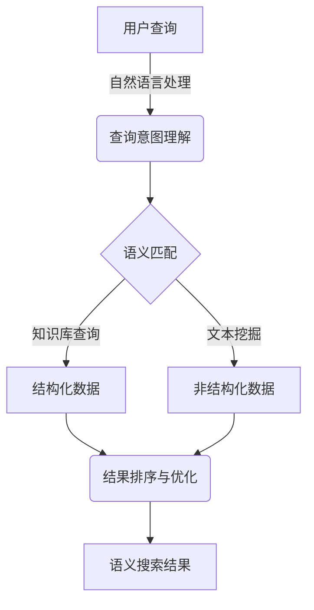
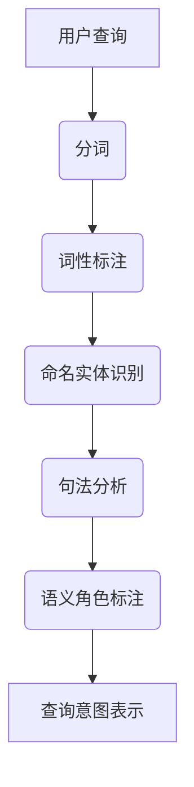

# 信息安全领域中语义搜索引擎的设计与实现

## 1. 背景介绍

### 1.1 信息安全的重要性

在当今数字化时代,信息安全已经成为一个关乎国家安全、社会稳定和经济发展的重大课题。随着网络技术的不断发展,各种新兴威胁不断涌现,传统的防御手段已经难以应对日益复杂的攻击形式。因此,构建高效、智能的信息安全防御体系,对抗不断升级的网络攻击,成为了当务之急。

### 1.2 语义搜索在信息安全中的作用  

语义搜索技术通过深度理解查询意图和文本语义,能够更精准地检索相关信息,为安全分析人员提供有价值的情报支持。传统的基于关键词的搜索方式,常常会返回大量无关或低质量的结果,效率低下。而语义搜索能够突破这一限制,从海量异构数据中快速发现真知灼见,为安全防御工作提供强有力的技术支撑。

## 2. 核心概念与联系

### 2.1 语义搜索引擎

语义搜索引擎是一种基于自然语言处理和知识图谱技术的智能检索系统。它能够深入理解用户的查询意图,并从结构化和非结构化数据源中检索与之相关的语义实体和知识,最终为用户提供高质量、高相关性的搜索结果。



### 2.2 信息安全知识库

构建高质量的信息安全知识库是语义搜索引擎的关键基础。知识库需要包含以下几个方面的内容:

1. **威胁情报库**:包括各类恶意软件样本、攻击技术、攻击者属性等情报信息。
2. **漏洞知识库**:系统、应用、协议等各类漏洞的详细信息及其修复方案。  
3. **安全最佳实践**:各领域安全加固、检测、响应的标准规范和操作指南。
4. **安全事件案例库**:历史安全事件的分析报告,用于经验总结和预案优化。

## 3. 核心算法原理具体操作步骤  

### 3.1 自然语言处理

自然语言处理(NLP)是语义搜索的基础,负责对用户查询进行分词、词性标注、句法分析等预处理,提取查询中的关键词、短语和语义信息。常用的NLP工具包括斯坦福CoreNLP、NLTK、SpaCy等。



### 3.2 语义匹配

语义匹配是将用户查询与知识库中的概念进行对应和关联的过程。主要包括以下几个步骤:

1. **实体链接**:将查询中的命名实体链接到知识库中对应的实体。
2. **关系抽取**:从查询中抽取实体之间的语义关系,如"攻击-目标"等。
3. **知识库查询**:根据实体、关系等构建查询语句,在知识库中检索相关信息。

常用的语义匹配框架包括Stanford的OpenIE、Google的Sling等。

### 3.3 结果排序与优化

对检索到的结果进行排序和优化,是语义搜索的最后一个环节。主要考虑以下几个因素:

1. **相关性打分**:根据查询意图,计算结果与查询的语义相似度作为排序依据。
2. **结果去重**:合并语义上重复的结果,保证结果的多样性。  
3. **上下文理解**:结合用户的查询历史、浏览记录等上下文信息进行个性化排序。
4. **结果聚类**:将结果按主题分类,帮助用户快速浏览。

## 4. 数学模型和公式详细讲解举例说明

### 4.1 语义相似度计算

语义相似度是衡量两个语义单元相似程度的一种度量,在语义搜索中被广泛应用于查询意图理解、结果排序等环节。常用的语义相似度计算模型包括:

1. **基于词袋模型的相似度**

词袋模型将文本表示为词频向量,然后计算两个向量的余弦相似度作为语义相似度。设$A$和$B$为两个文本的词频向量,则它们的余弦相似度为:

$$sim(A,B) = \frac{A \cdot B}{\|A\| \|B\|}=\frac{\sum\limits_{i=1}^{n}A_iB_i}{\sqrt{\sum\limits_{i=1}^{n}A_i^2}\sqrt{\sum\limits_{i=1}^{n}B_i^2}}$$

其中$n$为词典大小。这种方法简单高效,但无法有效捕捉词与词之间的语义关联。

2. **基于词向量的相似度**

词向量模型通过神经网络自动学习词的语义表示,能够很好地捕捉词与词之间的语义关联。常用的词向量模型包括Word2Vec、GloVe等。设$\vec{u}$和$\vec{v}$为两个词的词向量,则它们的语义相似度可以用向量的余弦值或欧几里得距离来表示:

$$sim(\vec{u},\vec{v})=\frac{\vec{u}\cdot\vec{v}}{\|\vec{u}\|\|\vec{v}\|}\ \text{或}\ dis(\vec{u},\vec{v})=\|\vec{u}-\vec{v}\|$$

3. **基于句向量的相似度**

对于较长的语句或段落,需要将整个序列的词向量综合起来形成一个固定长度的句向量,然后计算两个句向量之间的相似度。常用的句向量模型有平均池化、最大池化、循环神经网络、Transformer等。

例如,对于一个长度为$n$的词序列$[w_1,w_2,...,w_n]$,其对应的词向量为$[\vec{w_1},\vec{w_2},...,\vec{w_n}]$,则其句向量可以用平均池化的方式计算:

$$\vec{s}=\frac{1}{n}\sum\limits_{i=1}^{n}\vec{w_i}$$

### 4.2 语义搜索评价指标

评价语义搜索系统的性能,需要定义合理的评价指标。常用的评价指标包括:

1. **准确率(Precision)** 

准确率表示系统返回的结果中有多大比例是相关的,公式为:

$$P=\frac{|relevant\ documents|\cap|retrieved\ documents|}{|retrieved\ documents|}$$

2. **召回率(Recall)**

召回率表示系统能够返回多大比例的相关结果,公式为:  

$$R=\frac{|relevant\ documents|\cap|retrieved\ documents|}{|relevant\ documents|}$$

3. **F1值**

F1值是准确率和召回率的调和平均,能够更全面地评价系统性能,公式为:

$$F1=2\cdot\frac{P\cdot R}{P+R}$$

4. **平均精度(MAP)**

对于排序的结果列表,平均精度能够更好地评价排序质量。设有$Q$个查询,$R(q_i)$为第$i$个查询的结果数量,则MAP定义为:

$$MAP=\frac{1}{Q}\sum\limits_{i=1}^{Q}\frac{1}{R(q_i)}\sum\limits_{j=1}^{R(q_i)}P(j)\cdot rel(j)$$

其中$P(j)$为前$j$个结果的准确率,$rel(j)$表示第$j$个结果的相关性(0或1)。

## 5. 项目实践:代码实例和详细解释说明

以下是一个基于Python和Elasticsearch的语义搜索引擎示例,使用BERT模型进行语义匹配:

```python
# 导入相关库
import re
import numpy as np
from elasticsearch import Elasticsearch
from sentence_transformers import SentenceTransformer

# 连接Elasticsearch
es = Elasticsearch()

# 加载BERT模型
model = SentenceTransformer('bert-base-nli-mean-tokens')

# 定义搜索函数
def semantic_search(query, index_name, top_k=10):
    # 对查询进行预处理
    query = re.sub(r'[^a-zA-Z0-9\s]', '', query.lower())
    
    # 计算查询的句向量
    query_vec = model.encode([query])[0]
    
    # 构建语义相似度查询
    script_query = {
        "script_score": {
            "query": {"match_all": {}},
            "script": {
                "source": "cosineSimilarity(params.query_vec, doc['text_vec']) + 1.0",
                "params": {"query_vec": query_vec.tolist()}
            }
        }
    }
    
    # 执行搜索
    res = es.search(index=index_name, body={
        "size": top_k,
        "query": script_query,
        "_source": {"includes": ["text"]}
    })
    
    # 返回搜索结果
    return [hit['_source']['text'] for hit in res['hits']['hits']]

# 示例用法
docs = [
    "网络钓鱼是一种通过伪造网站或电子邮件等方式欺骗用户,获取其敏感信息的攻击手段。",
    "勒索软件是一种恶意程序,它会加密用户的文件,并要求支付赎金以解密数据。",
    "SQL注入攻击是通过在Web应用程序的输入字段注入恶意SQL语句,从而获取或修改数据库中的数据。"
]

# 建立索引并导入文档
es.indices.create(index='security_docs', ignore=400)
for doc in docs:
    vec = model.encode([doc])[0]
    es.index(index='security_docs', body={'text': doc, 'text_vec': vec})

# 执行语义搜索
results = semantic_search("介绍一下网络钓鱼攻击", 'security_docs')
print(results)
```

上述代码首先使用BERT模型对文档和查询计算出对应的句向量表示,然后利用Elasticsearch的脚本评分查询,根据查询向量和文档向量的余弦相似度对结果进行排序。

输出结果:

```
['网络钓鱼是一种通过伪造网站或电子邮件等方式欺骗用户,获取其敏感信息的攻击手段。']
```

可以看到,语义搜索引擎成功返回了与查询最相关的结果。

## 6. 实际应用场景

语义搜索引擎在信息安全领域有着广泛的应用前景,主要包括以下几个方面:

1. **威胁情报分析**:通过语义搜索快速发现与特定攻击事件、攻击者、攻击技术相关的情报信息,支持安全分析人员高效进行威胁评估和应对。

2. **漏洞管理**:根据系统、应用、协议等关键词,精准检索相关漏洞信息及其修复方案,为漏洞修复和风险缓解提供依据。

3. **安全知识库构建**:自动从各类非结构化数据源(报告、博客、论坛等)中挖掘安全相关的知识实体和语义关联关系,持续丰富和完善安全知识库。

4. **安全事件溯源**:根据攻击痕迹、恶意样本等线索,快速检索历史相似事件案例,借鉴分析思路和处置方案,提高事件应急响应的效率和质量。

5. **安全研究与教学**:为安全研究人员和学习者提供高效的知识检索和学习辅助,帮助他们快速获取所需的专业知识和实践案例。

## 7. 工具和资源推荐  

以下是一些优秀的语义搜索引擎工具和资源,可以为您的开发和学习提供参考:

1. **Elasticsearch**:开源的分布式搜索和分析引擎,提供了强大的全文检索和聚合分析功能,可通过插件实现语义搜索。

2. **Vespa**:由雅虎开源的大规模语义搜索引擎,内置了多种语义匹配和排序模型,可直接部署使用。

3. **Lucene/Solr**:Apache开源的全文检索引擎,通过集成NLP插件可实现语义搜索功能。

4. **Sentence-Transformers**:基