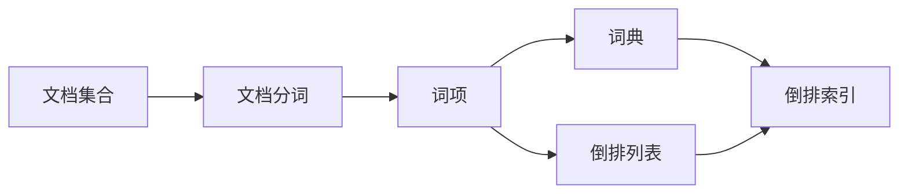

# 倒排索引的基本原理和数据结构

## 1. 背景介绍
### 1.1 信息检索的发展历程
#### 1.1.1 早期的信息检索
#### 1.1.2 布尔检索模型
#### 1.1.3 向量空间模型

### 1.2 搜索引擎中的索引
#### 1.2.1 索引的重要性  
#### 1.2.2 正排索引与倒排索引
#### 1.2.3 倒排索引的优势

## 2. 核心概念与联系
### 2.1 文档(Document)
### 2.2 词项(Term)
### 2.3 词典(Dictionary)
### 2.4 倒排列表(Posting List)
### 2.5 倒排文件(Inverted File)



## 3. 核心算法原理具体操作步骤
### 3.1 文档集合预处理
#### 3.1.1 文档编号DocID分配
#### 3.1.2 文档内容规范化
#### 3.1.3 中文分词/英文词干化

### 3.2 词典构建
#### 3.2.1 词项抽取与规范化  
#### 3.2.2 词项词频统计
#### 3.2.3 词典排序与编码

### 3.3 倒排列表构建
#### 3.3.1 文档词项发生映射
#### 3.3.2 倒排列表压缩存储
#### 3.3.3 倒排列表增量更新

### 3.4 倒排索引查询
#### 3.4.1 布尔查询处理
#### 3.4.2 短语查询处理
#### 3.4.3 相关度排序

## 4. 数学模型和公式详细讲解举例说明
### 4.1 布尔模型(Boolean Model) 
- 查询表示：$Q=(q_1\wedge q_2)\vee(\neg q_3)$
- 文档表示：$D=(t_1,t_2,\dots,t_n), t_i \in \{0,1\}$
- 相关性判断：$sim(Q,D)=\begin{cases}1, & D满足Q的布尔表达式 \\ 0, & 其他\end{cases}$

### 4.2 向量空间模型(Vector Space Model)
- 文档向量：$\vec{V}(d_j)=(w_{1j},w_{2j},\dots,w_{nj})$  
- 查询向量：$\vec{V}(q)=(w_{1q},w_{2q},\dots,w_{nq})$
- 相关度计算：

$$
sim(d_j,q)=\frac{\vec{V}(d_j)\cdot \vec{V}(q)}{\lVert\vec{V}(d_j) \rVert \times \lVert\vec{V}(q)\rVert}=\frac{\sum_{i=1}^n w_{ij}w_{iq}}{\sqrt{\sum_{i=1}^n w_{ij}^2}\sqrt{\sum_{i=1}^n w_{iq}^2}}
$$

其中，$w_{ij}, w_{iq}$ 分别表示词项 $t_i$ 在文档 $d_j$ 和查询 $q$ 中的权重。

### 4.3 BM25概率模型
BM25 模型是一种基于概率的文档排序模型，计算文档 $D$ 与查询 $Q$ 的相关性得分：

$$
score(D,Q)=\sum_{i=1}^n IDF(q_i) \cdot \frac{f(q_i,D) \cdot (k_1+1)}{f(q_i,D)+k_1 \cdot (1-b+b \cdot \frac{|D|}{avgdl})}
$$

- $IDF(q_i)$：查询词 $q_i$ 的逆文档频率
- $f(q_i,D)$：查询词 $q_i$ 在文档 $D$ 中的频率
- $|D|$：文档 $D$ 的长度
- $avgdl$：文档集合的平均长度
- $k_1,b$：调节因子，通常取 $k_1 \in [1.2,2.0], b=0.75$

## 5. 项目实践：代码实例和详细解释说明
下面是一个简单的 Python 实现倒排索引的示例：

```python
from collections import defaultdict

class InvertedIndex:
    def __init__(self):
        self.index = defaultdict(list)
        
    def build_index(self, docs):
        for doc_id, doc in enumerate(docs):
            terms = doc.lower().split()
            for term in terms:
                self.index[term].append(doc_id)
                
    def search(self, query):
        query_terms = query.lower().split()
        result = set(self.index[query_terms[0]])
        for term in query_terms[1:]:
            result = result.intersection(self.index[term])
        return result

# 测试代码
docs = [
    "This is the first document.",
    "This document is the second document.",
    "And this is the third one.",
    "Is this the first document?",
]

index = InvertedIndex()
index.build_index(docs)

print(index.search("first"))  # 输出：{0, 3}
print(index.search("document"))  # 输出：{0, 1, 3}
print(index.search("second document"))  # 输出：{1}
```

代码解释：
1. 定义了一个 `InvertedIndex` 类，内部使用 `defaultdict` 存储倒排索引。
2. `build_index` 方法接受一个文档列表，遍历每个文档，对文档进行分词，然后将文档ID添加到对应词项的倒排列表中。
3. `search` 方法接受一个查询字符串，对查询进行分词，然后取第一个词项的倒排列表作为初始结果集，再与其他词项的倒排列表取交集，得到最终的文档ID结果集。

这个示例展示了倒排索引的基本构建和查询过程，实际应用中还需要考虑更多因素，如词项规范化、倒排列表压缩、权重计算等。

## 6. 实际应用场景
### 6.1 大型搜索引擎
- Google、Bing、Baidu 等通用搜索引擎
- 垂直领域搜索引擎，如学术搜索、法律搜索等

### 6.2 站内搜索
- 电商网站商品搜索，如淘宝、京东
- 论坛、博客等内容网站的文章搜索

### 6.3 个人信息管理
- 个人笔记、文档的本地搜索
- 邮件搜索、即时通讯聊天记录搜索

### 6.4 推荐系统
- 利用倒排索引快速找到相似用户或物品
- 协同过滤、内容推荐常用倒排索引进行加速

## 7. 工具和资源推荐
### 7.1 开源搜索引擎库
- Apache Lucene：Java 编写的高性能全文搜索引擎库
- Elasticsearch：基于 Lucene 构建的分布式搜索和分析引擎
- Apache Solr：基于 Lucene 的企业级搜索服务器
- Sphinx：C++ 编写的高性能全文搜索引擎

### 7.2 编程语言及相关库
- Python：whoosh、jieba、nltk 等
- Java：Lucene、Elasticsearch、Solr 等
- C++：Sphinx、Xapian 等
- JavaScript：Lunr.js、Elasticlunr.js 等

### 7.3 相关书籍与教程
- 《这就是搜索引擎：核心技术详解》- 张俊林
- 《信息检索导论》- Christopher D. Manning 等
- 《Lucene in Action》- Michael McCandless 等
- Coursera 课程《文本检索和搜索引擎》- Chengxiang Zhai

## 8. 总结：未来发展趋势与挑战
### 8.1 海量数据处理
- 数据量爆炸式增长，对索引构建和更新性能提出更高要求
- 分布式索引技术，如分片、副本、负载均衡等

### 8.2 实时索引更新
- 传统的批量构建索引无法满足实时性需求
- 增量更新技术，支持新文档的实时索引和查询

### 8.3 个性化和语义化搜索  
- 利用用户画像、查询意图理解等技术，提供个性化搜索结果
- 语义索引技术，捕捉词项间的语义关系，提高搜索准确率

### 8.4 多媒体数据检索
- 图片、视频、音频等非文本数据的索引和检索
- 深度学习技术在多媒体检索中的应用，如卷积神经网络、循环神经网络等

### 8.5 隐私保护与安全
- 敏感数据的索引和查询隐私保护
- 抵御索引数据被恶意篡改、删除等安全威胁

## 9. 附录：常见问题与解答
### 9.1 倒排索引与正排索引的区别是什么？
正排索引以文档ID为键，存储文档内容或词项；倒排索引以词项为键，存储包含该词项的文档ID列表。正排索引适合根据文档ID快速获取文档内容，倒排索引适合根据词项快速获取包含该词项的文档。

### 9.2 倒排索引的存储空间占用如何？
倒排索引的存储空间主要由词典和倒排列表组成。词典存储所有不重复的词项，倒排列表存储每个词项对应的文档ID。索引空间占用与文档集合的大小、词项数量、倒排列表压缩率等因素有关。一般来说，倒排索引的空间占用大于原始文档集合。

### 9.3 倒排索引如何支持动态更新？
可以采用增量更新的方式支持倒排索引的动态更新。新文档到达时，对其分词提取词项，然后将文档ID添加到对应词项的倒排列表中。为了提高更新效率，可以先缓存更新操作，定期批量提交。此外，还可以采用多副本、分片等技术实现分布式索引的动态更新。

### 9.4 倒排索引在分布式环境下如何实现？
分布式倒排索引的实现需要考虑数据分片、副本、负载均衡等因素。常见的方案有：
- 文档分片：按照文档ID进行分片，每个分片构建自己的本地倒排索引。
- 词项分片：按照词项进行分片，不同节点负责不同词项的索引构建和查询。
- 副本机制：为每个分片创建多个副本，提高查询吞吐量和容错能力。
- 负载均衡：将查询请求均匀分发到不同的节点或副本，提高查询性能。

代表性的分布式索引实现有 Elasticsearch、Solr 等。

### 9.5 倒排索引查询的优化策略有哪些？
- 词项跳表：在倒排列表中为每个词项维护一个跳表，加速查询定位。
- 倒排列表压缩：采用变长编码、差值编码等方式压缩倒排列表，减小存储空间。
- 缓存机制：缓存热点查询的结果，减少重复计算。
- 查询拓展：根据同义词、词根等关系拓展查询词，提高查全率。
- 相关度计算优化：采用 BM25、向量空间模型等高效的相关度计算算法。
- 多线程并行：利用多线程并行处理查询请求，提高查询吞吐量。

作者：禅与计算机程序设计艺术 / Zen and the Art of Computer Programming