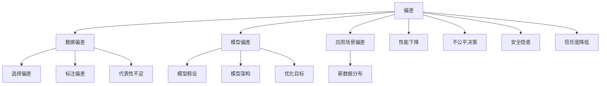
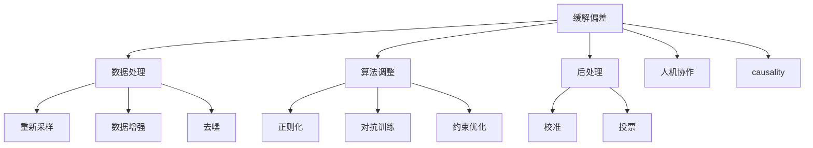

# 偏差来源：数据、模型和应用场景

## 1.背景介绍

在人工智能和机器学习领域中,偏差(Bias)一直是一个备受关注的问题。偏差可能来源于多个方面,包括数据、模型以及应用场景。理解和缓解这些偏差源对于构建公平、可靠和有效的人工智能系统至关重要。本文将深入探讨偏差的根源,分析其对模型性能和决策的影响,并提供一些缓解偏差的策略和最佳实践。

## 2.核心概念与联系

### 2.1 偏差的定义

在机器学习中,偏差(Bias)指的是模型与真实数据分布之间的系统性差异。偏差可能导致模型在某些情况下表现不佳,产生不准确或不公平的预测结果。

### 2.2 偏差的来源

偏差可能来自以下三个主要来源:

1. **数据偏差**:训练数据集本身可能存在偏差,例如数据收集过程中的选择偏差、标注偏差或代表性不足等。
2. **模型偏差**:机器学习模型本身的假设、架构或优化目标可能引入偏差。
3. **应用场景偏差**:在特定的应用场景中,模型可能会面临新的数据分布,与训练数据存在差异,从而导致偏差。

这三个来源相互影响,共同决定了模型的整体偏差水平。

### 2.3 偏差的影响

偏差可能导致以下负面影响:

1. **性能下降**:模型在特定情况下的预测精度降低。
2. **不公平决策**:模型对某些群体或个体做出不公平的判断和决策。
3. **安全隐患**:在关键应用场景(如自动驾驶)中,偏差可能导致严重的安全风险。
4. **信任度降低**:用户对模型的决策缺乏信任,影响人工智能系统的采用。

因此,识别和缓解偏差对于构建可靠、公平和有效的人工智能系统至关重要。



## 3.核心算法原理具体操作步骤

### 3.1 识别偏差的方法

识别偏差是缓解偏差的第一步。以下是一些常用的方法:

1. **数据分析**:通过可视化和统计分析,检查数据集中的潜在偏差,如类别不平衡、缺失值模式等。
2. **子群体分析**:将数据划分为不同的子群体(如年龄、性别、种族等),分别评估模型在每个子群体上的表现,发现潜在的偏差。
3. **人工审计**:由人工专家手动审查模型的预测结果,识别潜在的偏差问题。
4. **公平度量**:使用各种公平度量(如统计率成对、等等)来量化模型的偏差水平。
5. **模型可解释性技术**:利用可解释性技术(如SHAP、LIME等)解释模型的决策过程,发现潜在的偏差根源。

### 3.2 缓解偏差的策略

一旦识别出偏差的来源,可以采取以下策略来缓解偏差:

1. **数据处理**:
   - 重新采样:过采样少数类别,下采样多数类别,平衡数据集。
   - 数据增强:通过合成数据或数据扩充技术增加少数类别的样本。
   - 去噪:清理含有噪声或错误标注的数据样本。

2. **算法调整**:
   - 正则化:通过添加正则化项,缓解模型对某些特征的过度依赖。
   - 对抗训练:在训练过程中,引入对抗性扰动,提高模型的鲁棒性。
   - 约束优化:在优化目标中加入公平性约束,促进模型学习公平的决策边界。

3. **后处理**:
   - 校准:根据模型在不同子群体上的表现,对输出概率进行校准。
   - 投票:结合多个模型的预测结果,缓解单一模型的偏差。

4. **人机协作**:将人工审计和人工反馈纳入模型的训练和决策过程中,减少偏差。

5. **causality**:利用因果推理技术,识别和移除模型中的不公平因果路径,促进公平决策。



## 4.数学模型和公式详细讲解举例说明

### 4.1 统计率成对 (Statistical Parity)

统计率成对是一种常用的公平度量,它要求模型对不同的人口统计群体(如不同种族或性别)做出相同的预测概率。形式化地,对于一个二元分类任务,我们定义:

- $Y$为二元标签(0或1)
- $\hat{Y}$为模型预测的标签
- $A$为敏感属性(如种族或性别)
- $P(Y=1|A=0)$和$P(Y=1|A=1)$分别表示不同群体的正例率

统计率成对要求:

$$P(\hat{Y}=1|A=0) = P(\hat{Y}=1|A=1)$$

即不同群体的预测正例率相等。

然而,统计率成对存在一些局限性:

1. 它忽略了真实标签的分布,可能会在牺牲模型整体性能的情况下实现公平性。
2. 它只考虑了单一任务,在多任务场景下可能无法很好地衡量公平性。

因此,统计率成对通常被视为一种基线公平度量,在实践中需要结合其他度量和约束来评估和优化模型的公平性。

### 4.2 等机会 (Equal Opportunity)

等机会是另一种常用的公平度量,它要求模型对不同群体的真实正例做出相同的真正例率(True Positive Rate)。形式化地,我们定义:

- $TPR(A=0) = P(\hat{Y}=1|Y=1,A=0)$为群体$A=0$的真正例率
- $TPR(A=1) = P(\hat{Y}=1|Y=1,A=1)$为群体$A=1$的真正例率

等机会要求:

$$TPR(A=0) = TPR(A=1)$$

等机会度量关注的是模型对真实正例的预测能力,它避免了统计率成对的一些缺陷,但也存在局限性:

1. 它只考虑了真实正例,忽略了真实负例的情况。
2. 在某些场景下,等机会可能与其他公平度量(如平等机会)存在冲突。

因此,等机会通常与其他度量结合使用,以更全面地评估和优化模型的公平性。

### 4.3 对抗训练 (Adversarial Training)

对抗训练是一种常用的算法调整策略,旨在提高模型的鲁棒性和公平性。其基本思想是在训练过程中引入一个对抗性的判别器(discriminator),试图从模型的输出中预测敏感属性$A$。同时,模型的目标是最小化对抗性损失,使得判别器无法从输出中推断出敏感属性。

具体地,我们定义:

- $\theta$为模型参数
- $\phi$为判别器参数
- $\mathcal{L}_{task}$为主任务损失(如交叉熵损失)
- $\mathcal{L}_{adv}$为对抗性损失

模型和判别器的优化目标分别为:

$$\min_\theta \mathcal{L}_{task}(\theta) - \lambda \max_\phi \mathcal{L}_{adv}(\theta, \phi)$$
$$\max_\phi \mathcal{L}_{adv}(\theta, \phi)$$

其中$\lambda$是一个权重超参数,用于平衡主任务损失和对抗性损失。

对抗训练通过最小化对抗性损失,迫使模型学习到一个公平的表示,使得敏感属性对模型的预测没有影响。然而,对抗训练也存在一些挑战:

1. 对抗训练可能会降低模型在主任务上的性能。
2. 对抗训练的效果可能受到数据集中存在的其他潜在偏差的影响。
3. 对抗训练的收敛性和稳定性可能受到优化过程的影响。

因此,在实践中,对抗训练通常与其他策略(如数据处理、后处理等)结合使用,以更好地缓解偏差。

## 5.项目实践:代码实例和详细解释说明

在这一部分,我们将提供一个基于Python和PyTorch的代码示例,演示如何使用对抗训练来缓解模型中的偏差。我们将使用经典的成人收入预测数据集,其中包含了一些敏感属性(如性别和种族)。

### 5.1 数据预处理

```python
import pandas as pd
from sklearn.preprocessing import LabelEncoder, OneHotEncoder
from sklearn.compose import ColumnTransformer

# 加载数据集
data = pd.read_csv('adult.csv')

# 对标签和分类特征进行编码
label_encoder = LabelEncoder()
data['income'] = label_encoder.fit_transform(data['income'])

categorical_features = ['workclass', 'education', 'marital-status', 'occupation', 'relationship', 'race', 'sex', 'native-country']
categorical_transformer = ColumnTransformer(transformers=[('encoder', OneHotEncoder(), categorical_features)], remainder='passthrough')
data = pd.DataFrame(categorical_transformer.fit_transform(data))

# 分割训练集和测试集
X_train, X_test, y_train, y_test = train_test_split(data.drop('income', axis=1), data['income'], test_size=0.2, random_state=42)
```

在这个示例中,我们首先加载成人收入预测数据集,并对标签和分类特征进行编码。然后,我们使用`train_test_split`函数将数据集分割为训练集和测试集。

### 5.2 对抗训练模型

```python
import torch
import torch.nn as nn

class AdversarialModel(nn.Module):
    def __init__(self, input_size, hidden_size, num_classes, sensitive_dim):
        super(AdversarialModel, self).__init__()
        self.main_model = nn.Sequential(
            nn.Linear(input_size, hidden_size),
            nn.ReLU(),
            nn.Linear(hidden_size, num_classes)
        )
        self.adversary = nn.Sequential(
            nn.Linear(num_classes, hidden_size),
            nn.ReLU(),
            nn.Linear(hidden_size, sensitive_dim)
        )

    def forward(self, x):
        main_output = self.main_model(x)
        adversary_input = main_output.clone().detach()
        adversary_output = self.adversary(adversary_input)
        return main_output, adversary_output

# 初始化模型
input_size = X_train.shape[1]
hidden_size = 64
num_classes = 2
sensitive_dim = 2  # 假设敏感属性为性别(0或1)
model = AdversarialModel(input_size, hidden_size, num_classes, sensitive_dim)

# 定义损失函数和优化器
criterion_main = nn.CrossEntropyLoss()
criterion_adv = nn.CrossEntropyLoss()
optimizer_main = torch.optim.Adam(model.main_model.parameters(), lr=0.001)
optimizer_adv = torch.optim.Adam(model.adversary.parameters(), lr=0.001)

# 对抗训练
for epoch in range(num_epochs):
    for X_batch, y_batch, sensitive_batch in data_loader:
        # 前向传播
        main_output, adv_output = model(X_batch)

        # 计算主任务损失
        loss_main = criterion_main(main_output, y_batch)

        # 计算对抗性损失
        loss_adv = criterion_adv(adv_output, sensitive_batch)

        # 反向传播和优化
        optimizer_main.zero_grad()
        loss_main.backward(retain_graph=True)
        optimizer_main.step()

        optimizer_adv.zero_grad()
        loss_adv