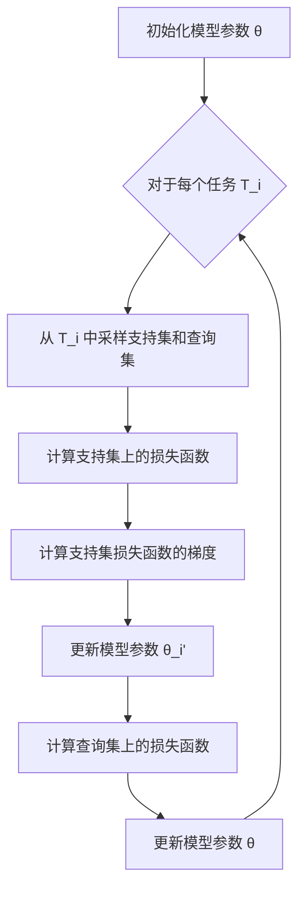

# 元学习 (Meta Learning) 原理与代码实例讲解

## 1. 背景介绍

在传统的机器学习中,我们通常需要为每个新任务收集大量的标记数据,并从头开始训练一个新的模型。然而,这种方法存在一些缺陷:

1. 数据标注成本高昂且耗时
2. 无法利用已有的知识,需要为每个任务重新学习
3. 泛化能力有限,难以适应新的环境和任务

为了解决这些问题,元学习(Meta Learning)应运而生。元学习旨在学习一种通用的知识表示,使得模型能够快速适应新的任务,并利用之前学习到的经验来提高学习效率。

## 2. 核心概念与联系

### 2.1 什么是元学习?

元学习是机器学习中的一个重要范式,它关注于如何利用过去的经验来快速学习新任务。与传统的机器学习不同,元学习不是直接学习特定任务,而是学习一种泛化的学习策略,使模型能够适应新的环境和任务。

### 2.2 元学习与其他机器学习范式的关系

元学习与其他机器学习范式存在一些联系和区别:

- 监督学习: 监督学习关注于从标记数据中学习映射函数,而元学习则关注于如何快速适应新任务。
- 强化学习: 强化学习侧重于如何通过与环境交互来学习最优策略,而元学习则关注于如何利用过去的经验来加速学习过程。
- 迁移学习: 迁移学习旨在将已学习的知识应用于新的相关任务,而元学习则更加关注于如何学习一种通用的学习策略。

### 2.3 元学习的应用场景

元学习在以下场景中具有广泛的应用前景:

- 少样本学习: 在数据稀缺的情况下,元学习可以利用过去的经验快速适应新任务。
- 持续学习: 元学习能够不断地从新任务中学习,并更新现有的知识表示。
- 多任务学习: 元学习可以同时学习多个相关任务,并提高整体的学习效率。
- 机器人控制: 元学习可以帮助机器人快速适应新的环境和任务,提高其泛化能力。

## 3. 核心算法原理具体操作步骤

元学习算法可以分为三个主要步骤:

1. **元训练(Meta-Training)**: 在这个阶段,算法从一系列相关但不同的任务中学习一种通用的知识表示。这种知识表示应该能够帮助模型快速适应新的任务。

2. **内循环(Inner Loop)**: 在内循环中,算法利用从元训练阶段学习到的知识表示来快速适应一个新的任务。这个过程通常只需要少量的数据和计算资源。

3. **外循环(Outer Loop)**: 在外循环中,算法根据内循环的表现来更新知识表示,以提高在新任务上的适应能力。

下面是一个常见的基于优化的元学习算法(Model-Agnostic Meta-Learning, MAML)的具体操作步骤:

1. 初始化模型参数 $\theta$
2. 对于每个任务 $\mathcal{T}_i$:
    a. 从 $\mathcal{T}_i$ 中采样支持集 $\mathcal{D}_i^{tr}$ 和查询集 $\mathcal{D}_i^{val}$
    b. 计算支持集上的损失函数 $\mathcal{L}_{\mathcal{T}_i}(\theta)$
    c. 计算支持集损失函数的梯度 $\nabla_\theta \mathcal{L}_{\mathcal{T}_i}(\theta)$
    d. 更新模型参数 $\theta_i' = \theta - \alpha \nabla_\theta \mathcal{L}_{\mathcal{T}_i}(\theta)$
    e. 计算查询集上的损失函数 $\mathcal{L}_{\mathcal{T}_i}(\theta_i')$
3. 更新模型参数 $\theta \leftarrow \theta - \beta \nabla_\theta \sum_{\mathcal{T}_i} \mathcal{L}_{\mathcal{T}_i}(\theta_i')$
4. 重复步骤 2 和 3,直到收敛

在这个算法中,内循环(步骤 2.b-2.d)用于快速适应新任务,而外循环(步骤 3)则用于更新通用的知识表示。通过反复进行这两个循环,算法可以逐步提高在新任务上的适应能力。



## 4. 数学模型和公式详细讲解举例说明

在元学习中,我们通常使用一个元学习器(meta-learner)来学习一种通用的知识表示。这种知识表示可以被快速适应到新的任务上,从而提高学习效率。

### 4.1 基于优化的元学习

在基于优化的元学习算法中,我们假设存在一个学习器(learner) $f_\theta$,其中 $\theta$ 是可学习的参数。对于每个任务 $\mathcal{T}_i$,我们可以通过在支持集 $\mathcal{D}_i^{tr}$ 上优化 $\theta$ 来获得适应该任务的参数 $\theta_i'$:

$$\theta_i' = \theta - \alpha \nabla_\theta \mathcal{L}_{\mathcal{T}_i}^{tr}(f_\theta)$$

其中 $\mathcal{L}_{\mathcal{T}_i}^{tr}$ 是任务 $\mathcal{T}_i$ 在支持集上的损失函数,而 $\alpha$ 是学习率。

在元训练阶段,我们希望找到一个初始参数 $\theta$,使得对于任何新任务 $\mathcal{T}_i$,只需要几步梯度更新就能获得一个良好的 $\theta_i'$。因此,我们可以在查询集 $\mathcal{D}_i^{val}$ 上最小化损失函数:

$$\min_\theta \sum_{\mathcal{T}_i} \mathcal{L}_{\mathcal{T}_i}^{val}(f_{\theta_i'})$$

这个优化过程就是元学习的外循环。通过反复进行内循环(适应新任务)和外循环(更新通用知识表示),我们可以获得一个能够快速适应新任务的元学习器。

### 4.2 基于度量的元学习

另一种常见的元学习方法是基于度量的元学习。在这种方法中,我们假设存在一个度量空间 $\mathcal{M}$,其中每个任务 $\mathcal{T}_i$ 都被嵌入到一个特定的点 $\phi_i \in \mathcal{M}$。我们的目标是学习一个函数 $f_\theta$,使得对于任何新任务 $\mathcal{T}_i$,只需要根据其嵌入 $\phi_i$ 就能快速适应该任务。

具体来说,我们可以将 $f_\theta$ 分解为两个部分:一个嵌入函数 $g_\phi$,用于将输入数据映射到度量空间 $\mathcal{M}$;以及一个预测函数 $h_\psi$,用于根据输入数据的嵌入和任务嵌入 $\phi_i$ 进行预测。

在元训练阶段,我们需要同时学习嵌入函数 $g_\phi$ 和预测函数 $h_\psi$,使得对于任何新任务 $\mathcal{T}_i$,只需要根据其嵌入 $\phi_i$ 就能获得良好的预测性能。这可以通过最小化以下损失函数来实现:

$$\min_{\phi, \psi} \sum_{\mathcal{T}_i} \mathcal{L}_{\mathcal{T}_i}(h_\psi(g_\phi(x), \phi_i))$$

其中 $x$ 是输入数据,而 $\mathcal{L}_{\mathcal{T}_i}$ 是任务 $\mathcal{T}_i$ 的损失函数。

通过这种方式,我们可以学习到一个通用的嵌入空间,使得相似的任务被映射到相近的点。在测试阶段,对于一个新任务 $\mathcal{T}_j$,我们只需要根据其嵌入 $\phi_j$ 和输入数据的嵌入 $g_\phi(x)$ 来进行预测,而无需进行额外的训练。

## 5. 项目实践: 代码实例和详细解释说明

在这一部分,我们将通过一个实际的代码示例来展示如何使用 PyTorch 实现基于优化的元学习算法 MAML。我们将使用一个简单的回归任务作为示例,但是这种方法同样可以应用于其他类型的任务。

### 5.1 问题设置

假设我们有一系列相关但不同的回归任务,每个任务都是从一个未知的函数 $f_i(x)$ 中采样得到的。我们的目标是学习一个元学习器,使其能够快速适应任何新的回归任务,即使只有少量的训练数据。

### 5.2 数据生成

首先,我们定义一个函数来生成回归任务的数据:

```python
import torch
import numpy as np

def sample_regression_task(num_samples, num_dims, amplitude, phase):
    # 生成输入数据
    x = torch.randn(num_samples, num_dims)
    
    # 生成目标函数
    f = amplitude * torch.sin(phase + x.matmul(torch.randn(num_dims)))
    
    # 添加噪声
    y = f + 0.3 * torch.randn(num_samples)
    
    return x, y
```

这个函数会生成一个具有 `num_samples` 个样本和 `num_dims` 个特征的回归任务。目标函数 `f` 是一个正弦函数,其振幅和相位由 `amplitude` 和 `phase` 参数控制。我们还添加了一些高斯噪声,以增加任务的难度。

### 5.3 模型定义

接下来,我们定义一个简单的神经网络模型,用于学习回归任务:

```python
import torch.nn as nn

class RegressionModel(nn.Module):
    def __init__(self, num_dims):
        super(RegressionModel, self).__init__()
        self.layers = nn.Sequential(
            nn.Linear(num_dims, 40),
            nn.ReLU(),
            nn.Linear(40, 40),
            nn.ReLU(),
            nn.Linear(40, 1)
        )

    def forward(self, x):
        return self.layers(x)
```

这个模型包含两个隐藏层,每层有 40 个神经元,并使用 ReLU 作为激活函数。

### 5.4 MAML 算法实现

现在,我们来实现 MAML 算法。我们将定义一个 `MetaLearner` 类,它包含了元训练和快速适应新任务的功能。

```python
import torch.optim as optim

class MetaLearner(nn.Module):
    def __init__(self, model, meta_lr, inner_lr):
        super(MetaLearner, self).__init__()
        self.model = model
        self.meta_lr = meta_lr
        self.inner_lr = inner_lr
        self.meta_opt = optim.Adam(self.model.parameters(), lr=self.meta_lr)

    def forward(self, x_tr, y_tr, x_val, y_val):
        # 计算支持集上的损失函数
        loss_tr = torch.mean((self.model(x_tr) - y_tr) ** 2)
        
        # 计算支持集损失函数的梯度
        grads = torch.autograd.grad(loss_tr, self.model.parameters(), create_graph=True)
        
        # 更新模型参数
        updated_params = [p - self.inner_lr * g for p, g in zip(self.model.parameters(), grads)]
        
        # 构建更新后的模型
        updated_model = RegressionModel(x_tr.shape[1])
        updated_model.load_state_dict(dict(zip(updated_model.state_dict().keys(), updated_params)))
        
        # 计算查询集上的损失函数
        loss_val = torch.mean((updated_model(x_val) - y_val) ** 2)
        
        return loss_val

    def meta_train(self, tasks, num_epochs):
        for epoch in range(num_epochs):
            meta_loss = 0
            for task in tasks:
                x_tr, y_tr = task['train']
                x_val, y_val = task['val