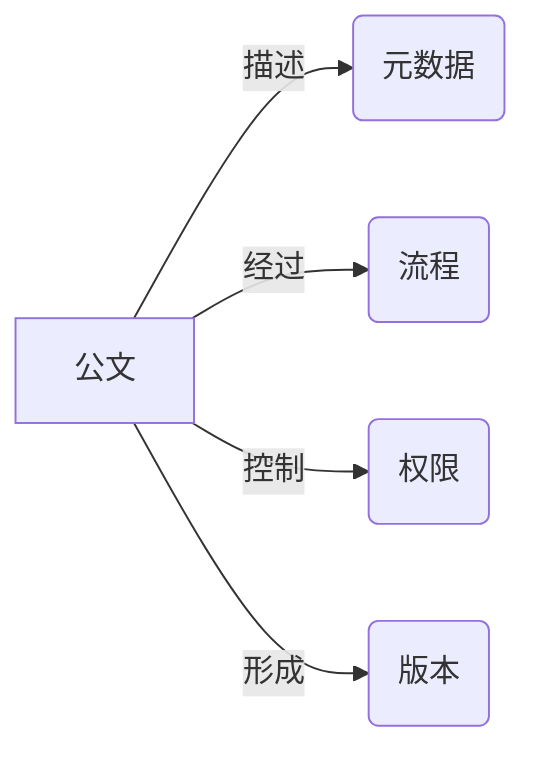

# 公文管理系统设计与实现

## 1. 背景介绍
### 1.1 公文管理的重要性
在现代化的行政管理工作中,公文管理是一项非常重要的工作。公文是国家机关、企事业单位在进行公务活动时形成的具有法律效力和保存价值的文件。高效规范的公文管理可以提高工作效率,规范工作流程,为领导决策提供参考依据。

### 1.2 传统公文管理存在的问题
传统的人工公文管理方式存在诸多问题,如:
1. 公文数量庞大,人工管理难度大
2. 纸质存档占用大量空间,检索不便 
3. 公文流转效率低,容易出错
4. 缺乏有效的监管和统计手段
5. 安全性难以保障

### 1.3 公文管理信息化的必要性
为了解决传统公文管理的弊端,提高公文管理效率和规范性,开发一套功能完善、易用高效的公文管理系统势在必行。通过信息化手段,可以实现:
1. 电子化存储,节约空间
2. 快速检索查询,提高效率
3. 流程自动化,减少错误
4. 数据统计分析,辅助决策
5. 严格权限控制,保障安全

## 2. 核心概念与联系
### 2.1 公文
公文是机关、团体、企事业单位在进行公务活动时形成的,具有法律效力或保存价值,以一定格式表现的文件。

### 2.2 元数据
元数据是用来描述公文属性的数据,如标题、文号、密级、拟稿人、日期等。通过元数据可以方便地对公文进行分类、检索。

### 2.3 流程
公文从拟稿、审核、签发到归档,要经过一系列环节,这些环节以一定次序连接形成公文处理流程。系统通过对流程的控制来规范公文处理。

### 2.4 权限
为保障公文安全,需要对用户的操作权限进行严格控制。系统通过用户-角色-权限的方式,赋予不同用户对公文的访问、修改、审批等权限。

### 2.5 版本
公文在拟稿和修改过程中会形成多个版本,系统自动控制和记录版本,确保修改可追溯,不丢失历史信息。

下图展示了公文及相关核心概念之间的关系:


## 3. 核心算法原理具体操作步骤
### 3.1 公文全文检索
公文管理系统需要提供高效的公文检索功能。常用的全文检索算法有:
1. 倒排索引
2. 布尔模型
3. 向量空间模型
4. 概率模型

以倒排索引为例,其核心步骤如下:
1. 文本预处理:对公文内容进行分词、去除停用词、提取词干等操作
2. 建立词典:将预处理后的词项按字典序排列,生成词典
3. 建立倒排表:扫描文档,对每个词项,记录包含该词项的文档ID,形成倒排表
4. 查询处理:对用户输入的查询词,在倒排表中查找相关文档,计算相关度,返回结果

### 3.2 公文自动分类
利用机器学习算法可以实现公文自动分类。常用算法有:
1. 朴素贝叶斯
2. 支持向量机
3. K近邻
4. 决策树

以朴素贝叶斯为例,其核心步骤如下:
1. 特征选择:选择合适的公文特征,如标题关键词、正文关键词等
2. 数据准备:收集已分类的公文样本,提取特征,形成训练集
3. 模型训练:基于训练集,计算每个类别下各特征的条件概率,得到模型参数
4. 分类预测:对新的公文,提取特征,计算在各个类别下的后验概率,选择概率最大的类别作为分类结果

### 3.3 流程控制
公文流转需要严格按照预设的流程进行。常用的流程控制方法有:
1. 有限状态机
2. 工作流引擎
3. 规则引擎

以有限状态机为例,其核心步骤如下:
1. 定义状态:定义公文所有可能的状态,如草稿、待审核、已签发、已归档等
2. 定义转换:定义各状态之间可能的转换,以及转换的条件、触发事件等
3. 设置初始状态:指定新建公文的初始状态,如草稿
4. 状态转换:当条件满足时,根据当前状态和触发事件,执行相应的转换,进入下一状态
5. 状态持久化:将公文状态保存到数据库,以便系统重启后能恢复状态

## 4. 数学模型和公式详细讲解举例说明
### 4.1 向量空间模型
向量空间模型将文本表示为向量,通过计算向量之间的夹角余弦来衡量文本相似度。设有n个文本$d_1,d_2,...,d_n$和m个词项$t_1,t_2,...,t_m$,每个文本表示为m维向量:

$$d_i=(w_{i1},w_{i2},...,w_{im})$$

其中$w_{ij}$表示词项$t_j$在文本$d_i$中的权重,通常用TF-IDF来计算:

$$w_{ij}=tf_{ij} \cdot \log(\frac{N}{df_j})$$

$tf_{ij}$为词频,即$t_j$在$d_i$中出现的次数;$df_j$为文档频率,即包含$t_j$的文本数;N为总文本数。

两个文本$d_i$和$d_j$的相似度为其对应向量的夹角余弦:

$$sim(d_i,d_j)=\cos(\vec{d_i},\vec{d_j})=\frac{\vec{d_i} \cdot \vec{d_j}}{\|\vec{d_i}\| \|\vec{d_j}\|}$$

例如,有两个文本:
- $d_1$: 这是一个测试文本
- $d_2$: 这是一个示例文档

假设词典为{这,是,一个,测试,文本,示例,文档},则两个文本对应的向量为:
- $\vec{d_1}=(1,1,1,1,1,0,0)$
- $\vec{d_2}=(1,1,1,0,0,1,1)$

其相似度为:

$$sim(d_1,d_2)=\frac{1 \times 1+1 \times 1+1 \times 1}{\sqrt{1^2+1^2+1^2+1^2+1^2} \times \sqrt{1^2+1^2+1^2+1^2+1^2}}=0.6$$

### 4.2 朴素贝叶斯分类
朴素贝叶斯基于贝叶斯定理,假设各特征相互独立。设有m个特征$F_1,F_2,...,F_m$,n个类别$C_1,C_2,...,C_n$。给定文本d的特征$(f_1,f_2,...,f_m)$,其属于类别$C_i$的后验概率为:

$$P(C_i|F_1=f_1,F_2=f_2,...,F_m=f_m)=\frac{P(C_i)P(F_1=f_1,F_2=f_2,...,F_m=f_m|C_i)}{P(F_1=f_1,F_2=f_2,...,F_m=f_m)}$$

假设各特征相互独立,则:

$$P(F_1=f_1,F_2=f_2,...,F_m=f_m|C_i)=\prod_{j=1}^m P(F_j=f_j|C_i)$$

$P(C_i)$为类别$C_i$的先验概率,$P(F_j=f_j|C_i)$为特征$F_j$在类别$C_i$中取值为$f_j$的条件概率,可通过训练样本估计:

$$P(C_i)=\frac{|D_i|}{|D|}$$

$$P(F_j=f_j|C_i)=\frac{|D_{ij}|+1}{|D_i|+N_j}$$

其中$|D|$为总训练文本数,$|D_i|$为类别$C_i$的训练文本数,$|D_{ij}|$为类别$C_i$中特征$F_j$取值为$f_j$的训练文本数,$N_j$为特征$F_j$的可能取值数。

例如,训练集中有100个文本,其中20个属于类别$C_1$,80个属于类别$C_2$。在类别$C_1$的文本中,10个包含词A,5个包含词B;在类别$C_2$的文本中,20个包含词A,50个包含词B。则:

$$P(C_1)=\frac{20}{100}=0.2, P(C_2)=\frac{80}{100}=0.8$$

$$P(F_A=1|C_1)=\frac{10+1}{20+2}=0.5, P(F_A=0|C_1)=\frac{10+1}{20+2}=0.5$$

$$P(F_B=1|C_1)=\frac{5+1}{20+2}=0.27, P(F_B=0|C_1)=\frac{15+1}{20+2}=0.73$$

$$P(F_A=1|C_2)=\frac{20+1}{80+2}=0.26, P(F_A=0|C_2)=\frac{60+1}{80+2}=0.74$$

$$P(F_B=1|C_2)=\frac{50+1}{80+2}=0.62, P(F_B=0|C_2)=\frac{30+1}{80+2}=0.38$$

给定一个新文本,其包含词A,不包含词B,则其属于类别$C_1$和$C_2$的后验概率分别为:

$$P(C_1|F_A=1,F_B=0) \propto 0.2 \times 0.5 \times 0.73=0.073$$

$$P(C_2|F_A=1,F_B=0) \propto 0.8 \times 0.26 \times 0.38=0.079$$

因此预测该文本属于类别$C_2$。

## 5. 项目实践：代码实例和详细解释说明
下面以Python为例,给出公文管理系统的部分核心代码实现。

### 5.1 公文元数据定义
```python
class Document:
    def __init__(self, title, content, author, create_time):
        self.title = title          # 标题
        self.content = content      # 正文内容
        self.author = author        # 作者
        self.create_time = create_time  # 创建时间
        self.doc_id = generate_uuid()   # 唯一编号
        self.version = 1            # 版本号
        self.status = Status.DRAFT  # 状态
        self.flow_record = []       # 流转记录
```

`Document`类定义了公文的基本元数据,包括标题、正文、作者、创建时间等。`doc_id`用uuid来生成唯一编号。`status`表示公文当前状态,初始为草稿。`flow_record`记录公文的流转历史。

### 5.2 公文状态定义
```python
class Status(Enum):
    DRAFT = 1       # 草稿
    PENDING = 2     # 待审核
    APPROVED = 3    # 已审核
    REJECTED = 4    # 已驳回
    PUBLISHED = 5   # 已发布
    ARCHIVED = 6    # 已归档
```

使用枚举类型`Enum`定义公文的各种可能状态。

### 5.3 公文流程控制
```python
class DocumentFlow:
    def __init__(self, document):
        self.document = document
        self.current_state = document.status
        
    def next_state(self, action):
        if not self.can_transfer(action):
            raise Exception("Invalid action")
        
        # 根据action执行相应的状态转换
        if action == Action.SUBMIT_REVIEW:
            self.current_state = Status.PENDING
        elif action == Action.APPROVE:
            self.current_state = Status.APPROVED
        elif action == Action.REJECT:
            self.current_state = Status.REJECTED
        elif action == Action.PUBLISH:
            self.current_state = Status.PUBLISHED
        elif action == Action.ARCHIVE:
            self.current_state = Status.ARCHIVED
        
        # 更新公文状态和流转记录
        self.document.status = self.current_state
        self.document.flow_record.append(FlowRecord(self.current_state))
        
    def can_transfer(self, action):
        # 定义各状态下允许的action
        allow_actions = {
            Status.DRAFT: [Action.SUBMIT_REVIEW],
            Status