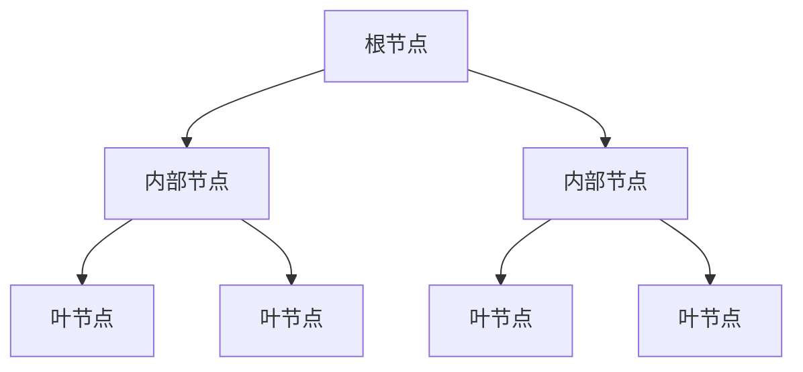

## 1.背景介绍

决策树是一种基础且强大的机器学习算法。它是一种监督学习算法，主要用于分类问题，但也可以用于回归问题。决策树的优点在于，它们的结果是非常直观且易于理解的，这使得决策树成为解释机器学习结果的一个重要工具。

## 2.核心概念与联系

决策树的核心概念是节点（Node）和边（Edge）。一棵决策树包括一个根节点（Root Node），多个内部节点（Internal Node），以及叶节点（Leaf Node）。每一个节点代表一个特征或属性，每一条边代表一个决策规则，而每一个叶节点代表一个决策结果。



## 3.核心算法原理具体操作步骤

决策树的构造过程是一个递归过程，具体步骤如下：

1. 选择最优特征：根据特征的信息增益（或其他指标）选择当前最优的特征。
2. 生成决策节点：根据最优特征生成决策节点。
3. 递归生成子树：对最优特征的每一个取值，根据该特征取值的样本子集递归生成子树。

## 4.数学模型和公式详细讲解举例说明

决策树的构造过程涉及到很多数学模型和公式，例如信息增益、基尼指数等。下面我们以信息增益为例进行详细讲解。

信息增益表示的是划分特征之后信息的不确定性减少的程度。假设我们有一个数据集$D$，$|D|$表示数据集的样本数量，$D$中第$i$类样本子集$D_i$的样本数量为$|D_i|$，则数据集$D$的信息熵（Entropy）可以定义为：

$$
E(D) = -\sum_{i=1}^{|D|}\frac{|D_i|}{|D|}\log_2\frac{|D_i|}{|D|}
$$

假设我们根据特征$A$的取值将数据集$D$划分为$v$个子集$D_1,D_2,\ldots,D_v$，$|D_k|$表示子集$D_k$的样本数量，那么特征$A$对数据集$D$的信息增益（Gain）可以定义为：

$$
G(D,A) = E(D) - \sum_{k=1}^{v}\frac{|D_k|}{|D|}E(D_k)
$$

在构造决策树的过程中，我们通常选择信息增益最大的特征作为划分特征。

## 5.项目实践：代码实例和详细解释说明

下面我们以Python的scikit-learn库为例，展示如何使用决策树进行分类。

```python
from sklearn.datasets import load_iris
from sklearn.model_selection import train_test_split
from sklearn.tree import DecisionTreeClassifier

# 加载数据
iris = load_iris()
X = iris.data
y = iris.target

# 划分训练集和测试集
X_train, X_test, y_train, y_test = train_test_split(X, y, test_size=0.2, random_state=42)

# 构建决策树模型
clf = DecisionTreeClassifier(criterion='entropy')
clf.fit(X_train, y_train)

# 在测试集上进行预测
y_pred = clf.predict(X_test)
```

## 6.实际应用场景

决策树在很多实际应用场景中都有广泛的应用，例如：

- 医疗诊断：通过病人的各种症状作为特征，预测病人可能患有的疾病。
- 信用评级：通过客户的各种信息（如收入、职业、负债等）作为特征，预测客户的信用等级。
- 客户流失预测：通过客户的各种行为数据（如购买频率、最近一次购买时间等）作为特征，预测客户是否可能流失。

## 7.工具和资源推荐

- [scikit-learn](https://scikit-learn.org/stable/)：一个强大的Python机器学习库，包含了决策树等很多机器学习算法。
- [Weka](https://www.cs.waikato.ac.nz/ml/weka/)：一个包含了大量机器学习算法的Java工具包，界面友好，适合初学者。

## 8.总结：未来发展趋势与挑战

决策树作为一种基础的机器学习算法，其简单直观、易于理解的特点使得它在实际应用中有着广泛的应用。然而，决策树也存在一些问题，例如容易过拟合、对于连续特征和高维特征处理不好等。因此，如何改进决策树算法，使其在更复杂的任务中表现更好，是未来的一个重要研究方向。

## 9.附录：常见问题与解答

Q: 决策树的剪枝是什么？

A: 决策树的剪枝是为了防止过拟合，通过一定的策略将决策树的一些分支剪掉，使得决策树的复杂度降低。

Q: 决策树如何处理连续特征？

A: 决策树处理连续特征的一种常见方法是二分法，即将连续特征的取值范围分为两部分，从而将连续特征转化为二元特征。

Q: 决策树如何处理缺失值？

A: 决策树处理缺失值的一种常见方法是通过特征的平均值或者众数来填充缺失值。

作者：禅与计算机程序设计艺术 / Zen and the Art of Computer Programming