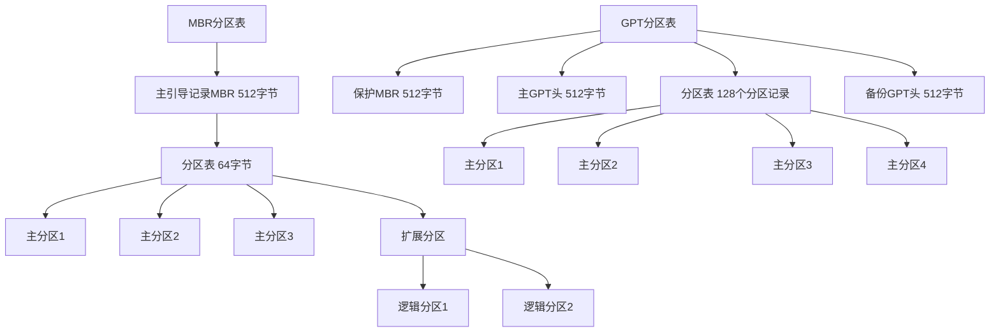

# 分区 原理与代码实例讲解

## 1.背景介绍
### 1.1 分区的概念
### 1.2 分区的重要性
### 1.3 分区的发展历史

## 2.核心概念与联系
### 2.1 分区的类型
#### 2.1.1 主分区
#### 2.1.2 扩展分区
#### 2.1.3 逻辑分区
### 2.2 分区表
#### 2.2.1 MBR分区表
#### 2.2.2 GPT分区表
### 2.3 文件系统与分区的关系
#### 2.3.1 文件系统概述
#### 2.3.2 分区与文件系统的对应关系

## 3.核心算法原理具体操作步骤
### 3.1 MBR分区
#### 3.1.1 MBR分区表结构
#### 3.1.2 MBR分区创建流程
#### 3.1.3 MBR分区限制
### 3.2 GPT分区
#### 3.2.1 GPT分区表结构  
#### 3.2.2 GPT分区创建流程
#### 3.2.3 GPT分区优势

## 4.数学模型和公式详细讲解举例说明
### 4.1 CHS寻址模式
#### 4.1.1 柱面(Cylinder)
#### 4.1.2 磁头(Head)
#### 4.1.3 扇区(Sector)
### 4.2 LBA寻址模式
#### 4.2.1 LBA地址计算公式
#### 4.2.2 LBA与CHS的转换

## 5.项目实践：代码实例和详细解释说明
### 5.1 使用fdisk进行MBR分区
#### 5.1.1 fdisk命令详解
#### 5.1.2 fdisk分区实例
### 5.2 使用parted进行GPT分区
#### 5.2.1 parted命令详解  
#### 5.2.2 parted分区实例
### 5.3 分区工具对比
#### 5.3.1 fdisk与parted异同点
#### 5.3.2 图形化分区工具

## 6.实际应用场景
### 6.1 双系统分区方案
### 6.2 数据盘分区方案
### 6.3 服务器磁盘分区最佳实践

## 7.工具和资源推荐
### 7.1 分区工具
#### 7.1.1 fdisk
#### 7.1.2 parted
#### 7.1.3 DiskGenius
### 7.2 文件系统工具
#### 7.2.1 mkfs
#### 7.2.2 fsck
### 7.3 学习资源
#### 7.3.1 官方文档
#### 7.3.2 技术博客
#### 7.3.3 视频教程

## 8.总结：未来发展趋势与挑战 
### 8.1 大容量存储设备的分区策略
### 8.2 新兴文件系统对分区的影响
### 8.3 分区技术的未来发展方向

## 9.附录：常见问题与解答
### 9.1 如何选择分区表类型？
### 9.2 分区和格式化有什么区别？
### 9.3 如何调整分区大小而不丢失数据？

---

分区是将一个物理磁盘划分成多个逻辑磁盘的过程，每个逻辑磁盘被称为一个分区。分区使得我们能够将一块物理磁盘用于多个目的，例如安装多个操作系统、隔离系统文件和用户数据等。了解分区的原理和掌握分区的操作方法，是进行系统管理和维护的基本技能。

在PC的发展初期，采用的是MBR(Master Boot Record，主引导记录)分区表。MBR位于磁盘的首个扇区，它包含了主引导程序和分区表信息。MBR分区表最多支持4个主分区，或3个主分区+1个扩展分区。每个分区记录占用16字节，总共64字节。由于MBR分区表的限制，它无法支持2TB以上的磁盘。

为了突破MBR分区表的限制，GPT(GUID Partition Table)分区表应运而生。GPT使用全局唯一标识符(GUID)来定义分区，支持128个主分区，最大支持18EB(1EB=1024PB)的磁盘容量。GPT在磁盘的头部和尾部都保存了分区表的副本，提高了分区信息的安全性。

下图展示了MBR和GPT分区的结构差异：



在Linux系统中，可以使用fdisk工具对MBR分区进行管理，使用parted工具对GPT分区进行管理。以下是使用fdisk进行分区的示例：

```bash
# 查看磁盘分区情况
fdisk -l

# 对/dev/sdb磁盘进行分区
fdisk /dev/sdb

# 输入m查看帮助菜单
m

# 输入n添加新分区
n

# 选择分区类型，p表示主分区，e表示扩展分区
p

# 选择分区编号，1-4
1

# 选择起始扇区，默认为2048
2048

# 选择结束扇区，+2G表示分配2G空间
+2G

# 输入w保存并退出
w
```

对于GPT分区，可以使用parted工具进行类似的操作：

```bash
# 查看磁盘分区情况
parted -l

# 选择/dev/sdb磁盘
parted /dev/sdb

# 将分区表类型转换为gpt
mklabel gpt

# 添加一个2GB的主分区
mkpart primary 1 2G

# 查看分区情况
print

# 退出parted
quit
```

除了命令行工具，还有许多图形化的分区工具可供选择，如DiskGenius、GParted等。这些工具提供了直观的界面，简化了分区操作的过程。

在实际应用中，分区方案的选择需要根据具体的使用场景来决定。例如，安装双系统时，需要为每个系统分配独立的分区；作为数据盘使用时，可以根据数据的类型和用途，将磁盘划分为多个分区。对于服务器磁盘，通常建议将系统文件、数据文件、日志文件等分别存放在不同的分区，以便于管理和维护。

分区技术的未来发展趋势主要体现在以下几个方面：
1. 支持更大容量的存储设备。随着存储技术的不断发展，单个磁盘的容量不断增加，分区表需要与之相适应。
2. 与新兴文件系统相适应。如btrfs、zfs等新型文件系统的出现，对分区提出了新的要求，分区技术需要不断升级以满足这些需求。
3. 提供更灵活的分区管理功能。如支持动态调整分区大小、快照等高级功能，以满足用户的多样化需求。

分区是磁盘管理的基础，也是文件系统赖以存在的基石。深入理解分区的原理，掌握分区的操作方法，对于系统管理和维护工作至关重要。无论是初学者还是有经验的系统管理员，都需要对分区技术有清晰的认知，并根据实际情况灵活运用。

作者：禅与计算机程序设计艺术 / Zen and the Art of Computer Programming