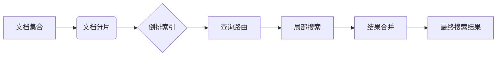

# 分布式搜索 原理与代码实例讲解

## 1. 背景介绍

### 1.1 分布式搜索的兴起

在当今大数据时代,海量的信息数据呈指数级增长。传统的集中式搜索系统已经无法满足快速检索和处理如此庞大数据的需求。为了应对这一挑战,分布式搜索技术应运而生。通过将搜索任务分散到多个节点上并行处理,分布式搜索能够大大提高搜索效率和吞吐量。

### 1.2 分布式搜索的优势

与传统的集中式搜索相比,分布式搜索具有以下几个显著优势:

1. 高性能:通过并行计算,分布式搜索可以显著提高搜索速度和吞吐量。
2. 高可用:分布式搜索采用多节点部署,避免了单点故障,提供了更高的可用性。 
3. 可扩展:分布式搜索可以通过增加节点数来线性扩展,满足不断增长的数据量和并发请求。
4. 负载均衡:搜索请求可以均匀分配到各个节点,充分利用系统资源。

### 1.3 分布式搜索的应用场景

分布式搜索广泛应用于各种需要快速检索海量数据的场景,例如:

- 搜索引擎:如Google、百度等,通过分布式搜索快速检索万亿级网页。  
- 电商平台:淘宝、京东等电商网站利用分布式搜索实现商品的快速检索和推荐。
- 社交网络:Facebook、微博等社交平台使用分布式搜索对海量用户生成内容进行实时搜索。
- 日志分析:通过分布式搜索对分布在多个服务器上的海量日志进行统一检索和分析。

## 2. 核心概念与联系

### 2.1 倒排索引

倒排索引是实现分布式搜索的核心数据结构。它将文档中的词语映射到包含它们的文档,便于根据关键词快速定位相关文档。倒排索引通常由两部分组成:

- 词典(Term Dictionary):记录所有文档的词语,每个词语对应一个唯一的词典ID。
- 倒排列表(Posting List):记录每个词语对应的文档ID列表,表示哪些文档包含该词语。

### 2.2 文档分片

为了实现分布式搜索,需要将大量的文档数据分散存储到多个节点。文档分片(Sharding)就是将文档集合分成多个子集,每个子集称为一个分片(Shard),分别存储在不同的节点上。常见的文档分片方式有:

- 基于文档ID的Hash分片
- 基于文档内容的语义分片
- 基于时间范围的分片

### 2.3 查询路由

当用户发起一个搜索请求时,需要确定将请求发送到哪些节点进行处理,这个过程称为查询路由(Query Routing)。查询路由需要考虑以下因素:

- 请求的关键词与分片的相关性
- 节点的负载均衡
- 请求的一致性要求

常见的查询路由算法有:

- 广播:将请求发送到所有节点
- 选择性路由:根据请求的特征选择部分节点
- 散列路由:根据请求的关键词计算散列值,将请求发送到对应的节点

### 2.4 结果合并

在分布式搜索中,每个节点独立处理搜索请求,返回一个局部的搜索结果。为了得到完整的搜索结果,需要将多个节点返回的局部结果进行合并和排序,这个过程称为结果合并(Result Merging)。结果合并需要考虑以下因素:

- 局部结果的相关性打分
- 局部结果的排序规则
- 去重和过滤

常见的结果合并算法有:

- Round Robin:轮询每个节点,依次获取局部结果
- 基于相关性打分的合并:根据局部结果的相关性得分进行排序合并
- 基于文档ID的合并:对所有节点的局部结果按文档ID进行排序合并

### 2.5 核心概念联系

下图展示了分布式搜索中核心概念之间的联系:



首先对文档集合进行分片,每个分片构建自己的倒排索引。当用户发起搜索请求时,通过查询路由确定请求应该发送到哪些分片。每个分片根据本地倒排索引执行搜索,返回局部结果。最后通过结果合并算法将局部结果合并为最终的完整搜索结果并返回给用户。

## 3. 核心算法原理具体操作步骤

### 3.1 文档分片算法

#### 3.1.1 基于文档ID的Hash分片

1. 对每个文档的ID进行Hash运算,得到一个Hash值。
2. 根据Hash值将文档分配到对应的分片。假设有N个分片,可以用Hash值对N取模来决定文档属于哪个分片。

伪代码如下:

```
function shardByHash(docId, numShards) {
    return hash(docId) % numShards;
}
```

#### 3.1.2 基于文档内容的语义分片

1. 对文档内容进行语义分析,提取关键主题词。
2. 根据主题词将文档聚类,将语义相似的文档分配到同一个分片。
3. 可以使用K-Means等聚类算法实现语义分片。

伪代码如下:

```
function shardByTopic(doc, numShards) {
    topics = extractTopics(doc);
    return clusterByKMeans(topics, numShards);
}
```

### 3.2 倒排索引构建算法

#### 3.2.1 单分片倒排索引构建

1. 对分片内的每个文档进行分词,得到词语列表。
2. 构建词典,将每个词语映射为唯一的词典ID。
3. 构建倒排列表,记录每个词语对应的文档ID列表。

伪代码如下:

```
function buildInvertedIndex(docs) {
    termDict = {};
    postingLists = {};
    
    for each doc in docs:
        terms = tokenize(doc);
        for each term in terms:
            if term not in termDict:
                termDict[term] = generateTermId();
            termId = termDict[term];
            if termId not in postingLists:
                postingLists[termId] = [];
            postingLists[termId].append(doc.id);
    
    return (termDict, postingLists);
}
```

#### 3.2.2 多分片倒排索引合并

1. 在每个分片上独立构建局部倒排索引。
2. 将各分片的词典合并为全局词典,为每个词语分配全局唯一的词典ID。
3. 将各分片的倒排列表合并为全局倒排列表,更新文档ID为全局文档ID。

伪代码如下:

```
function mergeInvertedIndex(localIndices) {
    globalTermDict = {};
    globalPostingLists = {};
    
    for each localIndex in localIndices:
        for each term, termId in localIndex.termDict:
            if term not in globalTermDict:
                globalTermDict[term] = generateGlobalTermId();
            globalTermId = globalTermDict[term];
            if globalTermId not in globalPostingLists:
                globalPostingLists[globalTermId] = [];
            globalPostingLists[globalTermId].extend(localIndex.postingLists[termId]);
    
    return (globalTermDict, globalPostingLists);
}
```

### 3.3 查询路由算法

#### 3.3.1 广播路由

1. 将搜索请求发送到所有分片。
2. 每个分片根据本地倒排索引执行搜索,返回局部结果。

伪代码如下:

```
function broadcastQuery(query, shards) {
    results = [];
    for each shard in shards:
        localResults = shard.search(query);
        results.extend(localResults);
    return results;
}
```

#### 3.3.2 选择性路由

1. 根据查询的关键词,选择与关键词最相关的Top-K个分片。
2. 将搜索请求发送到选中的分片。
3. 选中的分片根据本地倒排索引执行搜索,返回局部结果。

伪代码如下:

```
function selectiveQuery(query, shards, k) {
    selectedShards = selectTopKShards(query, shards, k);
    results = [];
    for each shard in selectedShards:
        localResults = shard.search(query);
        results.extend(localResults);
    return results;
}
```

### 3.4 结果合并算法

#### 3.4.1 Round Robin合并

1. 轮询每个分片,依次获取它们的局部搜索结果。
2. 将局部结果按照轮询顺序合并为最终结果。

伪代码如下:

```
function roundRobinMerge(shardResults) {
    finalResults = [];
    while not all shardResults are empty:
        for each shardResult in shardResults:
            if shardResult is not empty:
                finalResults.append(shardResult.pop(0));
    return finalResults;
}
```

#### 3.4.2 基于相关性打分的合并

1. 对每个分片返回的局部结果计算相关性得分。
2. 将所有局部结果按照相关性得分从高到低排序。
3. 将排序后的结果作为最终结果返回。

伪代码如下:

```
function relevanceMerge(shardResults) {
    allResults = [];
    for each shardResult in shardResults:
        for each result in shardResult:
            result.score = computeRelevance(result);
            allResults.append(result);
    
    sortByRelevance(allResults);
    return allResults;
}
```

## 4. 数学模型和公式详细讲解举例说明

### 4.1 向量空间模型(Vector Space Model)

向量空间模型是一种经典的信息检索模型,它将文档和查询都表示为向量,通过计算向量之间的相似度来评估文档与查询的相关性。

假设有n个文档和m个词语,每个文档可以表示为一个m维向量:

$D_i = (w_{i1}, w_{i2}, ..., w_{im})$

其中$w_{ij}$表示词语$t_j$在文档$D_i$中的权重。常见的权重计算方法有:

- TF(Term Frequency):词语在文档中出现的频率
- IDF(Inverse Document Frequency):词语在整个文档集合中的稀缺程度
- TF-IDF:综合考虑词语在文档中的频率和在文档集合中的稀缺程度

$w_{ij} = tf_{ij} \times \log(\frac{N}{df_j})$

其中$tf_{ij}$表示词语$t_j$在文档$D_i$中的频率,$N$为文档总数,$df_j$为包含词语$t_j$的文档数。

查询也可以表示为一个m维向量:

$Q = (q_1, q_2, ..., q_m)$

其中$q_j$表示词语$t_j$在查询中的权重,通常为0或1。

文档与查询的相关性可以通过计算它们对应向量的余弦相似度来评估:

$sim(D_i, Q) = \frac{\sum_{j=1}^m w_{ij} \times q_j}{\sqrt{\sum_{j=1}^m w_{ij}^2} \times \sqrt{\sum_{j=1}^m q_j^2}}$

余弦相似度的取值范围为[0,1],值越大表示文档与查询的相关性越高。

### 4.2 BM25模型

BM25是一种基于概率的文档排序算法,考虑了词语频率、文档长度和词语在文档集合中的分布等因素。

给定查询Q和文档D,BM25计算文档D对查询Q的相关性得分如下:

$$score(D,Q) = \sum_{i=1}^n IDF(q_i) \cdot \frac{f(q_i, D) \cdot (k_1 + 1)}{f(q_i, D) + k_1 \cdot (1 - b + b \cdot \frac{|D|}{avgdl})}$$

其中:
- $q_i$表示查询Q中的第i个词
- $f(q_i, D)$表示词$q_i$在文档D中的频率
- $|D|$表示文档D的长度
- $avgdl$表示文档集合中文档的平均长度
- $k_1$和$b$是调节参数,通常取值为$k_1=1.2, b=0.75$
- $IDF(q_i)$表示词$q_i$的逆文档频率,计算公式为:

$$IDF(q_i) = \log \frac{N - n(q_i) + 0.5}{