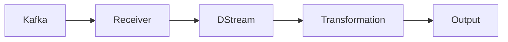

# 利用SparkStreaming构建实时广告点击流分析

## 1. 背景介绍

在当今数字广告时代,实时分析广告点击流数据对于广告主和广告平台至关重要。通过实时监测和分析用户对广告的点击行为,可以帮助优化广告投放策略,提高广告点击率和投资回报率(ROI)。然而,广告点击流数据通常具有数据量大、实时性要求高等特点,对传统的批处理分析方式构成了挑战。

SparkStreaming是Apache Spark生态系统中的实时数据处理组件,支持从Kafka、Flume等数据源实时摄取数据,并对数据进行实时计算处理。本文将介绍如何利用SparkStreaming构建一个实时广告点击流分析系统,实现对广告点击数据的实时处理和分析。

## 2. 核心概念与联系

在介绍具体的系统架构和实现之前,我们先来了解一下SparkStreaming涉及的几个核心概念:

### 2.1 DStream(Discretized Stream)

DStream是SparkStreaming的核心抽象,代表一个连续的数据流。在内部实现上,DStream由一系列连续的RDD(弹性分布式数据集)组成,每个RDD包含一个时间间隔内的数据。DStream支持多种转换操作,如map、flatMap、filter、reduceByKey等,用于对实时数据进行处理。

### 2.2 Receiver

Receiver是SparkStreaming中用于接收实时数据的组件。Receiver以长期运行的任务的形式运行在Executor上,从数据源(如Kafka)持续接收数据,并将数据存储到Spark的内存或磁盘中,形成DStream。

### 2.3 Kafka

Kafka是一个分布式的消息队列系统,广泛用于实时数据的收集和传输。在本文的广告点击流分析场景中,我们将Kafka作为数据源,Spark Streaming从Kafka中实时消费广告点击数据。

下图展示了SparkStreaming与Kafka集成的架构示意:



## 3. 核心算法原理与具体操作步骤

SparkStreaming的核心算法是基于DStream的一系列转换操作,包括无状态转换和有状态转换。下面我们详细介绍几个常用的转换操作:

### 3.1 无状态转换

无状态转换是指每个批次的处理不依赖于之前批次的数据,常见的无状态转换包括:

- map(func): 对DStream中的每个元素应用函数func进行转换。
- flatMap(func): 与map类似,但每个输入元素可以被映射为0个或多个输出元素。
- filter(func): 返回一个新的DStream,仅包含满足函数func的元素。
- reduceByKey(func): 对DStream中的KV型数据按Key进行聚合。

无状态转换的具体操作步骤如下:

1. 定义转换函数func
2. 在DStream上调用相应的转换算子,如map、filter等
3. 得到转换后的新DStream

### 3.2 有状态转换

有状态转换是指当前批次的处理需要使用之前批次的数据或中间结果,常见的有状态转换包括:

- updateStateByKey(func): 根据key对数据进行聚合,并持续更新每个key对应的状态。可用于实现累加器、计数器等。
- window(windowLength, slideInterval): 对源DStream窗口化,返回一个新的DStream,计算每个窗口内的数据。
- reduceByKeyAndWindow(func, windowLength, slideInterval): 对KV型DStream进行基于滑动窗口的聚合操作。

有状态转换的具体操作步骤如下:

1. 定义状态更新函数func,用于更新每个key对应的状态
2. 在DStream上调用updateStateByKey或window等算子,传入状态更新函数
3. 得到包含更新状态的新DStream

## 4. 数学模型和公式详细讲解举例说明

在广告点击流分析中,我们常常需要统计一些关键指标,如每个广告的点击次数、点击率等。这里以点击次数的计算为例,介绍SparkStreaming中使用的数学模型。

假设我们有一个DStream,其中每个元素代表一次广告点击,格式为(ad_id, 1),表示广告ad_id被点击了一次。我们要统计每个广告的总点击次数,可以使用reduceByKey算子:

```scala
val adClickCountDStream = adClickDStream.reduceByKey(_ + _)
```

这里使用了reduceByKey算子对DStream中的元素按ad_id进行聚合,聚合函数为 $(\_, \_) \Rightarrow \_ + \_$,即对每个ad_id对应的点击次数进行累加。

数学上,这个过程可以表示为:

$$
clickCount(ad_i) = \sum_{t=0}^{T} click_t(ad_i)
$$

其中,$clickCount(ad_i)$表示广告$ad_i$的总点击次数,$click_t(ad_i)$表示在时间$t$广告$ad_i$的点击次数,T为当前的总时间。

这个公式表明,我们通过对每个时间间隔内每个广告的点击次数进行累加,最终得到每个广告的总点击次数。

## 5. 项目实践:代码实例和详细解释说明

下面我们通过一个具体的代码实例,演示如何使用SparkStreaming构建实时广告点击流分析系统。

```scala
import org.apache.spark._
import org.apache.spark.streaming._
import org.apache.spark.streaming.kafka._

object AdClickAnalysis {
  def main(args: Array[String]) {
    val conf = new SparkConf().setAppName("AdClickAnalysis")
    val ssc = new StreamingContext(conf, Seconds(5))
    
    // 从Kafka读取广告点击数据流
    val kafkaParams = Map[String, String](
      "bootstrap.servers" -> "localhost:9092",
      "group.id" -> "ad-click-analysis"
    )
    val topics = Set("ad-click-topic")
    val adClickDStream = KafkaUtils.createDirectStream[String, String, StringDecoder, StringDecoder](
      ssc, kafkaParams, topics)
      
    // 解析广告点击数据
    val adClickPairDStream = adClickDStream.map(record => {
      val fields = record._2.split(",")
      (fields(0), 1)  // (ad_id, 1)
    })
    
    // 统计广告点击次数
    val adClickCountDStream = adClickPairDStream.reduceByKey(_ + _)
    
    // 打印结果
    adClickCountDStream.print()
    
    ssc.start()
    ssc.awaitTermination()
  }
}
```

代码详细解释:

1. 首先创建SparkStreaming上下文StreamingContext,设置批次间隔为5秒。

2. 使用KafkaUtils.createDirectStream从Kafka读取广告点击数据流,Kafka参数中指定了Kafka Broker地址和消费者组id。

3. 对接收到的广告点击数据进行解析,将每条记录转换为(ad_id, 1)的形式。

4. 调用reduceByKey算子对数据流中的广告点击事件按ad_id进行聚合,统计每个广告的点击次数。

5. 使用print()算子打印每个批次的统计结果。

6. 启动StreamingContext,开始处理数据流。

以上代码实现了一个简单的实时广告点击流分析系统,可以实时统计每个广告的点击次数。在实际应用中,我们还可以进一步扩展这个系统,如统计点击率、实现Top N点击广告等。

## 6. 实际应用场景

实时广告点击流分析在互联网广告行业有广泛的应用,主要应用场景包括:

### 6.1 广告点击率实时统计与监控

广告点击率(CTR)是衡量广告效果的重要指标。通过实时分析广告点击流数据,我们可以实时计算每个广告的点击率,监控广告效果,及时发现异常情况并采取相应措施。

### 6.2 实时竞价(RTB)

在实时竞价广告系统中,需要在用户访问网页时实时决定投放哪些广告。通过对用户历史点击行为的实时分析,结合用户画像、上下文等因素,可以优化广告投放决策,提高广告的点击率和转化率。

### 6.3 异常点击检测

广告点击流中可能存在一些异常或作弊的点击行为,如刷单、机器人点击等。通过实时分析点击流数据,构建异常点击检测模型,可以及时发现和过滤掉这些异常点击,保证广告点击数据的真实性和有效性。

## 7. 工具和资源推荐

以下是一些实现实时广告点击流分析常用的工具和资源:

- Apache Spark: https://spark.apache.org/
- Spark Streaming: https://spark.apache.org/streaming/
- Apache Kafka: https://kafka.apache.org/
- Kafka文档: https://kafka.apache.org/documentation/
- Spark Streaming + Kafka Integration Guide: https://spark.apache.org/docs/latest/streaming-kafka-integration.html

这些工具和资源可以帮助你快速入门和实践SparkStreaming + Kafka构建实时广告点击流分析系统。

## 8. 总结:未来发展趋势与挑战

实时广告点击流分析技术正在快速发展,未来的发展趋势主要体现在以下几个方面:

### 8.1 流批一体化处理

随着流数据处理技术的成熟,未来会出现更多流批一体化的处理框架,如Structured Streaming、Flink等。这些框架可以同时支持流处理和批处理,简化了流批一体化分析系统的开发和维护。

### 8.2 机器学习与实时分析的结合

将机器学习与实时分析相结合,可以实现更加智能化、个性化的广告推荐和优化。通过对实时点击流数据的机器学习处理,可以实时调整广告投放策略,提高广告效果。

### 8.3 数据隐私与安全

随着数据隐私保护意识的增强,如何在进行广告点击流分析的同时保护用户隐私,是一个重要的挑战。未来需要在技术和制度层面采取措施,确保数据分析过程的合规性和用户隐私的保护。

## 9. 附录:常见问题与解答

### 9.1 什么是实时计算?与传统的离线批处理有何区别?

实时计算是指对数据进行实时、持续的处理,并在数据到达后尽可能快地得到处理结果。与离线批处理不同,实时计算强调数据处理的低延迟和连续性,通常应用于对时效性要求较高的场景,如实时监控、风控等。

### 9.2 Spark Streaming与Storm、Flink等其他实时计算框架相比有何优势?

Spark Streaming基于Spark平台,可以与Spark生态系统中的其他组件(如MLlib、GraphX)无缝集成,实现机器学习、图计算等复杂分析。同时,Spark Streaming采用微批次处理模型,具有高吞吐、强容错等特点。与Storm等框架相比,Spark Streaming更加成熟和稳定,社区生态也更加丰富。

### 9.3 如何保证Spark Streaming的容错性和数据一致性?

Spark Streaming基于Spark的RDD模型实现容错。在数据处理过程中,Spark Streaming会周期性地生成RDD的检查点(checkpoint),如果出现故障,可以从最近的检查点恢复数据和状态。此外,Spark Streaming支持将接收到的数据存储到可靠的存储系统(如HDFS、S3)中,保证数据的持久性和一致性。

作者: 禅与计算机程序设计艺术 / Zen and the Art of Computer Programming