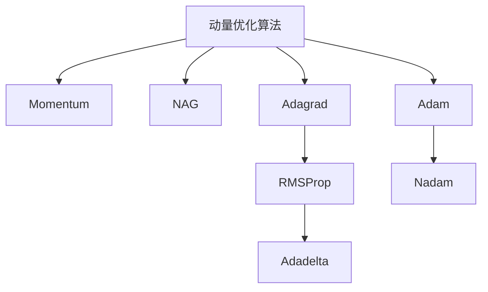
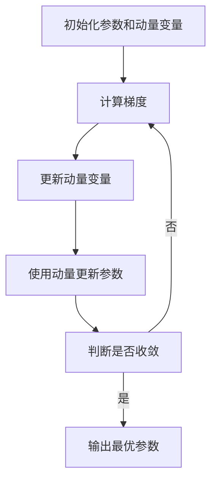
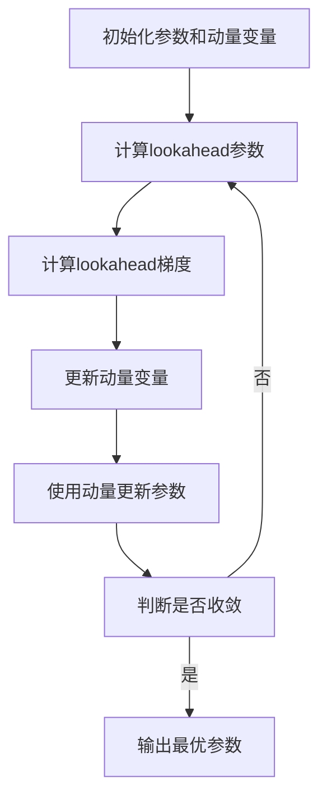

# 动量优化算法原理与代码实战案例讲解

## 1.背景介绍

在深度学习和机器学习领域中,优化算法扮演着至关重要的角色。传统的优化算法如随机梯度下降(SGD)虽然简单有效,但在处理高维、非凸或存在梯度噪声的优化问题时,往往会遇到收敛缓慢、陷入鞍点或局部最优等挑战。为了解决这些问题,动量优化算法(Momentum Optimization Algorithms)应运而生,它通过引入动量项来加速优化过程,提高收敛速度,并有助于逃脱鞍点和局部最优。

动量优化算法的核心思想是利用过去的梯度信息,为当前的梯度方向提供一个惯性加速度,使优化方向更加平滑,从而达到加速收敛的目的。这种思路源于物理学中的动量概念,即一个物体运动时,其速度不仅取决于当前的力,还取决于过去的运动状态。

## 2.核心概念与联系

### 2.1 动量项

动量项(Momentum Term)是动量优化算法中最核心的概念,它是一个向量,用于累积过去的梯度信息,并将其融入当前的梯度更新中。动量项的计算公式如下:

$$m_t = \beta m_{t-1} + \nabla_\theta J(\theta_{t-1})$$

其中:
- $m_t$表示第t次迭代时的动量项
- $\beta$是动量系数,控制过去梯度的衰减程度,通常取值在0.9左右
- $\nabla_\theta J(\theta_{t-1})$是目标函数关于参数$\theta$在第t-1次迭代时的梯度

可以看出,动量项是过去所有梯度的指数加权平均,它不仅包含当前梯度的信息,还融合了历史梯度的方向和幅度信息。

### 2.2 参数更新

在传统的梯度下降算法中,参数的更新规则是:

$$\theta_t = \theta_{t-1} - \eta \nabla_\theta J(\theta_{t-1})$$

其中$\eta$是学习率。而在动量优化算法中,参数更新规则融入了动量项:

$$\theta_t = \theta_{t-1} - \eta m_t$$

可以看出,动量优化算法使用动量项$m_t$代替了原始梯度$\nabla_\theta J(\theta_{t-1})$,从而引入了过去梯度信息的影响。

### 2.3 动量优化算法家族

基于动量项的概念,衍生出了多种动量优化算法,包括:

1. **Momentum**: 最基础的动量优化算法,由Geoffrey Hinton在1998年提出。
2. **Nesterov Accelerated Gradient (NAG)**: Nesterov在2013年提出,通过lookahead梯度来进一步加速优化过程。
3. **Adagrad**: 自适应学习率算法,解决了学习率设置困难的问题。
4. **RMSProp**: 改进版Adagrad,解决了Adagrad学习率monotonic下降的问题。
5. **Adadelta**: 基于RMSProp,不需要设置全局学习率。
6. **Adam**: 结合动量和自适应学习率,是当前最流行的动量优化算法之一。
7. **Nadam**: 将NAG和Adam结合,进一步提高收敛速度。

这些算法各有特点,在不同的场景下表现不尽相同,为我们提供了丰富的优化工具箱。



## 3.核心算法原理具体操作步骤

接下来,我们将重点介绍Momentum和NAG这两种基础且广泛使用的动量优化算法的原理和具体操作步骤。

### 3.1 Momentum算法

Momentum算法的核心思想是在梯度下降的基础上,为每个参数引入一个动量变量$v$,它累积了之前梯度的指数加权平均值。算法步骤如下:

1. 初始化参数$\theta$和动量变量$v=0$
2. 计算目标函数$J(\theta)$关于参数$\theta$的梯度$\nabla_\theta J(\theta)$
3. 更新动量变量:
   $$v_t = \beta v_{t-1} + (1-\beta)\nabla_\theta J(\theta_{t-1})$$
4. 使用动量变量更新参数:
   $$\theta_t = \theta_{t-1} - \eta v_t$$
5. 重复步骤2-4,直到收敛

其中$\beta$是动量系数,控制过去梯度的衰减程度,通常取值在0.9左右。$\eta$是学习率。

Momentum算法的优点是:
- 加速了优化过程,提高了收敛速度
- 有助于跳出局部最优,提高了优化的鲁棒性
- 平滑了参数轨迹,减少了震荡

但缺点是,在高曲率区域,动量项可能会过大,导致越过最优解。



### 3.2 Nesterov Accelerated Gradient (NAG)

NAG算法是Momentum算法的改进版本,它在计算梯度时使用了一个lookahead梯度,从而进一步加速了优化过程。算法步骤如下:

1. 初始化参数$\theta$和动量变量$v=0$
2. 计算lookahead参数:
   $$\theta_{lookahead} = \theta_{t-1} - \eta \beta v_{t-1}$$
3. 计算目标函数$J(\theta)$关于lookahead参数$\theta_{lookahead}$的梯度$\nabla_\theta J(\theta_{lookahead})$
4. 更新动量变量:
   $$v_t = \beta v_{t-1} + (1-\beta)\nabla_\theta J(\theta_{lookahead})$$
5. 使用动量变量更新参数:
   $$\theta_t = \theta_{t-1} - \eta v_t$$
6. 重复步骤2-5,直到收敛

NAG算法的优点是:
- 进一步加速了优化过程,提高了收敛速度
- 在高曲率区域表现更好,不易越过最优解
- 平滑了参数轨迹,减少了震荡

但缺点是计算开销略大于Momentum算法。



## 4.数学模型和公式详细讲解举例说明

在上一节中,我们介绍了Momentum和NAG算法的具体操作步骤,其中涉及到了一些重要的数学公式。现在,我们将对这些公式进行详细的讲解和举例说明。

### 4.1 动量项公式

动量项公式:
$$m_t = \beta m_{t-1} + (1-\beta)\nabla_\theta J(\theta_{t-1})$$

这个公式描述了如何计算当前迭代的动量项$m_t$。它是过去动量项$m_{t-1}$和当前梯度$\nabla_\theta J(\theta_{t-1})$的加权和。

- $\beta$是动量系数,控制过去梯度的衰减程度。当$\beta=0$时,动量项就等于当前梯度,等价于普通梯度下降;当$\beta=1$时,动量项就是所有过去梯度的累加和。通常$\beta$取值在0.9左右,这样可以较好地平衡过去和当前梯度的影响。
- $\nabla_\theta J(\theta_{t-1})$是目标函数$J$关于参数$\theta$在第t-1次迭代时的梯度。

让我们通过一个简单的例子来理解动量项的计算过程。假设我们有一个二次函数$J(\theta) = \theta^2$,初始参数$\theta_0=5$,学习率$\eta=0.1$,动量系数$\beta=0.9$。我们希望找到函数的最小值点。

第1次迭代:
$$\nabla_\theta J(\theta_0) = 2\theta_0 = 2\times5 = 10$$
$$m_1 = 0.9\times0 + 0.1\times10 = 1$$

第2次迭代:
$$\theta_1 = \theta_0 - \eta m_1 = 5 - 0.1\times1 = 4.9$$
$$\nabla_\theta J(\theta_1) = 2\theta_1 = 2\times4.9 = 9.8$$
$$m_2 = 0.9\times1 + 0.1\times9.8 = 1.88$$

第3次迭代:
$$\theta_2 = \theta_1 - \eta m_2 = 4.9 - 0.1\times1.88 = 4.71$$
$$\nabla_\theta J(\theta_2) = 2\theta_2 = 2\times4.71 = 9.42$$
$$m_3 = 0.9\times1.88 + 0.1\times9.42 = 2.67$$

我们可以看到,动量项在迭代过程中不断累积过去的梯度信息,使得参数更新的方向更加平滑,从而加速了优化过程。

### 4.2 NAG算法lookahead梯度

在NAG算法中,我们需要计算lookahead梯度:
$$\nabla_\theta J(\theta_{lookahead})$$

其中,lookahead参数$\theta_{lookahead}$的计算公式为:
$$\theta_{lookahead} = \theta_{t-1} - \eta \beta v_{t-1}$$

这个公式表示,我们先使用当前的动量变量$v_{t-1}$对参数$\theta_{t-1}$进行一次更新,得到lookahead参数$\theta_{lookahead}$,然后计算目标函数在$\theta_{lookahead}$处的梯度。

为什么要使用lookahead梯度呢?直观地说,lookahead梯度可以更好地预测参数的下一步更新方向,从而进一步加速优化过程。

我们继续使用上面的二次函数例子,来演示lookahead梯度的计算过程。假设当前迭代为第3次,我们已经计算出$\theta_2=4.71$和$v_2=2.67$,学习率$\eta=0.1$,动量系数$\beta=0.9$。

首先计算lookahead参数:
$$\theta_{lookahead} = \theta_2 - \eta \beta v_2 = 4.71 - 0.1\times0.9\times2.67 = 4.48$$

然后计算lookahead梯度:
$$\nabla_\theta J(\theta_{lookahead}) = 2\theta_{lookahead} = 2\times4.48 = 8.96$$

我们可以看到,lookahead梯度的值比$\nabla_\theta J(\theta_2)=9.42$要小,这意味着更新方向会更加平滑,有助于加速收敛。

通过上述例子,我们可以更好地理解动量项和lookahead梯度的计算过程,以及它们在优化算法中的作用。

## 5.项目实践：代码实例和详细解释说明

为了更好地理解动量优化算法的实现,我们将提供一个基于PyTorch的代码示例,并对其进行详细的解释说明。

在这个示例中,我们将使用Momentum和NAG算法来优化一个简单的二次函数$J(\theta) = \theta^2$。代码如下:

```python
import torch

# 定义目标函数
def func(x):
    return x**2

# Momentum优化器
def momentum(params, vs, lr=0.1, beta=0.9):
    grads = torch.autograd.grad(func(params), params)
    vs = beta * vs + (1 - beta) * grads[0]
    params = params - lr * vs
    return params, vs

# NAG优化器
def nag(params, vs, lr=0.1, beta=0.9):
    lookahead = params - beta * lr * vs
    grads = torch.autograd.grad(func(lookahead), lookahead)
    vs = beta * vs + (1 - beta) * grads[0]
    params = params - lr * vs
    return params, vs

# 初始化参数和动量变量
params = torch.tensor(5.0, requires_grad=True)
vs = torch.zeros_like(params)

# 运行优化
for i in range(10):
    