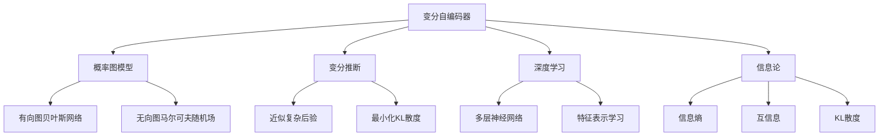
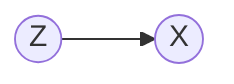
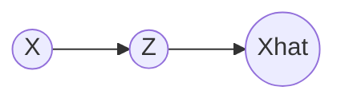

# 变分自编码器与生成模型原理与代码实战案例讲解

## 1. 背景介绍

### 1.1 生成模型概述

生成模型是机器学习和人工智能领域的重要分支,旨在学习数据的潜在分布,并生成与训练数据相似的新样本。生成模型在图像生成、语音合成、自然语言处理等领域有广泛应用。

### 1.2 变分自编码器的兴起

变分自编码器(Variational Autoencoder, VAE)是一种重要的生成模型,由Kingma和Welling在2013年提出。VAE将概率图模型与深度学习结合,通过隐变量建模数据分布,具有强大的生成能力和理论基础。

### 1.3 VAE的应用前景

VAE在图像生成、语音合成、异常检测等任务中取得了优异表现。同时,VAE也为其他生成模型如生成对抗网络(GAN)的发展奠定了基础。深入理解VAE的原理和实现对于从事生成模型研究和应用的人员至关重要。

## 2. 核心概念与联系

### 2.1 概率图模型

VAE建立在概率图模型的基础之上。概率图用节点表示随机变量,边表示变量间的依赖关系,是描述复杂概率分布的有力工具。有向图对应贝叶斯网络,无向图对应马尔可夫随机场。

### 2.2 变分推断

变分推断是一种近似复杂后验分布的方法。通过引入一个易于处理的变分分布,并最小化它与真实后验的KL散度,得到后验分布的近似解。变分推断使得在复杂模型中进行推断成为可能。

### 2.3 深度学习

深度学习利用多层神经网络学习数据的层次化特征表示。深度生成模型将深度学习与概率图模型结合,用神经网络拟合概率分布的参数。VAE就是一个成功的例子。

### 2.4 信息论

信息论研究信息的编码、传输和解码。信息熵衡量随机变量的不确定性,互信息衡量变量间的相关性,KL散度衡量两个分布的差异。VAE的目标函数可以用信息论术语解释。

### 2.5 概念联系

下图展示了VAE涉及的核心概念及其联系:



理解这些概念之间的联系,有助于深入理解VAE的原理和实现。

## 3. 核心算法原理具体操作步骤

### 3.1 VAE的生成过程

VAE假设数据是由隐变量 $z$ 生成的。生成过程如下:

1. 从先验分布 $p(z)$ 采样隐变量 $z$,通常取高斯分布 $N(0,I)$
2. 将隐变量 $z$ 输入生成器(解码器)网络 $p_\theta(x|z)$,生成数据 $x$

生成过程用概率图表示如下:



### 3.2 VAE的推断过程

VAE的目标是学习生成模型的参数 $\theta$ 和隐变量 $z$ 的后验分布 $p(z|x)$。由于后验分布难以直接计算,VAE引入一个变分分布 $q_\phi(z|x)$ 来近似后验分布。

推断过程如下:

1. 将数据 $x$ 输入推断网络(编码器) $q_\phi(z|x)$,得到隐变量 $z$ 的变分后验分布的参数
2. 从变分后验分布采样隐变量 $z$
3. 将采样的隐变量 $z$ 输入生成器网络 $p_\theta(x|z)$,重构数据 $\hat{x}$

推断过程用概率图表示如下:



### 3.3 VAE的目标函数

VAE通过最大化边际似然 $\log p(x)$ 来学习模型参数。由于边际似然难以直接计算,VAE通过最大化证据下界(Evidence Lower Bound, ELBO)来近似:

$$\log p(x) \geq \mathbb{E}_{q_\phi(z|x)}[\log p_\theta(x|z)] - D_{KL}(q_\phi(z|x)||p(z)) \triangleq ELBO$$

ELBO由两项组成:
- 重构误差 $\mathbb{E}_{q_\phi(z|x)}[\log p_\theta(x|z)]$:衡量重构数据的能力
- KL散度 $D_{KL}(q_\phi(z|x)||p(z))$:衡量变分后验与先验的差异,起到正则化作用

VAE通过最大化ELBO,同时优化推断网络参数 $\phi$ 和生成网络参数 $\theta$。

### 3.4 VAE的训练算法

VAE的训练算法如下:

1. 初始化推断网络参数 $\phi$ 和生成网络参数 $\theta$
2. 重复以下步骤直到收敛:
   1. 从数据集采样一批数据 $\{x^{(i)}\}_{i=1}^M$ 
   2. 对每个数据点 $x^{(i)}$:
      1. 将 $x^{(i)}$ 输入推断网络,得到隐变量的均值和方差 $\mu^{(i)}, \sigma^{(i)}$
      2. 重参数化采样隐变量 $z^{(i)} = \mu^{(i)} + \sigma^{(i)} \odot \epsilon, \epsilon \sim N(0,I)$
      3. 将隐变量 $z^{(i)}$ 输入生成网络,得到重构数据 $\hat{x}^{(i)}$
      4. 计算重构误差 $\log p_\theta(x^{(i)}|z^{(i)})$ 和KL散度 $D_{KL}(q_\phi(z^{(i)}|x^{(i)})||p(z))$
   3. 计算ELBO的梯度,更新参数 $\phi$ 和 $\theta$

重参数化技巧使得梯度可以通过隐变量传播,从而可以用反向传播算法高效训练VAE。

## 4. 数学模型和公式详细讲解举例说明

### 4.1 VAE的生成模型

VAE的生成模型 $p_\theta(x,z)$ 由先验分布 $p(z)$ 和条件概率 $p_\theta(x|z)$ 组成:

$$p_\theta(x,z) = p(z)p_\theta(x|z)$$

其中,先验分布通常取标准高斯分布:

$$p(z) = N(z;0,I)$$

条件概率 $p_\theta(x|z)$ 由生成网络参数化:

$$p_\theta(x|z) = f(x;g_\theta(z))$$

其中 $g_\theta(z)$ 是生成网络的输出,$f$ 是适当的概率分布。例如,对于二值图像数据,可以使用伯努利分布:

$$p_\theta(x|z) = Bern(x;g_\theta(z))$$

对于连续数据,可以使用高斯分布:

$$p_\theta(x|z) = N(x;g_\theta(z),\sigma^2I)$$

### 4.2 VAE的推断模型

VAE的推断模型 $q_\phi(z|x)$ 由推断网络参数化:

$$q_\phi(z|x) = N(z;\mu_\phi(x),diag(\sigma^2_\phi(x)))$$

其中 $\mu_\phi(x)$ 和 $\sigma^2_\phi(x)$ 是推断网络的输出,分别表示隐变量的均值和方差。

### 4.3 ELBO的推导

VAE的目标是最大化边际似然 $\log p(x)$。利用Jensen不等式可以得到边际似然的下界(ELBO):

$$\begin{aligned}
\log p(x) &= \log \int p(x,z)dz \\
&= \log \int q_\phi(z|x) \frac{p(x,z)}{q_\phi(z|x)}dz \\
&\geq \int q_\phi(z|x) \log \frac{p(x,z)}{q_\phi(z|x)}dz \\
&= \int q_\phi(z|x) \log p(x,z)dz - \int q_\phi(z|x) \log q_\phi(z|x)dz \\
&= \mathbb{E}_{q_\phi(z|x)}[\log p_\theta(x|z)] - D_{KL}(q_\phi(z|x)||p(z)) \\
&\triangleq ELBO
\end{aligned}$$

最大化ELBO等价于最小化变分后验 $q_\phi(z|x)$ 与真实后验 $p(z|x)$ 的KL散度:

$$\begin{aligned}
D_{KL}(q_\phi(z|x)||p(z|x)) &= \int q_\phi(z|x) \log \frac{q_\phi(z|x)}{p(z|x)}dz \\
&= \int q_\phi(z|x) \log \frac{q_\phi(z|x)p(x)}{p(x,z)}dz \\
&= \log p(x) + \int q_\phi(z|x) \log \frac{q_\phi(z|x)}{p(x,z)}dz \\
&= \log p(x) - ELBO
\end{aligned}$$

因此,最大化ELBO可以近似最大化边际似然,同时最小化变分后验与真实后验的KL散度。

### 4.4 重参数化技巧

为了对ELBO求梯度,VAE使用重参数化技巧对隐变量 $z$ 进行采样:

$$z = \mu_\phi(x) + \sigma_\phi(x) \odot \epsilon, \epsilon \sim N(0,I)$$

其中 $\odot$ 表示逐元素乘法。这样,梯度可以通过 $\epsilon$ 传播到推断网络参数 $\phi$。

重参数化技巧可以看作将隐变量分解为确定性部分和随机性部分。确定性部分由推断网络输出,包含样本的信息;随机性部分由标准高斯噪声提供,与样本无关。

### 4.5 VAE的生成和重构

训练完成后,VAE可以用于生成新样本和重构输入样本。

生成新样本时,从先验分布采样隐变量 $z \sim p(z)$,然后将其输入生成网络得到样本 $x = g_\theta(z)$。

重构输入样本时,将样本 $x$ 输入推断网络得到隐变量的后验分布参数 $\mu_\phi(x), \sigma_\phi(x)$,然后从后验分布采样隐变量 $z \sim q_\phi(z|x)$,最后将隐变量输入生成网络得到重构样本 $\hat{x} = g_\theta(z)$。

VAE的重构样本与输入样本相似,但不会完全相同,因为隐变量提取了数据的高层语义特征,忽略了一些细节信息。

## 5. 项目实践:代码实例和详细解释说明

下面以PyTorch实现一个用于MNIST数据集的VAE。

### 5.1 导入依赖库

```python
import torch
import torch.nn as nn
import torch.optim as optim
from torch.utils.data import DataLoader
from torchvision import datasets, transforms
```

### 5.2 定义VAE模型

```python
class VAE(nn.Module):
    def __init__(self, latent_dim):
        super(VAE, self).__init__()
        
        # 编码器
        self.encoder = nn.Sequential(
            nn.Linear(784, 400),
            nn.ReLU(),
            nn.Linear(400, 200),
            nn.ReLU()
        )
        self.mu = nn.Linear(200, latent_dim)
        self.log_var = nn.Linear(200, latent_dim)
        
        # 解码器
        self.decoder = nn.Sequential(
            nn.Linear(latent_dim, 200),
            nn.ReLU(),
            nn.Linear(200, 400),
            nn.ReLU(),
            nn.Linear(400, 784),
            nn.Sigmoid()
        )

    def encode(self, x):
        h = self.encoder(x)
        mu = self.mu(h)
        log_var = self.log_var(h)
        return mu, log_var

    def reparameterize(self, mu, log_var):
        std =