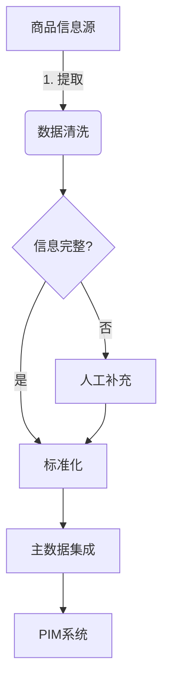
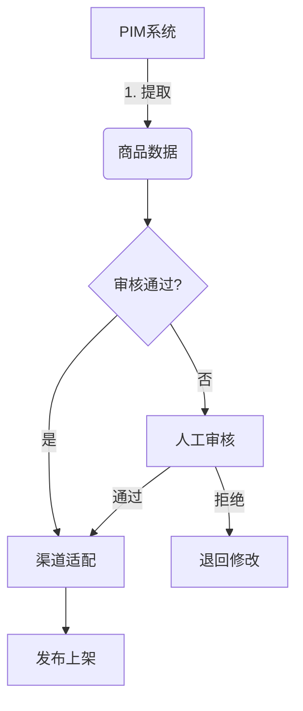
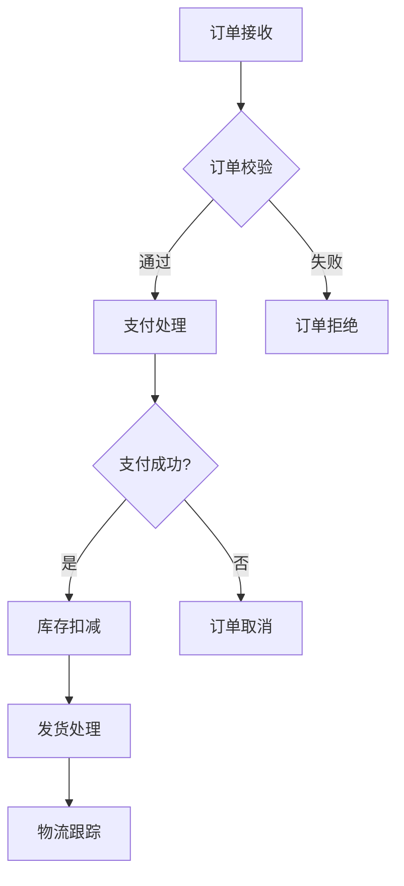
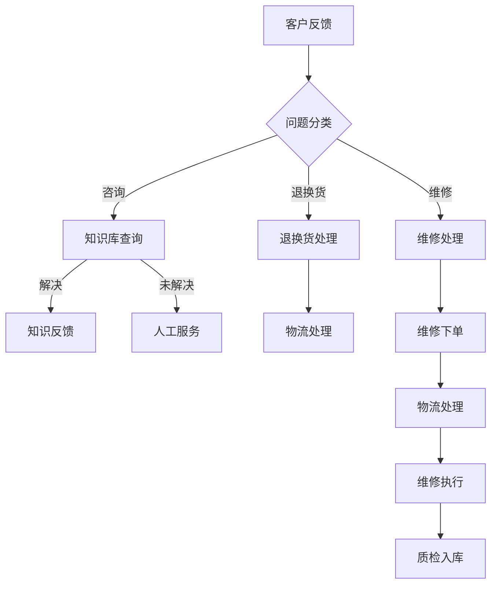

# 商品管理：从上架到售后，打造完美购物体验

## 1.背景介绍

在当今电子商务时代，为客户提供无缝、高效的购物体验已成为企业的核心竞争力。无论是传统实体店还是在线商城,商品管理都是确保顺利销售和良好用户体验的关键环节。从商品上架到售后服务,每一个步骤都需要精心设计和优化,以满足不断变化的客户需求。

本文将探讨商品管理的全生命周期,包括商品信息采集、商品上架、库存管理、订单处理、配送跟踪、售后服务等关键环节。我们将深入分析各个环节所涉及的核心概念、算法原理、数学模型,并通过实际应用场景和代码示例,为读者提供全面的解决方案和实用技巧。

## 2.核心概念与联系

商品管理涉及多个核心概念,它们相互关联,共同构建了一个高效、智能的商品生命周期管理系统。以下是几个关键概念:

### 2.1 主数据管理 (Master Data Management, MDM)

MDM是管理企业核心主数据(如产品数据、客户数据等)的过程和技术。在商品管理中,MDM确保商品信息的完整性、一致性和准确性,为下游流程提供高质量的数据源。

### 2.2 产品信息管理 (Product Information Management, PIM)

PIM系统集中管理商品数据,包括产品规格、描述、图片、分类等信息。它通常与MDM系统集成,实现统一的商品数据管理。

### 2.3 库存管理

库存管理跟踪商品的实时库存水平,并根据需求进行补货或调配。准确的库存数据对于满足客户需求、避免缺货至关重要。

### 2.4 订单管理

订单管理系统处理客户下单、支付、发货等流程,与库存管理、物流系统等模块紧密集成。

### 2.5 供应链管理

供应链管理涵盖从采购到交付的全过程,包括供应商管理、运输优化等,对商品的及时供应至关重要。

### 2.6 客户关系管理 (Customer Relationship Management, CRM)

CRM系统管理客户信息、订单历史、售后服务等,为提供个性化服务和增强客户粘性奠定基础。

这些核心概念相互关联、互为支撑,共同构建了一个完整的商品管理生命周期。下面我们将详细探讨各个环节的工作原理和实现方式。

## 3.核心算法原理具体操作步骤

商品管理的各个环节都涉及复杂的算法和数据处理流程,以确保高效、智能的运营。以下是一些核心算法原理和具体操作步骤:

### 3.1 商品信息采集

1. **数据提取**: 从各种来源(供应商、第三方等)提取商品原始数据,如产品规格、描述、图片等。
2. **数据清洗**: 去除无效数据、处理缺失值、解析非结构化数据(如产品描述)等。
3. **信息补充**: 对缺失的关键信息(如价格、尺码等)进行人工补充和审核。
4. **标准化**: 将不同来源的数据转换为统一格式,如标准化产品类别、属性名称等。
5. **主数据集成**: 将标准化后的商品数据与现有主数据(如供应商、品类等)进行关联和集成。
6. **PIM系统**: 将集成后的高质量商品数据导入PIM系统,为下游应用提供统一的数据视图。

该流程确保了高质量的商品数据源,为后续的商品上架、检索、推荐等奠定基础。

### 3.2 商品上架

商品上架流程负责将审核通过的商品数据发布到销售渠道(如电商平台、实体店等),以供客户浏览和购买。该流程通常包括以下步骤:

1. **数据提取**: 从PIM系统提取已审核的商品主数据。
2. **审核**: 对商品数据进行自动和人工审核,检查是否符合上架要求(如完整性、合规性等)。
3. **渠道适配**: 根据不同销售渠道的要求,对商品数据进行格式转换、增强等适配操作。
4. **发布上架**: 将适配后的商品数据发布到各个销售渠道,如电商平台、实体店终端等。
5. **人工审核**: 对自动审核拒绝的商品数据进行人工审核,决定是否上架。

该流程保证了商品数据的高质量,并实现了向多个销售渠道高效发布的能力。

### 3.3 库存管理

准确的库存管理对于满足客户需求、控制成本至关重要。常见的库存管理策略包括:

1. **经典库存管理模型**:
   - 经济订货量 (Economic Order Quantity, EOQ) 模型: 确定每次补货的最优订货量,以平衡库存成本和订货成本。
   - 再订货点 (ReOrder Point, ROP) 模型: 设置库存的再订货点,在库存降至该点时发出补货指令。

2. **面向服务水平的模型**:
   - 周期补货模型: 根据预测的需求,按固定周期进行补货。
   - 可用库存保护模型: 预留一定量的安全库存,以应对需求波动。

3. **智能库存优化算法**:
   - 时间序列分析: 利用历史销售数据,对未来需求进行预测。
   - 机器学习模型: 训练模型捕捉多变量之间的复杂关系,优化库存决策。

4. **多库存优化**:
   - 网络规划模型: 在多库存网络中,确定各库存点的最佳库存水平和补货策略。
   - 供应链优化: 将供应链各环节(采购、运输等)纳入考量,实现整体优化。

合理的库存管理策略能够显著降低库存成本,提高资产利用效率,并满足服务水平要求。

### 3.4 订单处理

订单处理是商品销售的核心环节,需要高效、准确地处理大量订单,并与库存、物流等系统紧密集成。典型的订单处理流程包括:

1. **订单接收**: 从各个销售渠道接收客户下单信息,包括商品明细、收货地址等。
2. **订单校验**: 验证订单信息的完整性和有效性,如检查商品是否有效、库存是否足够等。
3. **支付处理**: 调用支付系统进行支付,并等待支付结果。
4. **库存扣减**: 若支付成功,则从相应库存中扣减已售商品数量。
5. **发货处理**: 根据订单信息生成配货单,通知仓库发货。
6. **物流跟踪**: 将订单发货信息推送至物流系统,以跟踪发货状态。

高效的订单处理流程可以提升客户体验,降低订单错误率,并为后续的物流配送做好准备。

### 3.5 物流配送

物流配送是将商品送达客户手中的最后一公里,对用户体验至关重要。物流配送算法主要解决以下问题:

1. **路线规划**: 确定最优的配送路线,以缩短运输时间、降低运输成本。
   - 算法: 旅行商问题 (Traveling Salesman Problem, TSP) 及其变种算法。
2. **车辆调度**: 根据订单量和配送时间窗,安排最少的车辆完成配送。
   - 算法: 车辆路线问题 (Vehicle Routing Problem, VRP) 及其变种算法。
3. **仓库选址**: 确定最优的仓库位置,使得总的运输成本最小。
   - 算法: 设施选址问题 (Facility Location Problem) 算法。

除了上述经典算法外,人工智能技术如机器学习、约束优化等也被广泛应用于物流配送决策。合理的配送方案不仅能提升用户体验,还能为企业节省大量运营成本。

### 3.6 售后服务

良好的售后服务对于提升客户满意度、增强品牌形象至关重要。常见的售后服务流程包括:

1. **问题分类**: 根据客户反馈内容,对问题进行分类,如退换货、维修、咨询等。
2. **自助服务**: 对于常见问题,引导客户查询知识库,实现自助解决。
3. **人工服务**: 对于复杂问题,由人工客服介入,提供一对一的服务。
4. **退换货处理**: 受理客户的退换货申请,安排物流退回商品,并发起后续的退款或换货流程。
5. **维修处理**: 根据客户反馈,安排商品维修,包括物流、维修执行、质检入库等环节。

通过标准化的售后服务流程,结合知识库和人工服务,企业能够高效处理各类售后问题,提升客户体验。

## 4.数学模型和公式详细讲解举例说明

在商品管理的各个环节中,数学模型和公式发挥着重要作用,为决策提供理论支撑和量化依据。下面我们将详细讲解一些核心模型和公式:

### 4.1 经济订货量 (EOQ) 模型

EOQ模型是经典的库存管理模型,用于确定每次补货的最优订货量,以平衡库存成本和订货成本。该模型的基本公式如下:

$$EOQ = \sqrt{\frac{2DC_o}{C_h}}$$

其中:
- $EOQ$ 是最优订货量
- $D$ 是年度需求量
- $C_o$ 是每次订货的固定成本
- $C_h$ 是每单位商品的年库存持有成本

通过将上述公式推导过程,我们可以得到总成本 $TC$ 的表达式:

$$TC = \frac{DC_h}{2} + \frac{DC_o}{Q}$$

其中 $Q$ 是订货量。当 $Q = EOQ$ 时,总成本 $TC$ 达到最小值。

例如,某商品的年度需求量为 10,000 件,每次订货的固定成本为 500 元,每件商品的年库存持有成本为 20 元。根据 EOQ 公式,最优订货量为:

$$EOQ = \sqrt{\frac{2 \times 10,000 \times 500}{20}} = 1,000 \text{ 件}$$

因此,该商品应该每次订购 1,000 件,以达到最小的总成本。

EOQ 模型虽然简单,但在实际应用中需要考虑一些额外的因素,如安全库存、缺货成本等,以提高模型的准确性和适用性。

### 4.2 周期补货模型

周期补货模型是另一种常见的库存管理模型,它根据预测的需求,按固定周期进行补货。该模型的关键公式如下:

$$Q = d \times L + SS$$

其中:
- $Q$ 是订货量
- $d$ 是单位时间内的平均需求量
- $L$ 