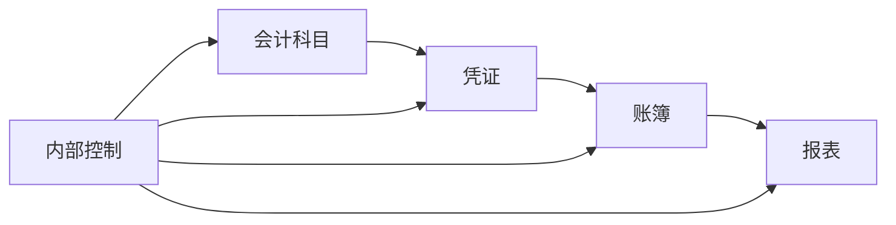

# 商场财务管理系统详细设计与具体代码实现

## 1. 背景介绍

在现代商业环境中,高效的财务管理对于商场的成功运营至关重要。一个完善的商场财务管理系统能够帮助企业实时监控资金流动、优化资源配置、控制成本支出,从而提高整体运营效率和盈利能力。本文将详细探讨如何设计和实现一个功能完备、性能优异的商场财务管理系统。

### 1.1 商场财务管理的痛点与挑战
#### 1.1.1 数据分散,缺乏统一管理
#### 1.1.2 财务流程繁琐,效率低下 
#### 1.1.3 风险控制能力不足

### 1.2 财务管理系统的价值与意义  
#### 1.2.1 提高财务管理效率
#### 1.2.2 加强风险控制能力
#### 1.2.3 为决策提供数据支持

## 2. 核心概念与联系

在设计商场财务管理系统之前,我们需要明确几个核心概念,并理清它们之间的关系。

### 2.1 会计科目
会计科目是对企业财务状况进行分类、记录和报告的基本单位。常见的一级科目包括资产、负债、所有者权益、收入、费用等。每个一级科目下还可以设置多个二级、三级子科目,以满足企业财务核算的需求。

### 2.2 凭证、账簿和报表
- 凭证:是记录经济业务的原始依据,如发票、收据等。
- 账簿:是根据凭证记录企业的经济业务,如总账、明细账等。  
- 报表:是对账簿数据进行加工、汇总形成的财务报告,如资产负债表、利润表等。

### 2.3 内部控制
内部控制是指企业为了提高经营管理效率、保证财务信息真实完整、防范经营风险而采取的一系列控制措施和方法。如岗位分离、授权审批、资产保护等。

以下是这些核心概念之间的关系图:



## 3. 核心算法原理与具体操作步骤

### 3.1 复式记账法
复式记账法是现代会计核算的基本方法。其核心原理是:每一笔经济业务都必须同时登记两个方向相反、金额相等的会计科目,即"有借必有贷,借贷必相等"。

具体操作步骤如下:
1. 根据原始凭证的内容,确定应登记的会计科目 
2. 根据经济业务的具体内容,判断各科目的借贷方向
3. 登记各会计科目的金额,保证借方金额等于贷方金额
4. 将登记结果记入总账和明细账

### 3.2 发票校验算法
为防止虚开发票、重复入账等问题,系统在录入发票时需要对其真伪和有效性进行校验。常用的发票校验算法有:

#### 3.2.1 金税发票校验
1. 提取发票代码、发票号码、开票日期、校验码等关键信息
2. 调用金税系统的校验接口,传入关键信息 
3. 根据返回结果判断发票的真伪与有效性

#### 3.2.2 OCR识别与人工审核
1. 利用OCR技术识别发票图片,提取关键信息
2. 人工比对原始发票,审核OCR识别结果
3. 确认无误后录入系统

## 4. 数学模型和公式详细讲解举例说明

在商场财务管理中,经常需要用到一些数学模型和公式,例如:

### 4.1 存货成本计算
#### 4.1.1 先进先出法(FIFO)
设第i次进货的单价为$p_i$,数量为$q_i$,截至第n次进货的存货成本$C_n$为:

$$
C_n=\sum_{i=1}^n p_i q_i - \sum_{j=1}^{n-1} p_j q_j
$$

其中,$\sum_{j=1}^{n-1} p_j q_j$表示前n-1次销售的存货成本。

举例:假设某商品前3次进货情况如下:

| 次数 | 单价  | 数量 |
|-----|------|------|
| 1   | 10   |100   |
| 2   | 11   |200   | 
| 3   | 12   |150   |

前2次销售分别为80件和120件,则第3次进货后的存货成本为:

$$
\begin{aligned}
C_3 &= 10 \times 100 + 11 \times 200 + 12 \times 150 - (10 \times 80 + 11 \times 120) \\
    &= 1000 + 2200 + 1800 - 800 - 1320 \\
    &= 2880
\end{aligned}
$$

#### 4.1.2 移动加权平均法
设第i次进货之前的单位成本为$\bar{p_{i-1}}$,进货单价为$p_i$,进货数量为$q_i$,进货之前的存货数量为$Q_{i-1}$,则第i次进货之后的单位成本$\bar{p_i}$为:

$$
\bar{p_i} = \frac{\bar{p_{i-1}} Q_{i-1} + p_i q_i}{Q_{i-1} + q_i}
$$

同样以上例为例,第3次进货后的单位成本为:

$$
\begin{aligned}
Q_2 &= 100 + 200 - 80 - 120 = 100 \\
\bar{p_2} &= \frac{10 \times 20 + 11 \times 80}{100} = 10.8 \\
\bar{p_3} &= \frac{10.8 \times 100 + 12 \times 150}{100 + 150} = 11.52
\end{aligned}
$$

### 4.2 资金时间价值
资金时间价值是指资金在不同时间的价值不同。通常用现值和终值来衡量。

#### 4.2.1 终值计算
设现值为$P$,年利率为$r$,投资期限为$n$年,则终值$F$为:

$$
F = P (1 + r)^n
$$

例如:现在投资10000元,年利率5%,投资5年,则终值为:

$$
F = 10000 (1 + 0.05)^5 = 12762.82
$$

#### 4.2.2 现值计算
与终值相反,现值是指未来某一时刻的资金在当前时点的价值。设终值为$F$,年利率为$r$,距离现在$n$年,则现值$P$为:

$$
P = \frac{F}{(1 + r)^n}
$$

例如:预期5年后收到一笔20000元的款项,年利率为5%,则其现值为:

$$
P = \frac{20000}{(1 + 0.05)^5} = 15673.81
$$

## 5. 项目实践:代码实例和详细解释说明

下面我们以Java语言为例,演示如何实现商场财务管理系统的部分核心功能。

### 5.1 总账记录
总账是对各类经济业务的汇总记录,是编制财务报表的基础。我们可以用一个`GeneralLedger`类来表示总账,包含以下属性和方法:

```java
public class GeneralLedger {
    private Long id; //总账ID
    private String subject; //会计科目
    private BigDecimal debitAmount; //借方金额  
    private BigDecimal creditAmount; //贷方金额
    private Date recordDate; //记账日期
    
    //构造函数、getter和setter方法省略
    
    //记账方法
    public void post(String subject, BigDecimal amount, boolean isDebit) {
        if (isDebit) {
            this.debitAmount = amount;
        } else {
            this.creditAmount = amount;
        }
        this.subject = subject;
        this.recordDate = new Date();
        //保存到数据库
        // ...
    }
}
```

`post`方法用于记录一笔总账分录,参数`subject`为会计科目,`amount`为金额,`isDebit`表示是借方还是贷方。记账时根据`isDebit`的值将金额记入借方或贷方,同时保存会计科目和记账日期。

### 5.2 发票录入与校验
发票是记账的重要依据,在录入时需要校验其真伪。我们可以定义一个`Invoice`类表示发票,并提供校验方法:

```java
public class Invoice {
    private Long id; //发票ID
    private String code; //发票代码
    private String number; //发票号码 
    private Date issueDate; //开票日期
    private BigDecimal amount; //发票金额
    private String checkCode; //校验码
    
    //构造函数、getter和setter方法省略
    
    //金税发票校验
    public boolean checkValid() {
        //调用金税接口校验真伪
        // ...
    }
    
    //OCR识别并审核
    public static Invoice parseImage(String imagePath) {
        //调用OCR服务识别发票图片
        // ...
        //人工审核OCR结果
        // ...
        //返回Invoice对象
        // ...
    }
}
```

`checkValid`方法用于校验发票真伪,可以调用金税系统的接口实现。`parseImage`方法用于识别发票图片,提取关键信息并人工审核后生成`Invoice`对象。

### 5.3 财务报表生成
财务报表是反映企业财务状况和经营成果的重要工具。我们以资产负债表为例,展示如何生成报表:

```java
public class BalanceSheet {
    private String title; //报表标题
    private Date date; //报表日期
    private List<Item> assets; //资产项目
    private List<Item> liabilities; //负债项目
    private List<Item> equity; //所有者权益项目
    
    //Item类表示报表项目
    public static class Item {
        private String name; //项目名称
        private BigDecimal amount; //项目金额
        //构造函数、getter和setter方法省略
    }

    //从总账生成资产负债表 
    public void generateFromLedger(Date startDate, Date endDate) {
        //查询startDate到endDate期间的总账记录
        List<GeneralLedger> ledgers = // ...
        //遍历总账记录,将金额汇总到对应的报表项目
        for (GeneralLedger ledger : ledgers) {
            if (isAsset(ledger.getSubject())) {
                //汇总到资产项目
                // ...
            } else if (isLiability(ledger.getSubject())) {
                //汇总到负债项目  
                // ...
            } else if (isEquity(ledger.getSubject())) {
                //汇总到所有者权益项目
                // ...  
            }
        }
        //设置报表标题和日期
        this.title = "资产负债表";
        this.date = endDate;  
    }
    
    //判断会计科目是否属于资产、负债、所有者权益
    // ...
}
```

`BalanceSheet`类表示资产负债表,包含资产、负债和所有者权益三个项目列表。`generateFromLedger`方法根据一段时间内的总账记录生成报表数据,主要逻辑是:
1. 查询总账获得期间内的所有记录
2. 遍历总账记录,根据会计科目的类型将金额汇总到资产、负债或所有者权益项目中
3. 设置报表的标题和日期

## 6. 实际应用场景

商场财务管理系统在实际工作中有广泛的应用,下面列举几个典型场景:

### 6.1 日常记账与对账
财务人员根据各类凭证(如销售单、采购单等)录入系统,生成会计分录。每天对总账、明细账进行核对,保证账实相符。月末对银行存款、往来款项等进行对账,核实是否存在遗漏或错误。

### 6.2 成本核算与控制
利用系统的数据,分析商品的进销存情况,计算各类存货的实际成本。对销售毛利率、费用率等指标进行考核,找出异常偏高的项目,分析原因并采取控制措施。

### 6.3 预算编制与执行监控
年初编制全年的收支预算,并将预算分解到各月度。在系统中设置预算额度,并根据实际发生额进行预警和控制。定期编制预算执行情况报告,分析偏差原因,及时调整资金安排。

### 6.4 财务报表分析
月度、季度、年度定期编制资产负债表、利润表、现金流量表等财务报表。对营业收入、净利润、资产周转率、资产负债率等关键指标进行分析,评判企业的盈利能力、偿债能力、营运能力,发现潜在