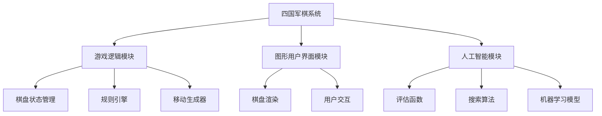

# 四国军棋系统详细设计与具体代码实现

## 1.背景介绍

四国军棋是一种源于中国的策略型棋类游戏,它融合了国际象棋、中国象棋和其他棋类游戏的特点,具有规则复杂、策略性强的特点。游戏中有红、黄、蓝、绿四个阵营,每个阵营拥有不同的棋子和不同的行棋规则,增加了游戏的趣味性和挑战性。

本文将详细介绍四国军棋系统的设计和实现,包括核心概念、算法原理、数学模型、代码实现、应用场景等,为读者提供全面的技术细节和实践指导。

### 1.1 游戏简介

四国军棋游戏在一个 10x9 的棋盘上进行,每个阵营初始摆放有16枚棋子。游戏的目标是将对手的主将(帅/将)被将死,或者阵营的所有棋子都被吃掉。每个回合,玩家可以移动一枚棋子,也可以选择不动。

### 1.2 系统架构概览



如上图所示,四国军棋系统主要由三个模块组成:游戏逻辑模块、图形用户界面模块和人工智能模块。游戏逻辑模块负责管理棋盘状态、执行规则和生成合法移动;图形用户界面模块负责渲染棋盘和处理用户交互;人工智能模块则实现了评估函数、搜索算法和机器学习模型,用于提供自动下棋的功能。

## 2.核心概念与联系

### 2.1 棋盘状态表示

棋盘状态是整个系统的核心数据结构,它记录了当前棋盘上每个位置的棋子信息。在四国军棋中,每个位置可能有红、黄、蓝、绿四种阵营的棋子,或者为空。因此,我们使用一个二维数组来表示棋盘状态,数组的每个元素记录了对应位置的棋子信息。

```python
board = [[0] * 9 for _ in range(10)]
```

上面的代码初始化了一个 10x9 的二维数组,所有元素初始值为 0,表示空位置。我们可以使用特定的数值来表示不同阵营的不同棋子,例如:

- 0: 空位置
- 1: 红帅
- 2: 红士
- ...

通过这种表示方式,我们可以方便地获取和修改棋盘上任意位置的棋子信息。

### 2.2 规则引擎

规则引擎是游戏逻辑的核心部分,它负责判断移动的合法性、执行移动、检查将死等。在四国军棋中,每个阵营的棋子都有不同的走法规则,因此规则引擎需要能够处理这些复杂的规则。

我们可以使用面向对象的设计模式,为每种棋子定义一个类,并在类中实现该棋子的走法规则。例如,对于红兵,我们可以定义一个 `RedPawn` 类,其中包含了判断红兵合法移动的方法。

```python
class RedPawn:
    def is_valid_move(self, board, src_row, src_col, dst_row, dst_col):
        # 判断红兵的合法移动规则
        # ...
        return True or False
```

规则引擎可以维护一个字典,将每种棋子类型映射到对应的类实例,从而方便地调用不同棋子的走法规则。

```python
piece_types = {
    1: RedKing(),
    2: RedGuard(),
    3: RedPawn(),
    ...
}
```

在执行移动时,规则引擎会先判断移动的合法性,如果合法则更新棋盘状态并进行相应的操作(如将死检查等)。

### 2.3 人工智能模块

人工智能模块的主要任务是实现一个强大的自动下棋引擎,它包括评估函数、搜索算法和机器学习模型三个核心组件。

**评估函数**用于对当前棋盘状态进行评分,评分高的状态对应更有利的局面。评估函数通常考虑棋子的数量、位置、控制力等多个因素,并对它们进行加权求和。

**搜索算法**则根据评估函数的评分,在游戏树中搜索最优的移动序列。常用的搜索算法包括极大极小算法(Minimax)、阿尔法贝塔剪枝(Alpha-Beta Pruning)等。

**机器学习模型**可以通过学习大量的对局数据,自动生成强大的评估函数和搜索策略。常见的机器学习模型包括深度神经网络、强化学习等。

这三个组件相互配合,共同构建了一个高效、智能的自动下棋引擎。

## 3.核心算法原理具体操作步骤

### 3.1 移动生成算法

移动生成算法的目标是根据当前棋盘状态和行棋方,生成所有合法的移动列表。这是整个系统的基础算法,也是最核心的算法之一。

算法的基本思路是:遍历棋盘上的每一个棋子,判断该棋子是否属于当前行棋方,如果是,则根据该棋子的走法规则,生成所有合法的目标位置,将源位置和目标位置构成一个移动,添加到移动列表中。

以下是一个简化版的 Python 代码实现:

```python
def generate_moves(board, color):
    moves = []
    for row in range(10):
        for col in range(9):
            piece = board[row][col]
            if piece != 0 and get_color(piece) == color:
                piece_type = get_piece_type(piece)
                for dst_row in range(10):
                    for dst_col in range(9):
                        if piece_types[piece_type].is_valid_move(board, row, col, dst_row, dst_col):
                            moves.append((row, col, dst_row, dst_col))
    return moves
```

在上面的代码中,我们首先遍历棋盘上的每一个位置,获取该位置的棋子信息。如果该位置有棋子,且棋子的阵营与当前行棋方相同,我们就根据棋子的类型,调用对应类的 `is_valid_move` 方法,判断从当前位置移动到每一个目标位置是否合法。如果合法,就将源位置和目标位置构成一个移动,添加到移动列表中。

这个算法的时间复杂度为 O(mn*k),其中 m 和 n 分别是棋盘的行数和列数,k 是每种棋子的最大移动步数。在四国军棋中,m=10,n=9,k 是一个较小的常数,因此算法的效率是可以接受的。

### 3.2 极大极小算法

极大极小算法(Minimax)是一种经典的对策树搜索算法,常用于对抗性游戏的人工智能系统中。它的基本思想是:在当前节点,计算机选择对自己最有利的移动,而假设对手也会做出对自己最有利的移动。通过这种方式,算法可以在游戏树中搜索出一条最优的移动序列。

算法的伪代码如下:

```
function minimax(node, depth, maximizingPlayer)
    if depth = 0 or node is a terminal node
        return the heuristic value of node

    if maximizingPlayer
        maxEval = -infinity
        for each child of node
            eval = minimax(child, depth - 1, false)
            maxEval = max(maxEval, eval)
        return maxEval

    else
        minEval = +infinity
        for each child of node
            eval = minimax(child, depth - 1, true)
            minEval = min(minEval, eval)
        return minEval
```

在这个算法中,我们定义了一个递归函数 `minimax`。如果当前节点是终止节点或者搜索深度为 0,函数返回当前节点的评估值。否则,如果是最大化节点(计算机行棋),函数遍历所有子节点,选择产生最大评估值的子节点,将这个最大值作为返回值。如果是最小化节点(对手行棋),函数遍历所有子节点,选择产生最小评估值的子节点,将这个最小值作为返回值。

通过这种方式,算法可以在游戏树中找到一条最优的移动序列。但是,极大极小算法的计算量随着搜索深度的增加而指数级增长,因此在实际应用中,我们通常会结合 Alpha-Beta 剪枝等优化技术,来提高算法的效率。

### 3.3 Alpha-Beta 剪枝

Alpha-Beta 剪枝是一种常用的对极大极小算法进行优化的技术,它可以在不影响最终结果的情况下,避免遍历整个游戏树,从而大大减少计算量。

算法的基本思想是:在搜索过程中,维护两个值 alpha 和 beta,分别记录已经找到的最大值和最小值的下界。如果当前节点的值小于 alpha 或者大于 beta,那么该节点及其子节点就可以被安全地剪枝,不需要继续搜索。

以下是 Alpha-Beta 剪枝算法的伪代码:

```
function alphabeta(node, depth, alpha, beta, maximizingPlayer)
    if depth = 0 or node is a terminal node
        return the heuristic value of node

    if maximizingPlayer
        maxEval = -infinity
        for each child of node
            eval = alphabeta(child, depth - 1, alpha, beta, false)
            maxEval = max(maxEval, eval)
            alpha = max(alpha, eval)
            if beta <= alpha
                break  # beta cut-off
        return maxEval

    else
        minEval = +infinity
        for each child of node
            eval = alphabeta(child, depth - 1, alpha, beta, true)
            minEval = min(minEval, eval)
            beta = min(beta, eval)
            if beta <= alpha
                break  # alpha cut-off
        return minEval
```

与极大极小算法相比,Alpha-Beta 剪枝算法在每一层搜索时,都会维护 alpha 和 beta 两个值。如果当前节点的值小于 alpha 或者大于 beta,就可以直接剪枝,不需要继续搜索该节点的子节点。

Alpha-Beta 剪枝算法的最坏情况时间复杂度仍然是指数级的,但在实际应用中,它可以大幅减少需要搜索的节点数量,从而提高算法的效率。

## 4.数学模型和公式详细讲解举例说明

在四国军棋系统中,数学模型和公式主要应用于评估函数和机器学习模型两个部分。

### 4.1 评估函数

评估函数的目标是对当前棋盘状态进行评分,评分高的状态对应更有利的局面。在四国军棋中,评估函数通常考虑以下几个因素:

1. 棋子数量
2. 棋子位置
3. 控制力
4. 特殊棋子(如将帅)的安全性

我们可以为每个因素赋予一定的权重,并将它们加权求和,得到最终的评估分数。具体的评估函数可以表示为:

$$
f(s) = w_1 \times \text{piece_count}(s) + w_2 \times \text{piece_position}(s) + w_3 \times \text{control}(s) + w_4 \times \text{king_safety}(s)
$$

其中:

- $s$ 表示当前棋盘状态
- $\text{piece_count}(s)$ 表示当前阵营的棋子数量
- $\text{piece_position}(s)$ 表示棋子位置的评分,好的位置得分高
- $\text{control}(s)$ 表示当前阵营对棋盘的控制力评分
- $\text{king_safety}(s)$ 表示主将(帅/将)的安全性评分
- $w_1, w_2, w_3, w_4$ 是对应因素的权重系数

通过调整权重系数,我们可以调节评估函数对不同因素的重视程度,从而影响人工智能引擎的下棋策略。

例如,如果我们希望人工智能引擎更注重棋子数量,可以增大 $w_1$ 的值;如果希望更注重主将的安全性,可以增大 $w_4$ 的值。

### 4.2 机器学习模型