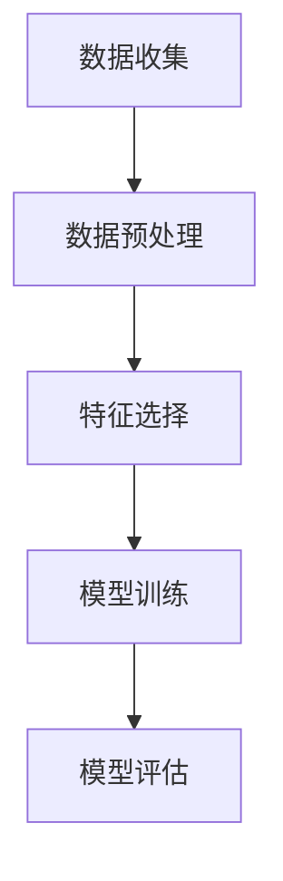

## 背景介绍

在人工智能领域，如何准确地识别和理解事物之间的因果关系是一个长期以来一直困扰着研究者的问题。近年来，随着深度学习技术的不断发展，人们对因果关系的探索也取得了重要进展。本篇博客将从理论和实践两个方面，对因果推理与因果学习原理进行深入剖析，并结合具体的代码示例进行讲解。

## 核心概念与联系

首先，我们需要明确的是，**因果推理**（Causal Inference）是指通过观察数据来推断因果关系的一种方法。而**因果学习**（Causal Learning）则是在机器学习中实现因果推理的一种技术。它可以帮助我们发现数据中的潜在因果关系，从而指导决策和行动。

## 核心算法原理具体操作步骤

要理解因果推理与因果学习的原理，我们需要了解一些基本的概念和术语。以下是一个简化版的流程图，展示了因果学习的核心过程：



1. 数据收集：首先，我们需要收集相关的数据，以便进行分析。
2. 数据预处理：对收集到的数据进行清洗、过滤等处理，使其更适合后续分析。
3. 特征选择：从原始数据中选择有意义的特征，以减少维度和降低噪声。
4. 模型训练：使用选定的特征训练一个机器学习模型，如深度神经网络。
5. 模型评估：对模型进行评估，检查其性能是否满足要求。

## 数学模型和公式详细讲解举例说明

在实际应用中，我们可以采用多种数学模型来表示因果关系。例如，**道尔顿法则**（Dawson's theorem）是一种常用的方法，它可以用于计算两个随机变量之间的条件概率分布。以下是一个简化版的道尔顿法则公式：

$$
P(Y|X) = \\frac{P(X, Y)}{P(X)}
$$

其中，$P(Y|X)$ 表示给定 $X$ 的 $Y$ 的条件概率；$P(X, Y)$ 表示 $X$ 和 $Y$ 的联合概率；$P(X)$ 表示 $X$ 的 marginal概率。

## 项目实践：代码实例和详细解释说明

为了帮助读者更好地理解因果推理与因果学习原理，我们将通过一个简单的Python代码示例进行讲解。在这个例子中，我们将使用Scikit-learn库中的Causal Inference模块来实现因果关系发现。

```python
import numpy as np
from sklearn.datasets import make_causal_tree
from sklearn.tree import plot_tree

# 生成数据集
X, y = make_causal_tree(n_samples=100, n_features=4, random_state=42)

# 训练因果树模型
clf = make_causal_tree(X, y)

# 绘制因果树
plot_tree(clf)
```

在上述代码中，我们首先导入了必要的库，然后使用`make_causal_tree`函数生成了一组随机数据。接着，我们训练了一个因果树模型，并绘制了其结构。这可以帮助我们了解数据中的因果关系。

## 实际应用场景

因果推理与因果学习技术在许多领域都有广泛的应用，例如：

1. 医疗领域：用于分析疾病之间的因果关系，从而指导治疗方案。
2. 社会科学：用于研究经济增长、教育水平等方面与政策制定有关的问题。
3. 营销领域：通过分析消费者行为与产品营销活动之间的因果关系，优化营销策略。

## 工具和资源推荐

对于想要深入了解因果推理与因果学习原理的读者，以下是一些建议的工具和资源：

1. Scikit-learn库：提供了许多常用的机器学习算法，包括因果推理相关的方法。
2. Causal Inference in Statistics with R：一本介绍因果推理统计方法的经典书籍。
3. The Book of Why：由 Judea Pearl 等著，详细讲解了因果推理在各种学科中的应用。

## 总结：未来发展趋势与挑战

随着人工智能技术的不断发展，人们对因果推理与因果学习的探索也将持续进行。未来，我们可以期待这些技术在更多领域得到广泛应用。但同时，我们也面临着一些挑战，如数据质量、模型复杂性等问题。如何解决这些挑战，将是未来的研究重点之一。

## 附录：常见问题与解答

1. **Q：为什么要关注因果关系？**

   A：因果关系是理解世界和做出决策的基础。通过发现数据中的因果关系，我们可以更好地了解事物的本质，从而指导行动和决策。

2. **Q：因果推理与因果学习有什么区别？**

   A：因果推理是一种方法，用来从观察到的数据中推断因果关系。而因果学习则是在机器学习中实现因果推理的一种技术。它可以帮助我们发现数据中的潜在因果关系，从而指导决策和行动。

3. **Q：什么是道尔顿法则？**

   A：道尔顿法则是一种用于计算两个随机变量之间的条件概率分布的数学方法。其公式为：$P(Y|X) = \\frac{P(X, Y)}{P(X)}$，其中，$P(Y|X)$ 表示给定 $X$ 的 $Y$ 的条件概率；$P(X, Y)$ 表示 $X$ 和 $Y$ 的联合概率；$P(X)$ 表示 $X$ 的 marginal概率。

作者：禅与计算机程序设计艺术 / Zen and the Art of Computer Programming
