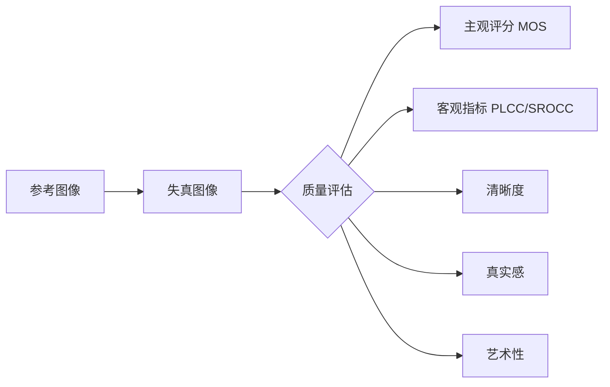
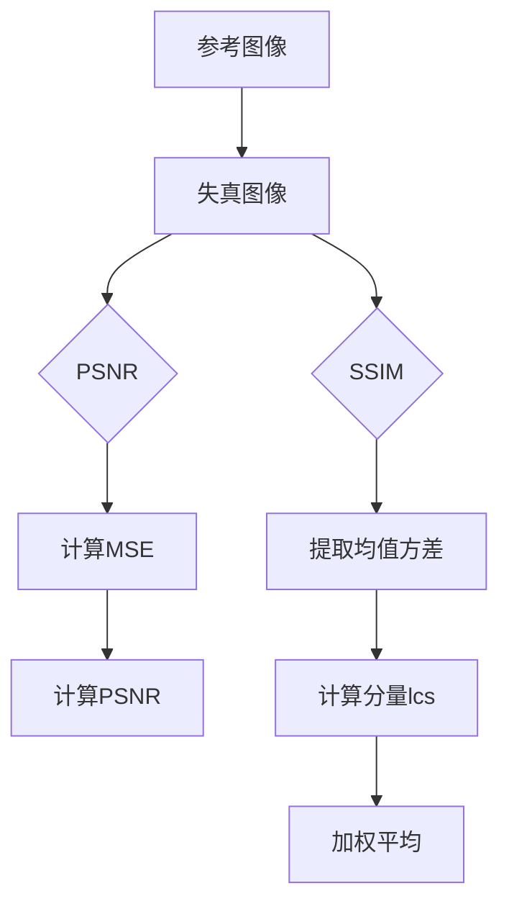

# 图像质量评估：清晰度、真实感与艺术性

## 1. 背景介绍
### 1.1 图像质量评估的重要性
在当今数字时代,图像无处不在。从社交媒体到医疗诊断,从自动驾驶到遥感监测,高质量的图像对于各行各业都至关重要。然而,由于图像获取、传输和处理过程中不可避免地引入各种失真和噪声,图像质量评估成为了一个亟需解决的问题。只有准确评估图像质量,才能有的放矢地改进成像系统、优化算法、提升用户体验。
### 1.2 主观评估与客观评估
传统上,图像质量主要依靠人眼主观评判。专家通过观察图像的清晰度、真实感、美观性等,给出主观分数。主观评估虽然可靠,但耗时费力,难以大规模开展。近年来,随着人工智能的发展,越来越多的研究致力于设计客观的图像质量评估算法,让机器像人一样"欣赏"图像。一个理想的客观评估算法,应当与人的主观感知高度一致,并且可以自动高效地处理海量图像数据。
### 1.3 本文的主要内容
本文将围绕图像质量评估这一主题,重点探讨三个方面:清晰度、真实感和艺术性。我们首先梳理图像质量评估的核心概念,包括参考图像、失真类型、评价指标等。然后介绍几种经典的清晰度、真实感评估算法,如梯度幅度相似度(GMSD)、视觉显著性加权SSIM等,并通过实例讲解其数学原理。接着,我们讨论如何将深度学习应用于图像质量评估,构建端到端的质量评分网络。在实践部分,我们将手把手带领读者用Python实现一个基于卷积神经网络的图像质量评估项目。最后,本文还将介绍一些有前景的研究方向,如多模态融合、元学习等,展望图像质量评估技术的未来。

## 2. 核心概念与联系
### 2.1 参考图像与失真图像
图像质量评估可分为全参考(Full-Reference)、半参考(Reduced-Reference)和无参考(No-Reference)三种范式。其中,全参考方法假设存在一幅"完美"的参考图像,评估任务就是比较失真图像与参考图像之间的差异。常见的失真类型包括:
- 高斯噪声
- 高斯模糊
- JPEG压缩
- 传输误码
- 对比度变化  

半参考方法只需要参考图像的部分信息,如边缘、纹理等。无参考方法则完全不依赖参考图像,直接从失真图像中提取质量特征。在实际应用中,往往很难获得理想的参考图像,因此无参考方法备受青睐。

### 2.2 主观评分与客观指标
主观评分是指人眼对图像质量的主观判断,通常采用平均意见分(MOS, Mean Opinion Score)作为金标准。MOS分为5级:5-优秀,4-好,3-一般,2-差,1-非常差。为了让主观评分更加规范化,国际电信联盟(ITU)制定了一系列标准,如ITU-R BT.500。

客观指标是通过算法自动计算的图像质量量化指标。一个理想的客观指标应当与主观MOS高度相关。常用的相关性度量包括:
- 皮尔逊相关系数(PLCC)
- 斯皮尔曼等级相关系数(SROCC)
- 肯德尔等级相关系数(KROCC)

此外,客观指标还要求计算高效、鲁棒,对各种失真类型都有较好的性能。

### 2.3 清晰度、真实感与艺术性
图像质量是一个多维度的主观概念,涉及清晰度、真实感、艺术性等多个方面。清晰度描述图像细节纹理的保真程度,真实感衡量图像内容与真实场景的相似性,艺术性则强调图像的美学吸引力。一幅高质量的图像应当在这三个维度上都有优异的表现。

然而,现有的图像质量评估方法大多只关注清晰度,忽视了真实感和艺术性。比如,超分辨率算法生成的图像往往过于平滑,缺乏真实的纹理细节。又如,风格迁移算法生成的图像虽然在艺术性上有独特的魅力,但往往失真严重,丢失了原始图像的语义内容。因此,全面评估图像质量,开发融合清晰度、真实感、艺术性的评估新范式,是一个富有挑战和意义的研究课题。

下图总结了图像质量评估的核心概念及其联系:



## 3. 核心算法原理具体操作步骤
本节将重点介绍两种经典的全参考图像质量评估算法:PSNR和SSIM。这两种算法分别从像素误差和结构相似性的角度度量图像失真程度,广泛应用于图像处理领域。我们将详细讲解它们的数学原理和具体计算步骤。

### 3.1 峰值信噪比 PSNR
峰值信噪比(Peak Signal-to-Noise Ratio, PSNR)是一种基于像素误差的图像质量评估指标。设参考图像为$x$,失真图像为$y$,两幅图像的均方误差(MSE)定义为:

$$
MSE=\frac{1}{N}\sum_{i=1}^{N}(x_i-y_i)^2
$$

其中$N$为图像总像素数。PSNR的定义为:

$$
PSNR=10\log_{10}(\frac{L^2}{MSE})
$$

其中$L$为图像像素的动态范围,对于8位灰度图像取255。直观地说,PSNR度量了失真图像与参考图像之间的像素误差能量,数值越大表示失真越小,质量越高。一般认为,PSNR高于40dB的图像质量就比较理想了。

PSNR的具体计算步骤如下:
1. 将彩色RGB图像转为灰度图像
2. 计算参考图像与失真图像的MSE
3. 根据MSE和动态范围$L$计算PSNR
4. 得到最终的PSNR评分

### 3.2 结构相似性 SSIM
结构相似性(Structural Similarity, SSIM)是一种考虑人眼视觉特性的图像质量评估指标。它基于一个重要假设:人眼对结构信息的变化更敏感。因此,SSIM不是直接比较两幅图像的像素值,而是提取亮度、对比度、结构三个特征,度量它们的相似性。

设图像$x$和$y$的均值、方差、协方差分别为$\mu_x,\mu_y,\sigma_x^2,\sigma_y^2,\sigma_{xy}$。SSIM定义为:

$$
SSIM(x,y)=[l(x,y)]^\alpha\cdot[c(x,y)]^\beta\cdot[s(x,y)]^\gamma
$$

其中$l,c,s$分别表示亮度、对比度、结构三个分量:

$$
l(x,y)=\frac{2\mu_x\mu_y+C_1}{\mu_x^2+\mu_y^2+C_1}
$$

$$
c(x,y)=\frac{2\sigma_x\sigma_y+C_2}{\sigma_x^2+\sigma_y^2+C_2} 
$$

$$
s(x,y)=\frac{\sigma_{xy}+C_3}{\sigma_x\sigma_y+C_3}
$$

$C_1,C_2,C_3$为小常数,避免分母为0。$\alpha,\beta,\gamma$为权重参数,一般取1。可以看出,当两幅图像完全相同时,SSIM取最大值1;差异越大,SSIM越接近0。

SSIM的具体计算步骤如下:
1. 用高斯滤波器提取局部图像块的均值、方差、协方差
2. 根据公式计算局部块的SSIM值
3. 对所有局部SSIM值求平均,得到全局SSIM评分
4. 将SSIM映射到0-100分,0分最差,100分最优

下图展示了PSNR和SSIM的计算流程:



## 4. 数学模型和公式详细讲解举例说明
本节将进一步深入探讨PSNR和SSIM背后的数学原理,并给出一些直观的例子帮助理解。

### 4.1 为什么用MSE而不是MAE?
在PSNR的定义中,我们用均方误差(MSE)而不是平均绝对误差(MAE)来度量像素误差。这是因为相比MAE,MSE更能凸显大的误差。直观地说,MSE相当于给较大的像素误差更高的惩罚权重。举个例子,假设有两幅失真图像a和b,它们与参考图像在两个像素上的绝对误差分别为:

```
a: [1, 10], MAE=5.5, MSE=50.5
b: [5,  6], MAE=5.5, MSE=30.5
```

可以看出,虽然a和b的MAE相同,但a的最大误差高达10,而b的误差较为均匀。因此,a的MSE远大于b,PSNR也会相应降低。这与人眼的感知更加吻合。

### 4.2 为什么SSIM要用乘法组合?
SSIM巧妙地将图像相似性分解为亮度、对比度、结构三个分量,并用乘法将它们组合起来。这种做法有两个好处:
1. 乘法能够放大各分量的差异。比如,当亮度分量为0.5,对比度和结构分量为1时,SSIM为0.5。但如果用加法组合,SSIM将高达0.83,掩盖了亮度差异。
2. 乘法能够平衡各分量的重要性。如果某一分量很低,即使其他分量很高,SSIM也不会太高。这与人眼的主观感受一致。

举个例子,假设图像x和y在三个分量上的相似度为:

```
l=0.9, c=0.8, s=0.7
SSIM = 0.9*0.8*0.7 = 0.504
```

可见,虽然各分量的相似度都不低,但它们的乘积SSIM只有0.504,反映了整体差异还是较大的。这体现了SSIM的乘法组合策略能够全面考虑各个分量。

### 4.3 SSIM与加权SSIM
原始的SSIM对图像的每个局部块等权平均,忽略了不同区域对人眼感知的重要性差异。一个改进的做法是,引入视觉显著性权重,对显著区域的SSIM赋予更高的权重。设第$i$个图像块的SSIM值为$SSIM_i$,对应的显著性权重为$w_i$,则加权SSIM定义为:

$$
WSSIM=\frac{\sum_{i=1}^{M}w_iSSIM_i}{\sum_{i=1}^{M}w_i}
$$

其中$M$为图像块总数。$w_i$可以用各种显著性检测算法预先计算,如谱残差法、图显著性等。直观地说,人眼更可能关注显著性高的区域,因此这些区域的质量更加重要。

举个例子,假设一幅图像分为四个块,它们的SSIM值和显著性权重分别为:

```
SSIM:  [0.9, 0.8, 0.7, 0.6]
权重:  [0.1, 0.2, 0.3, 0.4]
WSSIM = (0.9*0.1+0.8*0.2+0.7*0.3+0.6*0.4) / (0.1+0.2+0.3+0.4) = 0.69
```

可以看出,显著性高的第三、四块虽然SSIM较低,但在WSSIM中占据了更大的权重,使得整体评分降到了0.69。这说明加权平均