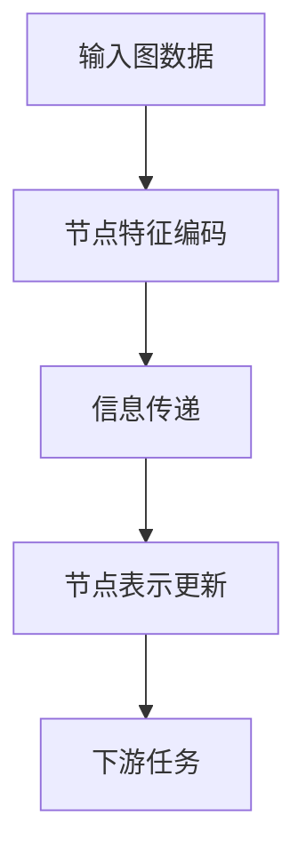

# 图神经网络(GNN)原理与代码实战案例讲解

## 1. 背景介绍

### 1.1 数据的关系性

在现实世界中,数据之间通常存在着复杂的关系和依赖性。例如,社交网络中的人与人之间存在着亲朋好友的关系;蛋白质互作网络中的蛋白质之间存在着相互作用的关系;计算机网络中的设备之间存在着连接关系。这些关系数据通常可以用图(Graph)的形式来表示,其中节点(Node)代表实体,边(Edge)代表实体之间的关系。

### 1.2 传统机器学习算法的局限性

传统的机器学习算法,如逻辑回归、支持向量机等,主要针对的是欧几里得空间中的数据,即结构化数据。这些算法在处理图结构数据时存在一定的局限性,因为它们无法很好地捕捉和利用数据之间的拓扑结构信息。

### 1.3 图神经网络(GNN)的兴起

为了更好地处理具有复杂关系的数据,近年来图神经网络(Graph Neural Networks, GNN)应运而生并得到了迅速发展。图神经网络是一种将神经网络与图数据相结合的新型深度学习架构,它可以直接对图结构数据进行端到端的学习,从而捕捉和利用数据之间的拓扑结构信息,为图数据的表示学习和预测任务提供了有力的工具。

## 2. 核心概念与联系

### 2.1 图的表示

在介绍图神经网络之前,我们首先需要了解图的表示方式。一个图 $\mathcal{G}$ 可以表示为 $\mathcal{G} = (\mathcal{V}, \mathcal{E})$,其中 $\mathcal{V}$ 表示节点集合,即 $\mathcal{V} = \{v_1, v_2, \dots, v_N\}$,共有 $N$ 个节点; $\mathcal{E}$ 表示边的集合,即 $\mathcal{E} = \{(v_i, v_j)\}$,表示节点 $v_i$ 和节点 $v_j$ 之间存在一条边。

此外,我们还可以为每个节点和边赋予一些属性特征,例如节点特征矩阵 $\mathbf{X} \in \mathbb{R}^{N \times D}$,其中 $\mathbf{x}_i \in \mathbb{R}^D$ 表示第 $i$ 个节点的 $D$ 维特征向量;边的特征矩阵 $\mathbf{E} \in \mathbb{R}^{|\mathcal{E}| \times D'}$,其中 $\mathbf{e}_{ij} \in \mathbb{R}^{D'}$ 表示连接节点 $v_i$ 和 $v_j$ 的边的 $D'$ 维特征向量。

### 2.2 图神经网络的基本思想

图神经网络的基本思想是利用神经网络来学习图数据的表示,并将这些表示应用于下游的图任务,如节点分类、链接预测等。图神经网络的核心在于如何捕捉和利用图结构中的拓扑信息,即节点之间的关系。

在图神经网络中,每个节点的表示向量是通过聚合其相邻节点的表示向量得到的,这个过程被称为"信息传递"(Message Passing)。具体来说,每个节点根据自身的特征向量和相邻节点的特征向量,通过一个神经网络函数(如多层感知机)来计算出一个新的节点表示向量。这个过程在整个图上进行迭代,直到达到收敛或者达到预设的迭代次数。

通过这种方式,图神经网络可以有效地捕捉和编码图结构中的拓扑信息,使得最终学习到的节点表示向量不仅包含了节点自身的特征信息,还包含了其相邻节点的特征信息及它们之间的关系信息。

### 2.3 图神经网络与其他神经网络的关系

图神经网络与其他一些神经网络模型存在一定的联系,例如:

- 卷积神经网络(CNN): CNN 主要用于处理欧几里得数据(如图像、序列等),而图神经网络则用于处理非欧几里得数据(如图数据)。两者都利用了局部邻域信息进行特征提取和聚合。
- 递归神经网络(RNN): RNN 主要用于处理序列数据,而图神经网络可以看作是在一般拓扑结构上的递归神经网络。
- 注意力机制(Attention): 注意力机制被广泛应用于各种神经网络模型中,图神经网络中的信息传递过程也可以看作是一种注意力聚合机制。

尽管存在一些联系,但图神经网络针对的是特殊的图结构数据,具有独特的网络架构和信息传递机制,是一种全新的深度学习范式。

## 3. 核心算法原理具体操作步骤

在介绍图神经网络的具体算法之前,我们先来看一下图神经网络的基本计算流程:

上图展示了图神经网络的基本计算流程,包括以下几个关键步骤:

1. 输入图数据,包括节点集合、边集合以及节点/边的特征信息。
2. 对原始节点特征进行编码,获得初始的节点表示向量。
3. 进行信息传递,根据相邻节点的表示向量更新当前节点的表示向量。
4. 重复执行步骤3,直到达到收敛或者达到预设的迭代次数,得到最终的节点表示向量。
5. 将学习到的节点表示向量应用于下游的图任务,如节点分类、链接预测等。

接下来,我们将介绍图神经网络中一种经典且广为人知的算法:图卷积网络(Graph Convolutional Network, GCN)。

### 3.1 图卷积网络(GCN)

图卷积网络是一种将卷积操作从欧几里得数据(如图像)推广到非欧几里得数据(如图)的图神经网络模型。它的核心思想是通过"信息传递"来学习节点的表示向量,具体步骤如下:

1. **特征编码**

   对原始节点特征矩阵 $\mathbf{X} \in \mathbb{R}^{N \times D}$ 进行线性变换,得到初始的节点表示向量:

   $$\mathbf{H}^{(0)} = \mathbf{X}\mathbf{W}^{(0)}$$

   其中 $\mathbf{W}^{(0)} \in \mathbb{R}^{D \times H}$ 是可训练的权重矩阵,用于将 $D$ 维节点特征映射到 $H$ 维隐空间。

2. **信息传递**

   在第 $l$ 层,每个节点的表示向量 $\mathbf{h}_i^{(l)}$ 是通过聚合自身和邻居节点的表示向量得到的:

   $$\mathbf{h}_i^{(l+1)} = \sigma\left(\sum_{j \in \mathcal{N}(i) \cup \{i\}} \frac{1}{\sqrt{\hat{d}_i\hat{d}_j}}\mathbf{h}_j^{(l)}\mathbf{W}^{(l)}\right)$$

   其中 $\mathcal{N}(i)$ 表示节点 $i$ 的邻居节点集合; $\hat{d}_i$ 和 $\hat{d}_j$ 分别表示节点 $i$ 和 $j$ 的度数加一; $\mathbf{W}^{(l)} \in \mathbb{R}^{H \times H'}$ 是可训练的权重矩阵,用于将 $H$ 维节点表示映射到 $H'$ 维隐空间; $\sigma(\cdot)$ 是非线性激活函数,如 ReLU。

   上式中的 $\frac{1}{\sqrt{\hat{d}_i\hat{d}_j}}$ 项是一种归一化操作,可以防止梯度爆炸或者消失。

3. **节点表示更新**

   重复执行步骤2,直到达到预设的层数 $L$,得到最终的节点表示向量 $\mathbf{H}^{(L)} \in \mathbb{R}^{N \times H_L}$。

4. **下游任务**

   将最终的节点表示向量 $\mathbf{H}^{(L)}$ 应用于下游的图任务,如节点分类、链接预测等。对于节点分类任务,可以添加一个简单的分类器:

   $$\mathbf{Z} = \text{softmax}(\mathbf{H}^{(L)}\mathbf{W}_\text{out})$$

   其中 $\mathbf{W}_\text{out} \in \mathbb{R}^{H_L \times C}$ 是可训练的权重矩阵,用于将 $H_L$ 维节点表示映射到 $C$ 个类别; $\mathbf{Z} \in \mathbb{R}^{N \times C}$ 是预测的类别概率分布。

通过上述步骤,图卷积网络可以有效地捕捉和利用图结构中的拓扑信息,学习出高质量的节点表示向量,从而提高下游任务的性能。

### 3.2 GCN 模型的优缺点

图卷积网络(GCN)作为一种经典的图神经网络模型,具有以下优点:

- 简单高效:GCN 的计算过程相对简单,只需要进行信息传递和线性变换,计算效率较高。
- 端到端训练:GCN 可以直接对原始图数据进行端到端的训练,无需手工提取特征。
- 泛化性强:GCN 可以直接应用于不同类型的图数据,具有较强的泛化能力。

然而,GCN 也存在一些缺点和局限性:

- 过平滑问题:在进行多层信息传递时,不同节点的表示向量会变得越来越相似,导致表示能力下降。
- 缺乏长程依赖建模:GCN 只能捕捉到节点的局部邻域信息,无法有效地建模长程依赖关系。
- 静态图限制:GCN 主要针对静态图数据,对于动态图数据的处理能力较差。

为了解决 GCN 的这些缺陷,研究人员提出了许多改进的图神经网络模型,如图注意力网络(GAT)、图同构网络(GIN)等,这些模型在不同方面对 GCN 进行了改进和扩展。

## 4. 数学模型和公式详细讲解举例说明

在上一节中,我们介绍了图卷积网络(GCN)的核心算法原理。在这一节,我们将对 GCN 中涉及的一些重要数学模型和公式进行更加详细的讲解和举例说明。

### 4.1 图拉普拉斯矩阵

在图卷积网络中,我们需要利用图的拓扑结构信息来指导信息传递过程。一种常用的方法是利用图的拉普拉斯矩阵(Laplacian Matrix)。

对于一个无向图 $\mathcal{G} = (\mathcal{V}, \mathcal{E})$,我们可以构造一个邻接矩阵(Adjacency Matrix) $\mathbf{A} \in \mathbb{R}^{N \times N}$,其中 $\mathbf{A}_{ij} = 1$ 当且仅当节点 $i$ 和节点 $j$ 之间存在边,否则 $\mathbf{A}_{ij} = 0$。

基于邻接矩阵,我们可以定义图的度矩阵(Degree Matrix) $\mathbf{D} \in \mathbb{R}^{N \times N}$,它是一个对角矩阵,对角线元素 $\mathbf{D}_{ii} = \sum_j \mathbf{A}_{ij}$ 表示节点 $i$ 的度数,即与节点 $i$ 相连的边的数量。

进一步,我们可以定义图的拉普拉斯矩阵 $\mathbf{L} \in \mathbb{R}^{N \times N}$ 为:

$$\mathbf{L} = \mathbf{D} - \mathbf{A}$$

拉普拉斯矩阵 $\mathbf{L}$ 反映了图的拓扑结构信息,它具有以下重要性质:

- 对于任意向量 $\mathbf{x} \in \mathbb{R}^N$,我们有 $