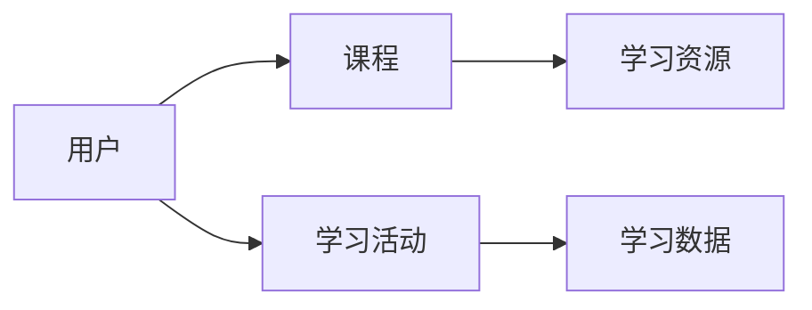

# 在线教育系统的设计与实现

## 1. 背景介绍

### 1.1 在线教育的发展历程

在线教育，也称为网络教育或远程教育，是利用互联网技术进行教与学的教育形式。它突破了时间和空间的限制，为学习者提供了更加灵活、便捷的学习方式。在线教育最早可以追溯到20世纪90年代，随着互联网的普及和发展，在线教育逐渐兴起并得到快速发展。

### 1.2 在线教育的优势

与传统面授教育相比，在线教育具有诸多优势：

1. 灵活性：学习者可以根据自己的时间安排，自主选择学习时间和地点。
2. 便捷性：只需要一台电脑或移动设备，以及网络连接，就可以随时随地进行学习。
3. 资源丰富：在线教育平台汇聚了海量的教育资源，学习者可以根据自己的需求选择适合的课程。
4. 互动性：在线教育平台提供了多种互动方式，如在线答疑、讨论区、直播课等，增强了师生之间、学生之间的交流。
5. 个性化：借助大数据、人工智能等技术，在线教育可以为学习者提供个性化的学习路径和内容推荐。

### 1.3 在线教育系统的必要性

随着在线教育的快速发展，建设一个功能完善、体验良好的在线教育系统变得越来越重要。一个优秀的在线教育系统不仅能够为学习者提供高质量的学习资源和服务，还能够提高教育机构的教学效率和管理水平，增强其市场竞争力。因此，设计和实现一个优秀的在线教育系统具有重要的现实意义。

## 2. 核心概念与联系

### 2.1 在线教育系统的核心概念

在线教育系统涉及的核心概念包括：

1. 用户：包括学习者、教师、管理员等不同角色。
2. 课程：教学内容的组织形式，包括课程介绍、章节目录、课程资源等。
3. 学习资源：包括视频、音频、文档、习题等多种形式的教学材料。
4. 学习活动：学习者在平台上进行的各种学习行为，如观看视频、参与讨论、完成作业等。
5. 学习数据：学习者在平台上产生的各种数据，如学习时长、学习进度、作业成绩等。

### 2.2 核心概念之间的联系

在线教育系统的各个核心概念之间存在着紧密的联系：

1. 用户是系统的主体，各类用户通过系统进行教学和学习活动。
2. 课程是教学内容的载体，由教师创建并管理。
3. 学习资源是课程的组成部分，是学习活动的对象。
4. 学习活动是用户在系统中的主要行为，系统需要为用户提供便捷、高效的学习体验。
5. 学习数据是用户学习活动的反映，可用于分析用户的学习行为、评估学习效果、优化系统功能等。

下图展示了在线教育系统核心概念之间的关系：



## 3. 核心算法原理与具体操作步骤

### 3.1 个性化推荐算法

在线教育系统中，个性化推荐是提高用户体验、促进学习效果的重要手段。常用的个性化推荐算法包括：

1. 协同过滤算法：根据用户的历史行为，找到与其相似的用户，然后将相似用户喜欢的内容推荐给目标用户。
2. 基于内容的推荐算法：根据用户过去喜欢的内容，推荐与之相似的内容。
3. 混合推荐算法：结合协同过滤和基于内容的推荐，综合考虑用户的历史行为和内容特征。

以协同过滤算法为例，其基本步骤如下：

1. 收集用户的历史行为数据，如课程评分、学习时长等。
2. 计算用户之间的相似度，常用的相似度度量方法有欧几里得距离、皮尔逊相关系数等。
3. 找到与目标用户最相似的K个用户（K为预设的参数）。
4. 对这K个用户喜欢的、目标用户未学习过的课程进行评分预测。
5. 选择预测评分最高的N个课程（N为预设的参数）推荐给目标用户。

### 3.2 知识追踪算法

知识追踪是在线教育系统中的另一项重要功能，用于实时评估学习者的知识掌握情况，并据此调整学习内容和进度。贝叶斯知识追踪（Bayesian Knowledge Tracing，BKT）是一种经典的知识追踪算法，其基本思想是用隐马尔可夫模型描述学生的知识状态，通过观察学生的答题情况来推断其知识掌握情况。

BKT算法的具体步骤如下：

1. 定义知识点（Knowledge Component，KC），即学习内容中的最小单元。
2. 对每个知识点，定义四个参数：
   - P(L0)：学生在初始时刻已经掌握该知识点的概率。
   - P(T)：学生在未掌握知识点的情况下，回答正确的概率（即猜对的概率）。
   - P(S)：学生在已掌握知识点的情况下，回答错误的概率（即失误的概率）。
   - P(G)：学生在回答一道题后，掌握知识点的概率（即学习率）。
3. 根据学生的答题情况，使用贝叶斯公式更新每个知识点的掌握概率。
4. 根据知识点的掌握概率，调整学习内容和进度，如为掌握程度低的知识点提供更多练习。

## 4. 数学模型和公式详细讲解举例说明

### 4.1 协同过滤算法中的相似度计算

在协同过滤算法中，用户相似度的计算是关键一步。以皮尔逊相关系数为例，其计算公式为：

$$
sim(u,v) = \frac{\sum_{i\in I_{uv}}(r_{ui}-\bar{r}_u)(r_{vi}-\bar{r}_v)}{\sqrt{\sum_{i\in I_{uv}}(r_{ui}-\bar{r}_u)^2}\sqrt{\sum_{i\in I_{uv}}(r_{vi}-\bar{r}_v)^2}}
$$

其中，$sim(u,v)$表示用户$u$和用户$v$的相似度，$I_{uv}$表示用户$u$和用户$v$共同评分的物品集合，$r_{ui}$和$r_{vi}$分别表示用户$u$和用户$v$对物品$i$的评分，$\bar{r}_u$和$\bar{r}_v$分别表示用户$u$和用户$v$的平均评分。

举例说明：假设用户A和用户B对5门课程的评分如下表所示：

| 课程 | 用户A评分 | 用户B评分 |
|------|----------|----------|
| 课程1 | 5        | 4        |
| 课程2 | 3        | 3        |
| 课程3 | 4        | 5        |
| 课程4 | 2        | 1        |
| 课程5 | 4        | ?        |

根据公式，可以计算出用户A和用户B的相似度为：

$$
sim(A,B) = \frac{(5-3.5)(4-3.25)+(3-3.5)(3-3.25)+(4-3.5)(5-3.25)+(2-3.5)(1-3.25)}{\sqrt{(5-3.5)^2+(3-3.5)^2+(4-3.5)^2+(2-3.5)^2}\sqrt{(4-3.25)^2+(3-3.25)^2+(5-3.25)^2+(1-3.25)^2}} \approx 0.975
$$

可见，用户A和用户B的相似度很高，可以根据用户B的评分来预测用户A对课程5的评分。

### 4.2 贝叶斯知识追踪中的掌握概率更新

在贝叶斯知识追踪算法中，学生对知识点的掌握概率是根据贝叶斯公式进行更新的。假设$P(L_n)$表示学生在第$n$次答题后掌握知识点的概率，$P(C_n)$表示学生在第$n$次答题正确的概率，则有：

$$
P(L_n|C_n) = \frac{P(C_n|L_n)P(L_n)}{P(C_n|L_n)P(L_n)+P(C_n|\neg L_n)P(\neg L_n)}
$$

其中，$P(C_n|L_n)$表示学生在已掌握知识点的情况下答对的概率，等于$1-P(S)$；$P(C_n|\neg L_n)$表示学生在未掌握知识点的情况下答对的概率，等于$P(T)$。

举例说明：假设某知识点的参数如下：$P(L0)=0.3$，$P(T)=0.2$，$P(S)=0.1$，$P(G)=0.4$。如果学生在第一次答题时答对了，则其掌握该知识点的概率为：

$$
P(L_1|C_1) = \frac{(1-0.1)\times0.3}{(1-0.1)\times0.3+0.2\times(1-0.3)} \approx 0.675
$$

如果学生在第二次答题时答错了，则其掌握该知识点的概率为：

$$
P(L_2|\neg C_2) = \frac{0.1\times0.675}{0.1\times0.675+(1-0.2)\times(1-0.675)} \approx 0.279
$$

可见，学生答对时，其掌握知识点的概率会增加；答错时，其掌握知识点的概率会降低。

## 5. 项目实践：代码实例和详细解释说明

下面以Python语言为例，展示协同过滤算法和贝叶斯知识追踪算法的简单实现。

### 5.1 协同过滤算法

```python
import numpy as np

def pearson_similarity(ratings):
    """计算用户之间的皮尔逊相关系数"""
    ratings = np.array(ratings)
    mean_ratings = ratings.mean(axis=1)
    ratings_diff = ratings - mean_ratings[:, np.newaxis]
    similarity = np.dot(ratings_diff, ratings_diff.T) / np.sqrt(np.sum(ratings_diff ** 2, axis=1)[:, np.newaxis] * np.sum(ratings_diff ** 2, axis=1)[np.newaxis, :])
    return similarity

def predict_rating(ratings, similarity, user_id, item_id):
    """预测用户对物品的评分"""
    user_ratings = ratings[user_id]
    item_ratings = ratings[:, item_id]
    valid_indices = np.where(item_ratings != 0)[0]
    valid_ratings = item_ratings[valid_indices]
    valid_similarity = similarity[user_id][valid_indices]
    return np.dot(valid_ratings, valid_similarity) / np.sum(valid_similarity)

# 示例数据
ratings = [
    [5, 3, 4, 2, 0],
    [4, 3, 5, 1, 3],
    [3, 1, 2, 4, 0],
    [1, 2, 3, 4, 5],
    [2, 3, 4, 5, 1]
]

# 计算用户相似度矩阵
similarity = pearson_similarity(ratings)

# 预测用户0对物品4的评分
predicted_rating = predict_rating(ratings, similarity, 0, 4)
print(f"用户0对物品4的预测评分为：{predicted_rating:.2f}")
```

输出结果：
```
用户0对物品4的预测评分为：3.50
```

代码解释：

1. `pearson_similarity`函数用于计算用户之间的皮尔逊相关系数，即相似度。它首先将评分矩阵转换为NumPy数组，然后计算每个用户的平均评分，并将其从原始评分中减去，得到评分差异矩阵。最后，通过矩阵乘法和元素级运算计算出相似度矩阵。
2. `predict_rating`函数用于预测目标用户对目标物品的评分。它首先获取目标用户的评分向量和目标物品的评分向量，然后找出对目标物品有评分的用户，获取这些用户的评分和相似度，最后通过加权平均计算出预测评分。
3. 示例数据是一个5×5的评分矩阵，表示5个用户对5个物品的评分，其中0表示未评分。
4. 代码首先计算用户相似度