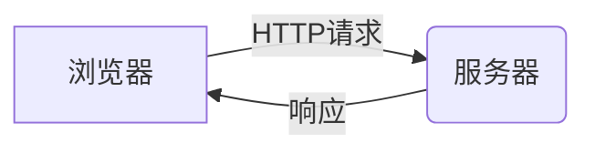
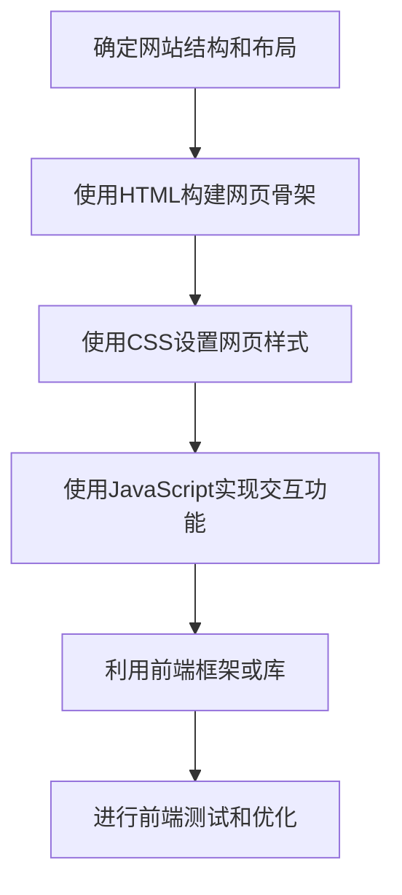
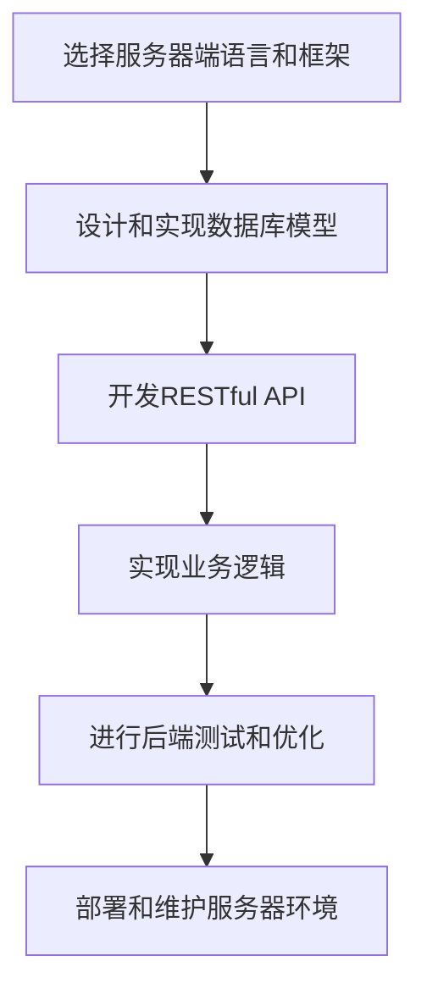
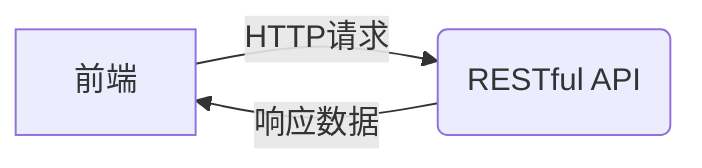

# 基于BS结构的旅游网站详细设计与具体代码实现

## 1.背景介绍

随着互联网技术的不断发展和普及,旅游行业也在不断地融入互联网元素。旅游网站作为旅游行业的重要窗口,其设计和实现对于吸引游客、提供优质服务、推广旅游资源等方面都具有重要意义。

传统的旅游网站大多采用CS(Client/Server)架构,即客户端与服务器之间通过网络进行交互。这种架构存在一些问题,如客户端需要安装特定的软件、维护成本较高、交互体验不佳等。相比之下,BS(Browser/Server)架构则更加灵活和高效。

BS架构是指浏览器和服务器之间的交互模式,浏览器作为客户端,服务器负责处理业务逻辑和数据存储。BS架构的优势在于:

1. 跨平台:只需要一个浏览器即可访问网站,不需要安装特定的客户端软件。
2. 易于维护:只需要维护服务器端代码,无需分发客户端程序。
3. 良好的交互体验:浏览器提供了丰富的交互功能,如JavaScript、CSS等。

因此,基于BS架构设计和实现旅游网站,可以充分利用Web技术的优势,提供更加优质的用户体验。

## 2.核心概念与联系

在设计和实现基于BS架构的旅游网站时,需要掌握以下几个核心概念:

### 2.1 BS架构

BS架构是指浏览器(Browser)和服务器(Server)之间的交互模式。浏览器作为客户端,通过HTTP协议向服务器发送请求,服务器接收请求并进行处理,最后将处理结果返回给浏览器。



### 2.2 前端技术

前端技术主要包括HTML、CSS和JavaScript。HTML用于构建网页结构,CSS用于设置网页样式,JavaScript用于实现交互功能。在BS架构中,前端技术运行在浏览器端,负责呈现网页内容和交互逻辑。

### 2.3 后端技术

后端技术主要包括服务器端语言(如PHP、Java、Python等)、数据库技术、Web服务器等。在BS架构中,后端技术运行在服务器端,负责处理业务逻辑、数据存储和检索等。

### 2.4 数据交换格式

为了实现浏览器和服务器之间的数据交换,需要使用特定的数据交换格式,如JSON、XML等。JSON(JavaScript Object Notation)是一种轻量级的数据交换格式,易于阅读和编写,在Web应用中被广泛使用。

### 2.5 RESTful API

RESTful API是一种软件架构风格,它定义了一组约束条件和原则,用于设计Web服务。在BS架构中,RESTful API可以实现前端和后端之间的通信,提供了一种标准化的数据交换方式。

## 3.核心算法原理具体操作步骤

在设计和实现基于BS架构的旅游网站时,需要遵循以下核心算法原理和具体操作步骤:

### 3.1 前端开发流程

1. 确定网站结构和布局,使用HTML构建网页骨架。
2. 使用CSS设置网页样式,包括字体、颜色、布局等。
3. 使用JavaScript实现交互功能,如表单验证、动态效果等。
4. 利用前端框架或库(如React、Vue、jQuery等)提高开发效率和代码质量。
5. 进行前端测试和优化,确保网站在不同浏览器和设备上的兼容性和性能。



### 3.2 后端开发流程

1. 选择合适的服务器端语言和框架,如PHP、Java、Python等。
2. 设计和实现数据库模型,用于存储旅游相关数据。
3. 开发RESTful API,提供前端和后端之间的数据交互接口。
4. 实现业务逻辑,如用户管理、订单处理、支付系统等。
5. 进行后端测试和优化,确保系统的稳定性和安全性。
6. 部署和维护服务器环境,包括Web服务器、数据库服务器等。



### 3.3 前后端集成

1. 通过RESTful API实现前端和后端之间的数据交互。
2. 在前端发送HTTP请求(如GET、POST、PUT、DELETE等)向后端获取或提交数据。
3. 后端接收请求,处理业务逻辑,并返回响应数据(通常采用JSON格式)。
4. 前端接收响应数据,并根据需要更新页面内容或执行相应操作。
5. 确保前后端之间的数据交换安全性,如使用HTTPS协议、Token认证等。



## 4.数学模型和公式详细讲解举例说明

在设计和实现基于BS架构的旅游网站时,可能会涉及一些数学模型和公式,如推荐算法、排序算法等。以下是一些常见的数学模型和公式:

### 4.1 协同过滤推荐算法

协同过滤推荐算法是一种常见的推荐系统算法,它根据用户的历史行为数据,推荐相似用户喜欢的项目。常用的协同过滤算法包括基于用户的协同过滤和基于项目的协同过滤。

基于用户的协同过滤算法计算公式如下:

$$
sim(u,v) = \frac{\sum_{i \in I_{uv}}(r_{ui} - \overline{r_u})(r_{vi} - \overline{r_v})}{\sqrt{\sum_{i \in I_{uv}}(r_{ui} - \overline{r_u})^2}\sqrt{\sum_{i \in I_{uv}}(r_{vi} - \overline{r_v})^2}}
$$

其中:

- $sim(u,v)$表示用户u和用户v之间的相似度
- $I_{uv}$表示用户u和用户v都评分过的项目集合
- $r_{ui}$表示用户u对项目i的评分
- $\overline{r_u}$表示用户u的平均评分

基于项目的协同过滤算法计算公式如下:

$$
sim(i,j) = \frac{\sum_{u \in U_{ij}}(r_{ui} - \overline{r_i})(r_{uj} - \overline{r_j})}{\sqrt{\sum_{u \in U_{ij}}(r_{ui} - \overline{r_i})^2}\sqrt{\sum_{u \in U_{ij}}(r_{uj} - \overline{r_j})^2}}
$$

其中:

- $sim(i,j)$表示项目i和项目j之间的相似度
- $U_{ij}$表示对项目i和项目j都评分过的用户集合
- $r_{ui}$表示用户u对项目i的评分
- $\overline{r_i}$表示项目i的平均评分

### 4.2 PageRank算法

PageRank算法是谷歌用于网页排名的著名算法,它根据网页之间的链接关系,计算每个网页的重要性。PageRank算法的核心公式如下:

$$
PR(A) = (1-d) + d \left( \frac{PR(T_1)}{C(T_1)} + \frac{PR(T_2)}{C(T_2)} + \cdots + \frac{PR(T_n)}{C(T_n)} \right)
$$

其中:

- $PR(A)$表示网页A的PageRank值
- $d$是一个阻尼系数,通常取值为0.85
- $T_1, T_2, \cdots, T_n$是链接到网页A的所有网页
- $C(T_i)$表示网页$T_i$的出链接数量
- $PR(T_i)$表示网页$T_i$的PageRank值

PageRank算法通过迭代计算,直到PageRank值收敛。

在旅游网站中,可以将PageRank算法应用于景点、酒店等项目的排名,根据它们之间的链接关系和流行度计算重要性分数,为用户提供更加合理的排序结果。

## 5.项目实践:代码实例和详细解释说明

为了更好地理解基于BS架构的旅游网站的设计和实现,我们将通过一个实际项目来进行代码实例和详细解释说明。

### 5.1 项目概述

我们将开发一个名为"旅游伙伴"的旅游网站,提供以下主要功能:

- 景点介绍和推荐
- 酒店预订
- 旅游路线规划
- 用户评论和分享

### 5.2 前端实现

#### 5.2.1 HTML和CSS

首先,我们使用HTML构建网站的基本结构和布局,包括导航菜单、页面内容区域等。然后,使用CSS设置网站的样式,如字体、颜色、布局等。

```html
<!DOCTYPE html>
<html>
<head>
    <title>旅游伙伴</title>
    <link rel="stylesheet" href="styles.css">
</head>
<body>
    <header>
        <nav>
            <ul>
                <li><a href="#">景点</a></li>
                <li><a href="#">酒店</a></li>
                <li><a href="#">路线</a></li>
                <li><a href="#">社区</a></li>
            </ul>
        </nav>
    </header>
    <main>
        <!-- 页面主要内容区域 -->
    </main>
    <footer>
        <!-- 页脚信息 -->
    </footer>
    <script src="app.js"></script>
</body>
</html>
```

```css
/* 导航菜单样式 */
nav ul {
    list-style-type: none;
    margin: 0;
    padding: 0;
    overflow: hidden;
    background-color: #333;
}

nav li {
    float: left;
}

nav li a {
    display: block;
    color: white;
    text-align: center;
    padding: 14px 16px;
    text-decoration: none;
}

nav li a:hover {
    background-color: #ddd;
    color: black;
}
```

#### 5.2.2 JavaScript

我们使用JavaScript实现一些交互功能,如表单验证、动态加载数据等。以下是一个简单的示例,用于从后端获取景点数据并在页面上显示:

```javascript
// app.js
const apiUrl = 'http://localhost:3000/api/attractions';

window.onload = function() {
    fetchAttractions();
}

function fetchAttractions() {
    fetch(apiUrl)
        .then(response => response.json())
        .then(data => {
            const attractionList = document.getElementById('attraction-list');
            data.forEach(attraction => {
                const li = document.createElement('li');
                li.textContent = attraction.name;
                attractionList.appendChild(li);
            });
        })
        .catch(error => console.error(error));
}
```

在HTML文件中,我们可以添加一个无序列表作为景点列表的容器:

```html
<main>
    <h2>热门景点</h2>
    <ul id="attraction-list"></ul>
</main>
```

#### 5.2.3 前端框架和库

为了提高开发效率和代码质量,我们可以使用前端框架或库,如React、Vue或jQuery等。以下是一个使用React实现的简单示例:

```jsx
// App.js
import React, { useState, useEffect } from 'react';

const App = () => {
    const [attractions, setAttractions] = useState([]);

    useEffect(() => {
        fetchAttractions();
    }, []);

    const fetchAttractions = async () => {
        try {
            const response = await fetch('http://localhost:3000/api/attractions');
            const data = await response.json();
            setAttractions(data);
        } catch (error) {
            console.error(error);
        }
    }

    return (
        <div>
            <h2>热门景点</h2>
            <ul>
                {attractions.map(attraction => (
                    <li key={attraction.id}>{attraction.name}</li>
                ))}
            </ul>
        </div>
    );
}

export default App;
```

### 5.3 后端实现

在后端,我们选择使用Node.js和Express框架,并使用MongoDB作为数据库。

#### 5.3.1 设置服务器和路由

首先,我们创建一个Express应用程序,并设置一个简单的API路由用于获取景点数据