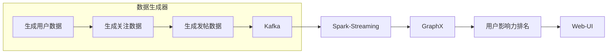

# 基于GraphX的实时社交网络数据分析

## 1. 背景介绍

### 1.1 社交网络数据分析的重要性

在当今时代,社交网络已经成为人们日常生活中不可或缺的一部分。随着社交媒体平台的不断发展,海量的社交网络数据被持续产生。这些数据蕴含着宝贵的信息,对于了解用户行为、发现潜在趋势、优化产品设计等方面具有重要意义。因此,对社交网络数据进行实时分析和挖掘,已经成为各大互联网公司和研究机构的当务之急。

### 1.2 社交网络数据的特点和挑战

社交网络数据具有以下几个主要特点:

1. **规模巨大**:随着社交媒体用户数量的不断增长,产生的数据量也在快速增长。
2. **动态变化**:用户之间的关系、内容生产和传播等都在不断变化。
3. **复杂关联**:用户之间存在着复杂的关系网络,数据之间存在着多种关联。

这些特点给社交网络数据的存储、处理和分析带来了巨大挑战。传统的关系型数据库和分析工具很难应对如此大规模、动态和复杂的数据。因此,需要采用新的技术和方法来解决这些挑战。

### 1.3 GraphX简介

Apache Spark是一个开源的大数据处理框架,它提供了GraphX作为图计算的核心组件。GraphX基于Spark的弹性分布式数据集(RDD),为图数据提供了高效的并行计算能力。它支持图的创建、转换和操作,并提供了丰富的图算法库,如PageRank、三角形计数、连通分量等。

GraphX的优势在于它能够高效地处理大规模的图数据,并且与Spark的其他组件(如Spark SQL、Spark Streaming等)无缝集成,可以构建端到端的大数据分析管道。因此,GraphX非常适合用于社交网络数据的实时分析和挖掘。

## 2. 核心概念与联系

### 2.1 图数据结构

在GraphX中,图数据结构由顶点(Vertex)和边(Edge)组成。每个顶点都有一个唯一的ID和属性值,而每条边则连接两个顶点,并可以携带属性值。GraphX使用弹性分布式属性图(Resilient Distributed Property Graph)来表示图数据,其中顶点和边都是RDD。

```scala
// 顶点
case class VertexId(id: String)
case class Vertex(id: VertexId, attr: VertexAttribute)

// 边
case class Edge(src: VertexId, dst: VertexId, attr: EdgeAttribute)
```

### 2.2 图运算

GraphX提供了丰富的图运算操作,包括:

- **结构操作**:如subgraph、mapVertices、mapEdges等,用于转换图的结构。
- **值操作**:如mapValues、join等,用于转换顶点或边的属性值。
- **聚合操作**:如aggregateMessages、foldLeft等,用于在图上进行聚合计算。

这些操作可以组合使用,构建复杂的图分析算法。

### 2.3 图算法

GraphX内置了多种经典的图算法,如:

- **PageRank**:用于计算网页或节点的重要性排名。
- **连通分量**:用于发现图中的连通子图。
- **三角形计数**:用于统计图中的三角形数量。
- **最短路径**:用于计算两个顶点之间的最短路径。

此外,GraphX还支持自定义图算法的开发和插件。

### 2.4 与Spark生态系统的集成

GraphX作为Spark的一个核心组件,可以与Spark生态系统中的其他组件无缝集成:

- **Spark SQL**:可以将图数据注册为临时视图,并使用SQL进行查询和分析。
- **Spark Streaming**:可以构建实时图分析管道,对动态变化的图数据进行流式处理。
- **MLlib**:可以将图分析结果与机器学习算法相结合,进行更深入的挖掘和预测。

这种集成能力使得GraphX成为一个强大的社交网络数据分析工具。

## 3. 核心算法原理具体操作步骤

### 3.1 图的创建和加载

GraphX支持多种方式创建和加载图数据:

1. **从集合创建**:可以从顶点和边的集合中创建图。

```scala
val vertexArray = Array((1L, ("Alice", 28)), (2L, ("Bob", 27)), (3L, ("Charlie", 65)), (4L, ("David", 42)), (6L, ("Ed", 55)))
val edgeArray = Array(Edge(2L, 1L, 7), Edge(2L, 4L, 5), Edge(3L, 2L, 4), Edge(1L, 2L, 3), Edge(5L, 3L, 8), Edge(5L, 6L, 9))

val vertices: RDD[(VertexId, Vertex)] = sc.parallelize(vertexArray.map { case (id, attr) => (id, Vertex(id.toString, attr)) })
val edges: RDD[Edge] = sc.parallelize(edgeArray)

val graph: Graph[Vertex, Edge] = Graph(vertices, edges)
```

2. **从数据源加载**:可以从各种数据源(如文本文件、HDFS、数据库等)加载顶点和边数据,然后创建图。

```scala
val vertexFile = "/path/to/vertices.txt"
val edgeFile = "/path/to/edges.txt"

val vertices: RDD[(VertexId, Vertex)] = sc.textFile(vertexFile).map { line =>
  val fields = line.split(",")
  (fields(0), Vertex(fields(0), fields(1)))
}

val edges: RDD[Edge] = sc.textFile(edgeFile).map { line =>
  val fields = line.split(",")
  Edge(fields(0), fields(1), fields(2))
}

val graph: Graph[Vertex, Edge] = Graph(vertices, edges)
```

### 3.2 图的转换和操作

GraphX提供了多种转换和操作图的方法,例如:

1. **mapVertices**:对每个顶点应用一个转换函数。

```scala
val ageGraph = graph.mapVertices((id, attr) => attr._2)
```

2. **mapEdges**:对每条边应用一个转换函数。

```scala
val weightedGraph = graph.mapEdges(e => e.attr.toDouble)
```

3. **subgraph**:提取图的一个子图。

```scala
val subGraph = graph.subgraph(vpredicate = (id, attr) => attr._2 < 30)
```

4. **aggregateMessages**:在图上进行聚合计算。

```scala
val msgCount = graph.aggregateMessages[Int](
  ctx => ctx.sendToDst(1),
  (a, b) => a + b
)
```

通过组合这些操作,可以构建复杂的图分析算法。

### 3.3 图算法示例:PageRank

PageRank是一种著名的链接分析算法,用于计算网页或节点的重要性排名。它的核心思想是:一个节点的重要性取决于指向它的节点的重要性及其数量。

在GraphX中,可以使用`staticPageRank`或`parallelPersonalizedPageRank`算法来计算PageRank值。以下是一个示例:

```scala
import org.apache.spark.graphx.lib.PageRank

val ranks = graph.staticPageRank(0.001).vertices

// 打印Top 5排名
ranks.sortBy(-_._2).take(5).foreach(println)
```

该算法的主要步骤如下:

1. 初始化每个节点的PageRank值为1/N(N为节点总数)。
2. 在每次迭代中,每个节点将自己的PageRank值平均分配给所有出边的目标节点。
3. 每个节点的新PageRank值是所有入边传递过来的PageRank值之和,再加上一个阻尼系数(damping factor)乘以1/N。
4. 重复步骤2和3,直到PageRank值收敛或达到最大迭代次数。

该算法的时间复杂度为O(I*k*M),其中I是迭代次数,k是平均出度,M是边的数量。GraphX的实现利用了Spark的并行计算能力,可以高效地处理大规模图数据。

## 4. 数学模型和公式详细讲解举例说明

PageRank算法的数学模型可以用下面的公式表示:

$$PR(u) = (1-d) + d\sum_{v\in B_u}\frac{PR(v)}{L(v)}$$

其中:

- $PR(u)$表示节点u的PageRank值
- $B_u$是指向节点u的所有节点集合
- $L(v)$是节点v的出度(指向其他节点的边数)
- $d$是一个阻尼系数(damping factor),通常取值0.85

该公式的含义是:一个节点的PageRank值由两部分组成:

1. $(1-d)$,代表随机游走到达该节点的概率。
2. $d\sum_{v\in B_u}\frac{PR(v)}{L(v)}$,代表从其他节点传递过来的PageRank值之和。

具体来说,如果一个节点v有多条出边,则v会将自身的PageRank值平均分配给所有出边的目标节点。而节点u的PageRank值就是所有入边传递过来的PageRank值之和。

为了更好地理解PageRank算法,我们用一个简单的示例来说明:

```
     +-----+
     |  B  |
     +--+--+
        | \
        |  \
        v   v
     +--+--+--+
     |  A  C  |
     +-----+--+
        |  /
        | /
        v/
     +--+--+
     |  D  |
     +-----+
```

假设初始时,每个节点的PageRank值为0.25(总共4个节点)。在第一次迭代后,各节点的PageRank值如下:

- A: $0.25 + 0.85 \times \frac{0.25}{2} = 0.3375$
- B: $0.25 + 0.85 \times 0 = 0.25$
- C: $0.25 + 0.85 \times \frac{0.25}{2} = 0.3375$
- D: $0.25 + 0.85 \times \frac{0.3375}{1} = 0.5369$

可以看到,D的PageRank值较高,因为它有一条入边来自A,而A的PageRank值较高。

通过多次迭代,PageRank值会逐渐收敛到一个稳定状态。这个稳定状态就反映了各节点的重要性排名。

## 5. 项目实践:代码实例和详细解释说明

在本节中,我们将通过一个实际的项目示例,演示如何使用GraphX对社交网络数据进行实时分析。我们将构建一个简单的社交网络应用,并使用GraphX来计算用户的影响力排名。

### 5.1 项目概述

我们的社交网络应用包括以下几个主要组件:

1. **数据生成器**:模拟用户在社交网络上的行为,生成用户、关注和发帖数据。
2. **Kafka**:用于存储和传输实时数据流。
3. **Spark Streaming**:从Kafka消费数据,并将数据转换为GraphX所需的格式。
4. **GraphX**:对图数据进行处理和分析,计算用户的影响力排名。
5. **Web UI**:展示分析结果,即用户的影响力排名。

下图展示了整个项目的架构:



### 5.2 数据生成器

我们使用Scala编写一个简单的数据生成器,模拟用户在社交网络上的行为。具体来说,它会生成以下三种类型的数据:

1. **用户数据**:包括用户ID和用户名。
2. **关注数据**:包括关注者ID和被关注者ID。
3. **发帖数据**:包括发帖者ID、发帖内容和时间戳。

这些数据将被发送到Kafka中,供后续的实时处理。

```scala
import java.util.Properties
import org.apache.kafka.clients.producer.{KafkaProducer, ProducerRecord}

object DataGenerator extends App {
  // 模拟用户数据
  val users = (1 to 1000).map(i => (i, s"user$i"))
  sendToKafka(users.map(u => new ProducerRecord[String, String]("users", u._1.toString, u._2)))

  // 模拟关注数据
  val follows = (1 to 10000).map { _ =>
    val follower = Random.nextInt(1000) + 1
    val followed = Random.nextInt(1000) + 1
    (follower, followed)
  }
  sendToKafka(follows.map(f => new