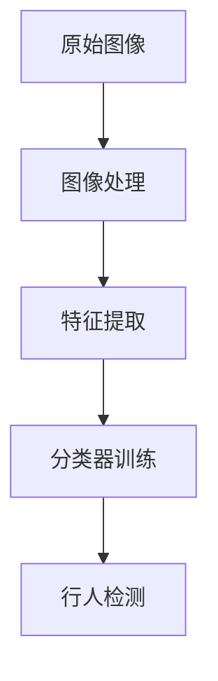

## 1.背景介绍

随着科技的发展，行人检测技术已经在许多领域得到广泛应用，如无人驾驶、视频监控、人机交互等。其中，基于计算机视觉的行人检测技术，以其强大的功能和广阔的应用前景，吸引了众多研究者的关注。本文主要介绍如何使用Opencv库来设计一个行人检测系统。

## 2.核心概念与联系

在行人检测中，我们主要涉及到的核心概念有：图像处理、特征提取和分类器训练。图像处理是指对原始图像进行一些预处理操作，如灰度化、归一化等。特征提取是从处理后的图像中提取出有用的信息，这些信息可以用来区分行人和非行人。分类器训练则是使用这些特征训练一个模型，用来判断一个图像区域是否包含行人。

这三个步骤之间的关系可以用以下的Mermaid流程图表示：



## 3.核心算法原理具体操作步骤

行人检测的主要步骤可以分为以下几个部分：

1. **图像采集**：首先，我们需要采集一些包含行人的图像，这些图像将作为我们的训练集。同时，我们还需要一些不包含行人的图像，作为负样本。

2. **图像处理**：对于采集到的图像，我们需要进行一些预处理操作，如灰度化、归一化等。这样可以减少图像的复杂性，提高后续特征提取的效率。

3. **特征提取**：从处理后的图像中提取出有用的特征。这些特征可以是颜色、纹理、形状等。在Opencv中，我们可以使用HOG（Histogram of Oriented Gradients）特征。

4. **分类器训练**：使用提取的特征，我们可以训练一个分类器。在Opencv中，我们可以使用SVM（Support Vector Machine）作为分类器。

5. **行人检测**：最后，我们可以使用训练好的分类器对新的图像进行行人检测。

## 4.数学模型和公式详细讲解举例说明

在行人检测中，我们主要使用到的数学模型是HOG特征和SVM分类器。

HOG特征是通过计算和统计图像局部区域的梯度方向直方图来构建的。其基本思想是，局部对象的表象和形状（appearance and shape）可以通过梯度或边缘的方向密度分布来描述。HOG特征的计算可以分为以下几个步骤：

1. **梯度计算**：首先，我们需要计算图像的梯度。这可以通过卷积操作实现，其中卷积核可以是Sobel算子等。梯度的大小和方向可以通过以下公式计算：

    $$
    magnitude = \sqrt{(I_x^2 + I_y^2)}
    $$

    $$
    direction = arctan(\frac{I_y}{I_x})
    $$

    其中，$I_x$和$I_y$分别是图像在x方向和y方向的梯度。

2. **直方图统计**：然后，我们需要对梯度方向进行统计，得到一个直方图。通常，我们会将0-360度分为9个bin，每个bin的大小为40度。

3. **归一化**：为了消除光照的影响，我们需要对直方图进行归一化。这可以通过以下公式实现：

    $$
    H(i) = \frac{H(i)}{\sqrt{\sum_{j=0}^{N-1}H(j)^2 + \epsilon}}
    $$

    其中，$H(i)$是直方图的第i个bin，N是bin的总数，$\epsilon$是一个很小的常数，用来防止分母为0。

SVM分类器是一种二分类模型，其基本思想是在特征空间中找到一个超平面，使得正负样本间的间隔最大。其数学模型可以表示为：

$$
min \frac{1}{2}||w||^2 + C\sum_{i=1}^{n}\xi_i
$$

$$
s.t. y_i(w^Tx_i+b) \geq 1-\xi_i, \xi_i \geq 0
$$

其中，$w$是超平面的法向量，$b$是偏置，$C$是惩罚系数，$\xi_i$是松弛变量，$x_i$和$y_i$分别是第i个样本的特征和标签。

## 5.项目实践：代码实例和详细解释说明

在Opencv中，我们可以使用HOGDescriptor类来提取HOG特征，使用ml::SVM类来训练SVM分类器。以下是一个简单的例子：

```c++
#include <opencv2/opencv.hpp>
#include <opencv2/ml/ml.hpp>

int main() {
    // 创建HOGDescriptor对象
    cv::HOGDescriptor hog(cv::Size(64, 128), cv::Size(16, 16), cv::Size(8, 8), cv::Size(8, 8), 9);

    // 创建SVM对象
    cv::Ptr<cv::ml::SVM> svm = cv::ml::SVM::create();
    svm->setType(cv::ml::SVM::C_SVC);
    svm->setKernel(cv::ml::SVM::LINEAR);
    svm->setC(0.01);

    // 加载图像
    cv::Mat img = cv::imread("person.jpg", cv::IMREAD_GRAYSCALE);
    if(img.empty()) {
        std::cout << "Could not open or find the image" << std::endl;
        return -1;
    }

    // 计算HOG特征
    std::vector<float> descriptors;
    hog.compute(img, descriptors);

    // 训练SVM分类器
    cv::Mat trainData = cv::Mat(descriptors).reshape(1, 1);
    cv::Mat labels = cv::Mat::ones(1, 1, CV_32S);
    svm->train(trainData, cv::ml::ROW_SAMPLE, labels);

    // 使用训练好的分类器进行行人检测
    cv::Mat testImg = cv::imread("test.jpg", cv::IMREAD_GRAYSCALE);
    if(testImg.empty()) {
        std::cout << "Could not open or find the image" << std::endl;
        return -1;
    }
    std::vector<float> testDescriptors;
    hog.compute(testImg, testDescriptors);
    cv::Mat testData = cv::Mat(testDescriptors).reshape(1, 1);
    float response = svm->predict(testData);

    std::cout << "The response of the classifier is " << response << std::endl;

    return 0;
}
```

这段代码首先创建了一个HOGDescriptor对象和一个SVM对象，然后加载了一张图像，并计算了其HOG特征。接着，使用这些特征和标签训练了SVM分类器。最后，加载了一张测试图像，计算了其HOG特征，并使用训练好的分类器对其进行了预测。

## 6.实际应用场景

基于Opencv的行人检测系统可以应用在许多领域，如无人驾驶、视频监控、人机交互等。在无人驾驶中，行人检测是非常重要的一部分，可以帮助无人车辆避免撞到行人。在视频监控中，行人检测可以用来统计人流量，或者检测异常行为。在人机交互中，行人检测可以用来实现人体追踪，提高交互的自然性。

## 7.工具和资源推荐

以下是一些推荐的工具和资源：

- **Opencv**：一个开源的计算机视觉库，提供了许多图像处理和机器学习的功能。

- **HOG+SVM tutorial**：Opencv官方提供的一个HOG+SVM的教程，详细介绍了如何使用Opencv进行行人检测。

- **INRIA Person Dataset**：一个常用的行人检测数据集，包含了许多正负样本。

## 8.总结：未来发展趋势与挑战

虽然基于Opencv的行人检测系统已经能够在一定程度上满足我们的需求，但是仍然存在一些挑战和未来的发展趋势。

首先，行人检测的准确率仍然有待提高。尽管HOG+SVM的方法在一些场景下表现良好，但在复杂的环境中，其性能可能会下降。因此，如何提高行人检测的准确率，是一个重要的研究方向。

其次，行人检测的实时性也是一个重要的问题。在无人驾驶等应用中，我们需要在短时间内对行人进行检测，这对计算性能提出了高要求。因此，如何提高行人检测的速度，也是一个重要的研究方向。

最后，随着深度学习的发展，使用深度神经网络进行行人检测已经成为一个热门的研究方向。相比于传统的方法，深度学习可以学习到更复杂的特征，从而提高行人检测的性能。然而，深度学习需要大量的标注数据和计算资源，如何解决这些问题，也是一个重要的研究方向。

## 9.附录：常见问题与解答

**Q: 为什么选择HOG特征和SVM分类器？**

A: HOG特征可以提供关于物体形状的有用信息，而SVM分类器则是一个强大的二分类器。在许多文献中，HOG+SVM的组合已经被证明在行人检测任务中表现良好。

**Q: 如何选择SVM的参数？**

A: SVM的参数，如惩罚系数C和核函数，可以通过交叉验证来选择。具体来说，我们可以在训练集上进行多轮训练和验证，每轮使用不同的参数，然后选择在验证集上表现最好的参数。

**Q: 如何提高行人检测的速度？**

A: 提高行人检测的速度可以从以下几个方面入手：优化算法、使用更快的硬件、降低图像的分辨率等。在Opencv中，我们还可以使用HOGDescriptor::detectMultiScale方法，通过设置scale参数来控制检测的速度和准确率。

**Q: 如何处理遮挡和变形问题？**

A: 遮挡和变形是行人检测中的常见问题。对于遮挡问题，我们可以通过增加训练样本的多样性来解决，例如，可以在训练集中加入一些被遮挡的行人图像。对于变形问题，我们可以使用多尺度检测，即在不同的尺度上对图像进行检测。

作者：禅与计算机程序设计艺术 / Zen and the Art of Computer Programming