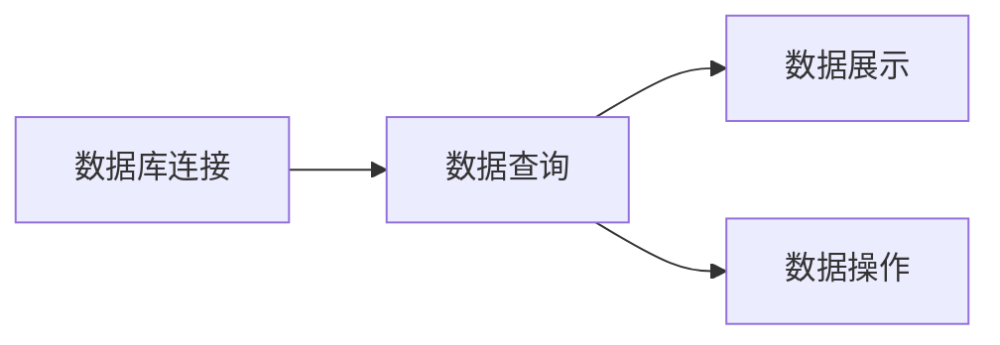

## 1.背景介绍

在现代的信息化社会，数据库已经成为了我们生活中不可或缺的一部分。无论是购物网站、社交媒体，还是企业的内部管理系统，都离不开数据库的支持。然而，如何有效地管理和使用这些数据库，却成为了一个挑战。传统的数据库管理工具，如SQL Server Management Studio，虽然功能强大，但使用起来却不够便捷。而且，由于其基于桌面应用的特性，使得在多设备、多地点的使用场景下，其便利性大打折扣。因此，基于Web的数据库浏览器，就显得尤为重要。

## 2.核心概念与联系

基于Web的数据库浏览器，是一种通过Web界面，实现对数据库进行查看、操作的工具。它的核心概念包括数据库连接、数据查询、数据展示和数据操作等。

- 数据库连接：通过网络，建立与数据库的连接，这是所有操作的基础。
- 数据查询：通过SQL语句，查询数据库中的数据。
- 数据展示：将查询到的数据，以表格或图形的方式，展示在Web界面上。
- 数据操作：包括增加、删除、修改等操作，实现对数据库的管理。

这些概念之间的联系，可以通过以下的Mermaid流程图进行展示：



## 3.核心算法原理具体操作步骤

基于Web的数据库浏览器的核心算法，主要包括数据库连接、数据查询和数据操作等步骤。

1. 数据库连接：通过网络，建立与数据库的连接。这通常通过JDBC（Java Database Connectivity）或者其他数据库连接工具实现。连接的参数包括数据库的地址、端口、数据库名、用户名和密码等。

2. 数据查询：用户在Web界面上输入SQL语句，然后通过服务器，将SQL语句发送到数据库，进行数据查询。查询的结果，会返回到服务器，然后展示在Web界面上。

3. 数据操作：用户可以在Web界面上，进行数据的增加、删除、修改等操作。这些操作，也是通过SQL语句实现的。

## 4.数学模型和公式详细讲解举例说明

在基于Web的数据库浏览器中，我们使用的数学模型主要是关系模型。关系模型是由E.F.Codd在1970年提出的，它使用集合代数和谓词逻辑两种数学工具描述数据和数据关系。在关系模型中，数据被组织成一系列的二维表，即关系。

关系可以用一个二元组$R=(U,R)$来描述，其中$U$是属性的集合，$R$是$U$上的关系，即$R\subseteq U_1\times U_2\times ...\times U_n$。这里，$U_i$是第$i$个属性的取值范围，也叫做域。

例如，我们有一个学生关系，其属性包括学号、姓名和年龄。则可以表示为：

```
学生(学号, 姓名, 年龄)
```

## 5.项目实践：代码实例和详细解释说明

下面，我们通过一个简单的项目实践，来演示如何实现一个基于Web的数据库浏览器。

首先，我们需要建立与数据库的连接。这里，我们使用Java的JDBC进行连接。

```java
// 加载数据库驱动
Class.forName("com.mysql.jdbc.Driver");

// 创建数据库连接
String url = "jdbc:mysql://localhost:3306/test";
String username = "root";
String password = "root";
Connection conn = DriverManager.getConnection(url, username, password);
```

然后，我们可以通过SQL语句，查询数据库中的数据。

```java
// 创建Statement对象
Statement stmt = conn.createStatement();

// 执行SQL语句
String sql = "SELECT * FROM students";
ResultSet rs = stmt.executeQuery(sql);

// 处理查询结果
while (rs.next()) {
  String id = rs.getString("id");
  String name = rs.getString("name");
  String age = rs.getString("age");
  System.out.println("id: " + id + ", name: " + name + ", age: " + age);
}
```

最后，我们可以通过Web界面，展示查询到的数据。

## 6.实际应用场景

基于Web的数据库浏览器，在实际的应用场景中，有着广泛的应用。例如：

- 企业内部：企业的员工，可以通过Web界面，查看和管理企业的内部数据，如员工信息、产品信息等。
- 电商网站：电商网站的管理员，可以通过Web界面，查看和管理商品信息、用户信息等。
- 教育机构：教育机构的教师，可以通过Web界面，查看和管理学生信息、课程信息等。

## 7.工具和资源推荐

在实现基于Web的数据库浏览器时，有一些工具和资源，可以帮助我们更好地完成工作。

- 数据库：MySQL、Oracle、SQL Server等。
- 服务器：Tomcat、Jetty、Jboss等。
- 开发工具：Eclipse、IntelliJ IDEA等。
- 开发语言：Java、Python、PHP等。

## 8.总结：未来发展趋势与挑战

随着云计算、大数据等技术的发展，我们的数据量正在以前所未有的速度增长。因此，我们需要更好的工具，来帮助我们管理和使用这些数据。基于Web的数据库浏览器，就是其中的一个重要工具。然而，随着数据量的增长，如何保证数据库浏览器的性能和稳定性，将是我们面临的一个重要挑战。

## 9.附录：常见问题与解答

1. Q: 如何解决数据库连接失败的问题？
   A: 首先，检查你的数据库地址、端口、数据库名、用户名和密码是否正确。其次，检查你的数据库是否已经启动，以及网络是否正常。

2. Q: 如何提高数据查询的效率？
   A: 你可以通过优化SQL语句，以及使用索引等方法，来提高数据查询的效率。

3. Q: 如何保证数据操作的安全性？
   A: 你可以通过使用事务，以及设置合适的权限，来保证数据操作的安全性。

作者：禅与计算机程序设计艺术 / Zen and the Art of Computer Programming