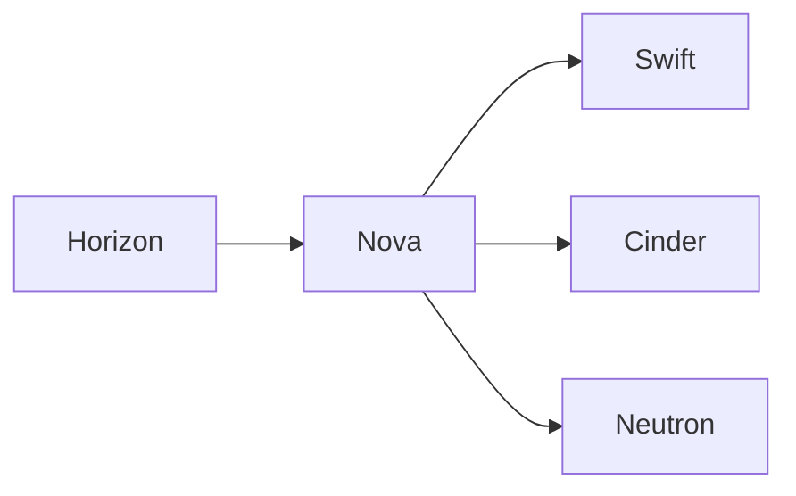

## 1.背景介绍

随着云计算技术的日益成熟，越来越多的企业开始将业务部署在云端，享受云计算带来的便捷性和高效性。OpenStack作为一个开源的云计算管理平台，提供了一套完整的云服务解决方案，包括计算、存储和网络等多个方面。本文将对基于OpenStack的云服务平台进行深入的探讨和分析。

## 2.核心概念与联系

OpenStack是一个开源的云计算管理平台项目，包含多个互相关联的项目组件，用于设置和管理大型网络中的虚拟机和其他实例。它主要由以下几个核心组件构成：

- Nova：负责计算，提供虚拟机实例。
- Swift：负责对象存储。
- Cinder：负责块存储。
- Neutron：负责网络，为虚拟机实例提供网络连接。
- Horizon：提供了一个Web-based的用户界面。

这些组件之间的关系如下所示：



## 3.核心算法原理具体操作步骤

OpenStack的运行主要依赖于其核心算法。例如，Nova组件中的调度器使用过滤和权重两种类型的算法来决定在哪个主机上创建新的虚拟机实例。过滤器算法首先基于一组规则（如主机的可用性、负载、硬件规格等）过滤出候选主机列表，然后权重算法根据另一组规则（如随机、负载均衡等）从候选列表中选择最优主机。

## 4.数学模型和公式详细讲解举例说明

在OpenStack的核心算法中，权重算法是一个重要的部分。权重算法的目标是根据特定的规则从候选主机列表中选择最优主机。这可以通过以下数学模型来描述：

设$H = {h_1, h_2, ..., h_n}$为候选主机列表，$W = {w_1, w_2, ..., w_n}$为对应的权重列表，权重算法的目标是找到$w_i$最大的$h_i$。

## 5.项目实践：代码实例和详细解释说明

以下是一个简单的OpenStack Nova调度器的Python代码示例。这个示例展示了如何使用过滤器和权重算法选择主机：

```python
class Scheduler(object):
    def select_host(self, hosts, filter_func, weight_func):
        # 使用过滤器算法过滤主机
        filtered_hosts = [host for host in hosts if filter_func(host)]
        # 使用权重算法选择主机
        weighted_hosts = [(host, weight_func(host)) for host in filtered_hosts]
        host, weight = max(weighted_hosts, key=lambda x: x[1])
        return host
```

## 6.实际应用场景

OpenStack被广泛应用于各种场景，包括公有云、私有云、混合云、多云等。例如，许多知名的云服务提供商如IBM、HP和Rackspace等都使用OpenStack作为其云服务的基础架构。

## 7.工具和资源推荐

对于想要深入了解和使用OpenStack的读者，以下是一些推荐的工具和资源：

- OpenStack官方文档：提供了详细的OpenStack各个组件的使用指南和API文档。
- DevStack：一个用于OpenStack开发和测试的工具，可以在单机上部署完整的OpenStack环境。
- OpenStack客户端：提供了一套命令行工具，用于管理OpenStack资源。

## 8.总结：未来发展趋势与挑战

随着云计算的发展，OpenStack的未来充满了挑战和机遇。一方面，OpenStack需要不断提升其稳定性、性能和易用性，以满足日益增长的用户需求。另一方面，OpenStack也需要不断创新，以适应云计算的新趋势，如容器化、无服务器计算等。

## 9.附录：常见问题与解答

1.问题：OpenStack适用于哪些场景？

答：OpenStack适用于各种云计算场景，包括公有云、私有云、混合云、多云等。

2.问题：如何学习OpenStack？

答：推荐阅读OpenStack官方文档，使用DevStack进行实践，通过OpenStack客户端熟悉各个组件的使用。

作者：禅与计算机程序设计艺术 / Zen and the Art of Computer Programming