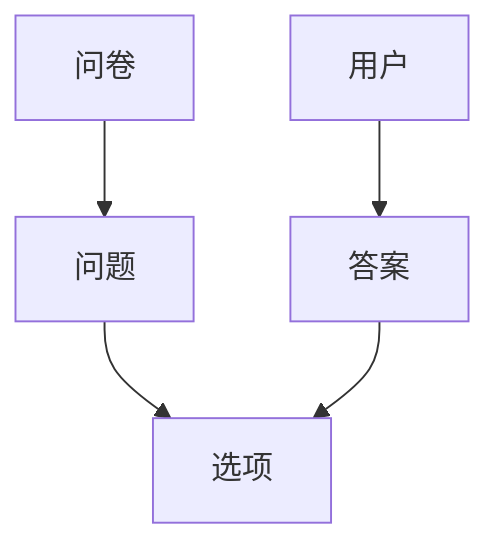

## 1.背景介绍

在现代社会，随着互联网的普及和发展，问卷调查已经成为一种重要的数据收集方式。而在软件开发领域，基于Spring Boot的问卷调查系统则因其简洁、高效的特性，逐渐受到了企业和开发者的青睐。

## 2.核心概念与联系

Spring Boot是一个基于Spring框架的开源Java项目，它的目标是简化Spring应用的初始搭建以及开发过程。在我们的问卷调查系统中，Spring Boot主要用于搭建后端服务，处理问卷的生成、分发和数据收集等功能。

在此基础上，我们还需要理解问卷调查系统的核心概念，包括问卷、问题、选项、答案等，以及它们之间的关系。例如，一个问卷由多个问题构成，每个问题有多个选项，用户的答案是对问题的选项的选择。



## 3.核心算法原理具体操作步骤

问卷调查系统的核心功能包括问卷的创建、发布、填写和结果收集。下面我们将详细介绍这些功能的实现步骤。

### 3.1 问卷创建

问卷创建主要包括问卷信息的录入、问题的添加和选项的设置。在我们的系统中，我们会设计一个问卷创建的接口，接收前端发送的问卷信息，包括问卷标题、描述、问题列表等，然后将这些信息保存到数据库中。

### 3.2 问卷发布

问卷发布是指将创建好的问卷发送给用户填写。在我们的系统中，我们会设计一个问卷发布的接口，接收前端发送的问卷ID和用户列表，然后将问卷信息发送给这些用户。

### 3.3 问卷填写

问卷填写是用户对问卷进行回答的过程。在我们的系统中，我们会设计一个问卷填写的接口，接收前端发送的用户ID、问卷ID和答案列表，然后将这些答案保存到数据库中。

### 3.4 结果收集

结果收集是指将用户填写的问卷答案进行汇总和分析。在我们的系统中，我们会设计一个结果收集的接口，接收前端发送的问卷ID，然后从数据库中查询出该问卷的所有答案，进行数据分析，并返回分析结果。

## 4.数学模型和公式详细讲解举例说明

在问卷调查系统中，我们通常会使用一些数学模型和公式进行数据分析。例如，我们可能会计算每个选项的选择率，或者计算某个问题的平均得分。

选择率的计算公式为：

$$
选择率 = \frac{选择该选项的人数}{总人数}
$$

平均得分的计算公式为：

$$
平均得分 = \frac{总得分}{总人数}
$$

其中，总得分是所有选择该选项的人的得分之和，总人数是参与问卷调查的人数。

## 5.项目实践：代码实例和详细解释说明

下面我们以问卷创建的接口为例，介绍一下具体的代码实现。

首先，我们需要定义一个Questionnaire类，用于表示一个问卷。

```java
public class Questionnaire {
    private String title;
    private String description;
    private List<Question> questions;
    // 省略getter和setter方法
}
```

然后，我们在QuestionnaireController类中定义一个创建问卷的接口。

```java
@RestController
@RequestMapping("/questionnaires")
public class QuestionnaireController {
    @Autowired
    private QuestionnaireService questionnaireService;

    @PostMapping
    public ResponseEntity<Questionnaire> create(@RequestBody Questionnaire questionnaire) {
        Questionnaire createdQuestionnaire = questionnaireService.create(questionnaire);
        return ResponseEntity.status(HttpStatus.CREATED).body(createdQuestionnaire);
    }
}
```

在这个接口中，我们接收前端发送的问卷信息，调用QuestionnaireService的create方法将问卷信息保存到数据库中，然后返回创建好的问卷。

## 6.实际应用场景

基于Spring Boot的问卷调查系统可以广泛应用于各种场景，包括但不限于：

- 市场调研：企业可以通过问卷调查系统收集消费者的需求和反馈，以便更好地优化产品和服务。
- 教育评估：学校可以通过问卷调查系统收集学生、家长和教师的意见和建议，以便更好地改进教育教学。
- 社会研究：研究机构可以通过问卷调查系统收集各种社会数据，以便进行各种社会研究。

## 7.工具和资源推荐

在开发基于Spring Boot的问卷调查系统时，以下工具和资源可能会对你有所帮助：

- Spring Boot官方网站：提供了详细的文档和教程，是学习Spring Boot的最好资源。
- IntelliJ IDEA：一款强大的Java开发IDE，对Spring Boot有很好的支持。
- Postman：一款API测试工具，可以用来测试你的问卷调查系统的接口。
- MySQL：一款开源的关系型数据库，可以用来存储你的问卷数据。

## 8.总结：未来发展趋势与挑战

随着互联网的发展，问卷调查系统的需求将会越来越大。而基于Spring Boot的问卷调查系统，因其简洁、高效的特性，有很大的发展潜力。

然而，随着数据量的增加，如何处理大规模的问卷数据，如何保证系统的稳定性和可用性，如何保护用户的隐私，都将是我们面临的挑战。

## 9.附录：常见问题与解答

1. Q: 如何处理大规模的问卷数据？
   A: 我们可以使用分布式数据库来存储大规模的问卷数据，同时使用分布式计算框架如Hadoop、Spark等来处理这些数据。

2. Q: 如何保证系统的稳定性和可用性？
   A: 我们可以使用微服务架构来提高系统的稳定性和可用性，当某个服务出现问题时，不会影响到其他服务。

3. Q: 如何保护用户的隐私？
   A: 我们可以对用户的敏感信息进行加密存储，同时在收集和处理数据时，遵守相关的隐私保护法规。

作者：禅与计算机程序设计艺术 / Zen and the Art of Computer Programming