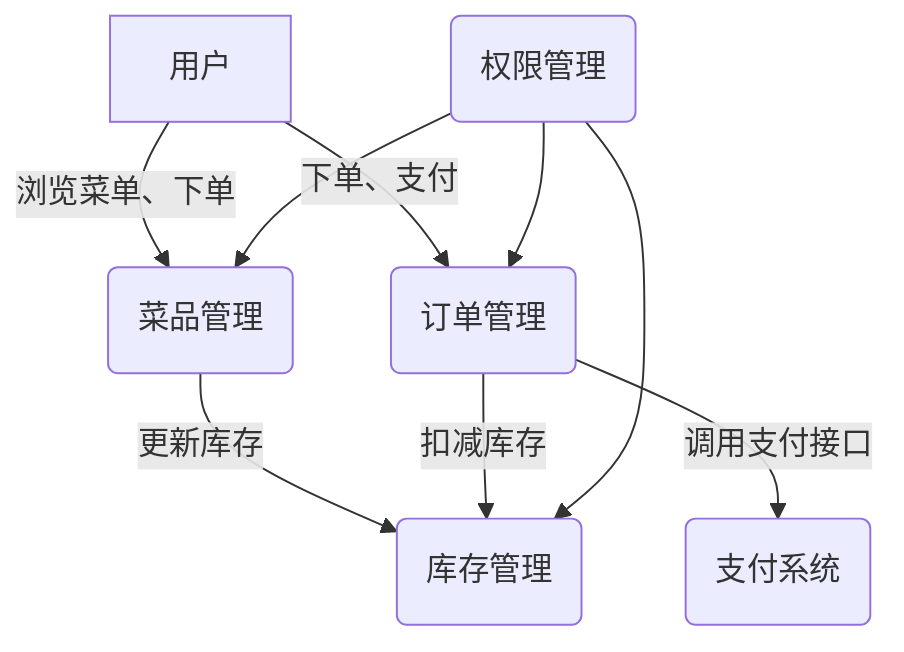
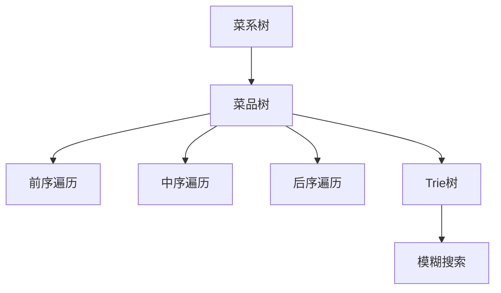
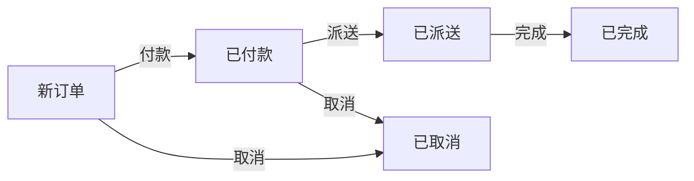
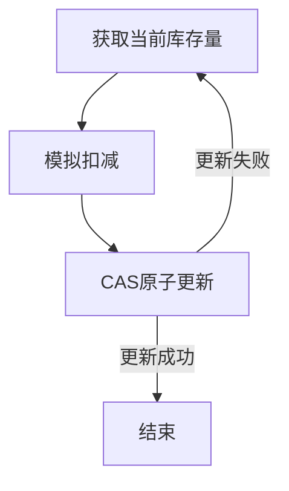
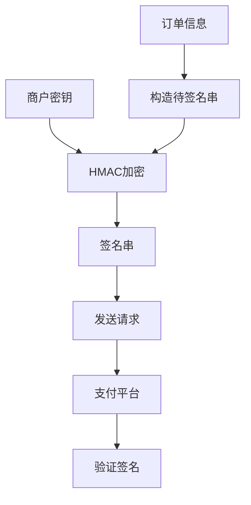
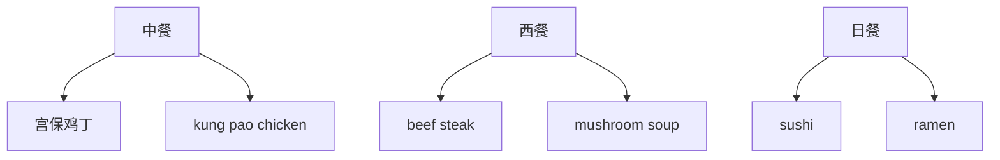

# 基于SSM的在线点餐系统

## 1.背景介绍

随着互联网和移动技术的快速发展,在线点餐系统逐渐成为餐饮行业的一种新兴服务模式。传统的线下点餐方式存在着效率低下、人工成本高、数据难以管理等诸多问题。而在线点餐系统则可以有效解决这些痛点,为餐厅和消费者带来更加便捷、高效的用餐体验。

基于SSM(Spring、SpringMVC、MyBatis)框架的在线点餐系统是一种常见的Web应用程序,它将菜品信息、订单管理、在线支付等功能集成到一个统一的平台上。用户可以通过手机APP或网页在线浏览菜单、下单点餐、付款结账,而餐厅则可以高效处理订单、管理菜品库存等。该系统的核心价值在于提升餐厅运营效率,优化用户体验,并为餐饮企业实现数字化转型奠定基础。

## 2.核心概念与联系

在线点餐系统涉及以下几个核心概念:

1. **菜品管理** 包括菜品信息的录入、修改、删除等操作,确保菜单信息的准确性和实时性。

2. **订单管理** 处理用户下单、支付、订单状态跟踪等流程,保证订单高效流转。

3. **库存管理** 实时监控菜品库存量,自动更新库存,避免菜品售罄。

4. **支付系统** 对接第三方支付平台,为用户提供安全、便捷的在线支付体验。

5. **权限管理** 对不同角色的用户进行权限划分,保证系统数据安全。

这些核心概念相互关联、相互作用,共同构建了在线点餐系统的完整业务流程。



## 3.核心算法原理具体操作步骤

### 3.1 菜品管理算法

菜品管理模块的核心算法是基于树形结构的多级分类算法,用于实现菜品的分类展示和检索。算法步骤如下:

1. 构建菜系树:将所有菜系根据层级关系组织成树形结构。

2. 构建菜品树:将每个菜品与其所属菜系建立父子关系,形成菜品树。

3. 树形遍历:通过前序、中序或后序遍历算法,实现菜品树的展示。

4. 模糊搜索:基于菜品名称的前缀树(Trie树)算法,实现菜品的模糊搜索功能。



### 3.2 订单管理算法

订单管理模块的核心算法是基于有限状态机的订单状态转换算法,用于追踪和管理订单的生命周期。算法步骤如下:

1. 定义订单状态:新订单、已付款、已派送、已完成、已取消等。

2. 定义状态转换规则:订单状态之间的合法转换路径。

3. 事件触发:用户操作(下单、付款、取消等)作为事件源,触发状态转换。

4. 状态持久化:将订单当前状态持久化存储,用于状态恢复和跟踪。



### 3.3 库存管理算法

库存管理模块的核心算法是基于乐观锁的库存扣减算法,用于保证并发场景下的库存数据一致性。算法步骤如下:

1. 获取当前库存量。

2. 模拟扣减操作,得到期望库存量。

3. 基于当前库存量和版本号,使用CAS原子操作更新库存。

4. 若更新失败,则重试该过程。

该算法利用CAS操作的原子性,避免了传统的悲观锁导致的性能损失。



### 3.4 支付系统算法

支付系统模块的核心算法是基于HMAC的支付签名算法,用于保证支付信息的完整性和不可篡改性。算法步骤如下:

1. 构造待签名串:将订单信息、支付金额等字段按规范拼接成字符串。

2. 计算HMAC:使用商户密钥对待签名串进行HMAC加密,得到签名串。

3. 发送请求:将签名串与其他数据一并发送给支付平台。

4. 支付平台验证:支付平台使用同样算法验证签名是否匹配,防止篡改。



## 4.数学模型和公式详细讲解举例说明

### 4.1 菜品分类树

菜品分类树是一种树形结构,用于组织和展示菜品的分类关系。它可以用如下数学模型表示:

设有 $n$ 个菜品,分属于 $m$ 个菜系,则菜品分类树可表示为:

$$
T = (V, E)
$$

其中 $V$ 为节点集合,包含所有菜系和菜品节点:

$$
V = \{v_1, v_2, \ldots, v_{m+n}\}
$$

$E$ 为边集合,表示菜品与菜系之间的父子关系:

$$
E = \{(v_i, v_j) | v_i \text{ 是 } v_j \text{ 的父节点}\}
$$

例如,假设有 3 个菜系(中餐、西餐、日餐),每个菜系下分别有 2 个菜品,则树形结构如下:



通过这种树形结构,可以高效地实现菜品的分类展示、检索和管理。

### 4.2 Trie树

Trie树(前缀树)是一种高效的文本检索数据结构,在菜品模糊搜索功能中发挥重要作用。Trie树的数学模型如下:

设有一个字符串集合 $S = \{s_1, s_2, \ldots, s_n\}$,其中每个字符串 $s_i$ 由若干个字符组成:

$$
s_i = c_{i1} c_{i2} \ldots c_{im_i}
$$

则对应的 Trie 树 $T$ 由节点集合 $V$ 和边集合 $E$ 组成:

$$
T = (V, E)
$$

其中,每个节点 $v \in V$ 表示一个字符,边 $(u, v) \in E$ 表示从节点 $u$ 转移到节点 $v$ 对应着一个字符。特别地,根节点代表空字符串。

例如,对于字符串集合 $\{"apple", "banana", "pear"\}$,其对应的 Trie 树如下:

```mermaid
graph TD
    A((root)) --> B[a]
    B --> C[p]
    C --> D[p]
    D --> E[l]
    E --> F[""]
    B --> G[n]
    G --> H[a]
    H --> I[n]
    I --> J[a]
    J --> K[""]
    A --> L[p]
    L --> M[e]
    M --> N[a]
    N --> O[r]
    O --> P[""]
```

在这个 Trie 树中,每条路径对应一个字符串。通过从根节点开始匹配字符,可以高效地检索和插入字符串,实现模糊搜索功能。

### 4.3 订单状态转换矩阵

订单状态转换可以用一个状态转换矩阵 $M$ 来表示,矩阵的每个元素 $m_{ij}$ 表示从状态 $i$ 到状态 $j$ 的转换是否合法:

$$
M = \begin{bmatrix}
    m_{11} & m_{12} & \cdots & m_{1n} \\
    m_{21} & m_{22} & \cdots & m_{2n} \\
    \vdots & \vdots & \ddots & \vdots \\
    m_{n1} & m_{n2} & \cdots & m_{nn}
\end{bmatrix}
$$

其中,如果 $m_{ij} = 1$,则表示从状态 $i$ 可以转移到状态 $j$;如果 $m_{ij} = 0$,则表示不能转移。

例如,对于一个简化的订单状态转换矩阵:

$$
M = \begin{bmatrix}
    0 & 1 & 0 & 1 \\
    0 & 0 & 1 & 0 \\
    0 & 0 & 0 & 1 \\
    0 & 0 & 0 & 0
\end{bmatrix}
$$

其中,状态 0 表示"新订单",状态 1 表示"已付款",状态 2 表示"已派送",状态 3 表示"已完成"。根据这个矩阵,我们可以得出:

- 新订单可以转移到已付款状态或已取消状态
- 已付款状态只能转移到已派送状态
- 已派送状态只能转移到已完成状态
- 已完成状态不能再转移到其他状态

通过这种数学模型,我们可以清晰地定义和管理订单的状态转换规则。

### 4.4 CAS原子操作

在库存扣减算法中,我们使用了CAS(Compare-And-Swap)原子操作来保证并发场景下的数据一致性。CAS操作的数学模型如下:

设有一个内存地址 $V$,其中存储着一个值 $A$ 和一个版本号 $E$。CAS操作接受三个参数:内存地址 $V$、期望值 $B$ 和新值 $C$,执行过程如下:

1. 比较内存地址 $V$ 的当前值 $A$ 是否等于期望值 $B$
2. 如果相等,则将内存地址 $V$ 的值更新为新值 $C$,并将版本号加 1
3. 如果不相等,则不进行任何操作

用数学语言表示,CAS操作可以写为:

$$
\text{CAS}(V, B, C) = \begin{cases}
    (C, E+1) & \text{if } A = B \\
    (A, E) & \text{if } A \neq B
\end{cases}
$$

其中,$(A, E)$ 表示内存地址 $V$ 中的值和版本号。

在库存扣减算法中,我们将库存量视为内存地址 $V$ 中的值 $A$,期望库存量作为期望值 $B$,扣减后的库存量作为新值 $C$。通过CAS操作的原子性,可以确保多个线程同时扣减库存时,数据的一致性得到保证。

### 4.5 HMAC签名算法

HMAC(Hash-based Message Authentication Code)是一种基于密钥的消息认证码算法,在支付签名中发挥重要作用。HMAC算法的数学模型如下:

设有一条消息 $M$,密钥为 $K$,哈希函数为 $H$,则 HMAC 的计算过程为:

1. 构造内部密钥 $K_i = K \oplus \text{ipad}$,其中 $\text{ipad}$ 是一个常量
2. 构造外部密钥 $K_o = K \oplus \text{opad}$,其中 $\text{opad}$ 是另一个常量
3. 计算 $H_1 = H(K_i \| M)$,其中 $\|$ 表示串联操作
4. 计