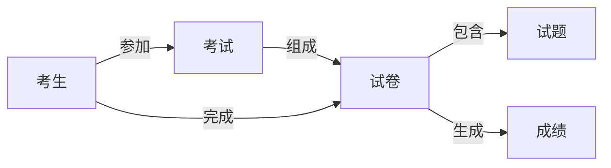
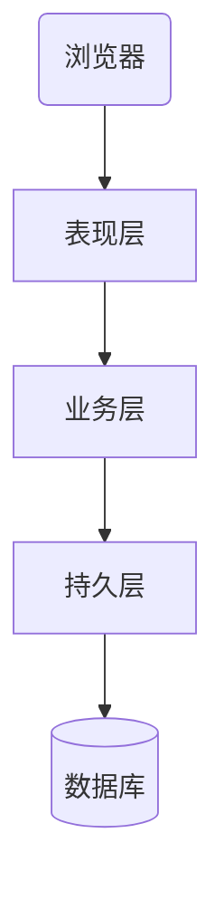

# 基于SSM的在线考试系统

## 1. 背景介绍

### 1.1 在线考试系统的发展历程

在互联网技术飞速发展的今天,传统的考试模式已经无法满足现代化教育的需求。在线考试系统应运而生,它利用互联网技术,突破了时间和空间的限制,为广大考生提供了便捷高效的考试服务。

### 1.2 在线考试系统的优势

与传统考试相比,在线考试系统具有诸多优势:

- 节省成本:无需打印试卷,减少人力物力投入
- 自动阅卷:系统可自动判分,避免人工评分的主观性
- 数据分析:可对考试数据进行统计分析,为教学改进提供依据  
- 便捷高效:考生可随时随地参加考试,节省时间精力

### 1.3 SSM框架简介

SSM框架是Java Web开发中的经典组合,包括:

- Spring:提供IOC和AOP等基础功能
- SpringMVC:基于MVC模式的Web框架
- MyBatis:优秀的持久层框架

SSM框架技术成熟稳定,社区活跃,是构建在线考试系统的理想选择。

## 2. 核心概念与关联

在线考试系统涉及的核心概念包括:

- 考生:参加考试的用户
- 试卷:由一系列试题组成
- 试题:考察知识点的最小单位,分为单选、多选、判断、填空等类型
- 成绩:考生完成试卷后的得分情况

这些概念之间的关系如下:



## 3. 系统架构与核心算法

### 3.1 系统架构

基于SSM的在线考试系统采用经典的三层架构:



- 表现层:使用SpringMVC实现,负责接收请求,返回响应
- 业务层:使用Spring管理服务,处理业务逻辑
- 持久层:使用MyBatis操作数据库,执行CRUD

### 3.2 试卷生成算法

在线考试系统的核心是试卷的自动生成。可采用如下算法:

1. 根据考试科目,确定考察的知识点
2. 每个知识点按照不同题型,抽取一定数量的试题
3. 将抽取的试题进行随机排序,生成试卷

伪代码如下:

```
function generatePaper(subject, knowledgePoints, questionTypes, questionCount)
    paper = []
    for each point in knowledgePoints
        for each type in questionTypes
            questions = randomSelect(point, type, questionCount)
            paper.addAll(questions)
        end for
    end for
    return shuffle(paper)
end function
```

### 3.3 自动阅卷算法

考生提交试卷后,系统需要自动对客观题进行判分。基本步骤如下:

1. 获取考生答案和标准答案
2. 遍历每道题,比对考生答案和标准答案
3. 若一致,得分累加
4. 最后计算总分

核心代码:

```java
public int autoGrade(String[] userAnswers, String[] standardAnswers) {
    int totalScore = 0;
    for (int i = 0; i < userAnswers.length; i++) {
        if (userAnswers[i].equals(standardAnswers[i])) {
            totalScore += questionScores[i];
        }
    }
    return totalScore;
}
```

## 4. 数学建模与公式推导

### 4.1 知识点覆盖模型

为保证试卷质量,需对知识点覆盖进行建模。假设知识点权重向量为$\mathbf{w}$,试卷对知识点的覆盖向量为$\mathbf{c}$,则覆盖度$C$可表示为:

$$C = \mathbf{w} \cdot \mathbf{c}$$

其中,$\mathbf{w} = (w_1, w_2, \ldots, w_n)$,$\mathbf{c} = (c_1, c_2, \ldots, c_n)$。$c_i$表示第$i$个知识点在试卷中出现的次数。

### 4.2 试题难度分布模型

试题难度分布也是评价试卷质量的重要指标。可用正态分布$N(\mu, \sigma^2)$建模,其概率密度函数为:

$$f(x) = \frac{1}{\sqrt{2\pi}\sigma}\exp\left(-\frac{(x-\mu)^2}{2\sigma^2}\right)$$

其中,$\mu$为难度均值,$\sigma$为难度标准差。难度分布的合理性可用均值和标准差来衡量。

## 5. 项目实践

### 5.1 数据库设计

在线考试系统的核心数据表包括:

- 考生表(user):存储考生信息
- 试卷表(paper):存储试卷信息
- 试题表(question):存储试题信息
- 成绩表(score):存储考试成绩

### 5.2 Spring配置

使用Spring的IOC和AOP特性,可大大简化系统开发。如注册用户服务:

```xml
<bean id="userService" class="com.exam.service.impl.UserServiceImpl">
    <property name="userDao" ref="userDao"/>
</bean>
```

### 5.3 SpringMVC控制器

控制器负责处理请求,调用服务。如用户登录:

```java
@Controller
@RequestMapping("/user")
public class UserController {
    
    @Autowired
    private UserService userService;
    
    @PostMapping("/login")
    public String login(String username, String password) {
        if (userService.login(username, password)) {
            return "redirect:/exam/list";
        } else {
            return "error";
        }
    }
}
```

### 5.4 MyBatis映射器

映射器定义了数据库操作。如根据ID查询用户:

```xml
<select id="selectById" resultType="User">
    select * from user where id = #{id}
</select>
```

## 6. 应用场景

在线考试系统可应用于多种场景:

- 学校教育:如单元测试、期末考试等
- 职业考试:如会计从业资格考试、教师资格证考试等
- 企业招聘:如笔试环节
- 技能认证:如软考、PMP等

## 7. 工具与资源

- IDEA:Java开发利器
- Maven:项目构建和依赖管理
- MySQL:关系型数据库
- Git:版本控制工具
- Jenkins:自动化部署工具

## 8. 总结与展望

### 8.1 SSM的优势

SSM框架成熟稳定,特点鲜明:

- Spring:解耦合,简化开发
- SpringMVC:清晰的MVC结构,灵活的配置
- MyBatis:优雅的SQL映射,动态SQL支持

### 8.2 在线考试系统的发展方向

未来,在线考试系统向智能化、个性化方向发展:

- 智能组卷:利用人工智能技术,自动生成高质量试卷
- 个性化考试:根据考生特点,提供个性化的考试内容
- 数据挖掘:对考试数据进行深度分析,挖掘隐藏规律

### 8.3 挑战与机遇

在线考试系统仍面临一些挑战:

- 安全性:如何防止作弊,保障考试公平
- 用户体验:如何提供友好便捷的考试界面
- 海量并发:如何支撑百万级考生同时在线

同时,在线考试系统也孕育着巨大的机遇:

- 教育创新:促进教育模式的变革,提高教学质量
- 产业升级:推动在线教育产业发展,创造新的经济增长点

## 9. 附录:常见问题解答

### 9.1 如何保证在线考试不作弊?

可采取以下措施:

- 随机抽题组卷,避免提前泄题
- 限制考试时长,防止查找答案
- 监控考生行为,发现异常及时处理

### 9.2 多场考试如何复用试题?

试题复用可参考以下流程:

1. 建立试题库,题目带有属性标签
2. 每场考试根据需求设置知识点、难度等属性  
3. 系统根据属性组合,自动选题组卷
4. 人工审核试卷,确保题目无重复

作者：禅与计算机程序设计艺术 / Zen and the Art of Computer Programming