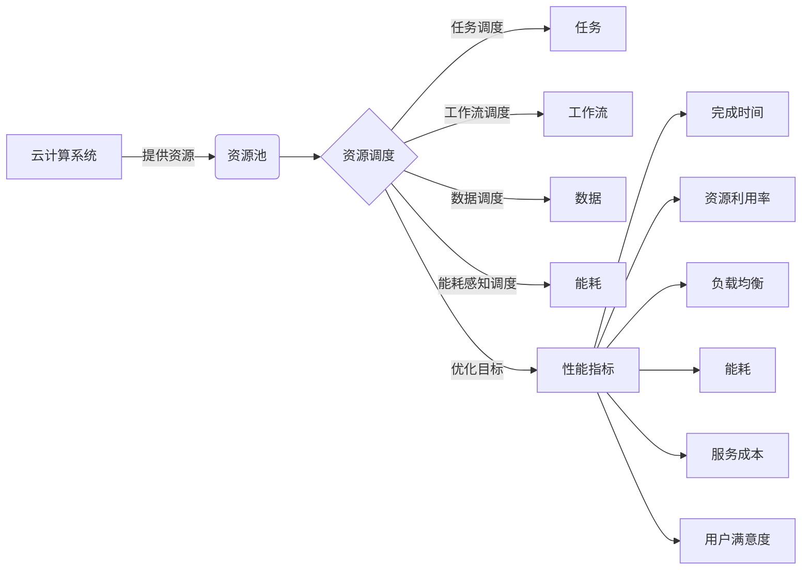

# 基于云计算的资源调度和优化算法

## 1. 背景介绍

### 1.1 云计算的发展现状
云计算作为一种新兴的计算模式,已经成为信息技术领域的热点研究方向。它通过网络将大量的计算、存储、网络等资源进行整合和共享,提供按需服务,具有高效、灵活、经济等优点。随着云计算技术的不断发展和应用,如何有效地管理和调度云资源,提高资源利用率和系统性能,已经成为亟待解决的关键问题。

### 1.2 资源调度和优化的重要性
在云计算环境下,面临的资源类型多样、用户需求动态变化、工作负载复杂多变等挑战,传统的资源管理和调度方法已经无法满足要求。因此,急需研究高效的资源调度和优化算法,合理分配和调度各类资源,最大限度地满足用户的服务质量需求,提高系统的整体性能和效益。这对于云计算的可持续发展具有重要意义。

### 1.3 本文的研究目标和内容安排
本文将重点研究云计算环境下的资源调度和优化问题,设计和实现高效的调度优化算法。内容安排如下:第2部分介绍云计算资源调度和优化涉及的核心概念;第3部分详细阐述几种典型的调度优化算法原理和步骤;第4部分建立资源调度的数学模型并举例说明;第5部分给出算法的代码实现和性能分析;第6部分讨论算法在实际云平台中的应用场景;第7部分推荐相关的工具和资源;第8部分总结全文并展望未来的研究方向;第9部分列举常见问题解答。

## 2. 核心概念与联系

### 2.1 云计算的定义与特征
云计算是一种按使用量付费的模式,通过网络提供可伸缩的、共享的计算机资源池,实现随时随地、按需获取所需的服务。其核心特征包括:资源池化、广泛网络接入、快速弹性、可计量服务等。

### 2.2 云计算的服务模式与部署模式
云计算主要有三种服务模式:
- IaaS(基础设施即服务):提供处理、存储、网络等基础计算资源,用户可以在上面部署和运行任意软件。
- PaaS(平台即服务):提供软件开发和运行平台,用户无需管理底层基础设施。  
- SaaS(软件即服务):通过网络提供应用软件,用户可以直接使用,无需关心底层平台和基础设施。

云计算的部署模式分为:公有云、私有云、社区云、混合云。

### 2.3 资源调度的定义与分类
资源调度是指在云计算系统中,根据系统当前的资源使用情况和任务的资源需求,合理地选择资源分配给任务,并将任务映射到相应的资源上执行的过程。其目标是在满足任务服务质量要求的同时,提高资源利用率,最小化任务的执行时间和系统能耗。

资源调度可以分为以下几类:
- 任务调度:将用户提交的任务分配到合适的资源上执行。
- 工作流调度:针对由多个相互依赖的子任务组成的工作流,合理安排子任务的执行顺序和资源分配。
- 数据调度:根据数据的存储位置、访问模式等,优化数据在不同存储介质和节点间的分布和迁移。
- 能耗感知调度:在满足性能约束的前提下,尽量降低系统能耗。

### 2.4 调度优化的目标与指标
资源调度优化需要权衡多个目标,主要包括:  
- 降低任务的完成时间(makespan)
- 提高资源利用率
- 负载均衡
- 降低能耗
- 降低服务成本
- 提高用户体验满意度

为了定量评估调度性能,需要设计合理的评价指标,如平均完成时间、资源利用率、SLA违约率、能耗比等。

### 2.5 调度过程涉及的关键技术
云资源调度优化设计到以下关键技术:
- 虚拟化:通过虚拟化实现物理资源的抽象和隔离,提高资源利用率。
- 资源监控:实时采集系统的资源使用信息和性能指标。 
- 需求预测:根据历史数据预测未来一段时间的资源需求。
- 容量规划:合理规划资源配置,满足长期的资源需求。
- 任务分析:分析任务的资源需求、执行时间、依赖关系等属性。
- 调度策略:设计高效的启发式或近似算法,求解调度优化问题。
- 资源供给:根据调度结果,及时将资源分配给任务使用。

下图描述了云资源调度优化涉及的核心概念之间的关系:

## 3. 核心算法原理具体操作步骤

云资源调度优化是一个NP-hard问题,很难找到多项式时间内的精确解。因此,主要采用启发式或元启发式算法设计调度策略。下面介绍几种典型算法的基本原理和操作步骤。

### 3.1 遗传算法GA
遗传算法是一种模拟生物进化论中自然选择和遗传机制的全局优化搜索算法。将问题的解编码为染色体,通过选择、交叉、变异等遗传操作,不断优化种群,最终收敛到最优解。

算法步骤:
1. 初始化:随机生成一定数量的初始种群。
2. 适应度评估:根据优化目标计算每个个体的适应度值。
3. 选择:按照一定的选择策略,从当前种群中选择一些个体。
4. 交叉:对选择出的个体进行交叉操作,生成新的子代个体。
5. 变异:以一定概率对新个体的某些基因进行变异。 
6. 更新种群:用新产生的个体替换原种群中适应度较差的个体。
7. 终止条件判断:若满足终止条件则输出最优解,否则回到步骤2。

### 3.2 蚁群算法ACO
蚁群算法是一种模拟蚂蚁觅食行为的群智能优化算法。蚂蚁在运动过程中通过释放信息素进行间接通信,影响后续蚂蚁的行走路线,整个蚁群最终能够找到最优路径。

算法步骤:
1. 初始化:初始化各参数,置信息素矩阵为初始值。
2. 构建解空间:每只蚂蚁根据状态转移规则构建一个可行解。
3. 更新信息素:根据解的质量更新信息素矩阵。
4. 蒸发信息素:对信息素进行一定程度的衰减。
5. 终止条件判断:若满足终止条件则输出最优解,否则回到步骤2。

### 3.3 粒子群优化算法PSO  
粒子群优化算法是一种模拟鸟群觅食行为的群体智能算法。每个粒子代表问题的一个潜在解,在解空间中运动。通过个体最优和全局最优位置来引导粒子的运动,不断更新粒子的速度和位置,最终收敛到最优解。

算法步骤:
1. 初始化:随机初始化每个粒子的位置和速度。
2. 适应度评估:计算每个粒子的适应度值。
3. 更新个体最优和全局最优。
4. 更新速度和位置:根据速度更新公式和位置更新公式,更新每个粒子的速度和位置。
5. 终止条件判断:若满足终止条件则输出最优解,否则回到步骤2。

### 3.4 模拟退火算法SA
模拟退火算法是一种模拟物理退火过程的随机搜索算法。通过温度参数控制搜索过程,早期高温时能跳出局部最优,后期低温时在局部进行精细搜索,最终以一定概率收敛到全局最优。

算法步骤:
1. 初始化:随机生成初始解,设定初始温度T和降温系数α。
2. 迭代搜索:在当前温度T下,进行一次迭代搜索。
   - 随机扰动当前解,生成新解。 
   - 计算新解与当前解的目标函数差值Δt。
   - 若Δt<0,则接受新解;否则以一定概率接受新解。
3. 降温:T=αT。
4. 终止条件判断:若满足终止条件则输出当前解作为最优解,否则回到步骤2。

### 3.5 禁忌搜索算法TS
禁忌搜索算法是一种启发式的局部搜索算法。通过设置禁忌表存储最近访问过的解,避免重复搜索,同时允许有条件地接受劣解,跳出局部最优。

算法步骤:
1. 初始化:随机选择一个初始解,初始化禁忌表为空。  
2. 生成候选解:在当前解的邻域内,生成若干候选解。
3. 选择最优候选解:在候选解中,选择目标函数值最优且不在禁忌表中的解作为新的当前解。
4. 更新禁忌表:将上一步的最优候选解加入禁忌表,并删除最早进入禁忌表的解。
5. 终止条件判断:若满足终止条件则输出当前解作为最优解,否则回到步骤2。

## 4. 数学模型和公式详细讲解举例说明

为了对资源调度问题进行数学建模,首先给出以下符号定义:

- $M$:物理机的集合,$M={m_1,m_2,...,m_n}$
- $V$:虚拟机的集合,$V={v_1,v_2,...,v_m}$ 
- $C_j$:物理机$m_j$的CPU容量
- $R_j$:物理机$m_j$的内存容量
- $c_i$:虚拟机$v_i$的CPU需求
- $r_i$:虚拟机$v_i$的内存需求
- $x_{ij}$:决策变量,若虚拟机$v_i$分配给物理机$m_j$,则$x_{ij}=1$,否则$x_{ij}=0$

目标函数可以根据不同的优化目标设置,例如最小化物理机数量、最小化能耗等。这里以最小化物理机数量为例:

$$
\min \sum_{j=1}^n y_j
$$

其中,$y_j$表示物理机$m_j$是否被使用,若被使用则$y_j=1$,否则$y_j=0$。

约束条件包括:

1. 每个虚拟机只能分配给一个物理机:

$$
\sum_{j=1}^n x_{ij} = 1, \forall i \in {1,2,...,m}
$$

2. 每个物理机的CPU和内存资源不能超过其容量:

$$
\sum_{i=1}^m c_i x_{ij} \leq C_j y_j, \forall j \in {1,2,...,n}
$$

$$
\sum_{i=1}^m r_i x_{ij} \leq R_j y_j, \forall j \in {1,2,...,n} 
$$

3. 决策变量取值为0或1:

$$
x_{ij} \in {0,1}, \forall i \in {1,2,...,m}, \forall j \in {1,2,...,n}
$$

$$
y_j \in {0,1}, \forall j \in {1,2,...,n}
$$

例如,假设有3台物理机和5台虚拟机,它们的CPU和内存参数如下表所示:

| 物理机 | CPU容量 | 内存容量 |
| ----- | ------- | ------- |
| $m_1$ |   8     |    16   |
| $m_2$ |   10    |    24   | 
| $m_3$ |   6     |    12   |

| 