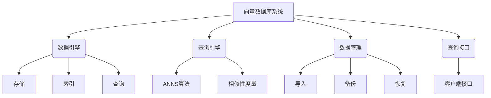

# 基于向量数据库的深度学习特征存储与快速检索

## 1.背景介绍

随着深度学习技术的不断发展,人工智能领域取得了令人瞩目的成就。然而,随着数据量的快速增长,如何高效地存储和检索海量的深度学习特征数据成为了一个亟待解决的问题。传统的关系型数据库和NoSQL数据库在处理高维稠密向量数据时存在明显的性能瓶颈,无法满足现代人工智能系统对特征存储和检索的高性能需求。

为了解决这一挑战,向量数据库(Vector Database)应运而生。向量数据库是一种专门为高效存储和检索向量数据而设计的数据库系统。它利用向量相似性搜索算法,可以快速找到与给定向量最相似的向量,从而支持各种基于相似性的应用场景,如相似项目推荐、聚类分析、异常检测等。

## 2.核心概念与联系

### 2.1 向量嵌入(Vector Embedding)

向量嵌入是将原始数据(如文本、图像等)映射到连续的向量空间中的过程。通过神经网络模型训练,可以将原始数据编码为具有语义信息的高维实数向量。相似的数据在向量空间中彼此靠近,不相似的数据则相距较远。向量嵌入技术广泛应用于自然语言处理、计算机视觉等领域。

### 2.2 向量相似性(Vector Similarity)

向量相似性是衡量两个向量之间接近程度的度量标准。常用的相似性度量方法包括余弦相似度、欧几里得距离等。在向量数据库中,相似性搜索是核心功能之一,可以根据给定的查询向量快速找到最相似的向量。

### 2.3 近似最近邻搜索(Approximate Nearest Neighbor Search)

近似最近邻搜索(Approximate Nearest Neighbor Search, ANNS)是一种在高维向量空间中快速查找最相似向量的算法。由于精确的最近邻搜索在高维空间中计算代价极高,因此ANNS算法通过牺牲一定的精度,以获得更高的查询效率。常用的ANNS算法包括局部敏感哈希(Locality Sensitive Hashing, LSH)、层次导航小世界图(Hierarchical Navigable Small World, HNSW)等。

### 2.4 向量数据库系统架构

典型的向量数据库系统架构包括以下几个核心组件:

1. **数据引擎**:负责向量数据的存储、索引和查询。
2. **查询引擎**:实现高效的相似性搜索算法,如ANNS算法。
3. **数据管理**:提供数据导入、备份、恢复等功能。
4. **查询接口**:支持多种编程语言的客户端查询接口。



## 3.核心算法原理具体操作步骤

### 3.1 向量嵌入算法

向量嵌入算法将原始数据映射到向量空间,是向量数据库的基础。常用的向量嵌入算法包括Word2Vec、GloVe(用于自然语言处理)、ResNet、VGGNet(用于计算机视觉)等。这些算法通过神经网络模型训练,学习将原始数据编码为具有语义信息的向量表示。

以Word2Vec为例,其核心思想是通过上下文预测目标词或反之,从而学习词向量的表示。算法具体步骤如下:

1. 构建训练语料库,对语料进行预处理(分词、去停用词等)。
2. 初始化词向量矩阵,每个词对应一个随机向量。
3. 对于每个目标词,提取其上下文窗口内的上下文词。
4. 使用神经网络模型(如Skip-Gram或CBOW),以目标词预测上下文词或反之。
5. 通过反向传播算法更新词向量矩阵,使得相似词的词向量更接近。
6. 重复3-5步,直到模型收敛或达到最大迭代次数。

经过训练,每个词都被映射到一个固定维度的向量空间中,相似的词在向量空间中彼此靠近。

### 3.2 近似最近邻搜索算法

近似最近邻搜索算法是向量数据库中高效相似性查询的关键。这里以层次导航小世界图(HNSW)算法为例,介绍其核心原理和操作步骤。

HNSW算法基于导航小世界图的思想,通过构建分层的邻近图来近似最近邻搜索。算法步骤如下:

1. **构建分层图结构**
   - 初始化一个空的分层图结构,包含一个入口节点(层0)。
   - 逐步插入向量,对于每个新向量:
     - 从入口节点开始,找到其在当前层的最近邻居。
     - 将新向量插入到下一层,并与其最近邻居相连。
     - 在下一层重复上述过程,直到达到最大层数或无法找到更近的邻居。

2. **查询最近邻**
   - 从入口节点开始,找到查询向量在当前层的最近邻居。
   - 遍历这些邻居,并在下一层重复上述过程。
   - 维护一个候选集合,存储遇到的最近邻居。
   - 重复上述步骤,直到达到最大层数或候选集合满足条件。

HNSW算法通过分层结构和近邻选择策略,实现了在高维空间中快速查找近似最近邻的目的。相比于暴力搜索,HNSW算法的时间复杂度大幅降低,同时保持了较高的查询精度。

## 4.数学模型和公式详细讲解举例说明

### 4.1 向量相似度计算

向量相似度是衡量两个向量之间接近程度的度量标准,在向量数据库中扮演着关键角色。常用的相似度计算方法包括:

1. **余弦相似度**

余弦相似度衡量两个向量的方向相似性,取值范围为[-1,1]。两个向量的余弦相似度可以通过它们的点积与模长的乘积计算:

$$\text{sim}_\text{cosine}(\vec{a}, \vec{b}) = \frac{\vec{a} \cdot \vec{b}}{\|\vec{a}\| \|\vec{b}\|} = \frac{\sum_{i=1}^{n}a_i b_i}{\sqrt{\sum_{i=1}^{n}a_i^2} \sqrt{\sum_{i=1}^{n}b_i^2}}$$

其中$\vec{a}$和$\vec{b}$是两个$n$维向量,点积$\vec{a} \cdot \vec{b} = \sum_{i=1}^{n}a_i b_i$,模长$\|\vec{a}\| = \sqrt{\sum_{i=1}^{n}a_i^2}$。

余弦相似度越接近1,表示两个向量越相似;越接近-1,表示两个向量越不相似;当为0时,表示两个向量正交。

2. **欧几里得距离**

欧几里得距离衡量两个向量在空间中的直线距离,取值范围为[0, +∞)。两个向量的欧几里得距离计算公式如下:

$$\text{dist}_\text{euclidean}(\vec{a}, \vec{b}) = \sqrt{\sum_{i=1}^{n}(a_i - b_i)^2}$$

欧几里得距离越小,表示两个向量越相似;距离越大,表示两个向量越不相似。

在实际应用中,余弦相似度和欧几里得距离各有优缺点。余弦相似度只考虑向量方向,忽略了向量模长的影响;而欧几里得距离同时考虑了方向和模长。选择哪种相似度计算方法,需要根据具体的应用场景和数据分布情况来决定。

### 4.2 局部敏感哈希

局部敏感哈希(Locality Sensitive Hashing, LSH)是一种常用的近似最近邻搜索算法,它通过将高维向量映射到低维哈希空间,从而加速相似向量的查找过程。

LSH算法的核心思想是,对于相似的向量,它们在哈希空间中也应该映射到相近的哈希值。具体来说,LSH算法包括以下步骤:

1. **构造哈希函数族**

   定义一个哈希函数族$\mathcal{H}$,使得对于任意两个向量$\vec{a}$和$\vec{b}$,它们的相似度$\text{sim}(\vec{a}, \vec{b})$与哈希值冲突概率$\Pr_{h \in \mathcal{H}}[h(\vec{a}) = h(\vec{b})]$成正比。

   常用的LSH哈希函数族包括:

   - 随机投影(Random Projection)
   - 随机超平面(Random Hyperplane)
   - 随机高斯(Random Gaussian)

2. **构建哈希表**

   对于每个向量$\vec{v}$,使用$k$个不同的哈希函数$h_1, h_2, \dots, h_k$计算$k$个哈希值$h_1(\vec{v}), h_2(\vec{v}), \dots, h_k(\vec{v})$,将向量$\vec{v}$存储在对应的$k$个哈希桶中。

3. **查询近似最近邻**

   对于查询向量$\vec{q}$,计算它的$k$个哈希值$h_1(\vec{q}), h_2(\vec{q}), \dots, h_k(\vec{q})$,并检查对应哈希桶中的向量。这些向量就是$\vec{q}$的候选近邻向量。

   为了提高查询精度,可以重复上述过程多次(使用不同的哈希函数族),并取候选集的并集作为最终结果。

LSH算法的时间复杂度与数据集大小和向量维度呈线性关系,大幅优于暴力搜索的$O(n^2)$时间复杂度。但是,LSH算法也存在一些缺陷,如难以确定合适的哈希函数族和哈希函数个数、查询精度受到哈希冲突的影响等。

## 5.项目实践:代码实例和详细解释说明

为了更好地理解向量数据库的实现原理,我们将使用Python和开源向量数据库Weaviate来构建一个基于文本相似性的搜索引擎示例。

### 5.1 环境准备

首先,我们需要安装Weaviate及其Python客户端库:

```bash
# 安装Weaviate
$ docker pull semitechnologies/weaviate:1.19.2

# 安装Python客户端库
$ pip install weaviate-client
```

### 5.2 导入数据

我们将使用一个包含10000条新闻标题的数据集。首先,我们需要将文本数据转换为向量嵌入形式。这里我们使用预训练的Sentence-BERT模型:

```python
from sentence_transformers import SentenceTransformer

# 加载预训练模型
model = SentenceTransformer('all-MiniLM-L6-v2')

# 读取数据集
with open('news_data.txt', 'r') as f:
    data = [line.strip() for line in f.readlines()]

# 计算文本嵌入
embeddings = model.encode(data)
```

接下来,我们将嵌入向量和原始文本数据导入Weaviate:

```python
import weaviate

# 连接Weaviate实例
client = weaviate.Client("http://localhost:8080")

# 创建schema
client.schema.get_or_create_class(
    "News",
    class_properties=[
        weaviate.schema.DataType.TEXT,
        weaviate.schema.DataType.VECTOR
    ]
)

# 批量导入数据
with client.batch.batch_encoder() as batch:
    for text, embedding in zip(data, embeddings):
        batch.add_data_object(
            data_object={
                "text": text,
                "vector": embedding
            },
            class_name="News"
        )
```

### 5.3 相似性搜索

现在,我们可以使用Weaviate提供的相似性搜索API来查找与给定文本最相似的新闻标题:

```python
import numpy as np

# 查询文本
query = "Apple unveils new iPhone models with improved cameras and longer battery life."

# 计算查询嵌入
query_embedding =