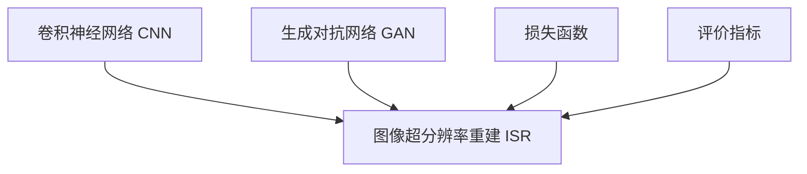
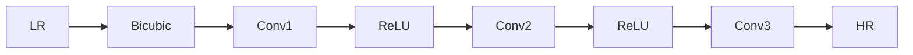
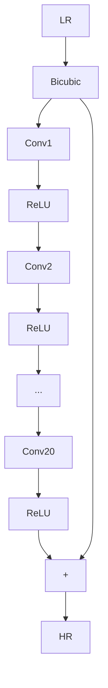
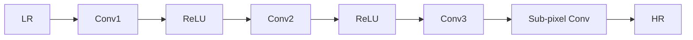
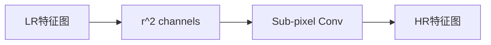
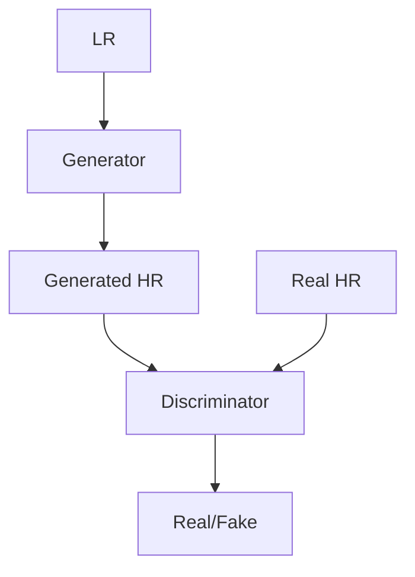

# 基于深度学习的图像超分辨率重建技术

## 1. 背景介绍

### 1.1 图像超分辨率重建的概念与意义

图像超分辨率重建(Image Super-Resolution, ISR)是指从低分辨率图像中重建高分辨率图像的技术。它在计算机视觉、图像处理等领域有着广泛的应用前景,如医学影像、卫星遥感影像、视频监控等。传统的图像超分辨率重建方法主要有插值法、重建法等,但效果有限。近年来,随着深度学习的发展,基于深度学习的图像超分辨率重建技术取得了突破性进展,成为研究的热点。

### 1.2 深度学习在图像超分辨率重建中的优势

与传统方法相比,基于深度学习的ISR方法具有以下优势:

1. 端到端的训练方式,避免了人工设计复杂的数学模型和先验知识,大大简化了流程。
2. 强大的特征表示和学习能力,能够从大量数据中自动学习到有效的特征表示,提高重建质量。 
3. 并行计算能力强,GPU加速使得训练和推理速度大幅提升。
4. 模型具有较好的泛化能力,可以处理不同场景和对象的图像。

### 1.3 本文的研究内容和贡献

本文将重点介绍几种经典的基于深度学习的图像超分辨率重建算法,包括SRCNN、VDSR、ESPCN、SRGAN等,分析其网络结构、损失函数设计和训练技巧。同时,本文还将讨论ISR技术在实际应用中的一些问题和未来的研究方向。

## 2. 核心概念与联系

### 2.1 卷积神经网络(CNN)

卷积神经网络是深度学习中非常重要的一类网络结构,特别适合处理网格拓扑结构的数据如图像。CNN的基本组件包括:

- 卷积层:通过卷积核对输入特征图进行卷积操作,提取局部特征。
- 池化层:对特征图进行下采样,减小数据维度,提高特征的鲁棒性。
- 激活函数:引入非线性变换,增强网络的表达能力,常见的有ReLU、LeakyReLU、PReLU等。
- 全连接层:对卷积和池化后的特征进行分类或回归预测。

CNN在图像超分辨率重建任务中,可以通过堆叠多个卷积层来提取图像的多尺度特征,并重建出高分辨率图像。

### 2.2 生成对抗网络(GAN) 

生成对抗网络由生成器和判别器两部分组成,通过两个网络的博弈学习,使生成器能够生成接近真实样本的数据。其中:

- 生成器:接收随机噪声向量作为输入,生成目标图像。 
- 判别器:判断输入图像是真实样本还是生成器生成的假样本。

训练过程中,生成器努力生成以假乱真的图像欺骗判别器,判别器则不断提升鉴别能力。最终两者达到动态平衡,生成器生成的图像与真实图像难以区分。GAN常用于图像生成、风格迁移等任务,在ISR中可以提升重建图像的真实感和纹理细节。

### 2.3 损失函数

损失函数衡量了模型预测输出与真实标签之间的差异,是训练神经网络的目标函数。常见的损失函数有:

- 均方误差(MSE):预测值与真实值差值的平方和,用于回归任务。
- 交叉熵(Cross Entropy):度量两个概率分布之间的差异,用于分类任务。
- 对抗损失:GAN中判别器的损失,使其能够判断真假样本。
- 感知损失:基于预训练的分类网络提取的特征,使重建图像在感知上更真实。

ISR任务常常组合多种损失函数,如像素空间的MSE损失和对抗损失等,以平衡重建图像的欺真性和感知质量。

### 2.4 评价指标

为了定量评估ISR算法的性能,需要使用一些客观的评价指标,常用的有:

- PSNR(Peak Signal-to-Noise Ratio):峰值信噪比,度量图像的失真程度,值越大表示失真越小。
- SSIM(Structural Similarity):结构相似性,衡量两幅图像在结构、亮度、对比度上的相似程度,取值范围为[0,1],越接近1表示越相似。
- IFC(Information Fidelity Criterion):信息保真度准则,从信息论角度度量图像的保真度。

下图是各核心概念间的联系:

## 3. 核心算法原理与具体步骤

### 3.1 SRCNN

SRCNN是最早将卷积神经网络应用到图像超分辨率重建任务中的工作,其主要步骤如下:

1. 预处理:使用双三次插值将低分辨率图像(LR)上采样到目标尺寸,得到插值后的高分辨率图像(HR_bicubic)。
2. 特征提取:使用一个卷积层对HR_bicubic提取特征,得到特征图F1。
3. 非线性映射:使用一个卷积层对F1进行非线性变换,得到特征图F2。
4. 重建:使用一个卷积层对F2进行重建,得到输出的高分辨率图像(HR)。

网络结构如下:

损失函数为HR与真实高分辨率图像(HR_true)的均方误差(MSE):

$$
L(\Theta) = \frac{1}{n}\sum_{i=1}^n \Vert F(I^{LR}_i;\Theta) - I^{HR_true}_i \Vert^2
$$

其中$\Theta$为网络参数,$I^{LR}$和$I^{HR_true}$分别为输入的LR图像和真实的HR图像。

### 3.2 VDSR

VDSR是SRCNN的改进版,主要有以下变化:

1. 网络加深:使用了20层卷积层,增强了网络的特征表示能力。
2. 残差学习:预测输出的是残差图像,即HR与HR_bicubic的差值,使网络更容易优化。 
3. 梯度裁剪:在反向传播时对梯度进行裁剪,防止梯度爆炸。
4. 调整学习率:使用较高的初始学习率,并在训练过程中逐渐降低。

网络结构如下:

损失函数与SRCNN相同,但引入了正则项以控制网络参数的范数:

$$
L(\Theta) = \frac{1}{n}\sum_{i=1}^n \Vert F(I^{LR}_i;\Theta) - I^{HR_true}_i \Vert^2 + \lambda \Vert \Theta \Vert^2
$$

其中$\lambda$为正则化系数。

### 3.3 ESPCN

ESPCN是第一个在网络中引入上采样层(Sub-pixel Conv)的ISR模型,其主要特点有:

1. 效率高:直接在LR特征图上进行卷积和上采样,避免了预处理阶段的插值操作。
2. 参数少:上采样层可以看作是一种高效的重组卷积层,参数量大大减少。

具体步骤为:

1. 特征提取:使用多个卷积层对LR图像提取特征,得到特征图F。
2. 上采样:使用一个Sub-pixel Conv层对F进行上采样,将通道数减小的同时分辨率扩大,得到输出的HR图像。

网络结构如下:

其中Sub-pixel Conv层的操作如下图所示:

假设LR特征图的尺寸为$H \times W \times C$,上采样因子为$r$,则Sub-pixel Conv层将通道数增加到$r^2C$,然后将特征图重排为$rH \times rW \times C$的HR特征图。

损失函数与SRCNN相同,使用MSE损失。

### 3.4 SRGAN

SRGAN引入了生成对抗网络(GAN)来提升ISR的感知质量,其主要特点有:

1. 生成器:采用了残差块(Residual Block)和上采样模块,能够生成高质量的HR图像。
2. 判别器:采用了VGG风格的卷积网络,用于区分真假HR图像。
3. 感知损失:基于VGG网络的特征空间,使生成的HR图像在感知上更真实。

具体步骤为:

1. 生成器G:从LR图像生成HR图像。
2. 判别器D:判断HR图像是真实样本还是生成样本。
3. 对抗训练:G和D交替训练,最小化如下损失函数:

$$
\begin{aligned}
L_G &= \underbrace{-\mathbb{E}_{I^{LR} \sim p_{train}(I^{LR})} [\log D(G(I^{LR}))]}_{\text{Adversarial Loss}} + \underbrace{\lambda \mathbb{E}_{I^{HR} \sim p_{train}(I^{HR})} [\Vert \phi(I^{HR}) - \phi(G(I^{LR})) \Vert_2^2]}_{\text{Perceptual Loss}} \\
L_D &= -\mathbb{E}_{I^{HR} \sim p_{train}(I^{HR})} [\log D(I^{HR})] - \mathbb{E}_{I^{LR} \sim p_{train}(I^{LR})} [\log(1 - D(G(I^{LR})))]
\end{aligned}
$$

其中$\phi$为VGG网络提取的特征,$\lambda$为平衡系数。生成器G的目标是最小化对抗损失和感知损失,使生成的HR图像能够欺骗判别器,同时在感知上与真实HR图像接近。判别器D的目标是最大化分类真实HR图像的概率,最小化分类生成图像的概率。

网络结构如下:

## 4. 数学模型和公式详解

### 4.1 卷积操作

卷积是CNN的核心操作,对于输入特征图$X$和卷积核$W$,卷积操作为:

$$
Y[i,j] = \sum_m \sum_n X[i+m, j+n] \cdot W[m,n]
$$

其中$Y$为输出特征图。卷积操作可以提取输入特征图的局部特征,通过层层堆叠实现层次化的特征表示。

### 4.2 上采样操作

上采样是ISR中常用的操作,用于将LR特征图变换为HR特征图。常见的上采样方式有:

1. 最近邻插值:直接复制像素值。
2. 双线性插值:对相邻4个像素进行加权平均。
3. 双三次插值:对相邻16个像素进行三次插值。
4. 反卷积(Deconv):转置卷积操作,学习上采样的卷积核。
5. Sub-pixel Conv:通过像素重排实现上采样,如ESPCN。

以双线性插值为例,设LR图像为$I_{LR}$,上采样因子为$r$,则HR图像$I_{HR}$为:

$$
I_{HR}[i,j] = \sum_{m,n} I_{LR}[m,n] \cdot \max(0, 1-|i/r-m|) \cdot \max