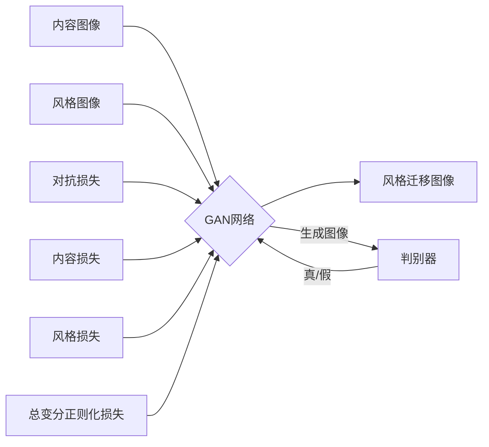

# 基于生成对抗网络的图像风格迁移在商品包装设计中的应用

## 1. 背景介绍

在当今瞬息万变的市场环境中,商品包装设计在吸引消费者注意力、提升品牌形象方面扮演着至关重要的角色。传统的包装设计流程往往耗时耗力,难以快速响应市场变化。近年来,人工智能技术的飞速发展为包装设计带来了新的突破口。其中,基于生成对抗网络(Generative Adversarial Networks, GANs)的图像风格迁移技术展现出巨大的应用潜力。本文将深入探讨GAN在商品包装设计中的应用,揭示这一前沿技术如何助力设计师高效创作出富有创意、契合市场需求的包装方案。

### 1.1 商品包装设计的重要性
#### 1.1.1 提升品牌辨识度
#### 1.1.2 吸引消费者注意力
#### 1.1.3 传递产品信息与价值主张

### 1.2 传统包装设计面临的挑战  
#### 1.2.1 设计周期长,响应速度慢
#### 1.2.2 创意局限,难以突破固有思维
#### 1.2.3 人力成本高,效率有待提升

### 1.3 人工智能在包装设计中的应用前景
#### 1.3.1 自动化设计,提高效率
#### 1.3.2 风格多样化,激发创意灵感
#### 1.3.3 个性化定制,满足细分市场需求

## 2. 核心概念与联系

### 2.1 生成对抗网络(GANs)
#### 2.1.1 GANs的基本原理
#### 2.1.2 生成器与判别器的博弈过程
#### 2.1.3 GANs在图像生成领域的优势

### 2.2 图像风格迁移
#### 2.2.1 风格迁移的定义与目标
#### 2.2.2 基于特征表示的风格迁移方法
#### 2.2.3 基于GAN的风格迁移方法

### 2.3 GAN与图像风格迁移的结合
#### 2.3.1 GAN在风格迁移中的应用优势  
#### 2.3.2 GAN风格迁移的网络结构设计
#### 2.3.3 GAN风格迁移的损失函数设计

## 3. 核心算法原理具体操作步骤

### 3.1 数据准备
#### 3.1.1 内容图像与风格图像的选取原则
#### 3.1.2 图像预处理与数据增强
#### 3.1.3 构建训练数据集

### 3.2 GAN网络结构设计
#### 3.2.1 生成器网络结构
#### 3.2.2 判别器网络结构 
#### 3.2.3 残差连接与跳跃连接的引入

### 3.3 损失函数设计
#### 3.3.1 对抗损失
#### 3.3.2 内容损失
#### 3.3.3 风格损失
#### 3.3.4 总变分正则化损失

### 3.4 训练过程
#### 3.4.1 初始化模型参数
#### 3.4.2 交替训练生成器与判别器
#### 3.4.3 监控训练过程与调整超参数
#### 3.4.4 模型评估与保存



## 4. 数学模型和公式详细讲解举例说明

### 4.1 对抗损失
生成器$G$和判别器$D$的目标函数可表示为:

$$\min_{G} \max_{D} \mathbb{E}_{x \sim p_{data}(x)}[\log D(x)] + \mathbb{E}_{z \sim p_{z}(z)}[\log (1 - D(G(z)))]$$

其中,$x$表示真实图像,$z$表示随机噪声,$p_{data}$和$p_z$分别表示真实图像和噪声的分布。

### 4.2 内容损失
内容损失用于衡量生成图像与内容图像在内容特征上的相似性,常用的是特征空间上的均方误差损失:

$$\mathcal{L}_{content}(G) = \mathbb{E}_{(c,s) \sim p_{data}(c,s)} \left[ \frac{1}{C_jH_jW_j} \left\| F_j(G(c,s)) - F_j(c) \right\|^2 \right]$$

其中,$c$和$s$分别表示内容图像和风格图像,$F_j$表示VGG网络第$j$层的特征图,$C_j$,$H_j$,$W_j$分别表示特征图的通道数、高度和宽度。

### 4.3 风格损失
风格损失用于衡量生成图像与风格图像在风格特征上的相似性,常用的是Gram矩阵的均方误差损失:

$$\mathcal{L}_{style}(G) = \mathbb{E}_{(c,s) \sim p_{data}(c,s)} \left[ \sum_{j=1}^J \frac{1}{C_j^2} \left\| G_j(G(c,s)) - G_j(s) \right\|^2 \right]$$

其中,$G_j$表示第$j$层特征图的Gram矩阵,定义为:

$$G_j(x)_{c,c'} = \frac{1}{C_jH_jW_j} \sum_{h=1}^{H_j} \sum_{w=1}^{W_j} F_j(x)_{h,w,c} F_j(x)_{h,w,c'}$$

### 4.4 总变分正则化损失
总变分正则化损失用于鼓励生成图像的空间平滑性,减少噪声和伪影:

$$\mathcal{L}_{tv}(G) = \mathbb{E}_{(c,s) \sim p_{data}(c,s)} \left[ \sum_{i,j} \left( (G(c,s)_{i,j+1} - G(c,s)_{i,j})^2 + (G(c,s)_{i+1,j} - G(c,s)_{i,j})^2 \right)^{\frac{1}{2}} \right]$$

其中,$i$,$j$表示生成图像$G(c,s)$的像素坐标。

### 4.5 完整的目标函数
综合以上各项损失,GAN风格迁移的完整目标函数为:

$$\min_{G} \max_{D} \mathcal{L}_{GAN}(G,D) + \lambda_c \mathcal{L}_{content}(G) + \lambda_s \mathcal{L}_{style}(G) + \lambda_{tv} \mathcal{L}_{tv}(G)$$

其中,$\lambda_c$,$\lambda_s$,$\lambda_{tv}$分别表示内容损失、风格损失和总变分正则化损失的权重系数。

## 5. 项目实践:代码实例和详细解释说明

下面是一个基于PyTorch实现GAN风格迁移的简要代码示例:

```python
import torch
import torch.nn as nn
import torchvision.transforms as transforms
from torchvision.models import vgg19

# 定义生成器网络
class Generator(nn.Module):
    def __init__(self):
        super(Generator, self).__init__()
        # 定义生成器网络结构
        # ...
        
    def forward(self, x):
        # 前向传播过程
        # ...
        return out

# 定义判别器网络        
class Discriminator(nn.Module):
    def __init__(self):
        super(Discriminator, self).__init__()
        # 定义判别器网络结构
        # ...
        
    def forward(self, x):
        # 前向传播过程  
        # ...
        return out

# 定义VGG特征提取器
class VGGFeatureExtractor(nn.Module):
    def __init__(self):
        super(VGGFeatureExtractor, self).__init__()
        # 加载预训练的VGG19网络
        vgg = vgg19(pretrained=True).features
        # 提取特定层作为内容和风格特征
        self.content_feat = nn.Sequential(*list(vgg.children())[:35])
        self.style_feat = nn.Sequential(*list(vgg.children())[:22])
        
    def forward(self, x):
        content_feat = self.content_feat(x)
        style_feat = self.style_feat(x)
        return content_feat, style_feat

# 定义损失函数
def content_loss(gen_feat, content_feat):
    return F.mse_loss(gen_feat, content_feat)

def gram_matrix(feat):
    b, c, h, w = feat.size()
    feat = feat.view(b, c, h * w)
    feat_t = feat.transpose(1, 2)
    gram = torch.bmm(feat, feat_t) / (c * h * w)
    return gram
    
def style_loss(gen_feat, style_feat):
    gen_gram = gram_matrix(gen_feat)
    style_gram = gram_matrix(style_feat)
    return F.mse_loss(gen_gram, style_gram)
    
def tv_loss(img):
    b, c, h, w = img.size()
    h_tv = torch.pow(img[:,:,1:,:]-img[:,:,:-1,:], 2).sum()
    w_tv = torch.pow(img[:,:,:,1:]-img[:,:,:,:-1], 2).sum()
    return (h_tv + w_tv) / (b * c * h * w)

# 初始化模型
generator = Generator()
discriminator = Discriminator()  
vgg_extractor = VGGFeatureExtractor()

# 定义优化器
g_optimizer = torch.optim.Adam(generator.parameters(), lr=1e-4)  
d_optimizer = torch.optim.Adam(discriminator.parameters(), lr=1e-4)

# 训练循环
for epoch in range(num_epochs):
    for content_img, style_img in dataloader:
        # 内容图像和风格图像的特征提取
        content_feat, _ = vgg_extractor(content_img)
        _, style_feat = vgg_extractor(style_img)
        
        # 训练判别器
        g_optimizer.zero_grad()
        gen_img = generator(content_img)
        gen_logit = discriminator(gen_img)
        _, gen_feat = vgg_extractor(gen_img)
        g_content_loss = content_loss(gen_feat, content_feat)
        g_style_loss = style_loss(gen_feat, style_feat) 
        g_tv_loss = tv_loss(gen_img)
        g_adv_loss = -torch.mean(gen_logit)
        g_loss = g_adv_loss + g_content_loss + g_style_loss + g_tv_loss
        g_loss.backward()
        g_optimizer.step()
        
        # 训练生成器  
        d_optimizer.zero_grad()
        real_logit = discriminator(style_img)
        fake_logit = discriminator(gen_img.detach())
        d_adv_loss = -torch.mean(real_logit) + torch.mean(fake_logit)  
        d_loss = d_adv_loss
        d_loss.backward()
        d_optimizer.step()
```

以上代码实现了GAN风格迁移的核心组件,包括生成器、判别器、VGG特征提取器以及相应的损失函数。在训练过程中,通过交替优化生成器和判别器,使生成器能够生成风格迁移后的图像,同时保留内容图像的语义信息。

具体而言,生成器接收内容图像作为输入,输出风格迁移后的图像。判别器接收真实的风格图像和生成器生成的图像,并试图区分它们。VGG特征提取器用于提取内容图像和生成图像的特征,以计算内容损失和风格损失。

在生成器的训练中,优化目标包括对抗损失(使生成图像能够欺骗判别器)、内容损失(保留内容图像的语义信息)、风格损失(迁移风格图像的风格特征)以及总变分正则化损失(鼓励空间平滑性)。

在判别器的训练中,优化目标是最小化真实风格图像的损失和最大化生成图像的损失,以提高判别器的判别能力。

通过多轮迭代训练,生成器逐渐学习如何生成具有目标风格且保留内容语义的图像,实现了图像风格迁移的目标。

## 6. 实际应用场景

### 6.1 产品包装设计
#### 6.1.1 快速生成多种风格的包装方案
#### 6.1.2 根据目标受众调整包装风格  
#### 6.1.3 适应节日主题和促销活动

### 6.2 品牌形象设计
#### 6.2.1 统一品牌视觉风格
#### 6.2.2 快速生成多个产品的包装设计
#### 6.2.3 提高品牌辨识度和忠诚度

### 6.3 个性化定制
#### 6.3.1 根据消费者喜好生成个性化包装
#### 6.3.2 提供在线