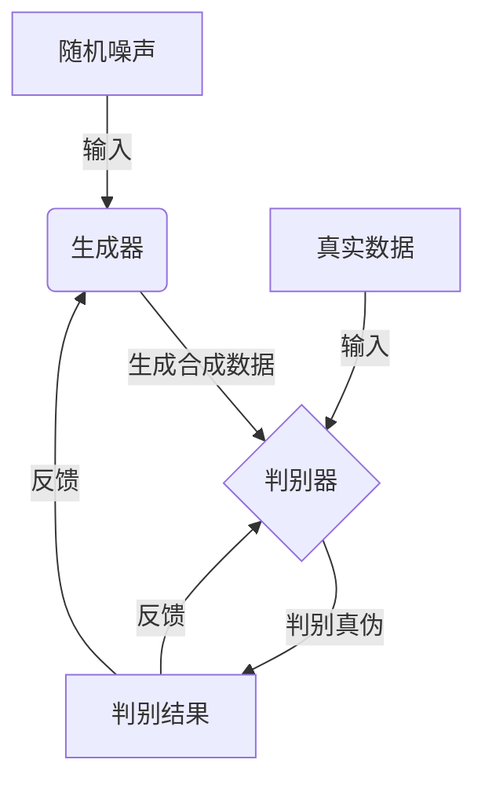
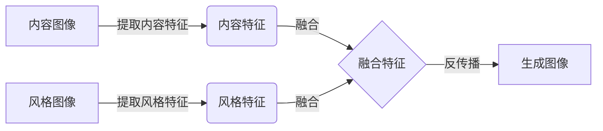
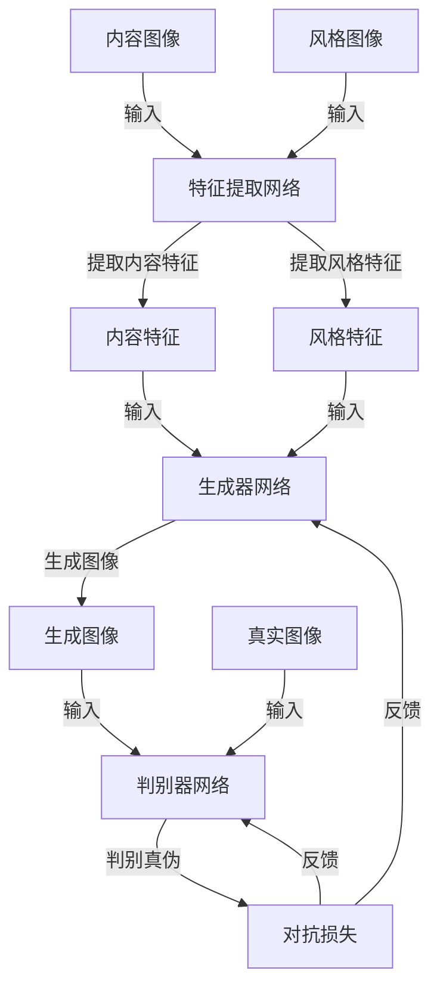

# 基于生成对抗网络的图像风格迁移在用户交互中的体验优化

## 1.背景介绍

### 1.1 图像风格迁移的概念

图像风格迁移是一种将一种图像的视觉风格迁移到另一种图像上的技术。它允许用户将一种艺术风格(如梵高的油画风格)应用到一张照片上,从而创造出具有独特视觉效果的新图像。这项技术在图像处理、计算机视觉和人工智能领域有着广泛的应用前景。

### 1.2 生成对抗网络在图像风格迁移中的作用

生成对抗网络(Generative Adversarial Networks, GANs)是一种基于深度学习的人工智能算法,由两个神经网络模型组成:生成器(Generator)和判别器(Discriminator)。生成器的目标是生成逼真的合成数据样本,而判别器则试图区分生成的数据和真实数据。通过两个模型的对抗训练,生成器可以学会生成更加逼真的数据。

在图像风格迁移任务中,生成对抗网络可以高效地学习图像内容和风格的表示,并将它们融合生成新的图像。与传统的基于优化的方法相比,基于GAN的方法可以更快地生成高质量的风格迁移图像,并且能够处理更高分辨率的输入。

### 1.3 用户交互体验的重要性

图像风格迁移作为一种创意工具,用户交互体验至关重要。良好的用户体验可以提高用户的参与度和满意度,从而推动该技术的普及和应用。然而,传统的图像风格迁移方法通常需要较长的处理时间,并且调整参数较为困难,这给用户带来了不便。因此,优化基于GAN的图像风格迁移在用户交互中的体验,是推广该技术的关键所在。

## 2.核心概念与联系

### 2.1 生成对抗网络的基本原理

生成对抗网络由两个神经网络模型组成:生成器(Generator)和判别器(Discriminator)。

- 生成器(Generator): 其目标是从随机噪声中生成逼真的合成数据样本,例如图像。生成器会不断尝试生成更加逼真的数据来欺骗判别器。
- 判别器(Discriminator): 其目标是区分生成器生成的合成数据和真实数据。判别器会不断提高自身的判别能力,以便更好地识别生成器的欺骗行为。

生成器和判别器通过对抗训练的方式相互博弈,相互促进对方的能力。随着训练的进行,生成器会学习生成更加逼真的数据,而判别器也会变得更加精准。最终,生成器可以生成难以被判别器区分的合成数据。

### 2.2 图像风格迁移的核心思想

图像风格迁移的核心思想是将一张图像的内容(Content)和另一张图像的风格(Style)相融合,生成一张新的图像。具体来说:

- 内容(Content): 指图像中的主体对象、场景等内容信息。
- 风格(Style): 指图像的视觉风格,如颜色、笔触、纹理等。

通过将内容图像和风格图像输入到神经网络中,可以提取它们的内容特征和风格特征。然后,将这两种特征融合,并将融合后的特征反传播到输入层,即可生成一张新的图像,该图像保留了内容图像的内容信息,同时具有风格图像的视觉风格。

### 2.3 生成对抗网络在图像风格迁移中的应用

在图像风格迁移任务中,生成对抗网络可以高效地学习图像内容和风格的表示,并将它们融合生成新的图像。具体来说:

1. 生成器的目标是生成具有目标风格的图像,而判别器则需要判断生成的图像是否真实地具有目标风格。
2. 通过对抗训练,生成器可以学习到如何将内容图像和风格图像的特征融合,从而生成具有目标风格的新图像。
3. 与传统的基于优化的方法相比,基于GAN的方法可以更快地生成高质量的风格迁移图像,并且能够处理更高分辨率的输入。

基于GAN的图像风格迁移不仅可以实现图像风格的转换,还可以探索多种风格的融合和插值,为创意应用提供了新的可能性。

## 3.核心算法原理具体操作步骤

基于生成对抗网络的图像风格迁移算法主要分为以下几个步骤:

### 3.1 数据预处理

1. 准备内容图像和风格图像数据集。
2. 对图像进行预处理,如调整大小、归一化等,以满足神经网络的输入要求。

### 3.2 网络架构设计

1. 设计生成器(Generator)网络架构,通常采用编码器-解码器结构。编码器提取图像的特征表示,解码器则从特征表示重建图像。
2. 设计判别器(Discriminator)网络架构,通常采用卷积神经网络结构,用于判断输入图像是否具有目标风格。

### 3.3 特征提取

1. 将内容图像输入到预训练的特征提取网络(如VGG19)中,提取内容特征。
2. 将风格图像输入到同一特征提取网络中,提取风格特征。

### 3.4 损失函数设计

设计损失函数,包括以下几个部分:

1. 内容损失(Content Loss):衡量生成图像与内容图像之间的内容差异。
2. 风格损失(Style Loss):衡量生成图像与风格图像之间的风格差异。
3. 对抗损失(Adversarial Loss):衡量生成图像是否具有目标风格,由判别器网络提供反馈。

### 3.5 对抗训练

1. 初始化生成器和判别器网络的权重。
2. 迭代训练:
   - 固定判别器,更新生成器,使生成图像尽可能欺骗判别器。
   - 固定生成器,更新判别器,提高其区分真伪图像的能力。
3. 重复上述过程,直到模型收敛。

### 3.6 风格迁移图像生成

1. 使用训练好的生成器网络,将内容图像和风格图像的特征融合。
2. 将融合后的特征输入到生成器中,生成具有目标风格的新图像。

整个过程可以用下面的流程图概括:

通过上述步骤,基于生成对抗网络的图像风格迁移算法可以高效地将一种图像风格迁移到另一种图像上,生成具有独特视觉效果的新图像。

## 4.数学模型和公式详细讲解举例说明

在基于生成对抗网络的图像风格迁移算法中,损失函数的设计是非常关键的一步。损失函数需要同时考虑内容保持、风格迁移和对抗训练三个方面,以确保生成的图像既保留了原始内容,又具有目标风格,同时看起来足够逼真。下面将详细介绍损失函数的数学模型和公式。

### 4.1 内容损失(Content Loss)

内容损失用于衡量生成图像与内容图像之间的内容差异,确保生成图像保留了原始内容信息。通常采用预训练的特征提取网络(如VGG19)提取图像的内容特征,然后计算生成图像特征和内容图像特征之间的均方差作为内容损失。

设 $F^l$ 为特征提取网络的第 $l$ 层输出特征图, $F^l_{ij}$ 表示第 $i$ 个特征图在空间位置 $(j)$ 处的值。内容损失可以定义为:

$$L_{content}(G, C) = \frac{1}{N_l}\sum_{i,j}(F^l_{ij}(G) - F^l_{ij}(C))^2$$

其中, $G$ 表示生成图像, $C$ 表示内容图像, $N_l$ 是第 $l$ 层特征图的总数。

### 4.2 风格损失(Style Loss)

风格损失用于衡量生成图像与风格图像之间的风格差异,确保生成图像具有目标风格。风格损失是基于格拉姆矩阵(Gram Matrix)计算的,格拉姆矩阵可以捕获特征图之间的相关性,从而表示图像的风格信息。

设 $F^l$ 为特征提取网络的第 $l$ 层输出特征图, $N_l$ 为该层特征图的数量, $M_l$ 为该层每个特征图的大小。格拉姆矩阵 $G_{ij}^l$ 定义为:

$$G_{ij}^l = \frac{1}{N_lM_l}\sum_k F_{ik}^lF_{jk}^l$$

风格损失可以定义为生成图像和风格图像的格拉姆矩阵之间的均方差:

$$L_{style}(G, S) = \sum_l\frac{1}{N_l^2M_l^2}\sum_{i,j}(G_{ij}^l(G) - G_{ij}^l(S))^2$$

其中, $G$ 表示生成图像, $S$ 表示风格图像。

### 4.3 对抗损失(Adversarial Loss)

对抗损失用于衡量生成图像是否足够逼真,能够欺骗判别器网络。对抗损失由判别器网络提供反馈,判别器会判断输入图像是真实图像还是生成图像。

设 $D$ 为判别器网络, $G$ 为生成器网络, $x$ 为真实图像, $z$ 为随机噪声输入。对抗损失可以定义为:

$$L_{adv}(G, D) = \mathbb{E}_{x\sim p_{data}(x)}[\log D(x)] + \mathbb{E}_{z\sim p_z(z)}[\log(1 - D(G(z)))]$$

其中, $p_{data}(x)$ 表示真实图像的数据分布, $p_z(z)$ 表示随机噪声的分布。

### 4.4 总体损失函数

将上述三个损失函数综合起来,可以得到图像风格迁移算法的总体损失函数:

$$L_{total}(G, D) = \alpha L_{content}(G, C) + \beta L_{style}(G, S) + \gamma L_{adv}(G, D)$$

其中, $\alpha$、$\beta$、$\gamma$ 分别是内容损失、风格损失和对抗损失的权重系数,用于平衡三个损失项的重要性。

在训练过程中,生成器 $G$ 和判别器 $D$ 会通过最小化总体损失函数来进行对抗训练,最终生成器可以生成同时保留内容信息、具有目标风格且看起来足够逼真的图像。

以下是一个具体的例子,说明如何计算风格损失:

假设特征提取网络的某一层输出了 $3$ 个特征图,每个特征图的大小为 $4\times4$。设生成图像的特征图为:

$$F^l(G) = \begin{bmatrix}
1 & 2 & 3 & 4\\
5 & 6 & 7 & 8\\
9 & 10 & 11 & 12\\
13 & 14 & 15 & 16
\end{bmatrix},
\begin{bmatrix}
17 