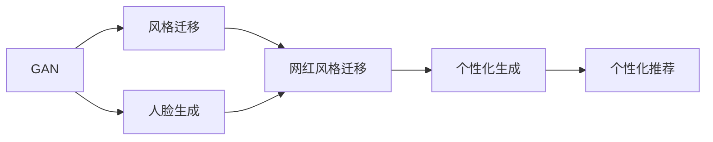

# 基于生成对抗网络的网络红人风格迁移与个性化生成

## 1. 背景介绍

### 1.1 网络红人的兴起与影响力

近年来,随着社交媒体和短视频平台的蓬勃发展,网络红人这一群体迅速崛起。他们凭借个人魅力、独特风格和创意内容,在网络世界获得了大量粉丝,成为备受关注的意见领袖。网络红人不仅改变了内容生产和传播方式,也对广告营销、电子商务等行业产生了深远影响。

### 1.2 AI技术在内容创作领域的应用

人工智能技术的快速发展为内容创作领域带来了新的可能性。机器学习算法可以从海量数据中学习和提取特征,自动生成文本、图像、音频等多媒体内容。特别是生成对抗网络(GAN)的出现,使得AI生成的内容质量和真实性大幅提升,在风格迁移、人脸生成等方面取得了令人瞩目的成果。

### 1.3 网红风格迁移与个性化生成的意义

将AI技术应用于网络红人风格迁移和个性化生成,有助于实现内容创作的自动化和个性化。通过学习网红的风格特征,AI可以生成与之相似的图像、视频等内容,降低内容制作成本,提高生产效率。同时,个性化生成技术可以根据用户的喜好和特点,定制化生成符合其口味的内容,提升用户体验和粘性。这对于内容平台、MCN机构等行业参与者具有重要价值。

## 2. 核心概念与联系

### 2.1 生成对抗网络(GAN)

生成对抗网络由生成器(Generator)和判别器(Discriminator)两部分组成。生成器负责生成逼真的样本,判别器则判断样本是真实的还是生成的。两者在训练过程中互相博弈,最终使生成器能够生成以假乱真的样本。GAN常用于图像生成、风格迁移等任务。

### 2.2 风格迁移

风格迁移指将一张图像的风格特征迁移到另一张图像上,使其呈现出相似的视觉效果。常见的风格迁移方法有基于特征的方法和基于GAN的方法。前者通过最小化内容图像和风格图像在特征空间的差异实现,后者则利用GAN的生成能力合成风格迁移后的图像。

### 2.3 个性化推荐

个性化推荐是根据用户的兴趣爱好、历史行为等信息,向其推荐感兴趣的内容或商品。常用的推荐算法包括协同过滤、基于内容的推荐和组合推荐等。个性化推荐可提高用户满意度和平台收益。

### 2.4 人脸生成

人脸生成是指利用AI算法自动合成逼真的人脸图像。基于GAN的人脸生成方法,如PGGAN、StyleGAN等,可以生成高分辨率、细节丰富的人脸,并支持属性编辑和风格混合。人脸生成技术在虚拟人物创建、影视后期等领域有广泛应用。

以下是这些核心概念之间的联系:



## 3. 核心算法原理与具体操作步骤

### 3.1 基于GAN的风格迁移算法

#### 3.1.1 CycleGAN

CycleGAN通过两个GAN网络实现双向风格迁移。其核心思想是引入循环一致性损失,保证原图像经过两次风格转换后尽可能接近原图像。具体步骤如下:

1. 定义两个生成器G_XtoY和G_YtoX,分别完成X域到Y域和Y域到X域的风格转换。
2. 定义两个判别器D_X和D_Y,分别判断X域和Y域中的图像是真实的还是生成的。
3. 训练过程中,优化如下损失函数:
   - 对抗损失:生成器尽可能欺骗判别器,判别器尽可能区分真实图像和生成图像。
   - 循环一致性损失:G_YtoX(G_XtoY(X)) ≈ X, G_XtoY(G_YtoX(Y)) ≈ Y。
   - 身份映射损失:G_XtoY(Y) ≈ Y, G_YtoX(X) ≈ X,防止生成器过度改变图像内容。
4. 测试阶段,用训练好的生成器G_XtoY或G_YtoX完成风格迁移。

#### 3.1.2 StarGAN

StarGAN是一种用于多域图像转换的统一框架。与CycleGAN不同,StarGAN只需一个生成器和一个判别器,可同时处理多个属性的转换。具体步骤如下:

1. 定义生成器G和判别器D。生成器以图像和目标域标签为输入,判别器同时预测图像的真假和域标签。
2. 训练过程中,优化如下损失函数:  
   - 对抗损失:生成器尽可能欺骗判别器,判别器尽可能区分真实图像和生成图像。
   - 域分类损失:判别器尽可能准确预测图像的域标签。
   - 重构损失:G(G(x, c), c') ≈ x,其中c'为原始域标签。该损失用于保持图像内容不变。
3. 测试阶段,用训练好的生成器G完成风格迁移,输入图像和目标域标签即可得到转换后的图像。

### 3.2 个性化生成算法

#### 3.2.1 PGAN

PGAN是一种支持个性化生成的GAN模型。其核心思想是引入个性化向量作为生成器和判别器的附加输入,从而控制生成结果的个性化特征。具体步骤如下:

1. 定义生成器G和判别器D,它们除了接收随机噪声和真实图像外,还接收个性化向量作为输入。
2. 训练过程中,优化如下损失函数:
   - 对抗损失:生成器尽可能欺骗判别器,判别器尽可能区分真实图像和生成图像。
   - 个性化重构损失:G(z, p) ≈ x,其中z为随机噪声,p为个性化向量,x为真实图像。该损失保证生成图像符合个性化特征。
3. 测试阶段,用训练好的生成器G完成个性化生成,输入随机噪声和目标个性化向量即可得到对应的个性化图像。

#### 3.2.2 AdaIN

AdaIN是一种基于自适应实例归一化的风格迁移方法。与传统方法不同,AdaIN可以根据参考图像动态调整内容图像的风格特征,实现更加灵活的风格迁移。具体步骤如下:

1. 将内容图像和风格图像分别输入预训练的编码器,得到它们的特征表示。
2. 对内容特征进行自适应实例归一化:
   - 计算风格特征的均值和方差。
   - 对内容特征进行归一化,再用风格特征的均值和方差进行缩放和平移。
3. 将归一化后的内容特征输入解码器,得到风格迁移后的图像。
4. 训练过程中,优化重构损失和感知损失,使生成图像在内容和风格上都与目标图像接近。

AdaIN可以根据不同风格图像生成个性化的风格化结果,适用于支持用户自定义风格的应用场景。

## 4. 数学模型与公式详解

### 4.1 GAN的数学模型

GAN的目标是学习数据分布 $p_{data}(x)$,其中 $x$ 为真实样本。生成器 $G(z)$ 将随机噪声 $z$ 映射为生成样本,判别器 $D(x)$ 判断样本是真实的还是生成的。训练过程可表示为如下的极小极大博弈:

$$\min_G \max_D V(D, G) = \mathbb{E}_{x \sim p_{data}(x)}[\log D(x)] + \mathbb{E}_{z \sim p_z(z)}[\log(1 - D(G(z)))]$$

其中 $p_z(z)$ 为随机噪声的先验分布,通常为标准正态分布。生成器和判别器轮流优化,最终达到纳什均衡,即生成器可以生成与真实样本无法区分的样本。

### 4.2 CycleGAN的损失函数

CycleGAN的损失函数包括对抗损失、循环一致性损失和身份映射损失。以 $X$ 到 $Y$ 的风格迁移为例,损失函数定义如下:

- 对抗损失:
  $$L_{GAN}(G_{XtoY}, D_Y, X, Y) = \mathbb{E}_{y \sim p_{data}(y)}[\log D_Y(y)] + \mathbb{E}_{x \sim p_{data}(x)}[\log(1 - D_Y(G_{XtoY}(x)))]$$

- 循环一致性损失:
  $$L_{cyc}(G_{XtoY}, G_{YtoX}) = \mathbb{E}_{x \sim p_{data}(x)}[||G_{YtoX}(G_{XtoY}(x)) - x||_1] + \mathbb{E}_{y \sim p_{data}(y)}[||G_{XtoY}(G_{YtoX}(y)) - y||_1]$$

- 身份映射损失:
  $$L_{identity}(G_{XtoY}, G_{YtoX}) = \mathbb{E}_{x \sim p_{data}(x)}[||G_{YtoX}(x) - x||_1] + \mathbb{E}_{y \sim p_{data}(y)}[||G_{XtoY}(y) - y||_1]$$

最终的损失函数为:

$$L(G_{XtoY}, G_{YtoX}, D_X, D_Y) = L_{GAN}(G_{XtoY}, D_Y, X, Y) + L_{GAN}(G_{YtoX}, D_X, Y, X) + \lambda L_{cyc}(G_{XtoY}, G_{YtoX}) + \gamma L_{identity}(G_{XtoY}, G_{YtoX})$$

其中 $\lambda$ 和 $\gamma$ 为平衡不同损失项的超参数。

### 4.3 AdaIN的特征变换公式

AdaIN的核心是自适应实例归一化,对给定的内容特征 $f_c$ 和风格特征 $f_s$,AdaIN的特征变换公式为:

$$AdaIN(f_c, f_s) = \sigma(f_s) \left(\frac{f_c - \mu(f_c)}{\sigma(f_c)}\right) + \mu(f_s)$$

其中 $\mu(·)$ 和 $\sigma(·)$ 分别表示特征的均值和标准差。AdaIN首先对内容特征进行实例归一化,再用风格特征的均值和标准差进行缩放和平移,使其具有与风格特征相似的统计特性。

通过以上数学模型和公式,我们可以更深入地理解GAN、CycleGAN和AdaIN的原理,为算法的实现和优化提供理论基础。

## 5. 项目实践:代码实例与详解

下面以PyTorch为例,给出基于CycleGAN的网红风格迁移的关键代码实现。

### 5.1 生成器和判别器的定义

```python
class Generator(nn.Module):
    def __init__(self, input_nc, output_nc, ngf=64, n_blocks=6):
        super(Generator, self).__init__()
        # 定义生成器的结构,包括编码器、转换器和解码器
        self.encoder = self._make_encoder(input_nc, ngf, n_blocks)
        self.transformer = self._make_transformer(ngf)
        self.decoder = self._make_decoder(output_nc, ngf, n_blocks)
    
    def _make_encoder(self, input_nc, ngf, n_blocks):
        # 编码器由多个卷积层和LeakyReLU激活函数组成
        layers = [nn.Conv2d(input_nc, ngf, 4, 2, 1), nn.LeakyReLU(0.2, True)]
        for i in range(n_blocks):
            layers += [nn.Conv2d(ngf, ngf*2, 4, 2, 1), nn.InstanceNorm2d(ngf*2), nn.LeakyReLU(0.2, True)]
            ngf *= 2
        return nn.Sequential(*layers)

    def _make_transformer(self, ngf):
        # 转换器由多个残差块组成,用于提取高级特征
        layers = [ResidualBlock(ngf) for _ in range(6)]
        return nn.Sequential(*layers) 

    def _make