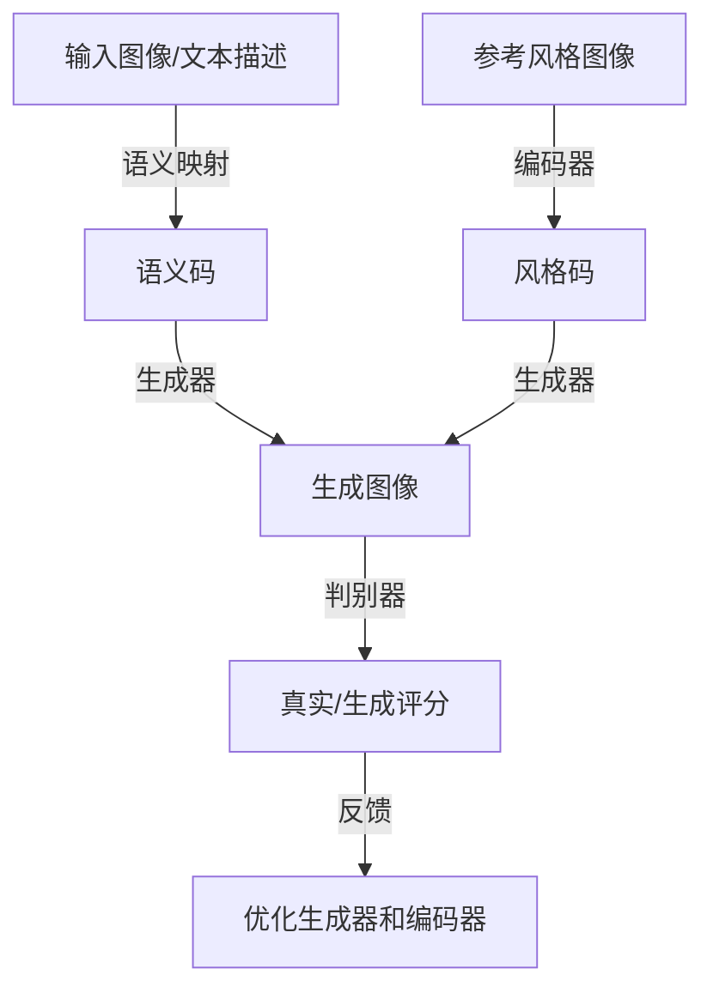

# 基于生成对抗网络的风格多样化图像生成平台

## 1.背景介绍

### 1.1 图像生成的重要性

在当今的数字时代,图像数据无处不在,从社交媒体到医疗影像,再到卫星遥感等领域。图像生成技术在多个领域扮演着重要角色,如数据增强、内容创作、虚拟现实等。高质量的图像生成技术不仅可以提高现有应用的性能,还能催生全新的应用场景。

### 1.2 图像生成的挑战

尽管近年来深度学习技术的飞速发展推动了图像生成领域的进步,但仍面临诸多挑战:

- 生成图像质量不高、缺乏细节
- 缺乏多样性,生成结果过于单一
- 控制生成图像风格的能力有限
- 生成过程缓慢、计算资源需求大

### 1.3 生成对抗网络(GAN)

生成对抗网络是一种由两个神经网络模型组成的框架,包括生成器(Generator)和判别器(Discriminator)。两个模型相互对抗,生成器学习生成逼真的图像以欺骗判别器,而判别器则努力区分生成图像和真实图像。这种对抗训练的方式驱使生成器不断提高图像质量。

GAN自2014年被提出以来,在图像生成领域取得了突破性进展,但也存在训练不稳定、模式崩溃等问题。研究人员提出了各种改进的GAN变体来解决这些挑战。

## 2.核心概念与联系  

### 2.1 生成对抗网络的核心思想

生成对抗网络(GAN)的核心思想是将图像生成问题建模为一个minimax博弈:

$$\min_G \max_D V(D,G) = \mathbb{E}_{x\sim p_{data}(x)}[\log D(x)] + \mathbb{E}_{z\sim p_z(z)}[\log(1-D(G(z)))]$$

其中:
- $G$是生成器,将随机噪声$z$映射到图像空间,生成假图像$G(z)$
- $D$是判别器,将真实图像$x$和生成图像$G(z)$映射到[0,1]区间,判断输入是真是假
- $p_{data}(x)$是真实数据分布, $p_z(z)$是噪声分布,通常为高斯分布

生成器$G$和判别器$D$相互对抗,生成器努力生成足以欺骗判别器的逼真图像,而判别器则努力区分生成图像和真实图像。这种对抗性训练驱使生成器不断改进,最终达到生成高质量图像的目标。

### 2.2 条件生成对抗网络

基本的GAN只能无条件地生成图像,无法控制生成图像的属性。条件生成对抗网络(CGAN)引入了条件信息,使生成器能根据条件信息(如类别标签、文本描述等)生成特定类型的图像。

CGAN的生成器和判别器的输入都包含条件信息$y$,对抗目标函数改写为:

$$\min_G \max_D V(D,G) = \mathbb{E}_{x\sim p_{data}(x)}[\log D(x|y)] + \mathbb{E}_{z\sim p_z(z)}[\log(1-D(G(z|y)|y))]$$

通过条件信息,CGAN可控制生成图像的属性,但仍难以灵活控制图像风格。

### 2.3 风格迁移与风格编码

风格迁移(Style Transfer)技术可将一种艺术风格迁移到另一幅图像上,赋予图像新的视觉风格。例如,将梵高的画风应用到一张照片上。

风格编码(Style Encoding)则是从参考图像中提取风格码(Style Code),并将其输入生成器,使生成图像具有参考图像的风格特征。通过改变风格码,可灵活控制生成图像的风格。

### 2.4 图像到图像的翻译

图像到图像的翻译(Image-to-Image Translation)是将一种图像转换为另一种形式的图像,如将素描图像上色、将夏季风景转换为冬季场景等。这类问题可建模为条件生成对抗网络。

条件生成对抗网络和风格编码技术为风格多样化图像生成奠定了理论基础。

## 3.核心算法原理具体操作步骤

基于生成对抗网络的风格多样化图像生成平台,通常包含以下几个核心组件:

1. **编码器(Encoder)**: 将参考图像编码为风格码,捕获图像的风格特征。
2. **生成器(Generator)**: 将输入的语义码(Semantic Code)和风格码(Style Code)融合,生成具有特定语义和风格的图像。
3. **判别器(Discriminator)**: 判断输入图像是真实的还是生成的,并对生成图像的质量给出反馈。
4. **语义映射(Semantic Mapping)**: 将输入图像或文本描述映射为语义码,捕获图像内容或文本语义信息。

以下是该系统的核心算法步骤:



1. **语义映射**: 将输入图像或文本描述映射为语义码,捕获输入的内容或语义信息。
2. **编码器**: 将参考风格图像输入编码器,提取其风格特征,得到风格码。
3. **生成器**: 将语义码和风格码融合,生成具有特定内容和风格的图像。
4. **判别器**: 判别器将真实图像和生成图像作为输入,判断它们是真实的还是生成的,并给出真实性评分。
5. **反馈与优化**: 根据判别器的评分,优化生成器和编码器的参数,提高生成图像质量和风格一致性。

通过端到端的训练,该系统能够生成具有多样化风格且语义信息准确的高质量图像。

## 4.数学模型和公式详细讲解举例说明

### 4.1 生成对抗网络的目标函数

生成对抗网络的目标函数基于最小化生成器和判别器的对抗性损失:

$$\min_G \max_D V(D,G) = \mathbb{E}_{x\sim p_{data}(x)}[\log D(x)] + \mathbb{E}_{z\sim p_z(z)}[\log(1-D(G(z)))]$$

其中:
- $D(x)$表示判别器对真实图像$x$的真实性评分
- $D(G(z))$表示判别器对生成器生成的假图像$G(z)$的真实性评分
- 生成器$G$旨在最小化$\log(1-D(G(z)))$,即最大化判别器对生成图像的真实性评分
- 判别器$D$旨在最大化$\log D(x)$和$\log(1-D(G(z)))$,即正确判别真实图像和生成图像

在实践中,通常采用替代目标函数来提高训练稳定性,如最小二乘GAN、Wasserstein GAN等。

### 4.2 条件生成对抗网络

为控制生成图像的属性,引入了条件生成对抗网络(CGAN),其目标函数为:

$$\min_G \max_D V(D,G) = \mathbb{E}_{x\sim p_{data}(x)}[\log D(x|y)] + \mathbb{E}_{z\sim p_z(z)}[\log(1-D(G(z|y)|y))]$$

其中$y$是条件信息,如类别标签或文本描述。生成器和判别器在生成或判别时,都会利用条件信息$y$。

### 4.3 风格编码损失函数

为了使生成图像具有参考风格图像的风格特征,引入了风格编码损失函数。假设$E$是编码器,将参考风格图像$x_s$编码为风格码$s=E(x_s)$。则风格编码损失函数为:

$$\mathcal{L}_{\text{style}}(G,E) = \mathbb{E}_{x_c\sim p_{data}(x),x_s\sim q(x)}\left[\left\|s-E(G(z,s,c))\right\|_1\right]$$

其中:
- $x_c$是内容图像,用于提供语义码$c$
- $x_s$是风格参考图像
- $z$是随机噪声
- $s=E(x_s)$是从风格参考图像编码得到的风格码
- $G(z,s,c)$是生成器输出,融合了噪声$z$、风格码$s$和语义码$c$
- $\left\|s-E(G(z,s,c))\right\|_1$是生成图像的风格码与参考风格码之间的$L_1$距离

通过最小化风格编码损失,可使生成图像具有参考风格图像的风格特征。

### 4.4 多损失函数优化

为生成高质量、多样化的图像,该系统通常使用多个损失函数的加权求和进行联合优化:

$$\mathcal{L} = \lambda_1\mathcal{L}_{\text{adv}} + \lambda_2\mathcal{L}_{\text{style}} + \lambda_3\mathcal{L}_{\text{percept}} + \lambda_4\mathcal{L}_{\text{content}}$$

其中:
- $\mathcal{L}_{\text{adv}}$是对抗性损失,驱使生成图像更加逼真
- $\mathcal{L}_{\text{style}}$是风格编码损失,使生成图像具有参考风格
- $\mathcal{L}_{\text{percept}}$是感知损失,提高生成图像的清晰度和细节
- $\mathcal{L}_{\text{content}}$是内容损失,确保生成图像保留了输入语义信息
- $\lambda_1,\lambda_2,\lambda_3,\lambda_4$是各损失函数的权重系数

通过联合优化多个损失函数,可平衡生成图像的逼真度、风格一致性、清晰度和内容保真度。

### 4.5 实例和可视化说明

以下是一个基于CGAN的风格迁移示例,将梵高的风格应用到一张风景照片上:

输入内容图像:


输入风格参考图像(梵高的作品):


生成图像:


可以看到,生成图像保留了内容图像的语义内容(风景),同时获得了风格参考图像(梵高画作)的笔触风格。

## 5.项目实践: 代码实例和详细解释说明

以下是一个使用PyTorch实现的基于CGAN的风格迁移示例代码,供参考:

```python
import torch
import torch.nn as nn

# 定义生成器
class Generator(nn.Module):
    def __init__(self, input_dim, output_dim):
        super(Generator, self).__init__()
        self.fc1 = nn.Linear(input_dim, 256)
        self.bn1 = nn.BatchNorm1d(256)
        self.fc2 = nn.Linear(256, 512)
        self.bn2 = nn.BatchNorm1d(512)
        self.fc3 = nn.Linear(512, output_dim)

    def forward(self, x):
        x = F.relu(self.bn1(self.fc1(x)))
        x = F.relu(self.bn2(self.fc2(x)))
        x = self.fc3(x)
        return x

# 定义判别器
class Discriminator(nn.Module):
    def __init__(self, input_dim):
        super(Discriminator, self).__init__()
        self.fc1 = nn.Linear(input_dim, 512)
        self.fc2 = nn.Linear(512, 256)
        self.fc3 = nn.Linear(256, 1)

    def forward(self, x):
        x = F.leaky_relu(self.fc1(x), 0.2)
        x = F.leaky_relu(self.fc2(x), 0.2)
        x = torch.sigmoid(self.fc3(x))
        return x

# 定义损失函数
bce_loss = nn.BCELoss()

# 初始化生成器和判别器
generator = Generator(input_dim, output_