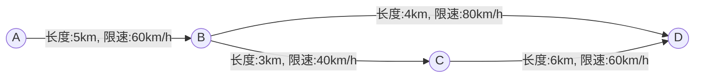

# 基于轨迹数据的最优路径推荐算法设计与实现

## 1. 背景介绍

### 1.1 路径规划的重要性

在现代社会中,交通出行是人们日常生活的重要组成部分。无论是通勤、购物还是休闲娱乐,人们都需要在城市中穿梭往返。然而,由于城市规模的不断扩大和交通网络的日益复杂,寻找最优路径成为了一个棘手的问题。传统的导航系统往往只考虑最短路径或最快路径,但忽视了交通拥堵、路况和个人偏好等重要因素。因此,开发一种能够综合考虑多种因素的智能路径规划算法,对于缓解交通压力、提高出行效率和改善城市生活质量至关重要。

### 1.2 轨迹数据的应用

随着移动设备和位置服务的普及,大量的轨迹数据被收集和存储。轨迹数据记录了移动对象在特定时间和空间下的位置信息,包括GPS坐标、时间戳和速度等。这些海量的轨迹数据蕴含着丰富的交通信息,如路况、拥堵程度和流量模式等,为智能路径规划提供了宝贵的数据支持。通过对轨迹数据的分析和挖掘,我们可以更好地了解城市交通状况,从而优化路径规划算法。

### 1.3 最优路径推荐的挑战

设计一种高效的最优路径推荐算法面临着诸多挑战:

1. **数据规模**:现代城市中的轨迹数据规模庞大,需要高效的数据处理和存储技术。
2. **多目标优化**:路径规划需要考虑多个目标,如距离、时间、拥堵程度和费用等,需要合理权衡和优化。
3. **动态环境**:交通状况是动态变化的,算法需要实时响应并适应路况的变化。
4. **个性化偏好**:不同用户对路径的偏好不尽相同,算法需要满足个性化需求。
5. **可解释性**:算法的决策过程应当具有可解释性,以便用户理解和信任推荐结果。

本文将介绍一种基于轨迹数据的最优路径推荐算法,旨在解决上述挑战,为用户提供个性化、高效和可靠的路径规划方案。

## 2. 核心概念与联系

### 2.1 轨迹数据

轨迹数据是描述移动对象在特定时空下位置变化的一系列时空序列。每个轨迹数据点通常包括以下信息:

- 对象ID
- 时间戳
- 经纬度坐标
- 速度
- 方向角
- ...

通过分析轨迹数据,我们可以获取移动对象的运动模式、速度变化、停留点等丰富信息,为路径规划提供宝贵的数据支持。

### 2.2 路网图

路网图是对现实世界道路网络的抽象表示,由节点(Node)和边(Edge)组成。节点表示路口或特殊地点,边表示道路段。每条边都有相应的属性,如长度、容量、限速等,用于描述道路的物理特征。路网图为路径规划算法提供了基础的网络拓扑结构。

### 2.3 路径规划

路径规划是指在给定的起点和终点之间,根据特定的优化目标(如最短距离、最短时间等),寻找一条或多条最优路径的过程。传统的路径规划算法包括Dijkstra算法、A*算法等,但它们通常只考虑了单一目标,无法满足现实场景中的多目标优化需求。

### 2.4 多目标优化

多目标优化(Multi-Objective Optimization)旨在在存在多个冲突目标的情况下,寻找最优解或最优解集。在路径规划中,我们需要同时考虑距离、时间、拥堵程度、费用等多个目标,并根据用户偏好进行权衡和优化。多目标优化算法通常采用启发式或进化算法,如遗传算法、蚁群算法等,以求解此类复杂的组合优化问题。

### 2.5 个性化推荐

个性化推荐系统旨在根据用户的偏好、历史记录和上下文信息,为用户推荐最合适的内容或服务。在路径规划中,不同用户对路径的偏好存在差异,如有的用户偏好最短距离,有的用户偏好最短时间,还有的用户更关注费用或舒适度。个性化推荐算法可以通过学习用户偏好,为每个用户推荐最合适的路径。

上述核心概念相互关联,共同构建了基于轨迹数据的最优路径推荐算法的理论基础。下一节将详细介绍算法的原理和具体实现步骤。

## 3. 核心算法原理具体操作步骤

基于轨迹数据的最优路径推荐算法主要包括以下几个核心步骤:

1. **轨迹数据预处理**
2. **路网图构建**
3. **路径代价计算**
4. **多目标优化求解**
5. **个性化推荐**

### 3.1 轨迹数据预处理

由于原始轨迹数据通常存在噪声、缺失值和异常点等问题,因此需要进行数据清洗和预处理,以提高数据质量。常用的预处理技术包括:

1. **噪声去除**:使用滤波算法(如卡尔曼滤波、均值滤波等)去除GPS数据中的噪声。
2. **缺失值插补**:通过插值或机器学习模型预测缺失的GPS点。
3. **轨迹分段**:将轨迹按照停留点或方向变化等特征进行分段,提取出有效的移动轨迹片段。
4. **Map Matching**:将GPS点匹配到实际的道路网络上,修正偏移误差。
5. **语义信息提取**:从轨迹数据中提取出交通模式、拥堵程度等语义信息。

经过预处理后的高质量轨迹数据,可以为后续的路径规划提供更加准确和可靠的数据支持。

### 3.2 路网图构建

基于实际的道路网络数据(如OpenStreetMap等),我们可以构建一个加权的路网图$G(V, E)$,其中$V$表示节点集合(路口或特殊地点),$E$表示边集合(道路段)。每条边$e_{ij} \in E$都有相应的属性,如长度$l_{ij}$、容量$c_{ij}$、限速$v_{ij}$等,用于描述道路的物理特征。

在构建路网图的过程中,我们还需要将预处理后的轨迹数据与路网图相关联,为每条边赋予实时的交通状态信息,如流量、速度等。这可以通过将轨迹投影到对应的路段上来实现。

### 3.3 路径代价计算

对于给定的起点$s$和终点$t$,我们需要计算从$s$到$t$的所有可能路径的代价,作为多目标优化的输入。路径代价通常包括以下几个方面:

1. **距离代价**:路径的总距离,即所有边长度之和。

$$
C_d(p) = \sum_{e_{ij} \in p} l_{ij}
$$

2. **时间代价**:根据路径上每条边的实时速度,估计路径的行驶时间。

$$
C_t(p) = \sum_{e_{ij} \in p} \frac{l_{ij}}{v_{ij}}
$$

3. **拥堵代价**:根据轨迹数据估计路径上的拥堵程度,可以使用平均速度、行驶时间等指标。
4. **费用代价**:如果考虑收费道路,需要计算路径上的总费用。
5. **舒适度代价**:评估路径的舒适程度,可以考虑路面质量、转弯次数等因素。

不同的代价函数可以根据实际需求进行定制和组合,形成一个多目标优化问题。

### 3.4 多目标优化求解

有了路径代价的计算模型,我们就可以将最优路径规划问题形式化为一个多目标优化问题:

$$
\begin{aligned}
\min\quad & f(p) = (C_d(p), C_t(p), C_c(p), \ldots) \\
\text{s.t.}\quad & p \in \mathcal{P}_{st}
\end{aligned}
$$

其中,$f(p)$是需要优化的多个目标函数,$\mathcal{P}_{st}$是从$s$到$t$的所有可能路径集合。

由于多目标优化问题通常没有单一的最优解,我们需要寻找一个近似的Pareto前沿解集,即在所有目标上都不能被其他解所优化的非支配解集合。常用的多目标优化算法包括:

1. **加权求和法**:将多个目标函数线性组合为单目标优化问题,通过调整权重来近似Pareto前沿。
2. **进化算法**:如NSGA-II(Non-dominated Sorting Genetic Algorithm)、MOEA/D(Multi-Objective Evolutionary Algorithm based on Decomposition)等,通过模拟自然进化过程来求解多目标优化问题。
3. **蚁群算法**:模拟蚂蚁觅食行为,通过信息素机制协作求解最优路径。
4. **贪婪算法**:如蚁群系统(Ant Colony System)等,通过构造启发式函数来逐步生成近似最优解。

在实际应用中,我们可以根据问题的特点和计算资源,选择合适的多目标优化算法。

### 3.5 个性化推荐

得到近似的Pareto前沿解集合后,我们还需要根据用户的个性化偏好,为每个用户推荐最合适的路径。这可以通过以下步骤实现:

1. **用户偏好建模**:通过用户的历史路径选择、反馈评分等数据,使用机器学习模型(如协同过滤、矩阵分解等)来学习用户的偏好。
2. **多目标决策**:将用户偏好映射为多目标优化问题中的权重向量,并在Pareto前沿解集中选择最优解。
3. **上下文感知**:除了用户长期偏好,还需要考虑当前的上下文信息,如出行目的、天气、时间等,动态调整路径推荐策略。
4. **解释性**:为了提高用户对推荐结果的信任度,算法应当具有一定的可解释性,解释推荐路径的优缺点和权衡过程。

通过个性化推荐,我们可以为每个用户提供最合适的路径方案,提高出行体验和决策质量。

上述算法步骤共同构建了一个完整的基于轨迹数据的最优路径推荐系统。下一节将介绍算法在实际项目中的应用。

## 4. 数学模型和公式详细讲解举例说明

在前一节中,我们介绍了最优路径推荐算法的核心步骤,其中涉及到了一些数学模型和公式。本节将对这些数学模型和公式进行更加详细的讲解和举例说明。

### 4.1 路网图表示

我们使用一个加权有向图$G(V, E)$来表示实际的道路网络,其中$V$是节点集合(路口或特殊地点),$E$是边集合(道路段)。每条边$e_{ij} \in E$都有相应的属性,如长度$l_{ij}$、容量$c_{ij}$、限速$v_{ij}$等,用于描述道路的物理特征。

例如,下图是一个简单的路网图示例:

在这个路网图中,有4个节点(A、B、C、D)和4条边(AB、BC、BD、CD)。每条边都标注了长度和限速信息。

### 4.2 路径代价计算

对于给定的起点$s$和终点$t$,我们需要计算从$s$到$t$的所有可能路径的代价,作为多目标优化的输入。常见的路径代价包括:

1. **距离代价**:路径的总距离,即所有边长度之和。

$$
C_d(p)