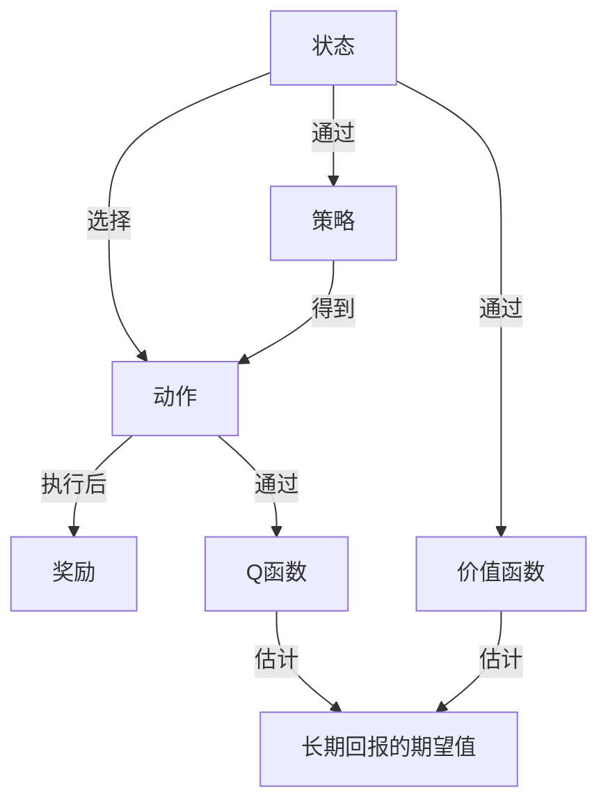

## 1.背景介绍

增强学习（Reinforcement Learning）是机器学习的一个重要分支，其基本思想是通过智能系统与环境的交互，利用环境给出的奖励或惩罚信息，调整系统的行为，以达到优化系统整体性能的目标。增强学习在各种复杂问题中都有广泛的应用，如机器人控制、自动驾驶、游戏AI等。

## 2.核心概念与联系

增强学习的核心概念主要包括：状态（State）、动作（Action）、奖励（Reward）、策略（Policy）、价值函数（Value Function）和Q函数（Q Function）。

- 状态（State）：描述智能系统当前的情况或位置。
- 动作（Action）：智能系统在某个状态下可以选择的行为。
- 奖励（Reward）：智能系统在某个状态下执行某个动作后，环境给出的反馈。
- 策略（Policy）：描述智能系统在某个状态下应选择哪个动作的规则。
- 价值函数（Value Function）：衡量在某个状态下，按照某策略执行动作的长期回报的期望值。
- Q函数（Q Function）：衡量在某个状态下，执行某个动作后按照某策略执行动作的长期回报的期望值。

这些概念之间的关系如下图所示：



## 3.核心算法原理具体操作步骤

增强学习的核心算法包括：Q-learning、SARSA、Deep Q Network（DQN）等。这里以Q-learning为例，介绍其具体操作步骤：

1. 初始化Q表格。
2. 对于每一个回合（episode）：
   1. 初始化状态$s$。
   2. 对于回合内的每一步：
      1. 根据Q表格和策略，选择动作$a$。
      2. 执行动作$a$，观察奖励$r$和新的状态$s'$。
      3. 更新Q表格：$Q(s,a) \leftarrow Q(s,a) + \alpha[r + \gamma \max_{a'}Q(s',a') - Q(s,a)]$。
      4. 更新状态：$s \leftarrow s'$。
   3. 直到回合结束。

## 4.数学模型和公式详细讲解举例说明

Q-learning的更新公式是：

$$
Q(s,a) \leftarrow Q(s,a) + \alpha[r + \gamma \max_{a'}Q(s',a') - Q(s,a)]
$$

其中，$s$和$a$分别表示当前的状态和动作，$s'$表示执行动作$a$后的新状态，$r$表示执行动作$a$后得到的奖励，$\alpha$是学习率，$\gamma$是折扣因子，$\max_{a'}Q(s',a')$表示在新状态$s'$下，所有动作的Q值的最大值。

这个公式的含义是：新的Q值等于旧的Q值加上学习率乘以（实际得到的奖励加上折扣因子乘以预期的最大奖励减去旧的Q值）。

## 5.项目实践：代码实例和详细解释说明

下面是一个简单的Q-learning的Python代码实例：

```python
import numpy as np

# 初始化Q表格
Q = np.zeros([state_num, action_num])

# 参数设置
alpha = 0.5
gamma = 0.9
episode_num = 1000

# Q-learning
for episode in range(episode_num):
    # 初始化状态
    s = np.random.randint(state_num)
    while True:
        # 选择动作
        a = np.random.choice(np.where(Q[s, :] == np.max(Q[s, :]))[0])
        # 执行动作，得到奖励和新状态
        r, s_ = env.step(s, a)
        # 更新Q表格
        Q[s, a] = Q[s, a] + alpha * (r + gamma * np.max(Q[s_, :]) - Q[s, a])
        # 更新状态
        s = s_
        # 判断是否结束
        if env.is_end(s):
            break
```

这段代码首先初始化了Q表格和参数，然后在每一个回合中，选择动作，执行动作，更新Q表格，更新状态，直到回合结束。

## 6.实际应用场景

增强学习在许多实际应用场景中都有广泛的应用，如：

- 游戏AI：例如，DeepMind的AlphaGo就是通过增强学习打败了世界围棋冠军。
- 自动驾驶：通过增强学习，自动驾驶汽车可以学习如何在复杂的道路环境中安全有效地驾驶。
- 机器人控制：通过增强学习，机器人可以学习如何完成各种复杂的任务，如抓取物体、行走等。

## 7.工具和资源推荐

增强学习的学习和研究，推荐以下工具和资源：

- OpenAI Gym：一个用于开发和比较增强学习算法的工具包。
- TensorFlow：一个强大的深度学习框架，可以用于实现深度增强学习算法。
- "Reinforcement Learning: An Introduction"：Richard S. Sutton和Andrew G. Barto的经典教材，对增强学习的各种算法和理论进行了详细的介绍。

## 8.总结：未来发展趋势与挑战

增强学习是一个非常活跃的研究领域，未来的发展趋势包括：

- 深度增强学习：结合深度学习和增强学习，处理更复杂的问题。
- 多智能体增强学习：研究多个智能系统如何通过增强学习协同工作。
- 实时增强学习：研究在实时环境中进行增强学习的方法。

同时，也面临一些挑战，如：

- 稳定性和收敛性：如何保证增强学习算法的稳定性和收敛性。
- 采样效率：如何提高增强学习的采样效率。
- 探索和利用的平衡：如何在探索新的状态和动作与利用已知的信息之间找到平衡。

## 9.附录：常见问题与解答

Q：增强学习和监督学习有什么区别？

A：增强学习是通过智能系统与环境的交互，利用环境给出的奖励或惩罚信息，调整系统的行为，以达到优化系统整体性能的目标。而监督学习是通过已知的输入-输出对，学习一个映射函数，使得对于新的输入，可以预测出正确的输出。

Q：Q-learning和SARSA有什么区别？

A：Q-learning和SARSA都是增强学习的算法，区别在于更新Q值时，Q-learning使用的是最优策略，即在新状态下，所有动作的Q值的最大值；而SARSA使用的是实际策略，即在新状态下，实际选择的动作的Q值。

作者：禅与计算机程序设计艺术 / Zen and the Art of Computer Programming