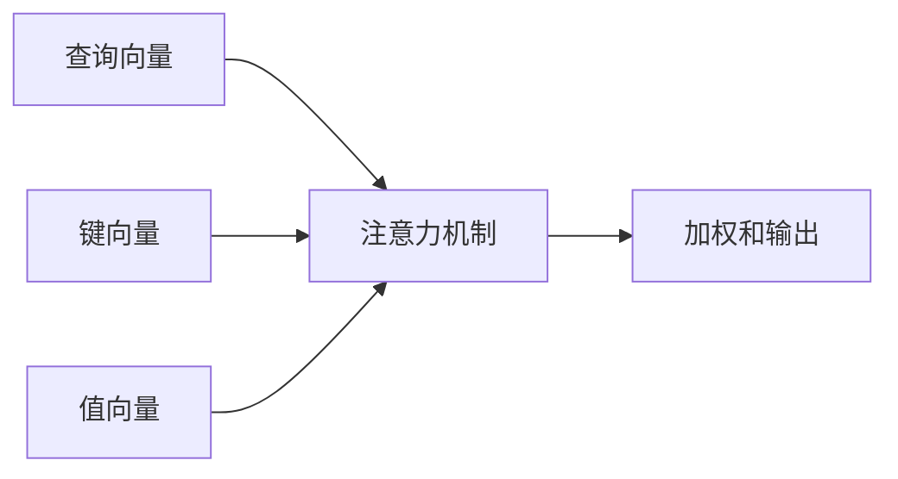
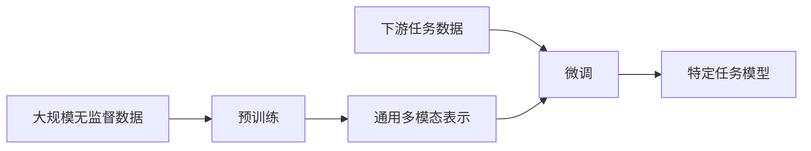

# 多模态大模型：技术原理与实战 图像多模态技术

## 1.背景介绍

### 1.1 多模态人工智能的兴起

在过去几年中,人工智能领域出现了一种新兴的范式,即多模态人工智能(Multimodal AI)。传统的人工智能系统通常专注于单一模态数据,如文本或图像。然而,现实世界中的信息通常以多种形式存在,包括文本、图像、视频、语音等。多模态人工智能旨在整合和处理这些异构数据,以实现更加智能和人性化的系统。

### 1.2 大模型时代的到来

与此同时,大模型(Large Model)也成为人工智能发展的重要趋势。通过在海量数据上进行预训练,大模型可以学习丰富的知识和语义表示,从而在下游任务中表现出卓越的性能。著名的大模型包括GPT-3、BERT、DALL-E等。

### 1.3 多模态大模型的重要性

将多模态和大模型相结合,形成了多模态大模型(Multimodal Large Model)。这种模型能够同时处理多种模态数据,并利用大规模预训练获得强大的表示能力。多模态大模型在诸多领域展现出巨大的潜力,如视觉问答、图像描述生成、多模态检索等,为人机交互带来全新的体验。

## 2.核心概念与联系

### 2.1 多模态表示学习

多模态表示学习(Multimodal Representation Learning)是多模态大模型的核心概念。它旨在学习一种统一的表示空间,将不同模态的数据映射到同一语义空间中,从而捕捉不同模态之间的相关性和互补性。

如上图所示,多模态表示学习的基本流程包括:

1. 输入数据:接收不同模态的原始数据,如文本、图像、视频等。
2. 模态特征提取器:对每种模态的数据进行特征提取,获得相应的特征表示。
3. 模态融合模块:将不同模态的特征表示进行融合,生成统一的多模态表示。
4. 统一表示空间:所有模态的数据被映射到同一语义空间中,捕捉模态间的关联。
5. 下游任务:基于统一的多模态表示,执行各种下游任务,如视觉问答、图像描述生成等。

### 2.2 注意力机制

注意力机制(Attention Mechanism)是多模态大模型中广泛采用的关键技术。它允许模型动态地聚焦于输入数据的不同部分,并根据上下文信息分配不同的权重。在多模态场景中,注意力机制可以帮助模型捕捉不同模态之间的相互作用,提高模型的表示能力。

如上图所示,注意力机制的基本原理是:

1. 查询向量(Query):表示当前需要关注的部分。
2. 键向量(Key):表示输入数据的不同部分。
3. 值向量(Value):对应于每个键向量的实际值。
4. 注意力机制根据查询向量和键向量的相似性,计算每个值向量的权重。
5. 加权和输出:将加权后的值向量相加,得到最终的注意力输出。

在多模态大模型中,注意力机制可以应用于不同模态之间的交互,捕捉模态间的相关性。例如,在图像描述生成任务中,注意力机制可以让模型关注图像中的不同区域,并根据这些区域生成相应的文本描述。

### 2.3 预训练与微调

预训练(Pre-training)和微调(Fine-tuning)是多模态大模型的关键训练范式。由于大模型需要在海量数据上进行训练,因此通常采用两阶段训练策略:

1. 预训练阶段:在大规模无监督数据上进行自监督学习,获得通用的多模态表示能力。
2. 微调阶段:在特定下游任务的监督数据上进行微调,使模型适应具体任务。

如上图所示,预训练和微调的流程包括:

1. 在大规模无监督数据上进行预训练,获得通用的多模态表示能力。
2. 将预训练模型作为初始化权重,在特定下游任务的监督数据上进行微调。
3. 微调后的模型可以适应具体的下游任务,提供更好的性能。

预训练和微调的范式可以充分利用大规模数据和有限的标注数据,实现模型的通用化和特定化,是多模态大模型取得卓越性能的关键。

## 3.核心算法原理具体操作步骤

### 3.1 Transformer 编码器-解码器架构

Transformer 编码器-解码器架构是多模态大模型中广泛采用的核心架构。它由两个主要部分组成:编码器(Encoder)和解码器(Decoder)。

如上图所示,Transformer 编码器-解码器架构的工作流程如下:

1. 输入数据:接收多模态输入数据,如文本、图像等。
2. 编码器:对输入数据进行编码,生成编码器输出。编码器通常由多层自注意力和前馈神经网络组成。
3. 编码器输出:编码器的输出表示,捕捉了输入数据的语义和上下文信息。
4. 解码器:接收编码器输出和目标任务的输入,生成最终的输出序列。解码器也由多层自注意力和交叉注意力组成。
5. 输出序列:根据目标任务,解码器生成相应的输出序列,如文本、图像等。

在多模态场景中,编码器可以处理不同模态的输入数据,而解码器则根据任务需求生成相应的输出。通过自注意力和交叉注意力机制,Transformer 架构可以有效捕捉模态内和模态间的依赖关系。

### 3.2 Vision Transformer (ViT)

Vision Transformer (ViT) 是一种应用于计算机视觉任务的 Transformer 模型。它将图像分割为多个补丁(Patch),并将每个补丁作为输入序列的一个元素,利用 Transformer 编码器对图像进行编码。

如上图所示,ViT 的工作流程如下:

1. 输入图像:接收原始图像作为输入。
2. 图像分割:将图像分割为多个固定大小的补丁。
3. 图像补丁序列:将每个补丁线性化,形成一个补丁序列。
4. Transformer 编码器:将补丁序列输入 Transformer 编码器,对图像进行编码。
5. 图像编码:Transformer 编码器的输出,表示图像的语义和上下文信息。
6. 下游任务:基于图像编码,执行各种计算机视觉任务,如图像分类、目标检测等。

ViT 的优点在于可以直接对原始图像进行建模,避免了传统卷积神经网络的手工设计特征提取器。通过自注意力机制,ViT 可以有效捕捉图像中的长程依赖关系,提高了模型的表示能力。

### 3.3 多模态融合策略

在多模态大模型中,如何有效融合不同模态的信息是一个关键问题。常见的多模态融合策略包括:

1. **早期融合**:在模型的底层将不同模态的特征进行拼接或加和,然后送入后续的网络层进行处理。这种方式简单直接,但可能会导致模态间信息的丢失。

2. **晚期融合**:对每种模态单独进行编码,然后在模型的顶层将不同模态的表示进行融合。这种方式保留了模态间的独立性,但可能无法充分捕捉模态间的交互关系。

3. **多层融合**:在模型的不同层次上进行多模态融合,捕捉不同粒度的模态交互信息。这种方式更加灵活和全面,但也增加了模型的复杂性。

4. **注意力融合**:利用注意力机制动态地融合不同模态的信息,根据上下文自适应地分配模态权重。这种方式可以有效捕捉模态间的相关性,是目前较为流行的融合策略。

不同的融合策略适用于不同的任务和场景,选择合适的融合方式对于多模态大模型的性能至关重要。

## 4.数学模型和公式详细讲解举例说明

### 4.1 自注意力机制

自注意力机制是 Transformer 模型的核心组件,它允许模型捕捉输入序列中任意两个位置之间的依赖关系。自注意力机制的数学表示如下:

$$
\mathrm{Attention}(Q, K, V) = \mathrm{softmax}\left(\frac{QK^T}{\sqrt{d_k}}\right)V
$$

其中:

- $Q$ 表示查询向量(Query)
- $K$ 表示键向量(Key)
- $V$ 表示值向量(Value)
- $d_k$ 是缩放因子,用于防止点积的值过大或过小

自注意力机制的计算过程如下:

1. 计算查询向量 $Q$ 和所有键向量 $K$ 的点积,得到一个注意力分数矩阵。
2. 对注意力分数矩阵进行缩放,防止梯度过大或过小。
3. 对缩放后的注意力分数矩阵进行 softmax 操作,得到注意力权重矩阵。
4. 将注意力权重矩阵与值向量 $V$ 相乘,得到加权和输出。

通过自注意力机制,模型可以动态地关注输入序列中的不同部分,捕捉长程依赖关系。在多模态大模型中,自注意力机制可以应用于不同模态之间的交互,捕捉模态间的相关性。

### 4.2 交叉注意力机制

在多模态场景中,除了自注意力机制之外,交叉注意力机制也扮演着重要角色。交叉注意力机制允许模型关注来自不同模态的信息,并融合这些信息。交叉注意力机制的数学表示如下:

$$
\mathrm{CrossAttention}(Q, K, V) = \mathrm{softmax}\left(\frac{QK^T}{\sqrt{d_k}}\right)V
$$

其中:

- $Q$ 表示查询模态的表示
- $K$ 表示键模态的表示
- $V$ 表示值模态的表示
- $d_k$ 是缩放因子

交叉注意力机制的计算过程与自注意力机制类似,但查询向量 $Q$ 和键向量 $K$ 来自不同的模态。通过交叉注意力机制,模型可以关注不同模态之间的相关性,并融合这些信息以生成最终的输出。

例如,在图像描述生成任务中,交叉注意力机制可以让模型关注图像中的不同区域,并根据这些区域生成相应的文本描述。查询向量 $Q$ 来自文本模态,键向量 $K$ 和值向量 $V$ 来自图像模态。通过交叉注意力机制,模型可以动态地融合图像和文本信息,生成准确的描述。

### 4.3 对比学习

对比学习(Contrastive Learning)是多模态大模型中常用的无监督预训练策略之一。它通过最大化相似样本之间的相似性,最小化不相似样本之间的相似性,来学习有效的数据表示。对比学习的损失函数可以表示为:

$$
\mathcal{L}_\mathrm{contrast} = -\log \frac{\exp