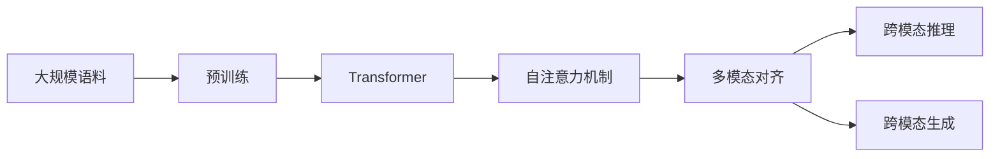

# 多模态大模型：技术原理与实战 在LLM时代，对软件研发的更多思考

## 1. 背景介绍
### 1.1 大模型的兴起
近年来,随着深度学习技术的不断突破,以Transformer为代表的大规模预训练语言模型(Large Pre-trained Language Models, LLMs)取得了令人瞩目的成就。从GPT、BERT到GPT-3、PaLM等,语言模型的参数规模和性能不断刷新记录。这些大模型展现出了惊人的自然语言理解和生成能力,在问答、对话、文本分类、摘要等任务上达到甚至超越人类的水平。

### 1.2 多模态大模型的发展
在LLM取得巨大成功的同时,多模态大模型也开始崭露头角。多模态学习旨在让机器同时理解和关联不同模态(如文本、图像、音频等)的信息,从而获得更全面、更贴近人类认知的理解能力。近期,OpenAI、DeepMind、谷歌等科技巨头纷纷推出多模态大模型,如DALL-E、Flamingo、Parti等,它们不仅能根据文本生成逼真的图像,还能完成图文问答、视觉推理等复杂任务。多模态大模型正在成为人工智能领域的新前沿。

### 1.3 对软件研发的影响与思考
大模型的崛起,尤其是多模态大模型的出现,预示着人工智能正在向通用人工智能(AGI)迈进。这对软件研发领域产生了深远影响:

1. 智能化程度大幅提升:大模型可以作为智能助手参与需求分析、架构设计、编码实现、测试等研发环节,大大提高开发效率和质量。
2. 开发模式的变革:代码生成、自动化测试等大模型驱动的新型研发模式正在兴起,传统的软件工程流程面临重塑。
3. 技术栈的转变:机器学习、知识图谱等AI技术将成为未来软件研发的核心竞争力,开发者需要掌握更多跨学科技能。
4. 应用场景的拓展:多模态大模型让计算机拥有理解图像、视频等非结构化数据的能力,大大拓宽了软件应用的边界。

本文将深入探讨多模态大模型的技术原理,并结合实战案例,分析其给软件研发带来的机遇与挑战。站在LLM时代的风口,开发者需要拥抱变革,提升认知,方能驾驭智能新浪潮。

## 2. 核心概念与联系
### 2.1 大模型与预训练
大模型通常是指参数量达到亿级甚至千亿级的超大规模机器学习模型。与传统的面向特定任务的小模型不同,大模型采用了预训练(Pre-training)的范式。即首先在大规模无标注数据上进行自监督学习,让模型自主学习数据的内在模式和规律,建立起庞大的先验知识;然后再在下游任务的小样本数据上进行微调(Fine-tuning),使模型快速适应具体任务。预训练让大模型具备了惊人的泛化能力和少样本学习能力。

### 2.2 Transformer与自注意力
Transformer是大模型的核心架构,其最大的创新在于自注意力机制(Self-Attention)。传统的RNN/CNN等模型只能建模局部、顺序的依赖关系,而自注意力可以直接计算任意两个位置之间的相关性,更高效地捕捉长距离依赖。自注意力的计算公式为:
$$Attention(Q,K,V) = softmax(\frac{QK^T}{\sqrt{d_k}})V$$
其中Q、K、V分别表示Query、Key、Value矩阵,$d_k$为Key的维度。通过自注意力,Transformer可以并行建模输入序列的全局语义,极大提升了建模能力。

### 2.3 多模态学习与跨模态对齐
多模态学习的目标是让模型理解不同模态数据之间的内在联系,形成一个统一的语义空间。其核心是跨模态对齐,即将不同模态的表示映射到一个共享的嵌入空间,使得语义相似的数据在嵌入空间中距离较近。常见的跨模态对齐方法包括:

- 对比学习:通过最大化正样本对的相似度、最小化负样本对的相似度,来拉近同语义数据的距离。
- 对偶学习:让模型互相生成另一模态的数据,如根据文本生成图像、根据图像生成文本,通过重构损失来学习对齐。
- 共同嵌入:直接将不同模态的数据映射到同一个嵌入空间,通过嵌入空间的约束来实现对齐。

多模态大模型通过海量数据的预训练,建立起强大的跨模态对齐能力,可以灵活地在不同模态间进行推理和生成。

### 2.4 核心概念之间的联系
下图展示了多模态大模型的核心概念之间的联系:

大规模语料经过预训练,通过Transformer的自注意力机制建模不同模态数据的关联,学习到跨模态对齐的统一语义表示,从而实现灵活的跨模态推理和生成。这些环节相辅相成,共同构建起多模态大模型的核心框架。

## 3. 核心算法原理与具体操作步骤
### 3.1 多模态融合
多模态融合是多模态学习的关键,其目标是将不同模态的特征表示整合为一个联合表示。主要有三类融合方式:

1. 早期融合:在特征提取之前直接拼接不同模态的原始数据,如将图像和文本拼接成一个长向量输入模型。
2. 晚期融合:将每个模态独立编码成高层语义特征,再进行拼接或组合。
3. 中间融合:在模型的中间层进行融合,如将图像特征图与文本特征图进行交互。

以视觉-语言预训练模型ViLBERT为例,其采用了中间融合的策略:

1. 图像编码:使用预训练的CNN提取图像区域特征。
2. 文本编码:使用WordPiece分词,然后通过词嵌入和位置嵌入获得文本特征。
3. 跨模态融合:使用Co-Attentional Transformer层对图像和文本特征进行交互融合。Co-Attention的计算公式为:
$$H_i = Attention(Q_i, K_t, V_t)$$
$$H_t = Attention(Q_t, K_i, V_i)$$
其中$H_i$和$H_t$分别表示融合后的图像和文本特征,$Q_i$、$K_i$、$V_i$表示图像特征,$Q_t$、$K_t$、$V_t$表示文本特征。
4. 预训练任务:在融合特征上设置掩码语言模型、图像文本匹配等预训练目标,让模型学习跨模态对齐。

通过中间融合,ViLBERT能够充分挖掘图像和文本的内在联系,学习到更强的跨模态表示。

### 3.2 对比学习
对比学习是多模态对齐的重要方法,通过构建正负样本对来拉近相似样本的距离。以CLIP模型为例,其采用了图文对比学习:

1. 图像编码:使用ViT将图像分割成补丁,然后通过Transformer提取图像特征$v$。
2. 文本编码:使用WordPiece分词,然后通过Transformer提取文本特征$w$。
3. 对比学习:将图像特征$v$和文本特征$w$映射到同一个规范化的嵌入空间,然后最大化同一图文对的余弦相似度,最小化不同图文对的相似度。损失函数为:
$$L = -\frac{1}{N}\sum_{i=1}^{N}log\frac{exp(v_i \cdot w_i / \tau)}{\sum_{j=1}^{N}exp(v_i \cdot w_j / \tau)}$$
其中$v_i$和$w_i$表示第$i$个图文对的特征,$\tau$为温度超参数。通过最小化该损失函数,CLIP可以学习到语义一致的图文嵌入表示。

对比学习让模型在巨量的图文对中学习语义对齐,是多模态预训练的有效范式。

### 3.3 Prompt学习
Prompt学习是大模型的一种新范式,通过设计恰当的输入提示(Prompt),可以引导模型执行指定任务而无需微调。以Flamingo模型为例:

1. 图像编码:使用ViT提取图像特征。
2. 文本编码:将输入的文本与提示拼接,如"图像问题:图片中有几只动物?回答:"。
3. 文本解码:使用因果语言模型(如GPT)根据图像特征和文本输入生成任务输出。

通过精心设计的提示,Flamingo可以执行图像问答、图像描述等任务,展现出了大模型的全新使用方式。Prompt学习大大简化了大模型的应用流程,让开发者可以更灵活地驾驭大模型的能力。

## 4. 数学模型和公式详细讲解举例说明
### 4.1 Transformer的数学原理
Transformer是大模型的核心组件,其数学原理可以概括为三个步骤:

1. 自注意力计算:
$$Attention(Q,K,V) = softmax(\frac{QK^T}{\sqrt{d_k}})V$$
其中$Q$、$K$、$V$分别表示查询、键、值矩阵,$d_k$为键的维度。自注意力通过查询和所有键计算相似度,然后将相似度作为权重对值进行加权求和,得到注意力输出。

举例说明:假设有一个句子"The cat sat on the mat",我们要计算单词"cat"的自注意力表示。首先将每个单词映射成查询、键、值向量,然后以"cat"的查询向量去查询其他单词的键向量,计算相似度得到权重,最后根据权重对值向量加权求和,得到"cat"的注意力输出。该输出综合了句子中其他单词对"cat"的语义影响。

2. 多头注意力:
$$MultiHead(Q,K,V) = Concat(head_1,...,head_h)W^O$$
$$head_i = Attention(QW_i^Q, KW_i^K, VW_i^V)$$
多头注意力将输入线性投影到$h$个不同的子空间,分别进行自注意力计算,然后拼接各头的输出并再次线性变换。这允许模型在不同的子空间中学习到不同的语义关系。

3. 前馈网络:
$$FFN(x) = max(0, xW_1 + b_1)W_2 + b_2$$
前馈网络由两层全连接层组成,中间加入ReLU激活函数。它可以增强模型的非线性表达能力。

Transformer通过堆叠多个自注意力层和前馈网络层,不断更新序列的表示,最终在输出层根据任务进行预测。

### 4.2 对比学习的数学原理
对比学习的核心是构建正负样本对,并设计合适的损失函数使得正样本对的嵌入距离较近,负样本对的距离较远。以InfoNCE损失为例:
$$L = -\frac{1}{N}\sum_{i=1}^{N}log\frac{exp(v_i \cdot w_i / \tau)}{\sum_{j=1}^{N}exp(v_i \cdot w_j / \tau)}$$
其中$v_i$和$w_i$表示第$i$个正样本对的视觉和文本特征,$\tau$为温度超参数。该损失函数可以理解为一个$N$分类问题,即给定图像特征$v_i$,从$N$个文本特征中识别出匹配的$w_i$。通过最小化该损失函数,可以使得匹配的图文对在嵌入空间中距离更近。

举例说明:假设我们有一批图像及其对应的文本描述,我们希望学习到语义对齐的图文嵌入表示。首先将图像和文本分别编码成特征向量,然后对每个图像特征,将其对应的文本特征作为正样本,其他文本特征作为负样本,构建一个$N$分类问题。通过最小