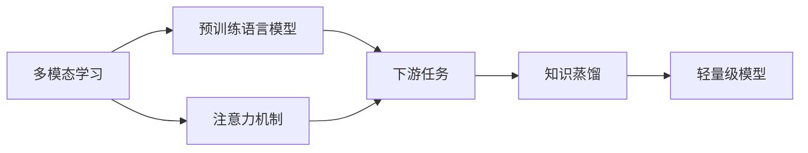

# 多模态大模型：技术原理与实战 如何提高长文本阅读能力

## 1. 背景介绍
### 1.1 多模态大模型的兴起
近年来,随着深度学习技术的飞速发展,多模态大模型(Multimodal Large Models)成为了人工智能领域的研究热点。多模态大模型能够同时处理文本、图像、音频等不同模态的数据,实现跨模态的信息理解和生成。这使得机器能够更全面地感知世界,拥有更强大的认知和交互能力。

### 1.2 长文本阅读理解的挑战
尽管多模态大模型取得了令人瞩目的成就,但在处理长文本阅读理解任务时仍面临诸多挑战:

1. 信息量大,难以快速抓取要点
2. 逻辑结构复杂,需要深入理解上下文
3. 涉及背景知识广泛,需要丰富的知识储备
4. 存在歧义、指代等语言现象,需要准确消歧

因此,如何提高多模态大模型在长文本阅读理解任务上的表现,成为了一个亟待解决的问题。

## 2. 核心概念与联系
### 2.1 多模态学习
多模态学习(Multimodal Learning)是指利用不同模态的数据(如文本、图像、音频等)进行联合建模和学习的技术。通过挖掘不同模态数据之间的内在联系,多模态学习可以获得比单模态学习更全面、更准确的信息表示。

### 2.2 预训练语言模型
预训练语言模型(Pre-trained Language Models)如BERT、GPT等,通过在大规模无标注文本数据上进行自监督预训练,可以学习到强大的语言表示能力。这为下游的各种自然语言处理任务提供了良好的基础。

### 2.3 注意力机制
注意力机制(Attention Mechanism)让模型能够聚焦于输入数据中的关键信息,是现代深度学习模型的重要组成部分。Self-Attention和Cross-Attention分别用于捕捉数据内部和不同模态之间的依赖关系。

### 2.4 知识蒸馏
知识蒸馏(Knowledge Distillation)是将大模型(Teacher Model)的知识迁移到小模型(Student Model)的技术。通过蒸馏,可以在保持模型性能的同时,大幅降低模型体积和推理开销。

### 2.5 概念间的联系
下图展示了上述核心概念之间的联系:

多模态学习和预训练语言模型分别从数据和模型的角度,为构建强大的语言理解能力奠定基础。注意力机制则是实现跨模态交互和长文本理解的关键。基于这些技术,我们可以构建用于各类下游任务的模型。最后,知识蒸馏帮助我们获得性能和效率兼顾的轻量级模型。

## 3. 核心算法原理与具体步骤
本节我们重点介绍如何利用多模态大模型进行长文本阅读理解。核心思路是将文本和图像等多模态信息融合,构建层次化的文本表示,并引入外部知识增强模型的语义理解能力。

### 3.1 多模态融合
第一步是将不同模态的数据映射到一个共同的语义空间。以文本和图像为例,我们分别使用预训练的语言模型(如BERT)和视觉模型(如ResNet)提取特征。然后通过注意力机制计算两个模态之间的对齐关系,并生成融合后的多模态表示。

具体步骤如下:

1. 使用BERT对文本进行编码,得到文本特征矩阵 $T \in \mathbb{R}^{n \times d_t}$,其中 $n$ 为文本长度, $d_t$ 为特征维度。
2. 使用ResNet对图像进行编码,得到图像特征矩阵 $I \in \mathbb{R}^{m \times d_i}$,其中 $m$ 为图像区域数, $d_i$ 为特征维度。
3. 计算文本特征 $T$ 与图像特征 $I$ 之间的注意力分数矩阵 $A \in \mathbb{R}^{n \times m}$:

$$
A = \text{softmax}(\frac{QK^T}{\sqrt{d}})
$$

其中 $Q=TW_q$, $K=IW_k$, $W_q \in \mathbb{R}^{d_t \times d}$, $W_k \in \mathbb{R}^{d_i \times d}$ 为可学习的投影矩阵。

4. 利用注意力分数 $A$ 对图像特征 $I$ 进行加权求和,得到与每个文本单元对齐的图像特征 $\tilde{I} \in \mathbb{R}^{n \times d_i}$:

$$
\tilde{I} = AI
$$

5. 将文本特征 $T$ 和对齐后的图像特征 $\tilde{I}$ 拼接,并通过前馈网络生成最终的多模态融合表示 $H \in \mathbb{R}^{n \times d_h}$:

$$
H = \text{FFN}([T; \tilde{I}]) 
$$

其中 $[;]$ 表示沿特征维度的拼接。

### 3.2 层次化文本编码
利用多模态融合表示 $H$,我们进一步构建层次化的文本编码。这里采用层次化的Transformer编码器,逐层建模文本的短语级、句子级和篇章级语义。

具体步骤如下:

1. 将 $H$ 输入 $L$ 层堆叠的Transformer编码器,每一层的计算过程为:

$$
\begin{aligned}
\tilde{H}^l &= \text{LayerNorm}(H^{l-1} + \text{SelfAttention}(H^{l-1})) \\
H^l &= \text{LayerNorm}(\tilde{H}^l + \text{FFN}(\tilde{H}^l))
\end{aligned}
$$

其中 $H^0=H$, $H^L$ 为最终的层次化文本编码结果。

2. 在每一层Transformer编码器之后,通过池化操作聚合当前层次的语义表示:

$$
s^l = \text{Pooling}(H^l) 
$$

其中 $s^l \in \mathbb{R}^{d_h}$ 为第 $l$ 层的语义表示向量。

3. 将各层的语义表示向量拼接,得到最终的层次化文本表示:

$$
S = [s^1; s^2; ...; s^L] \in \mathbb{R}^{L \times d_h}
$$

通过这种层次化的编码方式,模型能够更好地刻画长文本的多粒度语义信息。

### 3.3 知识增强
为了进一步提升模型对长文本的理解能力,我们引入外部知识对其进行增强。这里以知识图谱为例,介绍如何将结构化的知识信息融入模型。

具体步骤如下:

1. 对于文本中的每个实体mention,在知识图谱中检索其对应的实体节点,并提取一跳邻居节点的信息(包括实体类型、属性、关系等)。
2. 将这些知识信息通过知识编码器(如Graph Attention Network)进行编码,得到实体节点的知识增强表示 $e \in \mathbb{R}^{d_e}$。
3. 利用注意力机制,将知识增强表示 $e$ 融入层次化文本表示 $S$ 的每一层:

$$
\begin{aligned}
\alpha^l &= \text{softmax}(s^l W_s (e W_e)^T) \\  
\tilde{s}^l &= s^l + \alpha^l e
\end{aligned}
$$

其中 $W_s \in \mathbb{R}^{d_h \times d}$, $W_e \in \mathbb{R}^{d_e \times d}$ 为可学习的投影矩阵。

4. 用知识增强后的文本表示 $\tilde{S} = [\tilde{s}^1; \tilde{s}^2; ...; \tilde{s}^L]$ 替换原有的 $S$,作为后续任务的输入。

通过引入外部知识,模型能够利用先验信息来帮助理解长文本中的复杂语义和逻辑关系。

## 4. 数学模型与公式详解
本节我们对上述算法中涉及的几个关键数学模型进行详细推导和说明。

### 4.1 注意力机制
注意力机制用于计算两组向量之间的对齐关系。以计算文本特征 $T$ 与图像特征 $I$ 之间的注意力为例:

1. 首先将 $T$ 和 $I$ 通过线性变换投影到同一维度:

$$
Q = T W_q, \quad K = I W_k
$$

其中 $W_q \in \mathbb{R}^{d_t \times d}, W_k \in \mathbb{R}^{d_i \times d}$ 为可学习的投影矩阵。

2. 计算 $Q$ 和 $K$ 的内积并除以 $\sqrt{d}$ 进行缩放,得到注意力分数矩阵 $A \in \mathbb{R}^{n \times m}$:

$$
A = \frac{QK^T}{\sqrt{d}}
$$

3. 对 $A$ 的每一行进行 softmax 归一化,得到最终的注意力权重:

$$
A = \text{softmax}(A)
$$

直观地理解,注意力分数矩阵 $A$ 的每个元素 $a_{ij}$ 表示第 $i$ 个文本单元与第 $j$ 个图像区域之间的关联度。通过 softmax 归一化后, $a_{ij}$ 可以解释为第 $i$ 个文本单元分配给第 $j$ 个图像区域的注意力权重。

### 4.2 Transformer 编码器
Transformer 编码器由多头自注意力层和前馈网络组成,可以建模序列数据的长距离依赖关系。

以第 $l$ 层 Transformer 编码器的计算过程为例:

1. 多头自注意力层:

$$
\begin{aligned}
Q^h &= H^{l-1} W_q^h \\
K^h &= H^{l-1} W_k^h \\ 
V^h &= H^{l-1} W_v^h \\
\text{head}^h &= \text{softmax}(\frac{Q^h {K^h}^T}{\sqrt{d_h}})V^h \\
\text{MultiHead}(H^{l-1}) &= \text{Concat}(\text{head}^1, ..., \text{head}^h) W_o
\end{aligned}
$$

其中 $W_q^h, W_k^h, W_v^h \in \mathbb{R}^{d_h \times d_h/h}$, $W_o \in \mathbb{R}^{d_h \times d_h}$ 为可学习的投影矩阵, $h$ 为注意力头数。

2. 残差连接和层归一化:

$$
\tilde{H}^l = \text{LayerNorm}(H^{l-1} + \text{MultiHead}(H^{l-1}))
$$

3. 前馈网络:

$$
\text{FFN}(\tilde{H}^l) = \text{max}(0, \tilde{H}^l W_1 + b_1) W_2 + b_2
$$

其中 $W_1 \in \mathbb{R}^{d_h \times d_{ff}}, b_1 \in \mathbb{R}^{d_{ff}}$, $W_2 \in \mathbb{R}^{d_{ff} \times d_h}, b_2 \in \mathbb{R}^{d_h}$ 为可学习的参数。

4. 再次进行残差连接和层归一化,得到最终输出:

$$
H^l = \text{LayerNorm}(\tilde{H}^l + \text{FFN}(\tilde{H}^l))
$$

通过这种多层自注意力和前馈网络的堆叠,Transformer 编码器能够有效地建模序列数据的内部结构和依赖关系。

### 4.3 知识图谱嵌入
为了将知识图谱中的结构化信息引入模型,我们需要将图谱中的实体和关系嵌入到连续向量空间中。这里以 TransE 模型为例进行说明。

TransE 模型假设一个三元组 $(h,r,t)$ 中,头实体 $h$ 经过关系 $r$ 的翻译应该接近尾实体 $t$,即:

$$
h + r \approx t