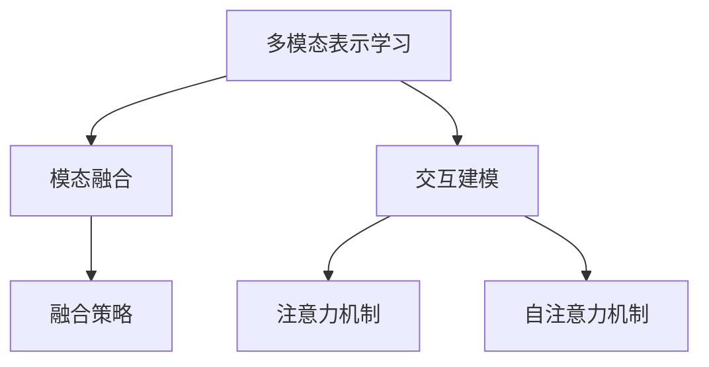
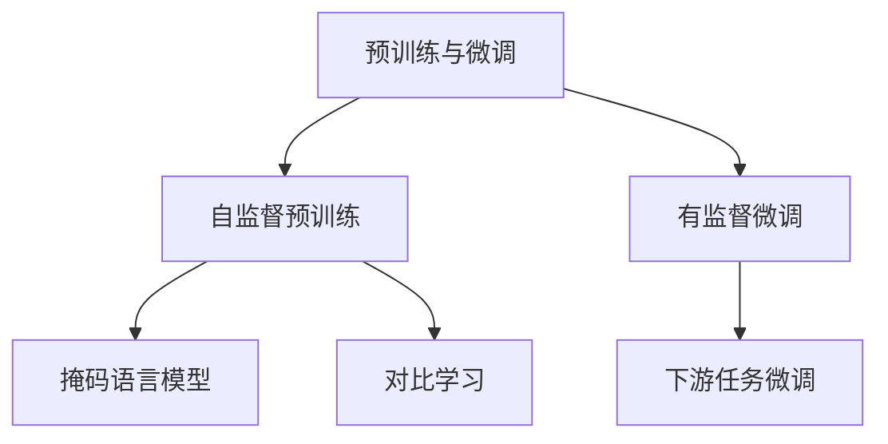
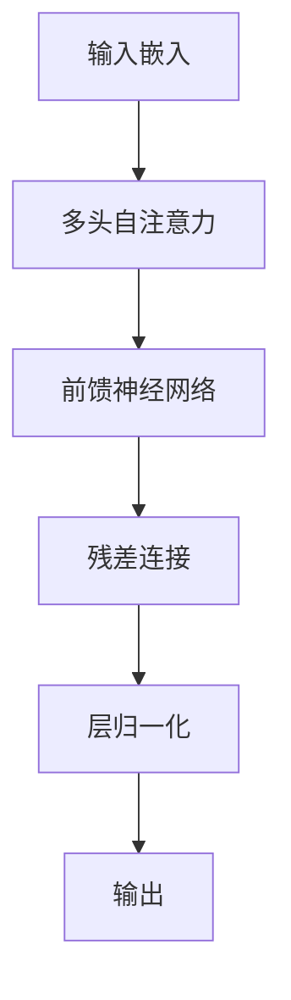

# 多模态大模型：技术原理与实战 如何提高长文本阅读能力

## 1. 背景介绍

### 1.1 人工智能的发展历程

人工智能(Artificial Intelligence, AI)是当代科技发展的重要领域,它旨在使机器具备类似于人类的认知能力,如视觉、语音、自然语言处理等。近年来,AI取得了长足进展,尤其是在深度学习和大数据方面的突破,推动了AI技术的快速发展。

### 1.2 大模型的兴起

随着计算能力的提升和海量数据的积累,大规模的人工神经网络模型(Large Model)开始崭露头角。这些大模型通过在海量数据上训练,能够捕捉到数据中蕴含的丰富模式,展现出惊人的泛化能力。著名的大模型包括GPT(Generative Pre-trained Transformer)、BERT(Bidirectional Encoder Representations from Transformers)等,它们在自然语言处理任务上取得了卓越的成绩。

### 1.3 多模态大模型的重要性

然而,现实世界是多模态的,仅依赖单一模态(如文本)是远远不够的。多模态大模型(Multimodal Large Model)旨在融合多种模态信息(如文本、图像、视频等),从而更好地理解和表示复杂的现实场景。这对于提高人机交互体验、增强认知能力等都具有重要意义。

## 2. 核心概念与联系

### 2.1 多模态表示学习



多模态表示学习(Multimodal Representation Learning)是多模态大模型的核心概念,包括两个关键部分:

1. **模态融合(Modal Fusion)**: 将不同模态的数据(如文本、图像等)融合到同一个表示空间中,捕捉不同模态之间的相关性。
2. **交互建模(Interaction Modeling)**: 对不同模态之间的交互关系进行建模,以充分利用多模态数据的互补信息。

#### 2.1.1 模态融合策略

模态融合策略决定了如何将不同模态的数据融合到同一个表示空间中。常见的融合策略包括:

- 特征级融合(Feature-level Fusion)
- 向量级融合(Vector-level Fusion)
- 张量级融合(Tensor-level Fusion)

#### 2.1.2 注意力机制

注意力机制(Attention Mechanism)是交互建模的关键,它能够自适应地捕捉不同模态之间的相关性,并聚焦于重要的模态特征。自注意力机制(Self-Attention)则进一步增强了模型对长距离依赖的建模能力。

### 2.2 预训练与微调



预训练与微调(Pre-training and Fine-tuning)是训练大模型的常用范式:

1. **自监督预训练(Self-supervised Pre-training)**: 在大规模无标注数据上进行自监督学习,获得通用的表示能力。常见的自监督预训练任务包括掩码语言模型(Masked Language Modeling)、对比学习(Contrastive Learning)等。
2. **有监督微调(Supervised Fine-tuning)**: 在具体的下游任务上进行有监督微调,使模型适应特定任务。

预训练与微调范式能够充分利用大规模无标注数据,并将通用知识迁移到具体任务中,从而提高模型的性能。

## 3. 核心算法原理具体操作步骤

### 3.1 Transformer模型

Transformer是多模态大模型的核心算法,它基于自注意力机制,能够有效捕捉长距离依赖关系。Transformer的基本结构如下:



1. **输入嵌入(Input Embedding)**: 将原始数据(如文本、图像等)映射到连续的向量空间。
2. **多头自注意力(Multi-Head Self-Attention)**: 计算输入序列中每个元素与其他元素的注意力权重,捕捉长距离依赖关系。
3. **前馈神经网络(Feed-Forward Neural Network)**: 对注意力输出进行非线性变换,提取更高级的特征。
4. **残差连接(Residual Connection)**: 将输入和输出相加,缓解梯度消失问题。
5. **层归一化(Layer Normalization)**: 对输出进行归一化,加速训练收敛。

### 3.2 多模态Transformer

为了处理多模态数据,Transformer需要进行适当的扩展和修改。常见的多模态Transformer包括:

- **ViLBERT**: 融合视觉和语言表示,用于视觉问答等任务。
- **VideoBERT**: 融合视频和语言表示,用于视频理解等任务。
- **UniT**: 统一的多模态Transformer,能够处理任意模态组合。

这些模型通过设计合适的模态融合策略和注意力机制,实现了不同模态之间的交互建模。

## 4. 数学模型和公式详细讲解举例说明

### 4.1 自注意力机制

自注意力机制是Transformer的核心,它能够捕捉输入序列中任意两个元素之间的依赖关系。给定输入序列 $\boldsymbol{X} = (x_1, x_2, \dots, x_n)$,自注意力的计算过程如下:

1. 计算查询(Query)、键(Key)和值(Value)向量:

$$
\begin{aligned}
\boldsymbol{Q} &= \boldsymbol{X} \boldsymbol{W}^Q \\
\boldsymbol{K} &= \boldsymbol{X} \boldsymbol{W}^K \\
\boldsymbol{V} &= \boldsymbol{X} \boldsymbol{W}^V
\end{aligned}
$$

其中 $\boldsymbol{W}^Q$、$\boldsymbol{W}^K$、$\boldsymbol{W}^V$ 是可学习的权重矩阵。

2. 计算注意力权重:

$$
\text{Attention}(\boldsymbol{Q}, \boldsymbol{K}, \boldsymbol{V}) = \text{softmax}\left(\frac{\boldsymbol{Q}\boldsymbol{K}^\top}{\sqrt{d_k}}\right)\boldsymbol{V}
$$

其中 $d_k$ 是键向量的维度,用于缩放点积值。

3. 多头注意力机制通过将注意力过程独立运行多次,然后将结果拼接,捕捉不同的子空间表示:

$$
\text{MultiHead}(\boldsymbol{Q}, \boldsymbol{K}, \boldsymbol{V}) = \text{Concat}(\text{head}_1, \dots, \text{head}_h)\boldsymbol{W}^O
$$

其中 $\text{head}_i = \text{Attention}(\boldsymbol{Q}\boldsymbol{W}_i^Q, \boldsymbol{K}\boldsymbol{W}_i^K, \boldsymbol{V}\boldsymbol{W}_i^V)$,并且 $\boldsymbol{W}_i^Q$、$\boldsymbol{W}_i^K$、$\boldsymbol{W}_i^V$、$\boldsymbol{W}^O$ 是可学习的权重矩阵。

自注意力机制能够捕捉输入序列中任意两个元素之间的依赖关系,是Transformer模型的核心组件。

### 4.2 交叉注意力机制

在多模态场景下,需要对不同模态之间的交互关系进行建模。交叉注意力机制(Cross-Attention)可以实现这一目标,它允许一个模态的表示基于另一个模态的表示进行更新。

给定两个模态的输入序列 $\boldsymbol{X}$ 和 $\boldsymbol{Y}$,交叉注意力的计算过程如下:

1. 计算查询向量 $\boldsymbol{Q}$ 和键向量 $\boldsymbol{K}$:

$$
\begin{aligned}
\boldsymbol{Q} &= \boldsymbol{X}\boldsymbol{W}^Q \\
\boldsymbol{K} &= \boldsymbol{Y}\boldsymbol{W}^K
\end{aligned}
$$

2. 计算注意力权重和加权和:

$$
\begin{aligned}
\text{Attention}(\boldsymbol{Q}, \boldsymbol{K}, \boldsymbol{V}) &= \text{softmax}\left(\frac{\boldsymbol{Q}\boldsymbol{K}^\top}{\sqrt{d_k}}\right)\boldsymbol{V} \\
\boldsymbol{X}^\prime &= \boldsymbol{X} + \text{Attention}(\boldsymbol{Q}, \boldsymbol{K}, \boldsymbol{Y})
\end{aligned}
$$

其中 $\boldsymbol{V} = \boldsymbol{Y}$,即使用另一个模态的表示作为值向量。

通过交叉注意力机制,一个模态的表示可以基于另一个模态的表示进行更新,从而实现不同模态之间的交互建模。

## 5. 项目实践:代码实例和详细解释说明

以下是一个基于PyTorch实现的简化版多模态Transformer模型:

```python
import torch
import torch.nn as nn

class MultimodalTransformer(nn.Module):
    def __init__(self, text_dim, image_dim, hidden_dim, num_heads, num_layers):
        super(MultimodalTransformer, self).__init__()
        self.text_embedding = nn.Linear(text_dim, hidden_dim)
        self.image_embedding = nn.Linear(image_dim, hidden_dim)
        self.encoder_layer = nn.TransformerEncoderLayer(d_model=hidden_dim, nhead=num_heads)
        self.transformer_encoder = nn.TransformerEncoder(self.encoder_layer, num_layers=num_layers)
        self.output_layer = nn.Linear(hidden_dim, output_dim)

    def forward(self, text, image):
        text_emb = self.text_embedding(text)
        image_emb = self.image_embedding(image)
        inputs = torch.cat((text_emb, image_emb), dim=1)
        outputs = self.transformer_encoder(inputs)
        outputs = self.output_layer(outputs)
        return outputs
```

这个模型包括以下几个主要组件:

1. **输入嵌入层(Input Embedding Layer)**: 将文本和图像数据映射到同一个隐藏空间中。
2. **Transformer编码器层(Transformer Encoder Layer)**: 基于自注意力机制和前馈神经网络构建的编码器层。
3. **Transformer编码器(Transformer Encoder)**: 由多个编码器层堆叠而成,用于捕捉长距离依赖关系。
4. **输出层(Output Layer)**: 将编码器的输出映射到目标空间。

在 `forward` 函数中,我们首先将文本和图像数据通过嵌入层映射到隐藏空间,然后将它们拼接在一起作为Transformer编码器的输入。编码器的输出经过输出层后,即可得到模型的最终输出。

需要注意的是,这只是一个简化版本的多模态Transformer模型,实际应用中可能需要进一步扩展和优化,如添加交叉注意力机制、位置编码等。

## 6. 实际应用场景

多模态大模型在各种实际应用场景中发挥着重要作用,例如:

### 6.1 视觉问答(Visual Question Answering, VQA)

视觉问答任务需要根据给定的图像和自然语言问题,生成相应的答案。多模态大模型能够有效融合视觉和语言信息,提高了问答的准确性。

### 6.2 图像描述(Image Captioning)

图像描述任务旨在为给定的图像生成自然语言描述。多模态大模型可以捕捉图像和文本之间的复杂关系,生成更加准确和流畅的描述。

### 6.3 视频理解(Video Understanding)

视频理解涉及对视频中的动作、事件、情景等进行识别和理解。多模态大模型能够融合视频、音频和文本信息,提高视频理解的性能。

### 6.4 多模态对话系统(Multimodal Dialogue Systems)

多模态对话系统需要根据用户的语音、文本、图像等多种模态输入,生成自然的响应。多模态大模型可以有效地融合这些模态信息,提升对话系统的交互体验。

## 7. 工具和资源推荐

### 7.1 开源框架

- **Hugging Face