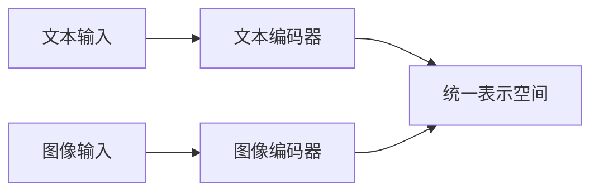
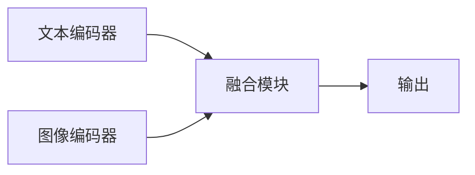
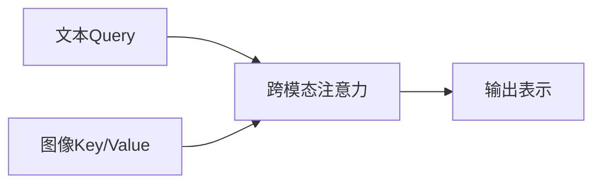
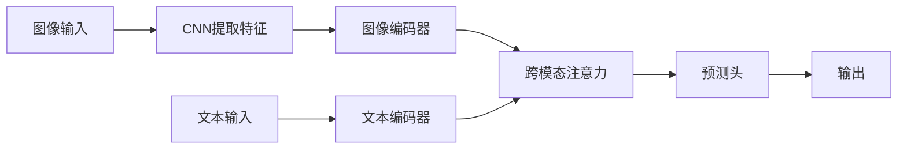
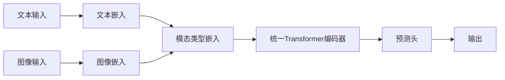
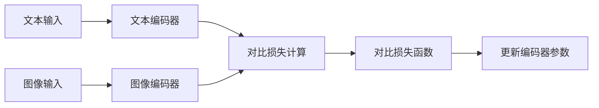

# 多模态大模型：整合视觉与文本信息的前沿科技

## 1.背景介绍

### 1.1 人工智能的发展历程

人工智能(AI)的发展经历了几个重要阶段。早期的AI系统主要关注符号推理和专家系统,利用规则和逻辑进行推理。20世纪90年代,机器学习和神经网络的兴起,使AI系统能够从数据中自动学习模式和规律。

进入21世纪,深度学习的出现成为AI发展的重大突破。深度神经网络能够从大规模数据中自动提取特征,在计算机视觉、自然语言处理等领域取得了卓越的成就。

### 1.2 大模型的兴起

近年来,大规模预训练语言模型(如GPT、BERT等)的出现,标志着AI进入了"大模型"时代。这些模型通过在海量文本数据上预训练,学习到了丰富的语义和世界知识,能够生成高质量的文本、回答问题、进行任务迁移等。

然而,这些大模型主要关注文本信息,无法直接处理图像、视频等非结构化数据。为了充分利用多模态信息,整合视觉和语言的多模态大模型应运而生。

### 1.3 多模态大模型的重要性

多模态大模型旨在同时处理文本、图像、视频等多种模态数据,捕捉不同模态之间的关联,实现跨模态的理解和生成。这种能力对于构建智能系统至关重要,有助于更好地理解现实世界,并与人类进行自然交互。

多模态大模型在多个领域展现出巨大的应用潜力,如视觉问答、图像描述生成、多模态检索、多模态对话系统等。它们有望推动人工智能系统向更加通用、智能和人性化的方向发展。

## 2.核心概念与联系

### 2.1 多模态表示学习

多模态表示学习是多模态大模型的核心概念之一。它旨在学习一种统一的表示空间,将不同模态的数据(如文本、图像等)映射到这个共享空间中,使得不同模态的数据可以在同一空间内进行比较和操作。

一种常见的方法是使用共享的编码器(如Transformer)对不同模态的输入进行编码,得到统一的向量表示。这些向量表示能够捕捉不同模态之间的相关性,为后续的多模态任务(如多模态融合、生成等)提供基础。

### 2.2 多模态融合

多模态融合是指将来自不同模态的信息有效地整合在一起,以获得更加全面和丰富的表示。这是多模态大模型的另一个核心概念。

常见的融合方式包括:

1. **早期融合**:在编码阶段就将不同模态的特征进行拼接或融合。
2. **晚期融合**:先分别对每个模态进行编码,然后在更高层次将编码后的表示进行融合。
3. **交互融合**:不同模态的表示在编码过程中进行交互,相互影响和约束。

融合策略的选择取决于具体任务和模型架构,需要权衡信息流动的时机和融合的granularity。

### 2.3 跨模态关注与对齐

跨模态关注(Cross-Modal Attention)是多模态大模型中一种重要的机制,用于捕捉不同模态之间的相关性和依赖关系。

在Transformer等注意力模型中,通过计算查询(Query)与键(Key)之间的相关性分数,可以动态地为每个查询分配不同的注意力权重,从而聚焦于输入序列中最相关的部分。

在多模态场景下,查询和键可以来自不同的模态(如文本查询对应图像键),从而实现跨模态的注意力机制。这种机制使模型能够关注不同模态之间的对应关系,并基于此进行有效的融合和推理。

### 2.4 多模态对比学习

对比学习(Contrastive Learning)是一种自监督学习范式,通过最大化相似样本之间的相似度,最小化不相似样本之间的相似度,来学习数据的有效表示。

在多模态场景下,对比学习可以应用于不同模态之间,例如最大化同一个概念在文本和图像模态下的表示相似度,最小化不相关概念之间的相似度。这种方式能够促使模型学习模态不变的统一表示,提高模型的泛化能力。

多模态对比学习为多模态大模型提供了一种有效的自监督训练方式,有助于模型从大量无标注的多模态数据中学习有用的知识和表示。

## 3.核心算法原理具体操作步骤

### 3.1 Transformer编码器

Transformer编码器是多模态大模型中常用的基础编码模块。它采用自注意力(Self-Attention)机制,能够有效地捕捉输入序列中的长程依赖关系,并生成向量化的序列表示。

Transformer编码器的具体操作步骤如下:

1. **输入嵌入(Input Embeddings)**: 将输入数据(如文本词元、图像像素等)映射为向量表示。
2. **位置编码(Positional Encoding)**: 为每个位置添加位置信息,使模型能够捕捉序列的顺序信息。
3. **多头自注意力(Multi-Head Self-Attention)**: 计算每个输入位置与其他位置的注意力权重,并根据权重对应的值进行加权求和,生成新的向量表示。
4. **前馈网络(Feed-Forward Network)**: 对注意力输出进行非线性变换,提取更高层次的特征表示。
5. **层范式(Layer Normalization)**: 对每一层的输出进行归一化,以加速训练并提高模型的稳定性。
6. **残差连接(Residual Connection)**: 将每一层的输出与输入相加,以缓解梯度消失问题。

通过堆叠多个这样的编码器层,Transformer能够学习到输入序列的深层次表示,为后续的多模态融合和下游任务奠定基础。

### 3.2 视觉-语言双流Transformer

视觉-语言双流Transformer是一种常见的多模态大模型架构,它使用两个独立的Transformer编码器分别对图像和文本进行编码,然后将两个模态的表示进行融合。

具体操作步骤如下:

1. **图像编码器**: 将图像输入馈送到卷积神经网络(CNN)中提取视觉特征,然后将特征序列输入到Transformer图像编码器,生成图像的向量表示。
2. **文本编码器**: 将文本输入(如标题、描述等)输入到Transformer文本编码器,生成文本的向量表示。
3. **跨模态注意力**: 使用跨模态注意力机制,计算图像表示和文本表示之间的相关性分数,并根据分数对两个模态的表示进行融合。
4. **预测头(Prediction Head)**: 将融合后的多模态表示输入到特定的预测头(如分类器、回归器等),完成下游任务(如视觉问答、图像描述生成等)。

该架构的优点是能够分别捕捉每个模态的特征,并通过注意力机制实现有效的跨模态融合。但是也存在信息流动路径较长、训练困难等挑战。

### 3.3 统一多模态Transformer

统一多模态Transformer旨在使用单个Transformer模型同时对多个模态的输入进行编码,实现真正的端到端多模态表示学习。

其具体操作步骤如下:

1. **模态特定嵌入(Modality-Specific Embeddings)**: 将不同模态的输入(如文本、图像等)映射为模态特定的向量表示。
2. **模态类型嵌入(Modality Type Embeddings)**: 为每个模态添加一个模态类型嵌入,以指示当前输入的模态类型。
3. **统一Transformer编码器**: 将所有模态的嵌入拼接在一起,输入到单个Transformer编码器中进行编码,生成统一的多模态表示。
4. **预测头**: 将编码后的多模态表示输入到特定的预测头,完成下游任务。

该架构的优点是能够在单个模型中直接对多个模态进行联合编码,避免了信息流动路径过长的问题。但也面临着训练数据需求更大、模型复杂度更高等挑战。

### 3.4 对比多模态编码

对比多模态编码(Contrastive Multimodal Encoding)是一种基于对比学习的多模态表示学习方法,它通过最大化相似样本之间的相似度,最小化不相似样本之间的相似度,来学习模态不变的统一表示。

具体操作步骤如下:

1. **数据增强**: 对输入数据进行数据增强,生成相似样本和不相似样本的对。
2. **编码器**: 使用统一的Transformer编码器或双流编码器,对每个模态的输入进行编码,生成向量表示。
3. **对比损失计算**: 计算相似样本对之间的相似度分数,以及不相似样本对之间的相似度分数。
4. **对比损失函数**: 最大化相似样本对的相似度分数,最小化不相似样本对的相似度分数,从而优化编码器参数。

通过对比学习,模型能够学习到模态不变的统一表示空间,提高了模型的泛化能力和鲁棒性。同时,对比学习也为多模态大模型提供了一种有效的自监督训练方式,能够利用大量无标注的多模态数据进行预训练。

## 4.数学模型和公式详细讲解举例说明

### 4.1 注意力机制

注意力机制是多模态大模型中的关键组成部分,它能够动态地为输入序列中的每个位置分配注意力权重,聚焦于最相关的部分。

在Transformer中,注意力分数的计算公式如下:

$$
\text{Attention}(Q, K, V) = \text{softmax}\left(\frac{QK^T}{\sqrt{d_k}}\right)V
$$

其中:

- $Q$ 为查询(Query)向量
- $K$ 为键(Key)向量
- $V$ 为值(Value)向量
- $d_k$ 为键向量的维度,用于缩放点积的值
- $\text{softmax}$ 函数用于将注意力分数归一化为概率分布

多头注意力机制则是将注意力过程独立运行多次,并将结果拼接在一起,公式如下:

$$
\text{MultiHead}(Q, K, V) = \text{Concat}(head_1, \dots, head_h)W^O
$$

$$
\text{where } head_i = \text{Attention}(QW_i^Q, KW_i^K, VW_i^V)
$$

其中 $W_i^Q$、$W_i^K$、$W_i^V$ 和 $W^O$ 是可学习的线性