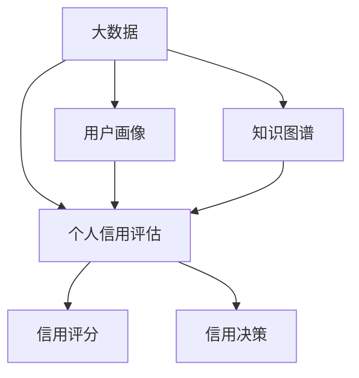

# 大数据下个人用户信用行为的等级评估及应用研究

## 1. 背景介绍
### 1.1 大数据时代的到来
随着互联网、物联网、云计算等新一代信息技术的迅猛发展,人类社会已经进入了大数据时代。大数据以其Volume(大量)、Velocity(高速)、Variety(多样)、Value(低价值密度)、Veracity(真实性)等5V特征为人们所熟知。在这个时代,各行各业、各个领域都在积极拥抱大数据,个人信用评估领域也不例外。

### 1.2 个人信用评估的重要性
个人信用评估是指对个人的信用状况进行评定,旨在全面、客观地反映个人的信用水平。个人信用评估在现代社会信用体系建设中起着至关重要的作用,它可以有效缓解信息不对称问题,降低交易成本,提高资源配置效率。个人信用评估结果广泛应用于银行信贷、商业保理、融资租赁、消费金融、互联网金融等诸多领域。

### 1.3 大数据给个人信用评估带来的机遇与挑战
大数据时代为个人信用评估提供了前所未有的历史机遇。一方面,大数据极大地丰富了个人信用评估所需的数据来源,使得全方位、多维度地刻画个人信用状况成为可能;另一方面,大数据驱动下的人工智能、机器学习等技术的进步,使得海量非结构化数据的处理和建模成为现实。然而,大数据也给个人信用评估带来诸多挑战,如数据获取与质量控制、隐私保护、模型可解释性等。因此,在大数据时代背景下,亟需对个人信用评估的理论、方法与应用开展系统性研究。

## 2. 核心概念与联系
### 2.1 个人信用
个人信用是指个人履行其承诺的意愿和能力,它反映了个人未来按时足额偿还债务的可能性。个人信用通常包括个人品德、个人能力、个人资本三个方面。其中,个人品德是个人信用的基础,个人能力是个人信用的保障,个人资本是个人信用的物质基础。

### 2.2 信用评分
信用评分是个人信用评估的一种主要形式,通过对个人信用数据进行量化、建模,最终得到一个数值化的信用分值,用以表征个人的信用水平。常见的信用评分模型有logistic回归、支持向量机、随机森林、神经网络等。信用评分的结果可以用于信用决策、风险定价、额度管理等。

### 2.3 用户画像
用户画像是大数据时代个性化服务的基础,它力图从海量数据中挖掘用户的属性标签、行为特征、偏好习惯等,从而精准刻画一个用户。用户画像通常采用标签化的方式呈现,每一个标签都代表用户的某一特征或偏好。在个人信用评估中,用户画像可以提供除了传统信用数据之外的丰富信息,如用户的消费能力、生活方式、人际关系等,有助于提升信用评估的准确性。

### 2.4 知识图谱
知识图谱是一种结构化的语义知识库,它通过节点和边的形式,描述客观世界中的实体、概念及其之间的关联。知识图谱具有高度的逻辑性、关联性和语义性,是人工智能时代知识表示和推理的重要工具。在个人信用领域,知识图谱可用于组织个人信用相关的海量异构数据,并基于图谱进行关联挖掘和推理预测,从而实现个人信用评估的知识化、语义化。

### 2.5 核心概念之间的联系
在大数据时代下,个人信用评估需要充分利用多源异构的大数据,并将用户画像、知识图谱等先进技术引入到信用评估的各个环节中。用户画像可为个人信用评估提供全方位的用户特征,知识图谱则可对信用数据进行语义化组织与关联挖掘,二者与传统信用评分模型相结合,可显著提升个人信用评估的精准度和可解释性。下图展示了几个核心概念之间的联系:



## 3. 核心算法原理具体操作步骤
个人信用等级评估是一个涉及数据采集、数据预处理、特征工程、模型开发、模型评估等多个环节的系统工程,需要综合运用多种数据挖掘和机器学习算法。本节重点介绍几种核心算法的原理和操作步骤。

### 3.1 逻辑回归
逻辑回归是一种常用的信用评分算法,其基本思想是通过sigmoid函数将线性回归的输出映射到[0,1]区间,得到样本属于某一类的概率。其主要步骤如下:
1. 数据准备:收集用户的信用数据,并进行清洗、转换等预处理。
2. 特征选择:选取对信用状况有显著影响的特征构建特征向量。
3. 模型训练:用已知用户的特征向量和对应的信用标签训练逻辑回归模型。
4. 模型评估:用测试集数据评估模型性能,并进行参数调优。
5. 模型预测:用训练好的模型对新用户的特征进行预测,输出其逾期概率。

### 3.2 随机森林
随机森林是一种基于决策树的集成学习算法,通过bootstrap抽样和属性随机选择,构建多棵彼此不相关的决策树,并将它们的预测结果进行组合。其主要步骤如下:
1. 数据准备:对原始数据进行采样和预处理。
2. 随机抽样:从原始样本中有放回地随机抽取若干子样本。 
3. 随机选择特征:从所有特征中随机选取一个最优特征子集。
4. 构建决策树:用子样本和特征子集构建CART决策树。
5. 重复2-4步骤,构建多棵决策树形成随机森林。
6. 模型预测:对新样本的特征进行预测,并用投票法确定最终类别。

### 3.3 XGBoost
XGBoost是一种基于boosting思想的梯度提升决策树算法,通过迭代地训练多棵CART回归树,不断拟合前向分步算法的残差,最终将所有树的结果相加得到预测值。其主要步骤如下:
1. 数据准备:对数据进行预处理和特征工程。
2. 初始化:将所有样本的预测值初始化为0。
3. 迭代训练:在每一轮迭代中,用前一轮的预测值和真实值计算残差,并用残差作为本轮的目标值去拟合一棵CART回归树。
4. 加法模型:将新训练出的树添加到模型中,更新预测值。
5. 重复3-4步骤,直至满足停止条件。
6. 模型预测:对新样本的特征进行预测,将所有树的预测结果相加得到最终预测值。

### 3.4 知识图谱嵌入
知识图谱嵌入是一类将知识图谱中的实体和关系映射到低维连续向量空间的算法,可用于知识图谱的表示学习和推理。其主要步骤如下:
1. 构建知识图谱:根据个人信用相关数据构建知识图谱。
2. 定义目标函数:设计一个能够保留图谱结构信息的目标函数,常用的有TransE、TransR等。
3. 初始化嵌入向量:为每个实体和关系随机初始化一个低维嵌入向量。 
4. 迭代优化:通过随机梯度下降等优化算法最小化目标函数,不断更新嵌入向量。
5. 获取嵌入结果:得到每个实体和关系的低维向量表示,用于下游任务。

## 4. 数学模型和公式详细讲解举例说明
本节以逻辑回归模型为例,详细讲解其数学原理和公式推导过程。

逻辑回归的目标是估计样本属于某个类别的概率,其本质是在线性回归的基础上,引入了sigmoid函数对线性回归的输出进行映射,将其压缩到[0,1]区间内,使其可以表示概率。设$x=(x_1,x_2,...,x_n)$为样本的特征向量,$y\in\{0,1\}$为样本的二元标签,逻辑回归模型可表示为:

$$
P(y=1|x)=\frac{1}{1+e^{-(\beta_0+\beta_1x_1+...+\beta_nx_n)}}=\frac{1}{1+e^{-\beta^Tx}}
$$

其中,$\beta=(\beta_0,\beta_1,...,\beta_n)$为模型的参数向量。对于给定的样本集$\{(x^{(i)},y^{(i)})\}_{i=1}^m$,逻辑回归的目标是找到一组参数$\beta$,使得样本属于其真实标签的概率最大。这等价于最大化如下的对数似然函数:

$$
L(\beta)=\sum_{i=1}^m[y^{(i)}\log P(y^{(i)}=1|x^{(i)})+(1-y^{(i)})\log P(y^{(i)}=0|x^{(i)})]
$$

将逻辑回归模型代入上式,并进行化简,可得:

$$
L(\beta)=\sum_{i=1}^m[y^{(i)}(\beta^Tx^{(i)})-\log(1+e^{\beta^Tx^{(i)}})]
$$

为了求解最优参数$\beta$,需要对$L(\beta)$求导,并令导数为0:

$$
\frac{\partial L(\beta)}{\partial \beta_j}=\sum_{i=1}^m[y^{(i)}-P(y^{(i)}=1|x^{(i)})]x_j^{(i)}=0,\quad j=0,1,...,n
$$

上式没有解析解,需要通过数值优化算法如梯度下降法、牛顿法等迭代求解。以梯度下降法为例,参数$\beta$的更新公式为:

$$
\beta_j:=\beta_j+\alpha\sum_{i=1}^m[y^{(i)}-P(y^{(i)}=1|x^{(i)})]x_j^{(i)},\quad j=0,1,...,n
$$

其中,$\alpha$为学习率。不断迭代上述更新公式,直至收敛,即可得到逻辑回归模型的最优参数估计。

举个例子,假设我们要建立一个信用评分模型,用户的特征包括年龄、月收入、历史逾期次数等,标签为用户是否逾期。我们可以收集一批用户的数据,将其随机划分为训练集和测试集,然后用训练集数据去训练逻辑回归模型,并在测试集上评估模型性能。最后,用训练好的模型对新用户的特征进行预测,得到其逾期概率,并根据一定的阈值划分用户的信用等级。

## 5. 项目实践:代码实例和详细解释说明
下面以Python为例,展示如何用逻辑回归实现一个简单的信用评分模型。

首先,我们导入需要的库:

```python
import numpy as np
import pandas as pd
from sklearn.model_selection import train_test_split
from sklearn.linear_model import LogisticRegression
from sklearn.metrics import accuracy_score
```

然后,我们读入用户数据,并将其划分为特征和标签:

```python
data = pd.read_csv('credit_data.csv')
X = data[['age', 'income', 'hist_default']]  # 特征
y = data['default']  # 标签
```

接着,我们将数据划分为训练集和测试集:

```python
X_train, X_test, y_train, y_test = train_test_split(X, y, test_size=0.2, random_state=42)
```

然后,我们初始化一个逻辑回归模型,并用训练集数据进行训练:

```python
lr_model = LogisticRegression()
lr_model.fit(X_train, y_train)
```

训练完成后,我们可以在测试集上评估模型的性能:

```python
y_pred = lr_model.predict(X_test)
accuracy = accuracy_score(y_test, y_pred)
print(f'Accuracy: {accuracy:.4f}