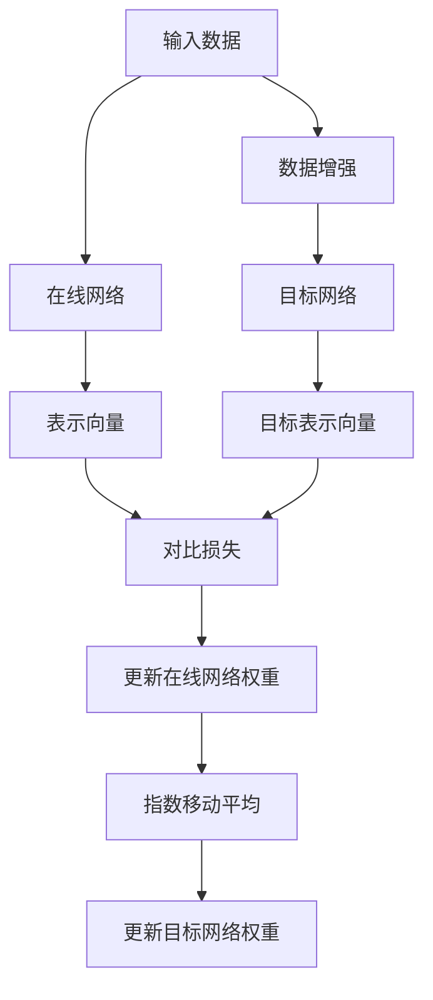

# 大规模BYOL模型训练技巧

## 1.背景介绍

在深度学习领域,自监督学习(Self-Supervised Learning)已经成为一种重要的范式,它可以利用大量未标记数据进行有效的预训练,从而获得通用的表示能力。与监督学习相比,自监督学习不需要大量的人工标注数据,可以更好地利用现有的海量数据资源。

Bootstrap Your Own Latent (BYOL)是一种新兴的自监督表示学习框架,它通过在线对比学习的方式,使用两个共享权重的网络来学习数据的表示。与其他对比学习方法相比,BYOL的优势在于训练过程更加简单和稳定,不需要大内存银行(large memory bank)或者动量编码器(momentum encoder),因此更加适合于大规模数据集和模型的训练。

### 1.1 BYOL原理简介

BYOL的核心思想是通过在线对比学习的方式,使用两个共享权重的网络来学习数据的表示。具体来说,BYOL包含两个网络:在线网络(Online Network)和目标网络(Target Network)。

在线网络通过对输入数据进行编码,生成该数据的表示向量。目标网络的作用是生成该表示向量的目标值,即期望的表示向量。在线网络的目标是使其生成的表示向量尽可能接近目标网络生成的目标值。通过这种对比学习的方式,在线网络就可以学习到数据的有效表示。

为了防止两个网络的权重完全相同而导致表示向量退化,BYOL采用了一种特殊的更新机制:目标网络的权重是在线网络权重的指数移动平均值(Exponential Moving Average,EMA)。这种更新方式可以确保目标网络的权重相对于在线网络有一定的滞后,从而避免了表示向量的退化问题。

### 1.2 BYOL在大规模训练中的优势

相比于其他自监督学习方法,BYOL在大规模模型训练中具有以下优势:

1. **训练稳定性**:BYOL不需要大内存银行或动量编码器,训练过程更加简单和稳定,适合于大规模数据集和模型的训练。

2. **计算效率**:BYOL只需要两个网络进行对比学习,计算开销相对较小,可以有效利用GPU资源进行大规模训练。

3. **数据高效利用**:BYOL可以充分利用大量未标记数据进行预训练,获得通用的表示能力,从而提高下游任务的性能。

4. **表示质量**:通过在线对比学习的方式,BYOL可以学习到高质量的数据表示,这对于下游任务的迁移学习非常有益。

因此,BYOL被广泛应用于大规模视觉表示学习任务,如图像分类、目标检测、语义分割等。通过在大规模数据集上预训练BYOL模型,可以获得强大的通用表示能力,为下游任务提供有力的支持。

## 2.核心概念与联系

### 2.1 自监督学习(Self-Supervised Learning)

自监督学习是一种无需人工标注数据的学习范式,它通过设计预测任务,利用数据本身的信息进行模型训练。自监督学习的核心思想是通过构建一种监督信号,使模型在学习过程中捕获数据的内在结构和统计规律。

常见的自监督学习方法包括:

- **重构任务**(Reconstruction Tasks):如自编码器(Autoencoder)、生成对抗网络(Generative Adversarial Networks,GAN)等,通过重构输入数据来学习数据的表示。

- **上下文预测任务**(Context Prediction Tasks):如Word2Vec、BERT等,通过预测上下文信息来学习数据的表示。

- **对比学习**(Contrastive Learning):如SimCLR、MoCo、BYOL等,通过对比不同视图之间的相似性来学习数据的表示。

自监督学习的优势在于可以利用大量未标记数据进行有效的预训练,获得通用的表示能力,从而提高下游任务的性能。同时,自监督学习也避免了人工标注数据的昂贵成本和标注偏差问题。

### 2.2 对比学习(Contrastive Learning)

对比学习是自监督学习的一种重要方法,它通过最大化不同视图之间的相似性,最小化不同样本之间的相似性,来学习数据的表示。对比学习的核心思想是:对于同一个样本的不同视图(如数据增强后的视图),它们的表示应该尽可能相似;而对于不同样本,它们的表示应该尽可能不同。

对比学习通常包含以下几个关键组件:

- **数据增强**(Data Augmentation):通过一些转换操作(如裁剪、旋转、颜色扰动等)生成同一个样本的不同视图。

- **编码器网络**(Encoder Network):将输入数据映射到表示向量空间。

- **对比损失函数**(Contrastive Loss):最大化正样本对(同一个样本的不同视图)之间的相似性,最小化负样本对(不同样本)之间的相似性。

- **大内存银行**(Large Memory Bank)或**动量编码器**(Momentum Encoder):用于存储和编码大量负样本,以计算对比损失。

BYOL作为一种新兴的对比学习方法,它通过在线对比学习的方式,避免了大内存银行和动量编码器的需求,从而简化了训练过程,提高了计算效率。

### 2.3 BYOL与其他对比学习方法的关系

BYOL与其他对比学习方法(如SimCLR、MoCo等)有一些相似之处,但也有重要区别:

- **相似之处**:都是通过对比不同视图之间的相似性来学习数据的表示,都使用了数据增强技术。

- **区别**:
    - BYOL采用了在线对比学习的方式,不需要大内存银行或动量编码器,训练过程更加简单和稳定。
    - BYOL使用了两个共享权重的网络进行对比学习,而不是单个编码器网络。
    - BYOL通过指数移动平均的方式更新目标网络权重,避免了表示向量的退化问题。

总的来说,BYOL在保留对比学习核心思想的同时,进一步简化了训练过程,提高了计算效率,因此更加适合于大规模模型和数据集的训练。

## 3.核心算法原理具体操作步骤

### 3.1 BYOL算法流程

BYOL算法的核心流程如下:

1. **数据增强**:对输入数据进行数据增强操作,生成两个不同的视图$x_1$和$x_2$。

2. **在线网络编码**:将视图$x_1$输入到在线网络中,获得该视图的表示向量$y_1=f_\theta(x_1)$,其中$f_\theta$表示在线网络,参数为$\theta$。

3. **目标网络编码**:将视图$x_2$输入到目标网络中,获得该视图的目标表示向量$y_2=f_\xi(x_2)$,其中$f_\xi$表示目标网络,参数为$\xi$。

4. **对比损失计算**:计算在线网络表示向量$y_1$与目标表示向量$y_2$之间的对比损失$\mathcal{L}(y_1,y_2)$。

5. **在线网络权重更新**:使用梯度下降法更新在线网络参数$\theta$,以最小化对比损失$\mathcal{L}(y_1,y_2)$。

6. **目标网络权重更新**:使用指数移动平均(Exponential Moving Average,EMA)的方式更新目标网络参数$\xi$,即$\xi \leftarrow \lambda \xi + (1-\lambda)\theta$,其中$\lambda$是平滑系数。

7. **重复上述步骤**:对训练数据集中的所有样本重复执行上述步骤,直到模型收敛。

通过上述过程,在线网络可以学习到数据的有效表示,而目标网络则作为在线网络表示的目标值,引导在线网络的学习过程。

### 3.2 对比损失函数

BYOL中使用的对比损失函数是一种基于余弦相似度的损失函数,它的目标是最大化在线网络表示向量$y_1$与目标表示向量$y_2$之间的相似性。具体来说,对比损失函数定义如下:

$$\mathcal{L}(y_1,y_2) = 2 - 2 \cdot \frac{y_1^T y_2}{\|y_1\| \|y_2\|}$$

其中,$y_1^T y_2$表示两个向量的点积,而$\|y_1\|$和$\|y_2\|$分别表示两个向量的$L_2$范数。这个损失函数实际上是在最大化两个向量之间的余弦相似度,即$\frac{y_1^T y_2}{\|y_1\| \|y_2\|}$。

为了防止表示向量的大小过大或过小,BYOL还引入了一个额外的正则化项,对表示向量的范数进行约束。具体来说,正则化项定义如下:

$$\mathcal{R}(y_1,y_2) = \|y_1\|^2 + \|y_2\|^2$$

最终,BYOL的总损失函数为对比损失与正则化项的加权和:

$$\mathcal{L}_{total} = \mathcal{L}(y_1,y_2) + \lambda \mathcal{R}(y_1,y_2)$$

其中,$\lambda$是一个超参数,用于控制正则化项的权重。

通过最小化这个总损失函数,BYOL可以同时最大化在线网络表示向量与目标表示向量之间的相似性,并约束表示向量的范数,从而获得更加有效和稳定的表示学习。

### 3.3 目标网络权重更新

BYOL中,目标网络权重的更新是通过指数移动平均(Exponential Moving Average,EMA)的方式实现的。具体来说,目标网络参数$\xi$的更新规则如下:

$$\xi \leftarrow \lambda \xi + (1-\lambda)\theta$$

其中,$\theta$是在线网络的参数,$\lambda$是一个平滑系数,通常取值在$0.99$左右。

这种更新方式可以确保目标网络的权重相对于在线网络有一定的滞后,从而避免了表示向量的退化问题。如果两个网络的权重完全相同,那么它们的输出表示向量也将完全相同,对比损失将永远为零,无法驱动模型继续学习。通过引入EMA更新机制,目标网络的权重会缓慢地跟随在线网络的变化,但始终存在一定的差异,从而为对比学习提供了有效的监督信号。

EMA更新机制不仅可以提高BYOL的训练稳定性,还可以减少目标网络参数的存储开销。由于目标网络的参数是在线网络参数的移动平均,因此我们只需要存储在线网络的参数和EMA系数,就可以在每次迭代时计算出目标网络的参数,从而节省了存储空间。

## 4.数学模型和公式详细讲解举例说明

### 4.1 对比损失函数推导

BYOL中使用的对比损失函数是基于余弦相似度的,它的目标是最大化在线网络表示向量$y_1$与目标表示向量$y_2$之间的相似性。我们可以通过以下推导来更好地理解这个损失函数的含义。

首先,我们定义两个向量$y_1$和$y_2$之间的余弦相似度为:

$$s(y_1,y_2) = \frac{y_1^T y_2}{\|y_1\| \|y_2\|}$$

其中,$y_1^T y_2$表示两个向量的点积,而$\|y_1\|$和$\|y_2\|$分别表示两个向量的$L_2$范数。

我们希望最大化$s(y_1,y_2)$,也就是最大化两个向量之间的相似性。然而,直接最大化$s(y_1,y_2)$存在一些问题,因为当$\|y_