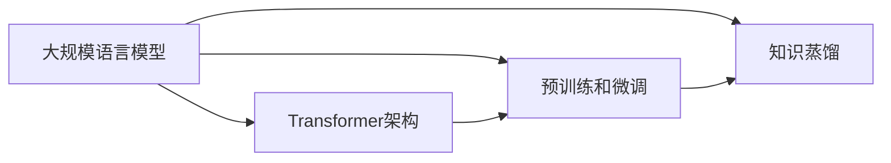

# 大规模语言模型从理论到实践 专业数据

## 1. 背景介绍
### 1.1 大规模语言模型的兴起
近年来,随着深度学习技术的快速发展,大规模语言模型(Large Language Models,LLMs)在自然语言处理(NLP)领域掀起了一场革命。从2018年Google发布的BERT模型,到2019年OpenAI推出的GPT-2,再到2020年的GPT-3,大规模语言模型不断刷新着NLP任务的性能上限。这些模型基于海量的文本数据进行预训练,学习到了丰富的语言知识和常识,展现出了惊人的语言理解和生成能力。

### 1.2 大规模语言模型的应用价值
大规模语言模型为NLP应用带来了新的突破。它们可以用于各种下游任务,如文本分类、命名实体识别、问答系统、机器翻译等,大大提升了这些任务的性能。此外,大规模语言模型还催生了新的应用场景,如对话系统、内容生成、知识图谱构建等。这些应用正在深刻影响着我们的工作和生活。

### 1.3 理论研究与实践应用的重要性  
尽管大规模语言模型取得了瞩目的成就,但要真正发挥其潜力,将理论研究与实践应用有机结合至关重要。一方面,我们需要深入理解这些模型的工作原理,探索更有效的模型架构和训练方法;另一方面,我们需要将模型应用到实际场景中,解决现实世界的问题。只有在理论和实践的良性互动中,大规模语言模型才能不断进步,创造更大的价值。

## 2. 核心概念与联系
### 2.1 大规模语言模型的定义
大规模语言模型是指基于海量文本数据训练的深度神经网络模型,旨在学习语言的统计规律和语义知识。与传统的词袋模型不同,大规模语言模型能够捕捉词语之间的上下文关系和长距离依赖,从而对语言有更深入的理解。

### 2.2 Transformer架构
Transformer是大规模语言模型的核心架构。它由编码器(Encoder)和解码器(Decoder)组成,通过自注意力机制(Self-Attention)和前馈神经网络(Feed-Forward Neural Network)来处理输入序列。相比循环神经网络(RNN),Transformer能够更高效地并行计算,更好地捕捉长距离依赖关系。

### 2.3 预训练和微调
大规模语言模型通常分为两个阶段:预训练(Pre-training)和微调(Fine-tuning)。在预训练阶段,模型在大规模无标注文本数据上进行自监督学习,如掩码语言模型(Masked Language Model)和下一句预测(Next Sentence Prediction)任务。这使模型学习到通用的语言知识。在微调阶段,预训练模型被应用到特定的下游任务上,通过少量标注数据进行监督学习,快速适应任务需求。

### 2.4 知识蒸馏
知识蒸馏(Knowledge Distillation)是一种将大模型的知识转移到小模型的技术。具体而言,先用大模型生成软目标(Soft Target),再用软目标训练小模型。这样可以在保持较高性能的同时,大幅减小模型尺寸,提高推理速度。对于大规模语言模型,知识蒸馏尤为重要,因为原始模型往往参数量巨大,难以部署到资源受限的环境中。

### 2.5 核心概念之间的联系
下图展示了大规模语言模型中几个核心概念之间的联系:

可以看出,Transformer架构是大规模语言模型的基础,预训练和微调是训练大规模语言模型的关键步骤,知识蒸馏则是优化大规模语言模型的重要技术。这些概念相互关联,共同推动着大规模语言模型的发展。

## 3. 核心算法原理具体操作步骤
### 3.1 Transformer的自注意力机制
Transformer的核心是自注意力机制。对于输入序列的每个位置,自注意力机制计算该位置与其他所有位置的相关性,生成一个注意力分布。然后,根据注意力分布对输入序列进行加权求和,得到该位置的新表示。具体步骤如下:

1. 将输入序列X通过三个线性变换得到查询矩阵Q、键矩阵K和值矩阵V。
2. 计算Q与K的点积,得到注意力分数矩阵S。
3. 对S进行缩放和softmax归一化,得到注意力分布A。
4. 将A与V相乘,得到加权求和结果Z。
5. 将Z通过线性变换得到输出序列Y。

数学公式如下:

$$
\begin{aligned}
Q &= XW^Q \\
K &= XW^K \\
V &= XW^V \\
S &= \frac{QK^T}{\sqrt{d_k}} \\
A &= \text{softmax}(S) \\
Z &= AV \\
Y &= ZW^O
\end{aligned}
$$

其中,$W^Q$、$W^K$、$W^V$和$W^O$是可学习的参数矩阵,$d_k$是缩放因子。

### 3.2 Transformer的多头自注意力机制
为了捕捉输入序列的不同方面信息,Transformer使用多头自注意力机制。具体而言,Transformer将输入序列分别输入到h个独立的自注意力模块中,得到h个输出序列。然后,将这h个输出序列拼接起来,通过线性变换得到最终的输出序列。多头自注意力机制可以看作是将单头自注意力机制的结果进行了融合,提高了模型的表达能力。

### 3.3 BERT的预训练任务
BERT是一个基于Transformer编码器的大规模语言模型。它在预训练阶段使用了两个任务:掩码语言模型和下一句预测。

掩码语言模型的目标是预测被掩码的单词。具体而言,BERT随机掩盖输入序列中的一些单词,然后让模型预测这些被掩盖的单词。这促使模型学习上下文信息,从而更好地理解语言。

下一句预测的目标是判断两个句子是否前后相邻。具体而言,BERT随机选择两个句子A和B,其中50%的概率B是A的下一句,50%的概率B是语料库中的随机句子。然后,BERT对这两个句子进行编码,并用特殊的[CLS]标记的输出来预测B是否为A的下一句。这促使模型学习句子之间的关系,捕捉全局的语义信息。

### 3.4 GPT的预训练任务
GPT是一个基于Transformer解码器的大规模语言模型。与BERT不同,GPT在预训练阶段只使用了语言建模任务。

语言建模的目标是根据前面的单词预测下一个单词。具体而言,GPT将输入序列向右移动一个位置作为目标序列,然后让模型最大化目标序列的似然概率。这促使模型学习单词之间的依赖关系,掌握语言的生成规律。

### 3.5 微调的流程
在微调阶段,预训练模型被应用到下游任务上。具体步骤如下:

1. 根据任务需求,在预训练模型的基础上添加任务特定的输出层。
2. 使用下游任务的标注数据对模型进行微调,即更新模型参数以最小化任务的损失函数。
3. 在开发集上评估模型性能,根据需要调整超参数。
4. 在测试集上评估模型的泛化能力。

微调通常只需要较少的标注数据和训练时间,就能在下游任务上取得不错的效果。这得益于预训练阶段学习到的通用语言知识,使模型具有了良好的初始化参数。

## 4. 数学模型和公式详细讲解举例说明
### 4.1 Transformer的位置编码
由于Transformer不包含循环和卷积结构,因此需要显式地为输入序列的每个位置添加位置信息。Transformer使用正弦和余弦函数来生成位置编码,公式如下:

$$
\begin{aligned}
PE(pos,2i) &= \sin(pos/10000^{2i/d_{model}}) \\
PE(pos,2i+1) &= \cos(pos/10000^{2i/d_{model}})
\end{aligned}
$$

其中,$pos$是位置索引,$i$是维度索引,$d_{model}$是模型的维度。位置编码的维度与输入序列的嵌入维度相同,两者相加得到最终的输入表示。

举例来说,假设输入序列的嵌入维度为512,序列长度为128。则位置编码矩阵PE的形状为(128, 512),其中第i行表示第i个位置的位置编码。将PE与输入序列的嵌入相加,就得到了包含位置信息的输入表示。

### 4.2 自注意力机制的矩阵计算
自注意力机制可以用矩阵运算来高效实现。以下是详细的矩阵计算过程:

1. 输入序列X的形状为(n, d),其中n是序列长度,d是嵌入维度。
2. 通过三个权重矩阵$W^Q$、$W^K$、$W^V$(形状均为(d, d_k))将X变换为Q、K、V矩阵,形状均为(n, d_k)。
3. 计算Q与K的转置的乘积,得到注意力分数矩阵S,形状为(n, n)。
4. 将S除以缩放因子$\sqrt{d_k}$,然后应用softmax函数,得到注意力分布A,形状为(n, n)。
5. 将A与V相乘,得到加权求和结果Z,形状为(n, d_k)。
6. 通过权重矩阵$W^O$(形状为(d_k, d))将Z变换为输出序列Y,形状为(n, d)。

举例来说,假设输入序列X的形状为(128, 512),d_k为64。则Q、K、V的形状均为(128, 64),S和A的形状均为(128, 128),Z的形状为(128, 64),Y的形状为(128, 512)。

### 4.3 LayerNorm层的计算
LayerNorm是Transformer中常用的归一化层,用于缓解深度网络的训练问题。LayerNorm对输入序列的每个位置分别进行归一化,公式如下:

$$
\begin{aligned}
\mu &= \frac{1}{d}\sum_{i=1}^d x_i \\
\sigma^2 &= \frac{1}{d}\sum_{i=1}^d (x_i - \mu)^2 \\
\hat{x}_i &= \frac{x_i - \mu}{\sqrt{\sigma^2 + \epsilon}} \\
y_i &= \gamma \hat{x}_i + \beta
\end{aligned}
$$

其中,$x_i$是输入序列的第i个元素,$\mu$和$\sigma^2$分别是输入序列的均值和方差,$\epsilon$是一个小常数(如1e-5),用于防止分母为零,$\gamma$和$\beta$是可学习的缩放和偏移参数。

举例来说,假设输入序列X的形状为(128, 512)。则LayerNorm会对X的每一行分别计算均值和方差,得到形状为(128,)的$\mu$和$\sigma^2$。然后,对X的每个元素进行归一化,并乘以$\gamma$(形状为(512,))加上$\beta$(形状为(512,)),得到输出序列Y,形状仍为(128, 512)。

### 4.4 BERT的损失函数
BERT在预训练阶段使用两个损失函数:掩码语言模型损失和下一句预测损失。

掩码语言模型损失使用交叉熵函数,公式如下:

$$
\mathcal{L}_{MLM} = -\sum_{i=1}^M \log p(x_i|x_{\backslash M})
$$

其中,$M$是被掩码的单词数,$x_i$是第i个被掩码单词,$x_{\backslash M}$表示去掉被掩码单词的输入序列,$p(x_i|x_{\backslash M})$是BERT预测第i个被掩码单词的概率。

下一句预测损失也使用交叉熵函数,公式如下:

$$
\mathcal{L}_{NSP} = -y\log p(y) - (1-y)\log(1-p(y))