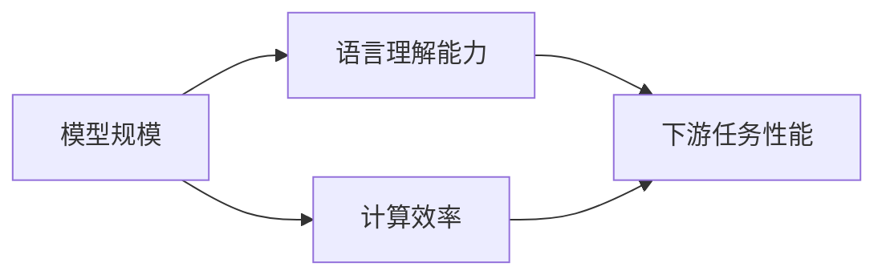
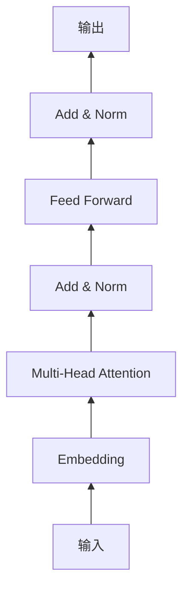

# 大规模语言模型从理论到实践 基础模型评估

## 1. 背景介绍
### 1.1 大规模语言模型的兴起
近年来,随着深度学习技术的飞速发展,大规模语言模型(Large Language Models, LLMs)在自然语言处理(NLP)领域掀起了一股热潮。从2018年的BERT到2020年的GPT-3,再到最近的PaLM、Chinchilla等模型,LLMs不断刷新着NLP任务的性能上限,展现出了惊人的语言理解和生成能力。

### 1.2 LLMs带来的机遇与挑战
LLMs为NLP应用带来了新的机遇。它们能够从海量文本数据中学习语言知识,具备强大的语义理解、知识获取、推理、生成等能力,有望用于智能问答、知识图谱构建、文本生成、机器翻译等多个领域。

但LLMs同时也带来了新的挑战。模型参数量巨大(动辄上百亿、千亿),训练和推理成本高昂。如何评估不同LLMs的性能,找出性价比最优的模型也成为一个重要课题。此外,LLMs存在偏见、毒性语言、事实错误等问题,亟需标准化的评估体系。

### 1.3 本文的研究意义
本文将全面梳理LLMs的发展脉络,总结其核心概念、原理和最新进展。重点介绍LLMs基础模型评估的理论与实践,包括评估指标、数据集、开源工具等。通过系统性的分析和对比,本文旨在为研究者和从业者提供一份LLMs选型和应用的参考指南。

## 2. 核心概念与联系
### 2.1 大规模语言模型的定义
LLMs是指参数量极大(一般在十亿到千亿量级)的深度学习语言模型,通过在超大规模文本语料上进行预训练,习得强大的语言理解和生成能力。代表模型有BERT、GPT、T5、Switch Transformer等。

### 2.2 预训练范式 
预训练(Pre-training)是LLMs的核心范式,即先在大规模无监督语料上训练通用语言模型,习得语言的基本规律。再在特定任务的小规模标注数据上微调(Fine-tuning),快速适应下游任务。这种"先学通用知识,再学特定技能"的思路大大提升了模型的数据效率和泛化能力。

### 2.3 Transformer结构
Transformer是构建LLMs的主流神经网络结构。它摒弃了RNN的顺序依赖,引入自注意力(Self-attention)机制,令任意两个词之间都能直接交互,大幅提升了长程依赖建模能力。Transformer还采用了层归一化、残差连接等技巧,使得模型可以堆叠到上百层而训练稳定。

### 2.4 评估方法分类
LLMs的评估方法主要分为内在评估(Intrinsic Evaluation)和外在评估(Extrinsic Evaluation)两大类:

- 内在评估: 考察模型在语言建模、完型填空、文本蕴含、问答等通用NLP基准任务上的性能,反映其语言理解能力的上限。常用数据集有GLUE、SuperGLUE、SQuAD等。
- 外在评估: 将模型应用到特定领域任务中,考察其实际效果。如机器翻译、对话、文本摘要、知识图谱构建等。需要针对具体任务构建评测集。

此外,还有参数效率、推理速度、内存占用、稳定性、可解释性等非功能性指标,需要权衡考虑。

### 2.5 评估维度关系
下图展示了LLMs评估的几个核心维度及其关系:

可以看出,模型规模是影响LLMs性能的关键因素。规模越大,通常语言理解能力越强,对下游任务的迁移效果越好。但也意味着训练和推理的算力成本更高。因此需要在性能和效率之间寻求平衡。

## 3. 核心算法原理与操作步骤
### 3.1 预训练目标
LLMs的预训练通常采用两类目标:

(1) 自回归语言建模(Auto-regressive Language Modeling)
给定前面的词,预测下一个词的概率。如GPT系列采用的单向语言模型:

$$
\mathcal{L}_{LM} = -\sum_{i=1}^{n} \log P(w_i|w_{<i})
$$

其中$w_i$为第$i$个词,$w_{<i}$为之前的词序列。优化目标是最小化负对数似然。

(2) 去噪自编码(Denoising Auto-Encoding)
随机遮挡(Mask)、删除、置换部分词,训练模型恢复原始序列。如BERT采用的MLM:

$$
\mathcal{L}_{MLM} = -\sum_{i=1}^{m} \log P(w_i|w_{\backslash M},\theta)
$$

其中$w_{\backslash M}$为去噪后的词序列,$m$为被Mask的词数。优化目标是最大化被Mask词的对数似然。

### 3.2 预训练流程
LLMs的预训练一般分为以下步骤:

(1) 语料构建: 收集大规模高质量的无监督文本数据,如维基百科、图书、新闻等。对语料进行清洗、分词、Tokenize等预处理。

(2) 目标构建: 根据所选的预训练范式(如自回归LM、MLM等),构建相应的训练目标和损失函数。

(3) 模型初始化: 定义Transformer等网络结构,随机初始化模型参数。

(4) 训练迭代:
- 从语料中采样一个Batch的文本序列 
- 根据目标函数,计算Loss并反向传播
- 更新模型参数,如用Adam优化器
- 重复上述步骤,直到收敛或达到预设的迭代次数

(5) 模型存储: 将训练好的模型权重保存到磁盘,供后续微调和推理使用。

### 3.3 微调流程
将预训练模型应用到下游任务时,一般需要进行微调,具体步骤为:

(1) 任务定义: 明确下游任务的输入输出形式,是分类、序列标注、生成还是其他。

(2) 网络设计: 在预训练模型的基础上,添加任务特定的输出层,如分类头、序列标注头等。冻结或微调预训练权重。

(3) 数据准备: 标注少量高质量的任务数据。对数据进行预处理,转换为模型输入格式。划分训练集、验证集、测试集。

(4) 超参选择: 选择合适的学习率、Batch Size、训练轮数等超参数,通常需要在验证集上调优。

(5) 模型训练: 用任务数据训练模型,监控验证集性能,防止过拟合。保存最优模型权重。

(6) 效果评估: 在测试集上评估模型性能,计算准确率、F1等指标。分析错误样例,进行误差分析。

微调一般只需少量数据和算力,即可获得不错的效果,是LLMs的重要应用范式。但如何高效微调,减少昂贵的预训练成本,仍是一个开放的研究问题。

## 4. 数学模型与公式详解
### 4.1 Transformer结构详解
Transformer是LLMs的核心组件,其基本结构如下:

(1) 输入Embedding: 将离散的词转换为连续的向量表示。可学习的参数为Embedding矩阵$\mathbf{E} \in \mathbb{R}^{V \times d}$,其中$V$为词表大小,$d$为Embedding维度。第$i$个词的Embedding为:

$$\mathbf{e}_i = \mathbf{E}[i,:]$$

(2) 多头注意力(Multi-Head Attention): 将Embedding序列$\mathbf{X} \in \mathbb{R}^{n \times d}$($n$为序列长度)线性变换为$h$组查询(Query)、键(Key)、值(Value)矩阵:

$$
\begin{aligned}
\mathbf{Q}_i &= \mathbf{X} \mathbf{W}_i^Q \\
\mathbf{K}_i &= \mathbf{X} \mathbf{W}_i^K \\
\mathbf{V}_i &= \mathbf{X} \mathbf{W}_i^V
\end{aligned}
$$

其中$\mathbf{W}_i^Q, \mathbf{W}_i^K, \mathbf{W}_i^V \in \mathbb{R}^{d \times d/h}$为可学习参数。然后对每组QKV计算注意力:

$$
\text{Attention}(\mathbf{Q}_i,\mathbf{K}_i,\mathbf{V}_i) = \text{softmax} \left( \frac{\mathbf{Q}_i \mathbf{K}_i^T}{\sqrt{d/h}} \right) \mathbf{V}_i
$$

直观地,注意力矩阵衡量了任意两个词之间的相关性,用于聚合信息。多头机制允许模型在不同子空间学习不同的语义交互模式。

(3) 前馈网络(Feed Forward): 对注意力输出做非线性变换,增强模型表达能力。通常采用两层MLP和ReLU激活:

$$
\text{FFN}(\mathbf{X}) = \text{ReLU}(\mathbf{X} \mathbf{W}_1 + \mathbf{b}_1) \mathbf{W}_2 + \mathbf{b}_2
$$

其中$\mathbf{W}_1 \in \mathbb{R}^{d \times d_f}, \mathbf{W}_2 \in \mathbb{R}^{d_f \times d}$为权重矩阵,$\mathbf{b}_1 \in \mathbb{R}^{d_f}, \mathbf{b}_2 \in \mathbb{R}^d$为偏置向量。$d_f$为隐藏层维度,通常取$4d$。

(4) 残差连接与层归一化: 对每个子层的输入和输出做残差连接,然后做层归一化。可以缓解深层网络的优化难题:

$$
\begin{aligned}
\mathbf{X}' &= \text{LayerNorm}(\mathbf{X} + \text{Sublayer}(\mathbf{X})) \\
\text{LayerNorm}(\mathbf{x}) &= \frac{\mathbf{x} - \mu}{\sqrt{\sigma^2 + \epsilon}} \odot \mathbf{g} + \mathbf{b}
\end{aligned}
$$

其中$\mu,\sigma^2$为样本均值和方差,$\mathbf{g},\mathbf{b}$为可学习的缩放和偏置向量。

Transformer通过堆叠多个这样的基本单元,构建了功能强大的语言模型。不同的LLMs在此基础上做了许多改进,如因果掩码、相对位置编码、稀疏注意力等,以提升性能和效率。

### 4.2 预训练目标函数推导
以MLM为例,详细推导其训练目标。记输入序列为$\mathbf{w} = [w_1,\cdots,w_n]$,Mask位置集合为$\mathcal{M}$。定义单个位置$i \in \mathcal{M}$的条件概率为:

$$
P(w_i|\mathbf{w}_{\backslash \mathcal{M}},\theta) = \frac{\exp(e(w_i)^T \mathbf{h}_i)}{\sum_{w' \in \mathcal{V}} \exp(e(w')^T \mathbf{h}_i)}
$$

其中$e(w) \in \mathbb{R}^d$为词$w$的Embedding,$\mathbf{h}_i \in \mathbb{R}^d$为位置$i$的隐状态(Transformer的最后一层),$\mathcal{V}$为词表。

假设各位置独立,则联合概率为:

$$
P(\mathbf{w}_{\mathcal{M}}|\mathbf{w}_{\backslash \mathcal{M}},\theta) = \prod_{i \in \mathcal{M}} P(w_i|\mathbf{w}_{\backslash \mathcal{M}},\theta)
$$

取负对数,得到损失函数:

$$
\begin{aligned}
\mathcal{L}(\theta) &= -\log P(\mathbf{w}_{\mathcal{M}}|\mathbf{w}_{\backslash \mathcal{M}},\theta) \\
&