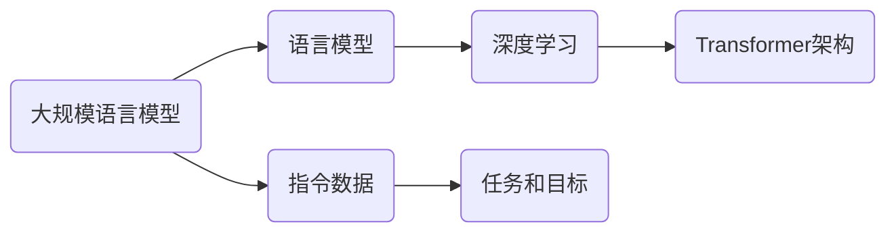

## 1.背景介绍

在计算机科学领域，大规模语言模型（Large Scale Language Models，简称LSLM）已经成为了自然语言处理（Natural Language Processing，简称NLP）的一个重要研究方向。从Google的BERT，OpenAI的GPT-3，到微软的Turing NLG，这些先进的模型在语言理解和生成任务上都取得了显著的效果。然而，这些模型的成功并非偶然，而是依赖于大量的训练数据和精心设计的训练算法。本文将从理论到实践的角度，深入探讨LSLM的指令数据构建问题。

## 2.核心概念与联系

在讨论LSLM的指令数据构建之前，我们首先需要理解一些核心概念。

### 2.1 语言模型

语言模型是一种计算机算法，用于预测一段文本中的下一个词或者一段文本的概率。它可以用于各种NLP任务，比如机器翻译、文本生成、语音识别等。

### 2.2 大规模语言模型

大规模语言模型是一种使用大量文本数据训练的语言模型。这些模型通常使用深度学习的技术，如Transformer架构，来捕捉文本中的复杂模式。

### 2.3 指令数据

指令数据是训练语言模型的关键组成部分。它包含了模型需要学习的任务和目标，比如翻译任务的源语言文本和目标语言文本，或者问答任务的问题和答案。

### 2.4 联系

这些概念之间的联系是：大规模语言模型通过学习大量的指令数据，来理解和生成人类的语言。



## 3.核心算法原理具体操作步骤

构建LSLM的指令数据包括以下几个步骤：

### 3.1 数据收集

首先，我们需要收集大量的文本数据。这些数据可以来自于各种来源，比如网络上的新闻文章、社交媒体帖子、书籍等。

### 3.2 数据预处理

收集到的数据需要进行预处理，以适应模型的输入格式。预处理的步骤包括文本清洗、分词、词嵌入等。

### 3.3 任务和目标定义

我们需要为模型定义学习的任务和目标。这些任务和目标就是我们的指令数据。比如，对于翻译任务，我们的指令数据就是源语言文本和目标语言文本。

### 3.4 数据标注

对于一些任务，我们可能需要对数据进行标注。比如，对于问答任务，我们需要标注问题的答案。

### 3.5 数据分割

最后，我们需要将数据分割为训练集、验证集和测试集，以便于模型的训练和评估。

## 4.数学模型和公式详细讲解举例说明

在LSLM中，我们通常使用最大似然估计（Maximum Likelihood Estimation，简称MLE）来训练模型。给定一个训练样本的集合$D = \{x_1, x_2, ..., x_N\}$，其中$x_i$是第$i$个训练样本，我们的目标是找到一个模型参数$\theta$，使得数据的似然函数$L(D;\theta)$最大。似然函数定义为：

$$
L(D;\theta) = \prod_{i=1}^{N} P(x_i|\theta)
$$

对数似然函数为：

$$
\log L(D;\theta) = \sum_{i=1}^{N} \log P(x_i|\theta)
$$

我们的目标是找到一个$\theta$，使得对数似然函数最大。这可以通过梯度上升或者其他优化算法来实现。

## 5.项目实践：代码实例和详细解释说明

为了让读者更好地理解LSLM的指令数据构建，下面我们以一个简单的例子来进行说明。我们将使用Python的transformers库来构建一个简单的语言模型。

首先，我们需要安装必要的库：

```python
!pip install transformers
```

然后，我们可以加载预训练的语言模型：

```python
from transformers import GPT2LMHeadModel, GPT2Tokenizer

tokenizer = GPT2Tokenizer.from_pretrained('gpt2')
model = GPT2LMHeadModel.from_pretrained('gpt2')
```

我们可以使用这个模型来生成文本：

```python
input_text = "The weather is"
input_ids = tokenizer.encode(input_text, return_tensors='pt')

output = model.generate(input_ids, max_length=50, num_return_sequences=5)

for i, text in enumerate(output):
    print(f'Sample {i+1}: {tokenizer.decode(text)}')
```

这个例子展示了如何使用预训练的语言模型来生成文本。在实际的项目中，我们需要收集和预处理大量的指令数据，然后使用这些数据来训练我们的模型。

## 6.实际应用场景

LSLM已经被广泛应用于各种场景，包括：

- 机器翻译：模型学习如何将一种语言翻译成另一种语言。
- 文本生成：模型学习如何生成具有一定主题或风格的文本。
- 问答系统：模型学习如何回答用户的问题。
- 文本摘要：模型学习如何生成文本的摘要。

## 7.工具和资源推荐

下面是一些用于构建LSLM的推荐工具和资源：

- Transformers：一个由Hugging Face开发的深度学习库，提供了大量预训练的语言模型。
- NLTK：一个强大的自然语言处理库，提供了各种文本预处理的工具。
- Spacy：另一个强大的自然语言处理库，提供了各种文本预处理的工具。
- TensorFlow和PyTorch：两个流行的深度学习框架，可以用于训练自己的模型。

## 8.总结：未来发展趋势与挑战

随着计算能力的提升和数据的增多，我们可以预见，LSLM将会得到更广泛的应用。然而，同时也面临着一些挑战，比如如何处理模型的计算需求，如何保护用户的隐私，如何避免模型生成有害的内容等。

## 9.附录：常见问题与解答

Q: LSLM需要多少数据来训练？

A: 这取决于你的任务和模型。一般来说，越大的模型需要越多的数据。

Q: 我可以使用哪些工具来训练LSLM？

A: 你可以使用各种深度学习框架，比如TensorFlow和PyTorch，以及各种自然语言处理库，比如NLTK和Spacy。

Q: 如何处理模型的计算需求？

A: 你可以使用GPU或者TPU来加速模型的训练。此外，你也可以使用分布式训练来处理大规模的数据。

作者：禅与计算机程序设计艺术 / Zen and the Art of Computer Programming